# Fundamentals of OGA

!!! warning "**多人在线游戏**(multiplayer online gaming)的挑战"

    - **一致性**(consistency)：网络同步
    
        <div style="text-align: center">
            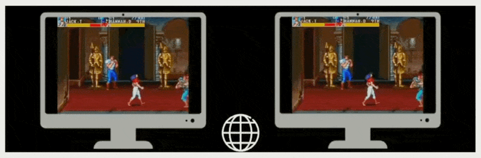
        </div>
    
    - **可靠性**(realibility)：
        - 网络延迟
        - 断开(drop)和重连
    
        <div style="text-align: center">
            
        </div>
    
    - **安全性**(security)
        - 作弊
        - 账号入侵
    
    - **多元性**(diversities)
        - 跨平台
        - 快速迭代
        - 多人游戏系统
    
        <div style="text-align: center">
            
        </div>
    
    - **复杂性**(complexities)
        - 高并发
        - 高可用性
        - 高性能

        <div style="text-align: center">
            
        </div>


## Network Protocols

因特网之父：[Vint Cerf](https://en.wikipedia.org/wiki/Vint_Cerf) 和 [Robert Kahn](https://en.wikipedia.org/wiki/Robert_Kahn_(computer_scientist))，他们设计了 TCP/IP 协议和因特网架构。

两台 PC（记作 A、B）要想相互通信(communicate)，A 和 B必须在多个不同层面上就发送和接收的比特的含义达成一致，包括：

- 用什么电平来表示比特 0 和比特 1？
- 接收者如何知道最后一个比特？
- 一个数字用多长比特表示？

如果直接让机器通过传输介质通信，就会遇到两个问题：

- 为每种新的底层传输介质重新实现应用程序？
- 在底层传输介质发生变化时更改应用程序？

这样做显然不现实。因特网的解决方法是通过引入一个**中间层**(intermediate layer)（一般有多层）来避免上述问题。中间层提供了一组关于应用程序和介质的抽象，这样新的应用程序或介质只需实现中间层接口即可。

一种经典的分层方法是 **OSI 模型**，它将中间层分为 7 层，自顶向下包括：

<div style="text-align: center">
    
</div>

- 应用层：为用户提供功能
- 表示层：转换不同表示
- 会话层：管理任务对话
- 传输层：提供端到端的传输
- 网络层：通过多个链路发送数据包
- 数据链路层：发送信息帧
- 物理层：将比特作为信号发送


### Socket

但对大多数游戏开发者而言，不需要通过这种复杂的机制实现通信。我们往往用到一种基于网络**套接字**(socket)的方法，它是计算机网络中网络节点内的软件结构，作为网络发送和接收数据的端点。可以把它简单看作 IP 地址 + 端口号的结合。

<div style="text-align: center">
    
</div>

<div style="text-align: center">
    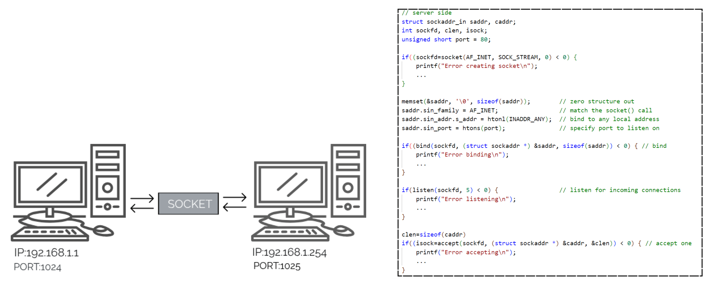
</div>

客户端和服务端都需要设置套接字。函数签名如下：

```cpp
int socket(int domain, int type, int protocol)
```

取值分别为：

- `domain`：`AF_INET`（IPv4）或 `AF_INET6`（IPv6）
- `type`：`SOCK_STREAM`（TCP）或 `SOCK_DGRAM`（UDP）
- `protocol`：默认置 0

>例子：`#!cpp int sockfd = socket(AF_INET, SOCK_STREAM, 0)`

其中值得一提的是两个著名网络协议：TCP 和 UDP

- **TCP**（传输控制协议(transmission control protocol)）
    - 特点：
        - 面向连接的
        - 可靠且有序
        - 流量控制
        - 拥塞控制

    - TCP 段头：

        <div style="text-align: center">
            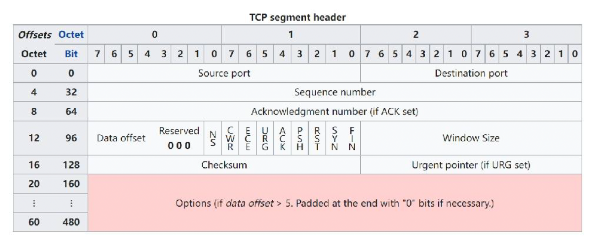
        </div>

    - **重传机制**：重复 ACKs（确认）
        - 发送者发送数据包和序列号，比如 1, 2, 3, 4, 5, 6, 7, 8
        - 假设第 5 个数据包丢失，那么 ACK 流为 1, 2, 3, 4, 4, 4, 4, 4

        <div style="text-align: center">
            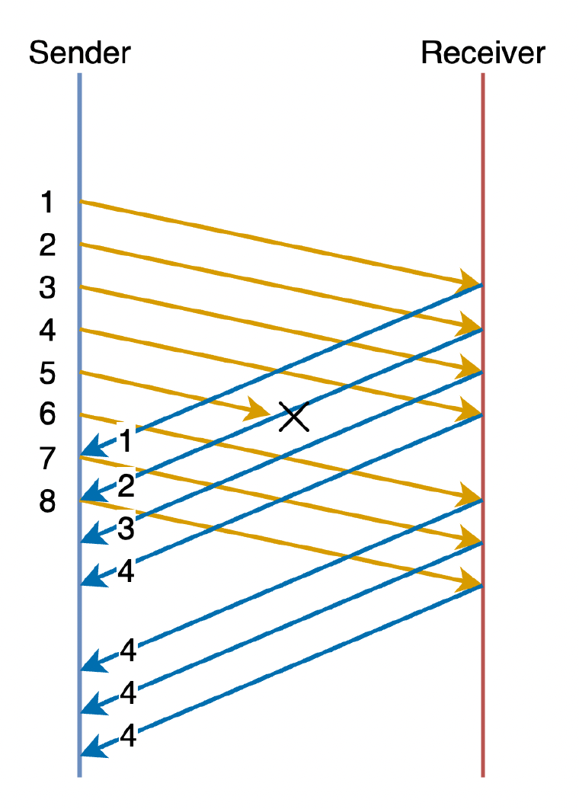
        </div>

    - **拥塞控制**(congestion control)：
        - TCP 的拥塞窗口（**CWND**）从一个小值开始增长
        - 当发生拥塞、数据包丢失或超时时，将根据某种算法减少 CWND 值
        - 这会导致高延迟并造成延迟抖动
        - 拥塞控制是必要的，否则会导致拥塞崩溃；TCP 拥塞控制是互联网主要的拥塞控制措施，也是 TCP 性能问题的主要原因

        <div style="text-align: center">
            
        </div>

- **UDP**（用户数据报协议(user datagram protocol)）
    - 特点：
        - 无连接
        - 不可靠且无序
        - 无流量控制
        - 无拥塞控制

    - UDP 数据包头部：

        <div style="text-align: center">
            
        </div>

网络协议在游戏中的使用情况：

- TCP：《炉石传说》(HearthStone)...
- UDP：《守望先锋》(Overwatch)《CSGO》...

但实际上对于一款大型 MMO 游戏，可能会用到多种协议的组合。

!!! bug "TCP 和 UDP 的问题"

    - TCP 不注重时间
        - 它是一个复杂且重量级的协议，虽然提供可靠的传输和高级功能，但开销更大
        - 它还是一个公平的、面向流量的协议，旨在提高带宽利用率，但并不是为速度而设计的
    - UDP 虽然快，但不可靠，丢包和乱序问题经常发生


### Reliable UDP

甚至在现代游戏中，我们会对已有的协议进行改造。之所以要改造，是因为：

- 游戏服务器
    - 保持活跃连接（TCP）
    - 需要保持“顺序”中的逻辑一致性（TCP）
    - 高响应和低延迟（UDP）
    - 经常用到广播(broadcast)（UDP）
- 网络服务器
    - 处理 HTTP 协议
    - 提供静态网页内容，比如 HTML 页面、文件、图像、视频等

可以看到，我们想要一种同时结合 TCP 和 UDP 优点的协议。为了能够实现这样的协议，先来认识两种网络技术—— ARQ 和 FEC。


#### Automatic Repeat Request

!!! info "确认(acknowledgement, ACK)与序列号"

    - **正 ACK**：在通信进程、计算机或设备之间传递的信号，用以表示确认或收到消息
    - **负 ACK**（NACK）：发送用于拒绝之前接收到的消息或指示某种错误的信号
    - **序列号**（SEQ）：用于跟踪主机发送字节的计数器
    - **超时**(timeouts)：在接收确认之前允许等待的指定时间段

**自动重传请求**(automatic repeat request, **ARQ**)是一种用于数据传输的错误控制方法，利用 ACK 和超时，在不可靠的通信通道上实现可靠的数据传输。如果发送者在超时前没有收到 ACK，它会重新发送数据包，直到收到确认或超过预定义的重传次数。

ARQ 有多种实现算法，它们大多属于**滑动窗口协议**(sliding window protocol)，具有以下特点：

- 一次发送多个帧，帧数取决于窗口大小
- 每个帧用序列号编号
- 当窗口前方的帧被接收时，窗口向前滑动

???+ example "例子"

    === "发送帧 0, 1, 2, 3"

        <div style="text-align: center">
            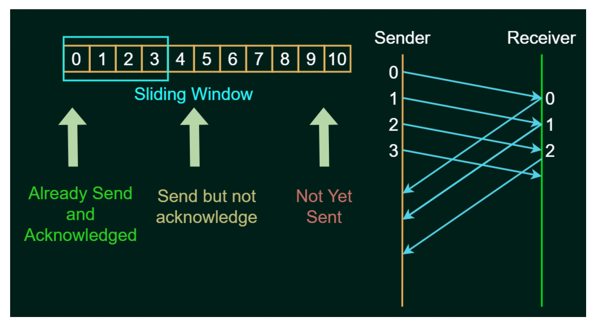
        </div>

    === "帧 0, 1, 2 已接收，发送帧 3, 4, 5, 6"

        <div style="text-align: center">
            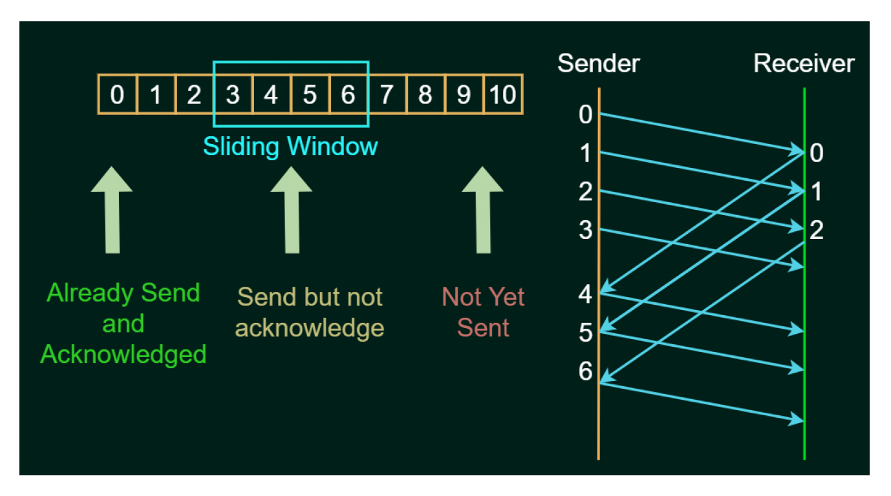
        </div>

下面详细介绍其中几种常见的算法。利用这些算法中的任意一种，我们便能搭建一个可靠的 UDP。

- **停止-等待**(stop-and-wait) ARQ
    - 窗口大小 = 1
    - 发送一个帧后，发送方在传输下一个帧之前等待 ACK
    - 如果在一定时间后没有收到 ACK，发送方超时并重新发送原始帧
    - 问题：带宽利用率低，性能差

    <div style="text-align: center">
        
    </div>

- **回退 N 帧**(go-back-N) ARQ
    - 发送窗口大小 = N
    - 接收者仅发送累积(cumulative) ACKs
    - 如果在约定时间内未收到 ACK，当前窗口中的所有帧将被传输

    <div style="text-align: center">
        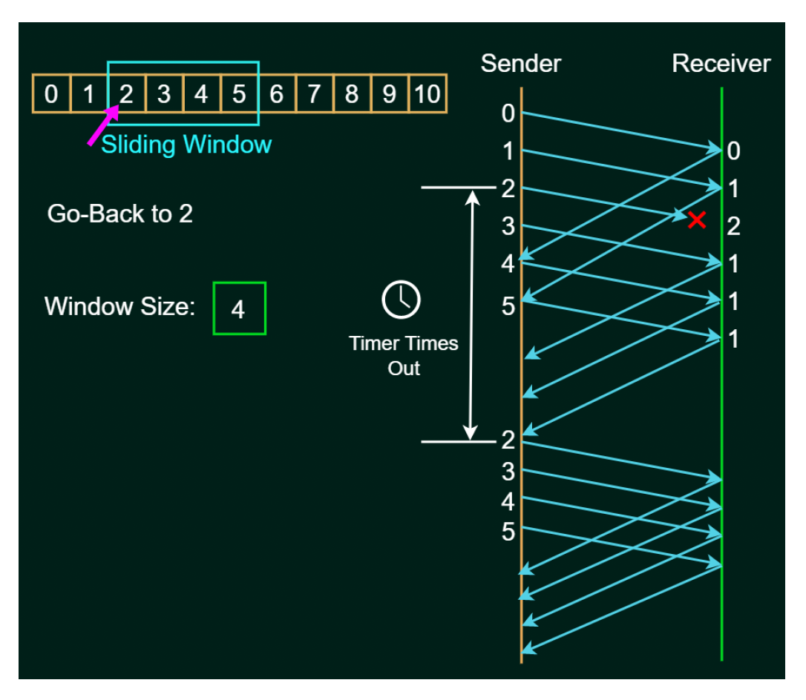
    </div>

- **选择重传**(selective repeat) ARQ
    - 只有损坏或丢失的帧会被重传
    - 接收方发送每个帧的确认，发送方维护每个帧的超时时间
    - 当接收方收到损坏的包时，它会发送一个 NACK，发送方将发送/重传收到 NACK 的帧

    <div style="text-align: center">
        
    </div>


#### Forward Error Correction

随着丢包率和延迟的增加，即便是可靠 UDP 也逐渐无法满足传输要求，比如当丢包率增加到 20% 时，使用可靠 UDP 仍然会有较高的延迟。这时我们引入第二种技术：**前向纠错**(forward error correction, **FEC**)。它通过传输足够的额外冗余信息与主数据流，在一定程度上重建丢失的 IP 数据包。

<div style="text-align: center">
    
</div>

FEC 算法以额外带宽为代价降低了丢包率，并且数据包丢失率越高，数据包丢失补偿的效果更为明显。下面介绍其中两种实现。

- **XOR FEC**

    ??? info "XOR 运算"

        <div style="text-align: center">
            
        </div>

    <div style="text-align: center">
        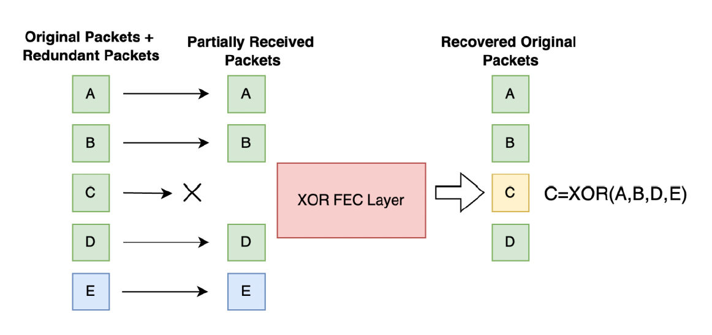
    </div>

    - 假如有 4 个数据包 A, B, C, D，令：
        - E = XOR(A, B, C, D)
        - A = XOR(B, C, D, E)
        - B = XOR(A, C, D, E)
        - C = XOR(A, B, D, E)
        - D = XOR(A, B, C, E)
    - 若任意一个包丢失，都可通过其余四个包恢复
    - 若丢失多个包，该算法无能为力
    - 该算法和某个等级的 RAID 很像

- **Reed-Solomon 编码**
    - 假如有 N 份有效数据，期望产生 M 份 FEC 数据
        
        <div style="text-align: center">
            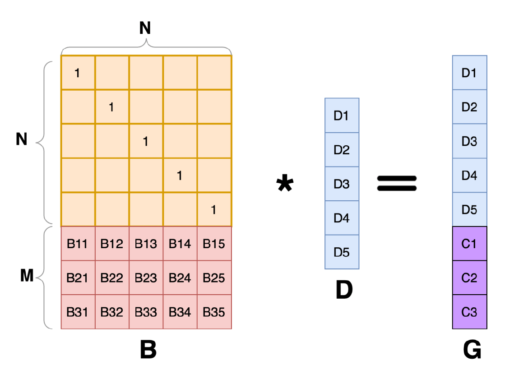
        </div>
        
        - 将 N 份有效数据形成一个单位向量 D
        - 生成一个变换矩阵(transformation matrix) B：它由一个 N 阶单位矩阵和一个 N * M 的 Vandemode 矩阵（由矩阵 B 的任意 n 行组成的矩阵是可逆的）组成
        - 通过将矩阵 B 和向量 D 相乘得到的矩阵 G 包含 M 个冗余的 FEC 数据

    - 假设 D1, D4, C2 丢失
        - 矩阵 B 也需要删除相应的 M 行以获得变形矩阵(deformation matrix) B'
        
            <div style="text-align: center">
                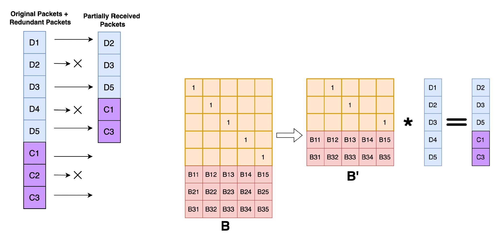
            </div>
        
        - 得到 B' 的逆矩阵 B'^-1^
        - 两边同乘以 B'^-1^ 以恢复数据

            <div style="text-align: center">
                
            </div>

---
现在我们用前面介绍的技术来定制自己的 UDP 协议：

- 可靠性：采用选择重传 ARQ
- 混合 ARQ 和 FEC：在采用 ARQ 前，先用 FEC 纠错
- 实时：
    - 更小的 RTO 增长
    - 无拥塞控制
    - 快速重传机制
    - 无延迟 ACK
- 灵活性：
    - 设计高速协议
    - 同时支持可靠和不可靠的传输


## Clock Synchronization

**时钟同步**(clock synchronization)是设计网络游戏时必须考虑的一件事，即确保同一场景、同一时间中的多名玩家感知到的事件是相同的。

这里涉及到一个叫做 **RTT**（往返时间(round-trip time)）的概念，它反映了：

- 发送/接收延迟
- 传播延迟
- 源服务器的响应时间

???+ note "RTT 和其他技术/概念的关系"
    
    - **PING**：通常在采用 ICMP 数据包的传输协议中进行 PING 测试，RTT 在应用层中被测量
    - **时延**(latency)：数据包从发送端点到接收端点所需的时间（1/2 * RTT）

    <div style="text-align: center">
        
    </div>


### Network Time Protocol

实现时间同步的一个最经典的方法是**网络时间协议**(network time protocol, **NTP**)。它是一种用于与网络中计算机时钟时间源同步的互联网协议。

- **参考时钟**(reference clock)：GPS 时钟、无线电发射站或诸如原子钟等极其精确的计时设备
    - 无需连接到互联网
    - 通过无线电或光纤发送时间
- **时间服务器层**(time server stratums)：
    
    <div style="text-align: center">
        
    </div>
    
    - 计算与参考时钟的分离度
    - 参考时钟的等级值(stratum value)为 0
    - 等级值为 1 的服务器称为主时间服务器(primary time server)
    - 如果一个设备的等级值超过 15，其时间不可信
    - 设备在修正时间时会自动选择等级值较低的服务器

NTP 算法的实现如下：

- 使用 NTP 很简单，只需
    - 客户端向服务器请求时间
    - 服务器接收请求并回复
    - 客户端接收回复
    - 但得考虑**延迟**问题

    <div style="text-align: center">
        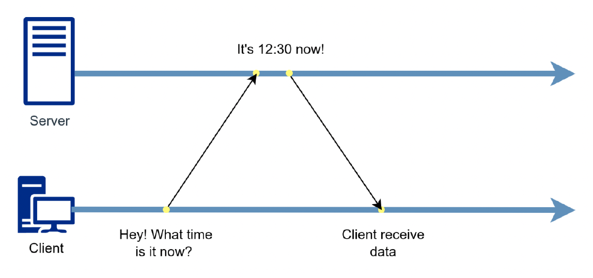
    </div>

- 记录 4 个时间戳 $t_0^c, t_1^s, t_2^s, t_3^c$，分别对应发送请求、接收请求、发送回复和接收回复的时间
    - 往返延迟 = $(t_3^c - t_0^c) - (t_2^s - t_1^s)$
    - 偏移量 = $\dfrac{t_1^s - t_0^c + t_2^s - t_3^c}{2}$
    - 隐含的假设是单向延迟是往返延迟的一半
    - 本地时钟校正是通过偏移数据计算得出的，即 $t_3^c$ + 偏移量
    - 获得的延迟和时钟偏移样本可以使用最大似然技术进行过滤

    <div style="text-align: center">
        
    </div>

    ??? example "例子"

        <div style="text-align: center">
            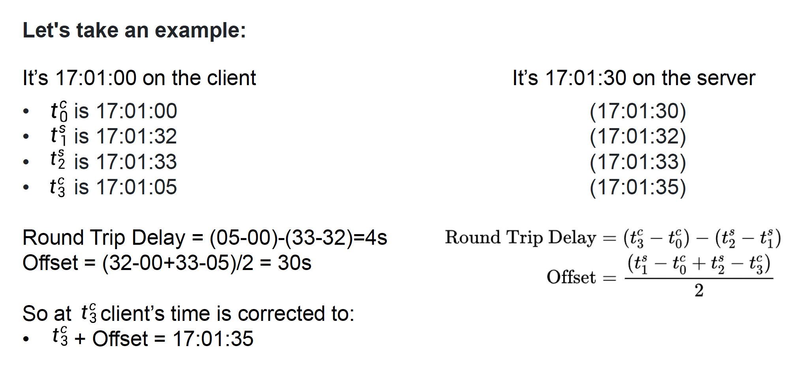
        </div>


### Stream-Based Time Synchronization with Elimination of Higher Order Modes

一种更精密的时钟同步做法是**基于流的时间同步与高阶模式的消除**：

1. 客户端在「时间请求」包上记录当前本地时间，并发送给服务器
2. 服务器收到后，记录服务器时间并返回
3. 客户端收到后，通过 delta = (当前时间 - 发送时间) / 2 计算时间差

>到目前为止和 NTP 算法很像。

4. 第一个结果应立即用于时钟更新
5. 客户端重复步骤 1-3 五次或更多
6. 累积并按延迟**升序**排序数据包接收的结果
7. 丢弃所有超过中位数 1.5 倍的数据样本，剩余样本使用算术平均数进行平均

<div style="text-align: center">
    
</div>


## Remote Procedure Call (RPC)

即便[套接字](#socket)编程简化了计算机间的通信处理，但在游戏开发中还是不太好用，我们还需要考虑很多东西：

- 如何在同一连接上区分不同的请求？
- 如何将字节写入网络/从网络读取字节？
- 如果主机 A 的进程是用 Go 编写的，而主机 B 的进程是用 C++ 编写的怎么办？
- 那些字节该如何处理？

另外，我们还要用套接字定义多种**消息**(message)，这是客户端和服务器常用的通信方式。

<div style="text-align: center">
    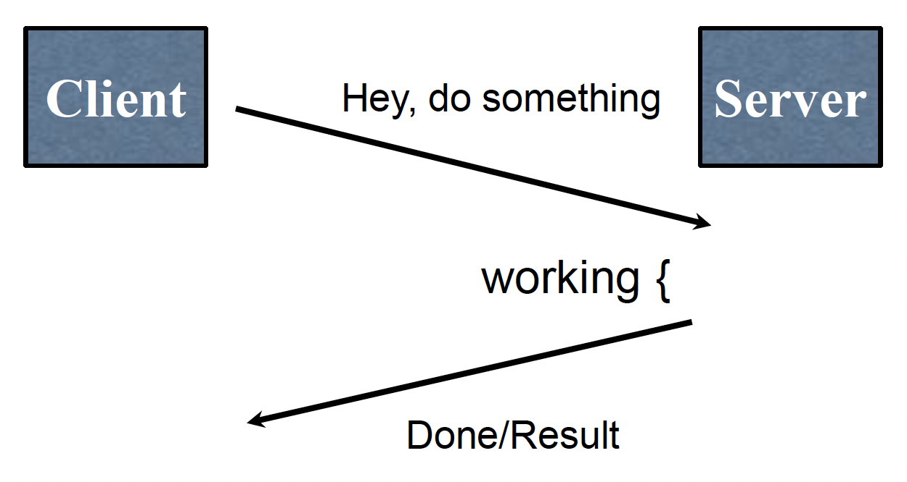
</div>

起初，程序员通过**硬编码**的方式定义用于发送请求和响应的消息。这样的消息被看作是一个字节流，包含了操作码和操作数信息。

??? example "例子"

    ```cpp
    struct foomsg {
        uint32_t len;
    };

    void send_foo(char *contents) {
        int msglen = sizeof(struct foomsg) + strlen(contents);
        char buf = malloc(msglen);
        struct foomsg *fm = (struct foomsg *)buf;
        fm->len = htonl(strlen(contents));
        memcpy(buf + sizeof(struct foomsg),
            contents,
            strlen(contents));
        write(outsock, buf, msglen);
    }
    ```

!!! bug "问题"

    - 需要关心消息格式
    - 必须对消息中的数据进行打包和解包
    - 服务器必须解码消息并将它们分派给处理函数
    - 消息通常是异步的
    - 发送一个消息后，直到收到响应前要做什么
    - 消息不是一个自然的编程模型

!!! warning "关于逻辑通信的更多挑战"

    远程过程调用中，远程机器可能：

    - 运行用**不同语言**编写的进程
    - 使用**不同大小**的数据类型表示
    - 使用**不同的字节序**（大小端(endianess)）
    - 以**不同**的方式表示浮点数
    - 有**不同的数据对齐**要求（例如，4 字节类型仅从 4 字节内存边界开始）

**远程过程调用**(remote procedure call, **RPC**)是一种请求-响应协议。RPC 由客户端发起，客户端向已知的远程服务器发送请求消息并提供参数，以执行指定的过程。其目标是：

- 让编程更简单
- 隐藏复杂性
- 建立对程序员来说更熟悉的模型（只需调用函数）

<div style="text-align: center">
    
</div>

??? example "例子（Go 语言）"

    注意两段程序高亮的两行之间的关系。

    === "客户端"

        ```go title="Client" hl_lines="15 19" linenums="1"
        package main

        import (
            "fmt"
            "log"
            "net/rpc"
        )

        func main() {
            client, err := rpc.Dial("tcp", "127.0.0.1:8000")
            if err != nil {
                log.Fatal("dial", err)
            }
            var response string
            err = client.Call("HelloWorldService.SayHello", "World", &response)
            if err != nil {
                log.Fatal("caller", err)
            }
            fmt.Println(response)
        }
        ```

    === "服务端"

        ```go title="Server" hl_lines="11-12" linenums="1"
        package main

        import (
            "net"
            "net/rpc"
        )

        type HelloWorldService struct {
        }

        func (s *HelloWorldService) SayHello(request string, response *string) error {
            *response = "Hello " + request
            return nil
        }

        func main() {
            _ = rpc.RegisterName("HelloWorldService", &HelloWorldService{})
            listener, err := net.Listen("tcp", ":8000")
            if err != nil {
                panic("Monitor port failed!")
            }
            conn, err := listener.Accept()
            if err != nil {
                panic("Establish a connection failure!")
            }
            rpc.ServeConn(conn)
        }
        ```

    输出：`Hello World`

???+ question "为什么用 RPC？"

    目标：实现易于编程的网络通信，使客户端和服务器之间的通信透明。

    - 保留编写集中式(centralized)代码的「感觉」
        - 程序员无需考虑网络
        - 使通信看起来像本地的过程调用

    - 无需担心网络序列化/反序列化的问题
    - 也无需担心网络的复杂性

这里涉及到一个叫做**接口定义语言**(interface definition language, **IDL**)的概念。它指定了所有客户端可调用的服务器过程的名称、参数和类型。服务器便用它来定义服务接口。

???+ example "例子"

    - OSI 参考模型的 ASN.1
    - Google Protobuf：Google 的数据交换格式（介绍工具链的[模式](13.md#schemas)(schema)时提到过）

        ```proto title="polyline.proto"
        syntax = "proto2";

        message Point {
            required int32 x = 1;
            required int32 y = 2;
            optional string label = 3;
        }

        message Line {
            required Point start = 1;
            required Point end = 2;
            optional string label = 3;
        }

            message Polyline {
            repeated Point point = 1;
            optional string label = 2;
        }
        ```

客户端与服务器之间的通信还有一种叫做 **RPC 存根**(stubs)的中间层。

<div style="text-align: center">
    
</div>

- **客户端存根**是一个看起来像可调用服务器过程的程序
    - 客户端程序认为它在调用服务器，但实际上它在调用客户端存根

- **服务器端存根**看起来像是对服务器进行调用的调用者
    - 服务器程序认为它被客户端调用，但实际上它是由服务器端存根调用的

- 存根之间通过发送消息使 RPC 透明发生

另外还会用一个「**存根编译器**」(stub compiler)读取 IDL 声明，并为每个服务器过程生成两个存根程序

- 服务器程序员实现服务的过程，并将其与**服务器端存根**链接
- 客户端程序员实现客户端程序，并将其与**客户端存根**链接
- 由存根管理客户端和服务器之间远程通信的所有细节

???+ abstract "一段真实的 RPC 包传输过程"

    <div style="text-align: center">
        
    </div>


## Network Topology

### P2P

一种曾在对战游戏中常用的经典网络拓扑结构是**点对点**(peer-to-peer, **P2P**)架构。

<div style="text-align: center">
    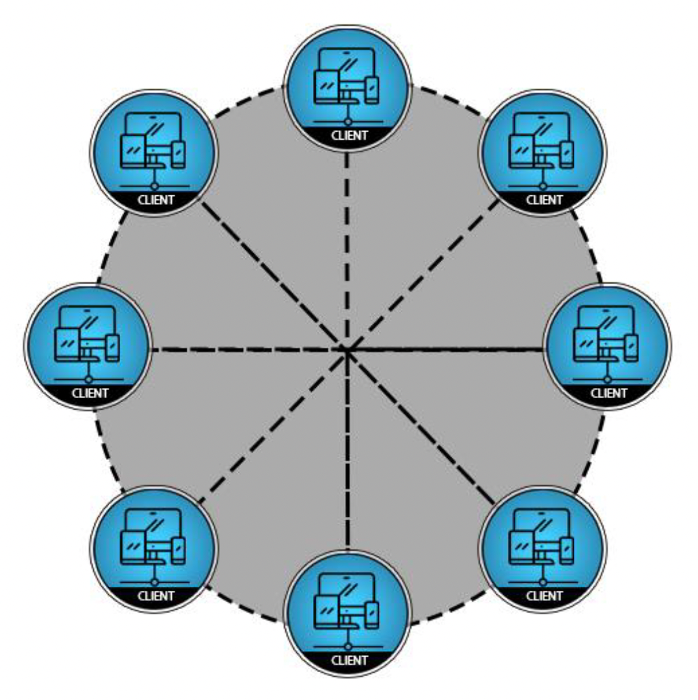
</div>

- 每个客户端向其他所有客户端广播游戏事件
- 鲁棒性
- 作弊更加容易
- 所有节点之间需要同步，以保持分布式游戏状态的一致性

后来开发者发现许多业务逻辑应当集中在一起处理，于是在原有 P2P 架构的基础上引入了**主机服务器**(host server)。

<div style="text-align: center">
    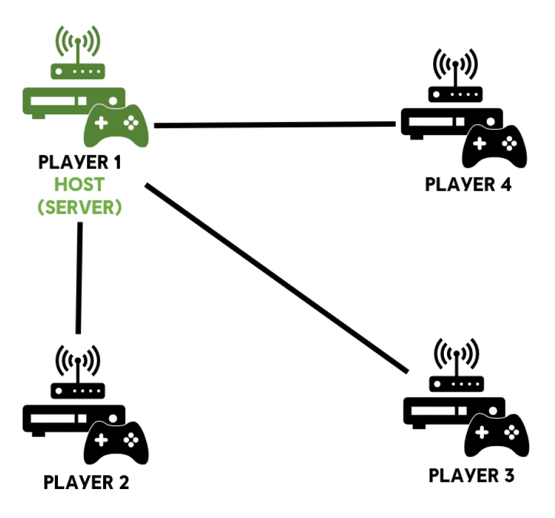
</div>

- 玩家可以充当“服务器”，称为主机
- 如果主机断开连接，游戏可能会结束
- 主机需要处理无法由玩家控制的游戏角色（比如 bot）

??? example "P2P 游戏代表"

    <div style="text-align: center">
        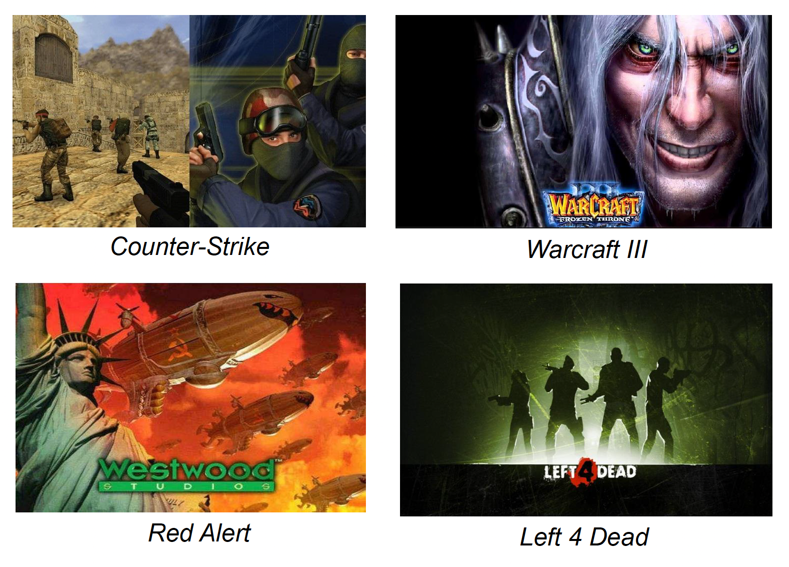
    </div>

P2P 游戏具有以下特点：

- 不依赖于服务器
- 通常采用局域网（LAN）
- 基本上由主机控制会话
- 同时在线的玩家数量有限


### Dedicated Server

但对于像 MMORPG 等更复杂的游戏类型，现在一般会采用**专用服务器**(dedicated server)架构，它的作用和特点是：

<div style="text-align: center">
    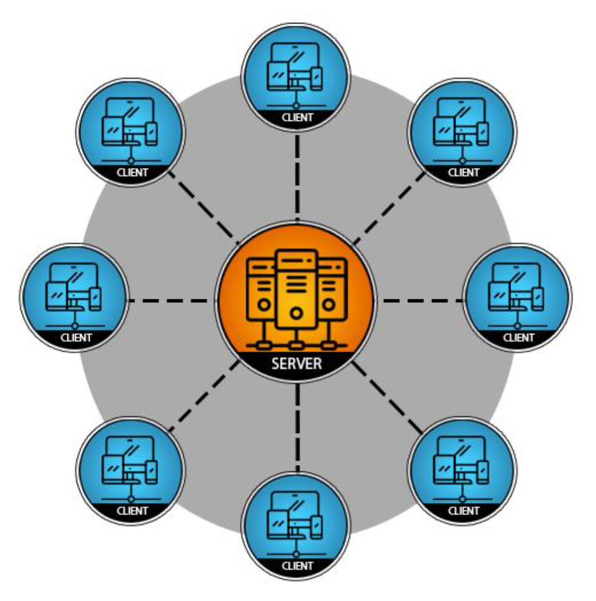
</div>

- 权威(authority)
- 模拟游戏世界
- 向玩家分派数据
- 高性能要求

???+ abstract "P2P vs 专用服务器"

    | | P2P | 专用服务器 |
    | :--- | :--- | :--- |
    | 优点 | 1. 鲁棒性强<br>2. 消除多人游戏会话中的“服务器故障”问题<br>3. 无需额外的服务器成本 | 1. 易于维护且能防止作弊<br>2. 可以处理庞大的游戏世界<br>3. 游戏的响应速度不依赖于**每个独立**客户端的网络状况 |
    | 缺点 | 1. 作弊更容易<br>2. 每个玩家都需要良好的网络连接才能使游戏正常运行<br>3. 只能处理**有限数量**的玩家 | 1. 服务器成本高昂<br>2. 服务器端程序的开发工作量大得多<br>3. 存在单点故障风险 |

---
当玩家在不同国家，相隔遥远，或者网络环境复杂时，RTT 就会很高。解决方法是使用**专用线路**(dedicated line)和**边缘网关**(edge gateway)来降低延迟。

<div style="text-align: center">
    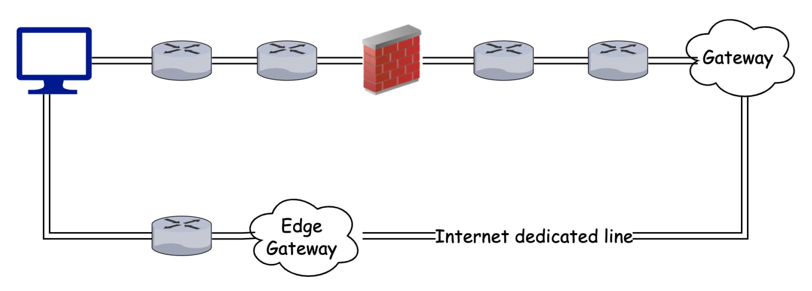
</div>


## Game Synchronization

在单机游戏中：

- 每个游戏 tick 中需要完成以下任务：
    
    <div style="text-align: center">
        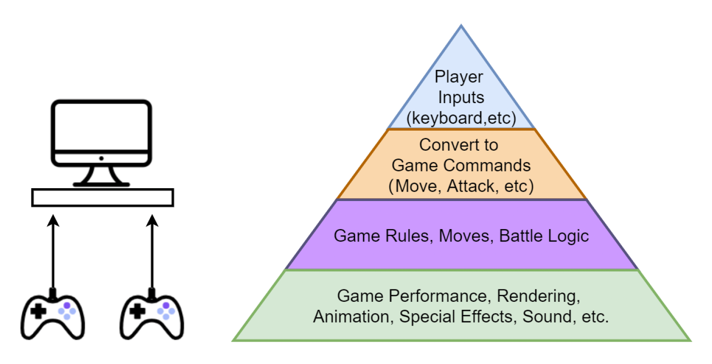
    </div>
    
    - 玩家输入
    - 转换为游戏命令
    - 游戏逻辑
    - 游戏渲染

- 玩家关心的是
    
    <div style="text-align: center">
        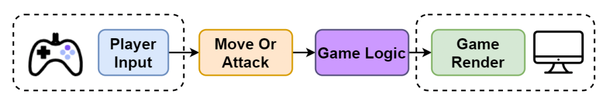
    </div>

    - 玩家输入
    - 保持一致性

对于网络游戏，虽然玩家关心的东西还是一样的，但每个游戏 tick 要完成的任务变得更加复杂了。但不管如何，还是得通过游戏命令和游戏逻辑来实现不同终端玩家一起玩游戏。

<div style="text-align: center">
    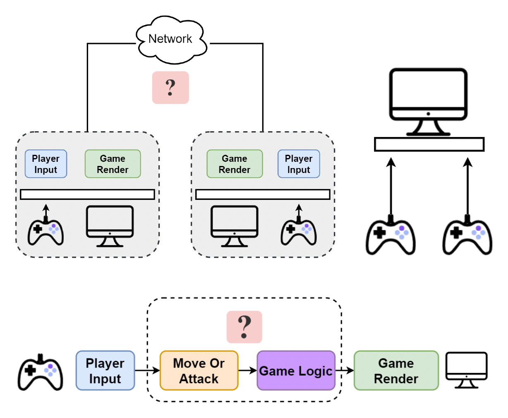
</div>

为了满足对响应策略的需求，游戏需要**同步**(synchronization)规则，以解决所有目标的延迟和一致性问题。

??? example "例子"

    <div style="text-align: center">
        
    </div>

常用的同步方法有三种，分别是：

- **快照**(snapshot)同步
- **锁步**(lockstep)同步（**帧同步**）
- **状态**(state)同步

下面将会详细分析这些方法。


### Snapshot Synchronization

??? example "例子（*Quake*）"

    <div style="text-align: center">
        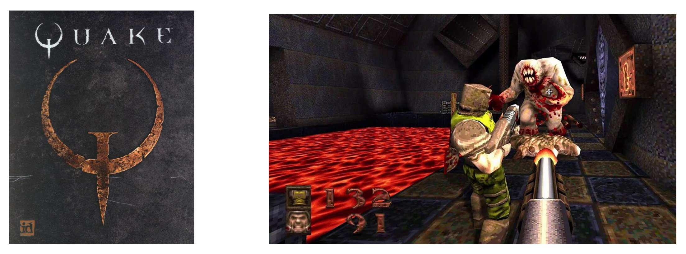
    </div>

快照同步的步骤：

1. 客户端向服务器发送输入
2. 服务器模拟游戏世界，生成整个游戏状态快照，并将它们发送给客户端
3. 客户端根据快照更新显示

<div style="text-align: center">
    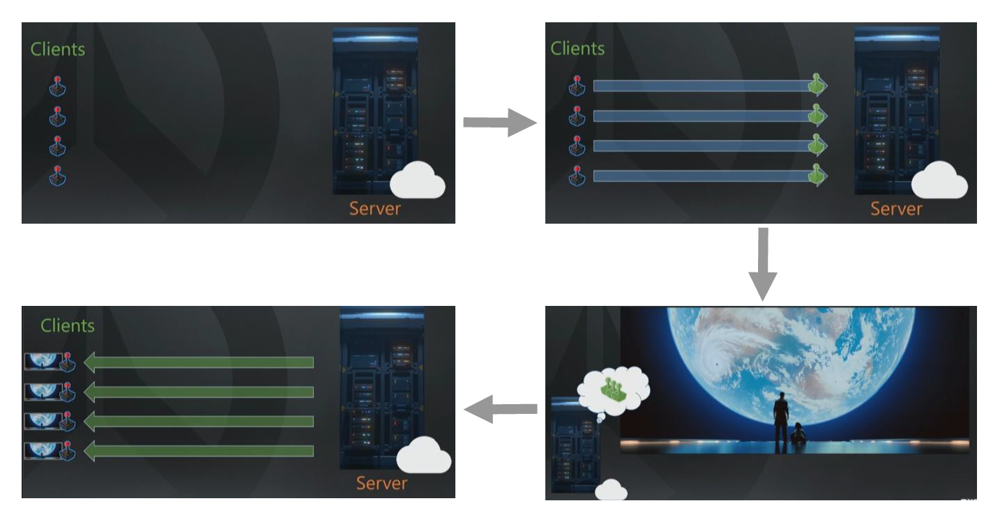
</div>


#### Snapshot Interpolation

出于对带宽和性能的考量，通常会限制服务器的 tick 速率，但这样做会出现画面抖动(jitters)和卡顿(hitches)的问题。

??? example "例子"

    <div style="text-align: center">
        
    </div>

解决方案是在快照之间进行**插值**，使画面变化看起来更丝滑。具体细节为：

- 接收快照后不会立即渲染
- 保留一个插值缓冲区
- 在两个延迟快照之间进行插值


#### Delta Compression

快照同步的另一个问题是每个快照的数据量可能很大，若不做任何处理就会占据过多的内存带宽和空间。常见做法是采用**增量压缩**(delta compression)，即仅同步客户端的快照增量（两次连续快照的差值）。

>*Quake3* 便采用了这种方法。

<div style="text-align: center">
    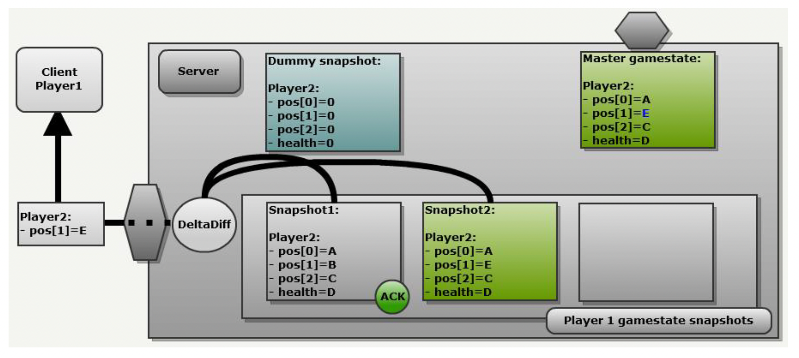
</div>

??? example "例子"

    <div style="text-align: center">
        
    </div>

???+ bug "缺点"

    - 浪费客户端性能，而服务器压力大
    - 数据量大，带宽要求高
    - 随着游戏变得越来越复杂，快照也会变得越来越大


### Lockstep Synchronization

「**锁步**」这一概念源自军队管理，是确保同步的一种最简单的方法，保证了同一时间下士兵采取相同行动，即结果相同。除非其他成员确定他们已经完成了任务，否则不允许任何成员提前推进模拟时钟。像下棋、打牌等回合制游戏都遵循这一原则。

显然，完全有序的交付(delivery)是确保不同节点之间游戏状态一致性的充分条件，因为它保证所有生成的事件都按照相同的唯一顺序可靠地交付。

在网络游戏中，锁步的原则是：相同的输入 + 相同的执行过程 = 相同的状态。

<div style="text-align: center">
    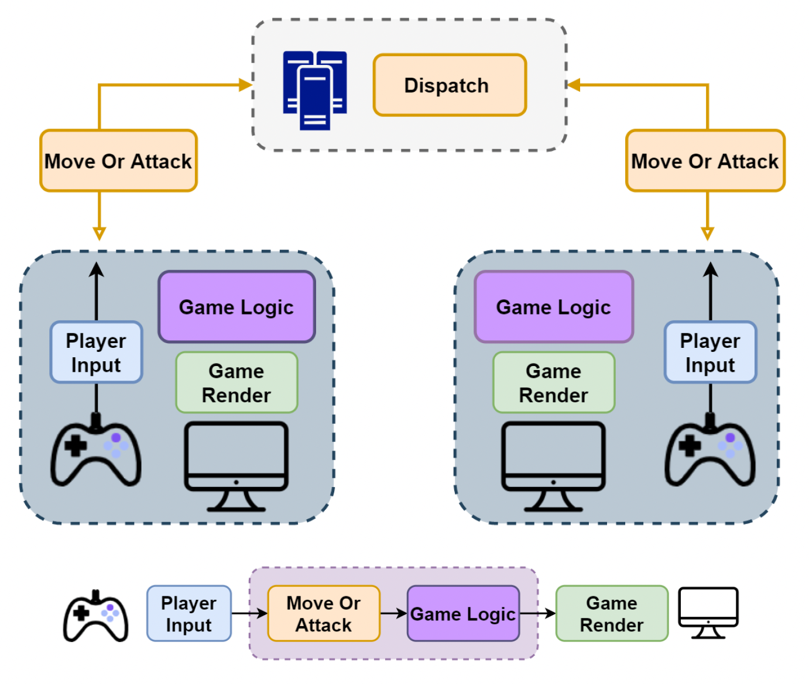
</div>

最早用到锁步思想的电子游戏是 *DOOM*（1994 年，采用 P2P 架构）。

锁步的**初始化**常常发生在游戏加载的时候，在这段时间中：

- 确保客户端的初始数据是**确定性的**(deterministic)
    - 游戏模型
    - 静态数据
    - ...

- 同步时钟


#### Deterministic Lockstep

确定性锁步的流程如下：

1. 客户端向服务器发送输入
2. 服务器接收并排序；在转发之前等待所有客户端的输入
3. 在从服务器接收数据后，客户端执行游戏逻辑

<div style="text-align: center">
    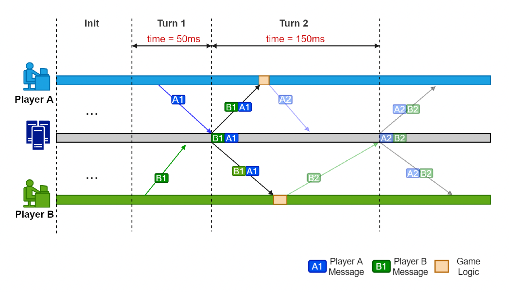
</div>

???+ bug "问题"

    若玩家 B 的消息 B2 到达较晚呢？（图中虚线标出的 B2）

    <div style="text-align: center">
        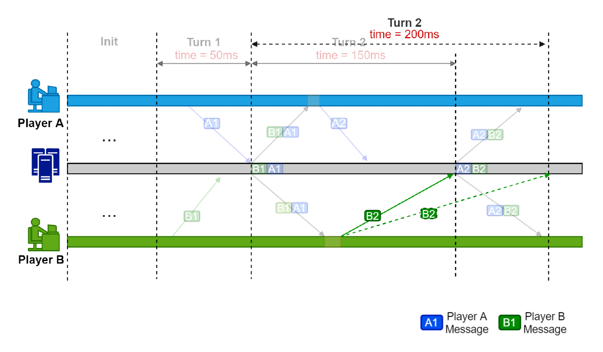
    </div>

    - 游戏进度取决于最慢的玩家
    - 游戏延迟不固定，体验不佳
    - 如果有玩家离线，那么所有玩家都将进入等待状态

        ??? example "例子"

            <div style="text-align: center">
                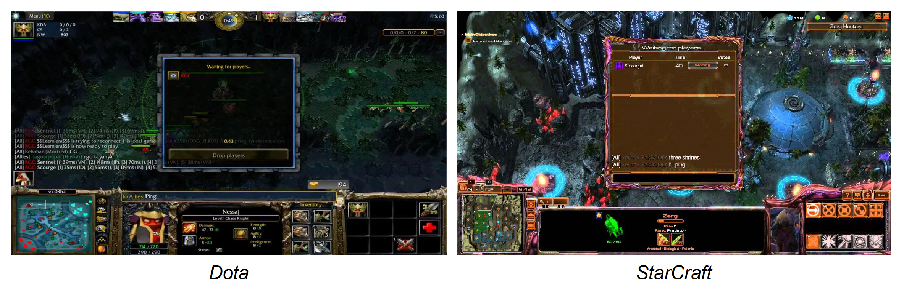
            </div>

优化方案是采用**桶同步**(bucket synchronization)。**桶**是指一个固定的时间段。每个桶需收集所有指令，并向所有玩家广播，无需等待所有玩家指令接收后再转发。

<div style="text-align: center">
    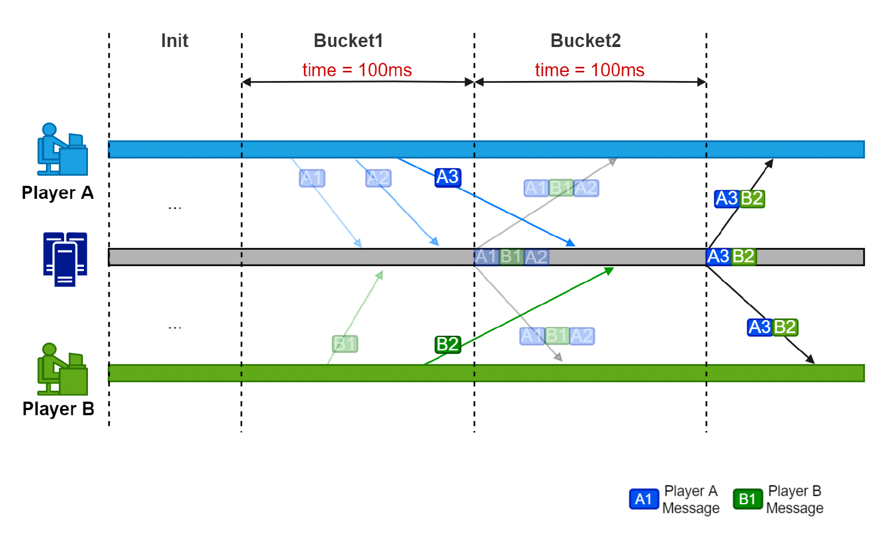
</div>

选择网络架构时，我们往往要考虑**一致性**(consistency)和**交互性**(interactivity)的权衡。一旦测得交互度低于给定阈值，就采取一些程序跳过处理过时的游戏事件，以恢复令人满意的交互水平。

!!! warning "确定性的挑战"

    - 浮点数
    - 随机数
    - 容器和算法（排序、添加、删除等）
    - 数学工具（向量、四元数等）
    - 物理模拟（非常困难）
    - 代码逻辑执行顺序

???+ note "浮点数"

    - 由于计算机是二进制编码的
        - 所以这些数字能被精确表示：0.5, 0.25, 0.75, 0.875...
        - 而这些数字只能被近似表示：2/3...
    
    - 浮点数必须遵循 IEEE 754 标准

        <div style="text-align: center">
            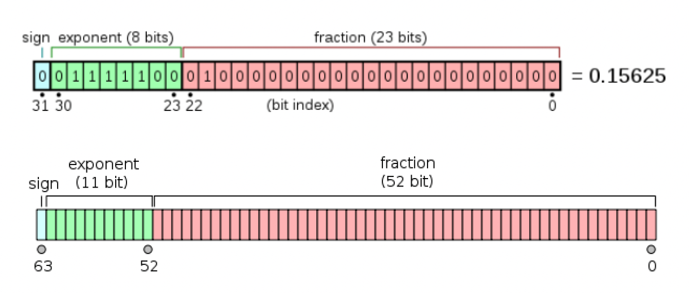
        </div>

    - 但在不同平台上有不同行为
        - 硬件和 OS
            - Intel / AMD
            - PS / Xbox
            - Windows / Linux
            - Android / IOS
            - ...
        
        - 编译器
            - 数学库（`sin`, `cos`, `tan`, `exp`, `pow`...）
            - 第三方库组件
            - 不同平台
            - 不同版本
            - 不同语言
            - ...

    - 思路：避免精度边界问题，自定义精度
        - 定点(fixed-point)数学库
        - 查找表（三角函数等）
        - 放大(amplification)和截断(truncation)

    - 简单方法：
        - 先乘以 1000，再除以 1000，但可能会溢出
        - 分子和分母由定点数表示（比如 2/3）
        - ...

    - **定点数**：

        <div style="text-align: center">
            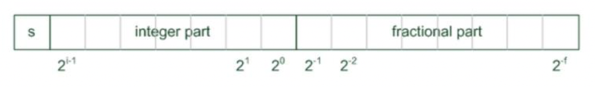
        </div>

        - 由三部分组成：一个可选的符号位、一个整数和一个小数部分
        
            $$
            V = (-1)^{b_{f+i}} \left( \sum_{n=0}^{i} 2^{n} b_{n+f} + \sum_{m=1}^{f} 2^{-m} b_{f-m} \right)
            $$
        
        - 需实现加减乘除等运算，以及类和类方法
        - 还需考虑性能
  
???+ note "随机数"

    游戏中的随机问题包括：

    - 随机事件的触发，比如 NPC 的随机出生地
    - 攻击的随机属性，比如暴击率
    - ...

    这些逻辑通常通过随机数实现。一种为多名玩家实现完全一致的随机逻辑的做法是使用**伪随机数**(pseudorandom)。

    - 在游戏开始之前，初始化随机数种子
    - 对于不同玩家的客户端，随机函数调用次数是固定的，生成的随机数是相同的

    ??? example "例子"

        ```cpp
        int main() {
            std::default_random_engine e;
            std::uniform_int_distribution<int> u(0, 100);
            e.seed(80);

            for (int i = 0; i < 20; i++) {
                std::cout << u(e) << std::endl;
            }

            return 0;
        }
        ```

        <div style="text-align: center">
            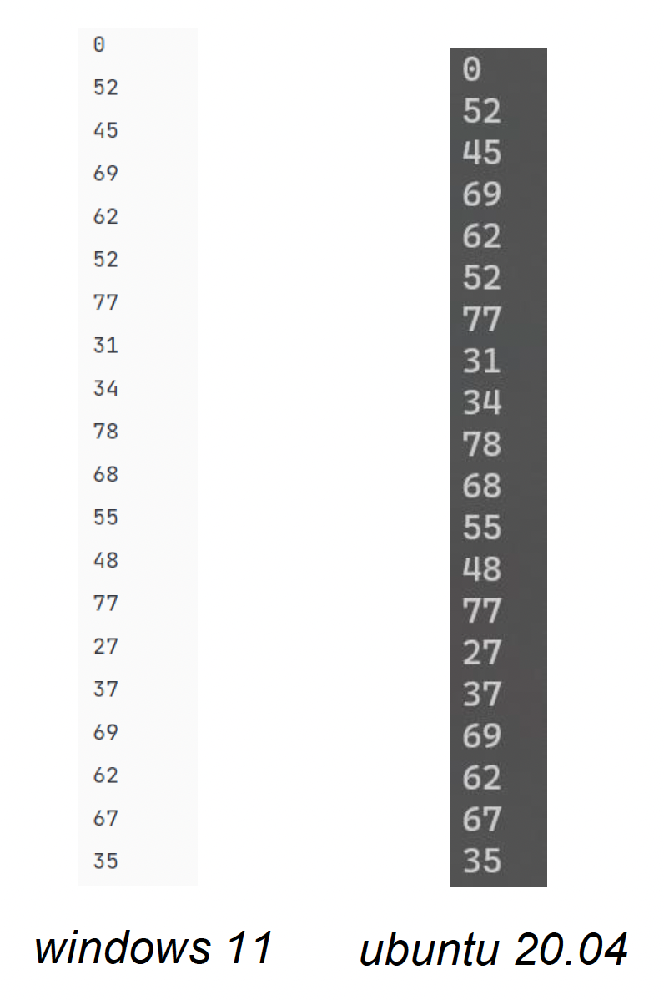
        </div>

对应地，我们有以下确定性的实现途径：

- 用定点数表示关键游戏逻辑中的浮点数
- 确定性随机算法
- 确定性容器和算法（排序、添加、删除等）
- 确定性数学工具（向量、四元数等）
- 确定性物理模拟（非常困难）
- 确定性执行顺序

显然我们无法总是保证确定性一直成立，这时我们就要找出 bug。常用的追踪和调试手段有：

- 获取**校验和**(checksum)：所有数据的校验和，或仅计算关键数据的校验和
- **自动定位** bug：
    - 服务器比较不同客户端的校验和
    - 客户端上传 50 帧完整日志
    - 通过比较日志找出不一致的地方

<div style="text-align: center">
    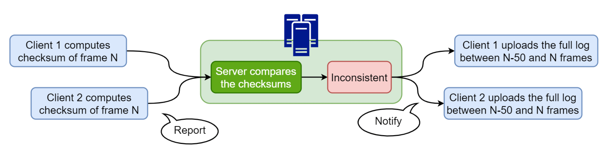
</div>


#### Lag and Delay

即便在帧同步中采用桶同步的优化措施，但还是有可能会出现**延迟**问题。因为网络通常是不稳定的，如果直到接收新的帧之前一直等待的话，就出现了延迟。解决方案有：

- 用**缓冲区**缓存帧：缓冲区越大，延迟越大（因为只有缓冲区满了才会显示里面的帧）；缓冲区越小，对延迟更敏感

    <div style="text-align: center">
        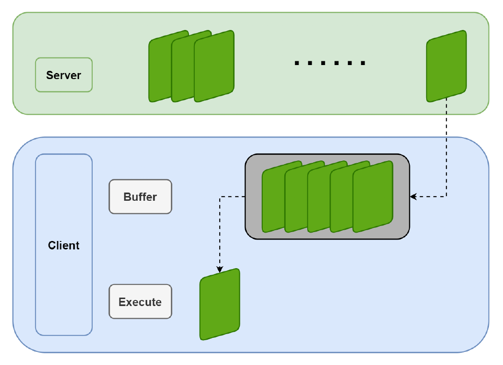
    </div>

- **分离游戏逻辑和渲染**
    
    <div style="text-align: center">
        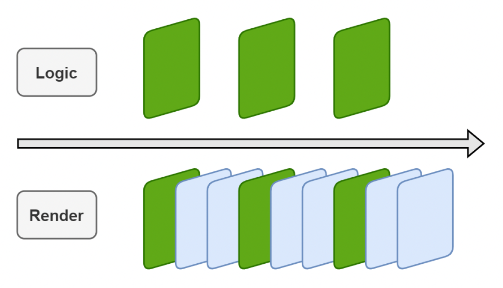
    </div>

    - 延迟问题的解决：
        - 分离逻辑和渲染
        - 本地客户端通过插值使画面变化更丝滑
    
    - 帧率：
        - 逻辑帧率通常在 10-30 fps 左右
        - 渲染帧率通常更高
    
    - 优点：
        - 逻辑和渲染可以以不同频率独立运行
        - 渲染卡顿不影响逻辑帧的操作
        - 服务器可以通过运行逻辑帧来解决一些作弊问题
        - 若服务器运行逻辑帧，可以保存关键帧快照以加速重连


#### Reconnection Problem

<div style="text-align: center">
    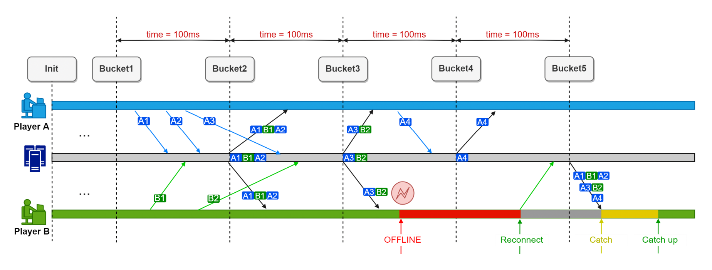
</div>

重连的三个阶段：**离线**(offline)、**重连**(reconnect)和**追赶**(catch up)。

**客户端**的游戏状态快照可以定期保存在本地客户端并序列化到磁盘。当重新连接发生时，将从磁盘的序列化数据中恢复游戏状态。获取快照后，服务器发送玩家命令，加速赶上游戏进度。这样的好处是不必从头开始恢复游戏状态，可以从断连的那一刻开始追赶。

<div style="text-align: center">
    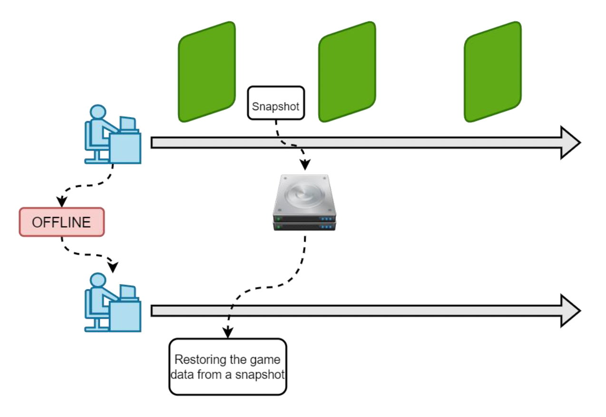
</div>

下面给出一段简单的关于快速追赶的实现代码：

```cpp
float m_delta = 0;
float m_tick_delta = 100;

void CBattleLayer::update(float delta){
    // do something
    m_delta += delta;

    int exec_count = 1;
    while(m_delta >= m_tick_delta){
        m_delta -= m_tick_delta;

        // logic frame
        if(!logicUpdate(LOGIC_TIME)){
            return;
        }

        // catch up 10 frames at a time
        if(exec_count++ >= 10){
            break;
        }
    }

    // do something
}
```

- 每次选择 10 帧
- 若初始为 10 fps，那么追赶时就是 100 fps

除了客户端外，**服务器**也可以保存快照。它会运行逻辑帧并保存关键帧快照。玩家断连后可在服务器发送快照后进行操作，之后也通过加速赶上游戏进度。

<div style="text-align: center">
    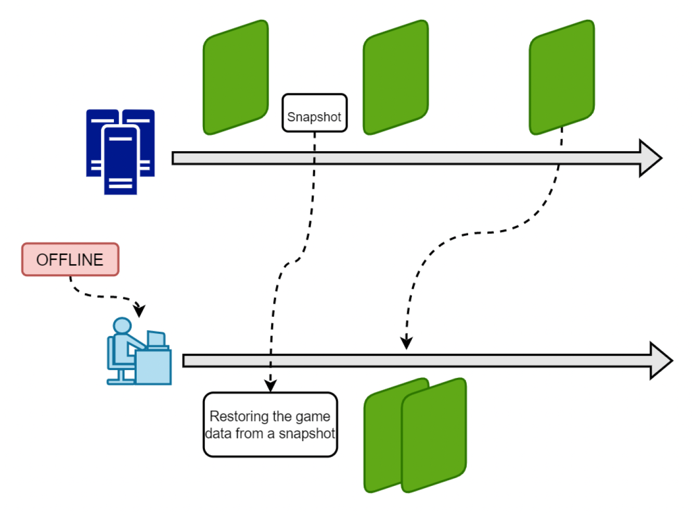
</div>

如果只是**临时离线**，则不会引起程序崩溃，因为客户端依然保留游戏状态、关键帧和确定性计时的帧。重连后，服务器向刚才断连的玩家发送一些命令，加速赶上游戏进度。

??? example "例子"

    <div style="text-align: center">
        
    </div>

这项技术的另一项应用是**观战模式**，即观看其他玩家游玩。

- 这和重连本质上是一样的，观看就相当于客户端崩溃后的重连
- 将玩家的行动命令转发给观看游戏的玩家
- 观看通常会延迟几分钟，以防止屏幕偷看

??? example "例子"

    <div style="text-align: center">
        
    </div>

**回放**(replay)功能也是类似的。通过执行玩家们当时在游戏中的命令，可以加速回放的播放。

- **回放文件**保存了一场游戏的游戏命令，仅占据很小的空间
- 实现**回退**的方式：
    - 当客户端执行回放文件时，它会添加一个关键帧快照，可以回退到关键帧时刻
    - 例子：《王者荣耀》当前版本（2022 年）可以回退到 60 秒前的关键帧

??? example "例子"

    <div style="text-align: center">
        
    </div>


#### Lockstep Cheating Issues

- 多人 PvP

    <div style="text-align: center">
        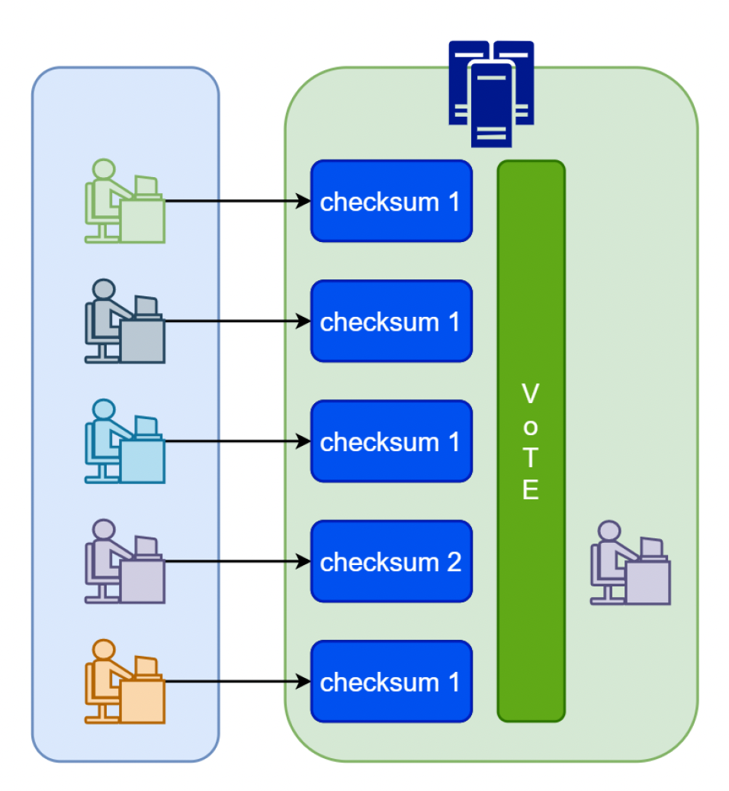
    </div>

    - 游戏结束时，客户端会上传密钥数据校验和，服务器验证游戏结果
    - 游戏进行时，客户端报告密钥数据校验和，作弊的玩家会被踢出等等

- 双人模式
    
    <div style="text-align: center">
        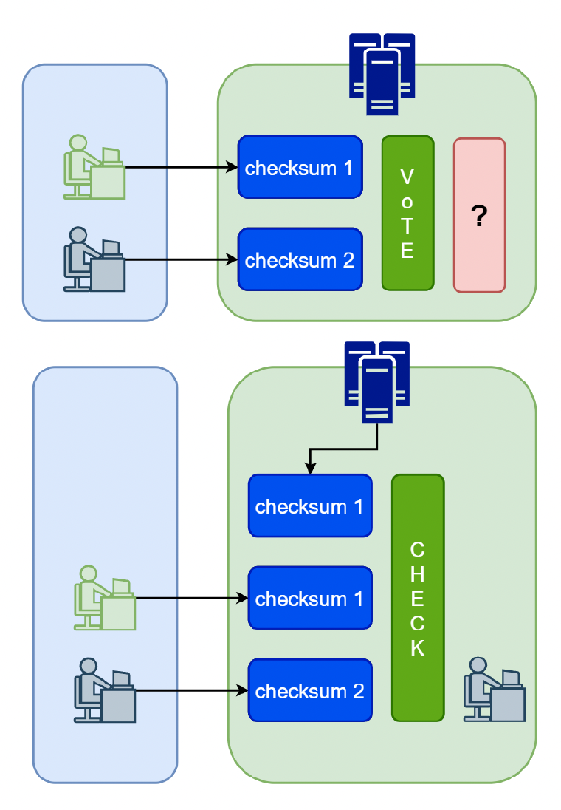
    </div>

    - 服务器无法通过密钥数据校验和来检测谁在作弊
    - 如果服务器未被验证，那么作弊玩家在这种情况下只会影响一个玩家

- 难以避免访问战争迷雾(war-fog)（玩家视野有限）或其他隐藏数据的第三方插件
    - 游戏逻辑在客户端执行
    - 客户端拥有所有游戏数据

    <div style="text-align: center">
        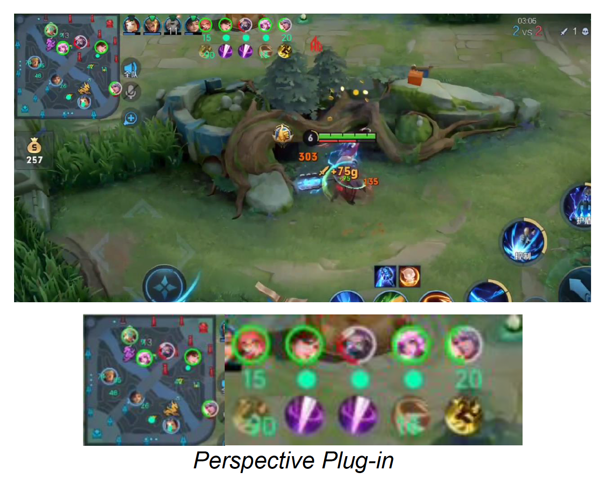
    </div>

???+ abstract "总结"

    ???+ recommend "优点"

        - 因为仅发送命令，所以带宽小
        - 类似于单人游戏开发的高开发效率
        - 精确的动作/命中检测
        - 便于游戏录制

    ???+ bug "问题"

        - 难以保持一致性
        - 很难解决显示所有游戏状态的作弊插件的问题
        - 断连和重连时间更长，需要更复杂的优化


### State Synchronization

游戏**状态**(states)对表示游戏世界而言是必需的。在**状态同步**中，

- 服务器不会为所有客户端生成单个更新，而是向客户端发送定制的数据包
- 如果游戏世界过于复杂，可以通过设置**兴趣区域**(area of interest, **AOI**)来减少服务器开销

状态同步最大的特点是由**服务器**管控整个游戏世界。

<div style="text-align: center">
    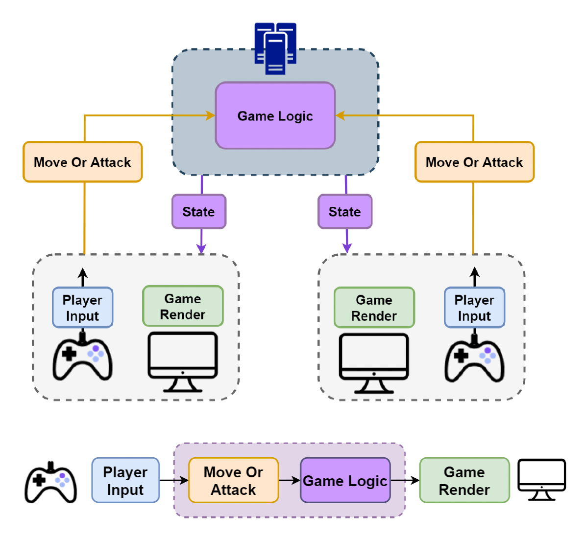
</div>

- 服务器：接收来自客户端的输入和状态，运行游戏逻辑，然后发送状态
- 客户端：接收数据并模拟游戏世界，游戏玩法的提升

???+ info "相关概念"

    <div style="text-align: center">
        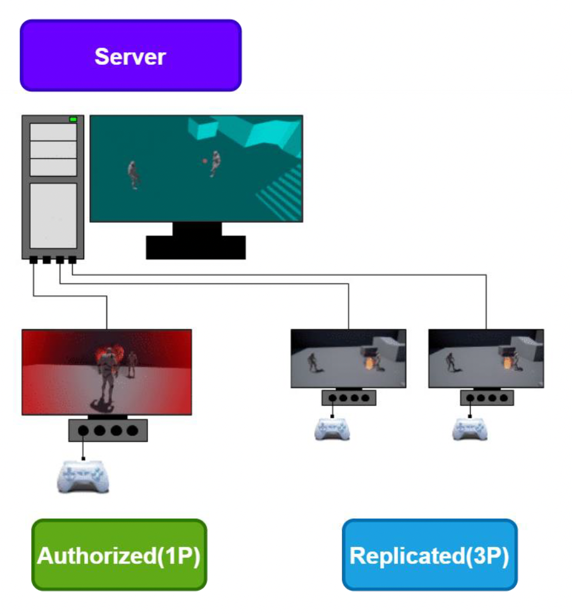
    </div>

    - **授权**(authorized)客户端（1P）：玩家本地游戏客户端（玩家自己操纵的）
    - **服务器**：授权服务器
    - **复制**(replicated)客户端（3P）：在其他玩家客户端中模拟的角色（其他玩家看到的）

??? example "例子"

    === "Stage 1"

        左右两张图分别对应（授权）玩家 1（准备开火）和（复制）玩家 2（观察玩家 1 开火）：

        <div style="text-align: center">
            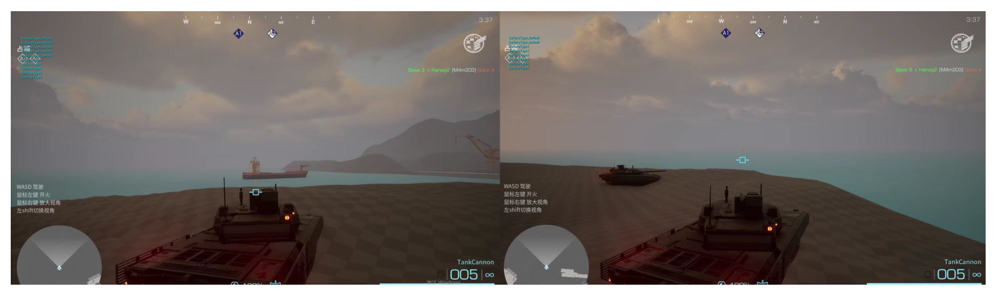
        </div>

    === "Stage 2"

        玩家 1 在本地机器上按下按钮开火时经历了这样一个过程：

        - 玩家 1：开火，发送给服务器
        - 服务器：玩家 1 开火，发送给各个客户端
        - 玩家 2：接收数据包，看到玩家 1 开火

        <div style="text-align: center">
            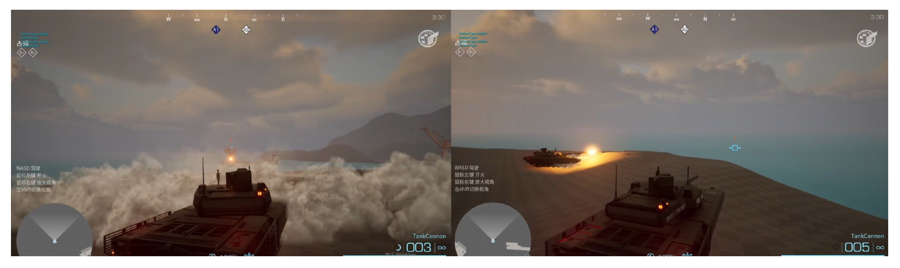
        </div>

    === "Stage 3"

        服务器告诉每个客户端以复现玩家 1 炮弹的移动：

        <div style="text-align: center">
            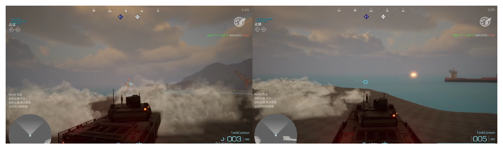
        </div>

    === "Stage 4"

        并且服务器告诉所有客户端要响应来自炮弹的破坏：

        <div style="text-align: center">
            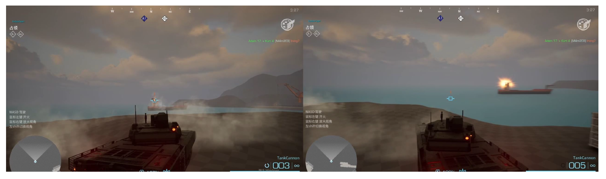
        </div>


#### Dumb Client Problem

**愚笨客户端问题**(dumb client problem)：客户端在收到服务器状态更新之前无法进行任何操作。

<div style="text-align: center">
    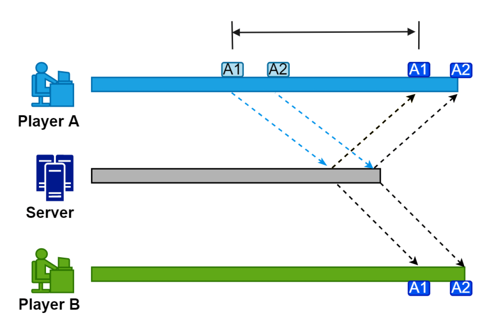
</div>

要想实现立即响应，可通过以下流程实现：

- **客户端预测**(client-side prediction)：对于授权客户端，假如按下 "->" 键，可以在未收到服务器消息的情况下先向右移动一段距离，等接收到消息时再和服务器的响应内容对齐

    <div style="text-align: center">
        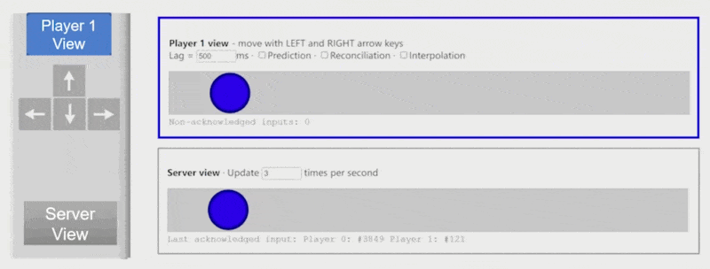
    </div>

    ??? example "例子"

        《守望先锋》的策略是：估计 RTT 为 160ms，并设定客户端总是领先服务器半个 RTT + 一条缓存命令帧的时间，即 80 + 16 = 96ms。因此玩家按下按钮后能够被立即响应。

        <div style="text-align: center">
            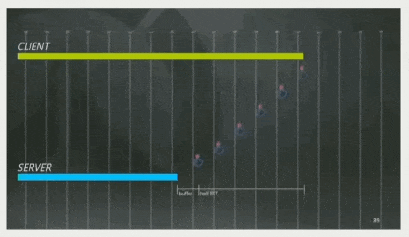
        </div>

- **服务器和解**(server reconciliation)
    - 授权客户端：**缓存**(buffer)
        - 客户端做预测时记录每个状态（便于回退）
        - 当接收来自客户端的数据时和服务器过去的数据比较

    - **环形状态缓存**：存储客户端前几帧的所有状态
    
        ??? example "例子"

            <div style="text-align: center">
                
            </div>
    
    - 进程：若客户端的计算结果与服务器一致，客户端就可以顺利继续模拟下一次输入
    - 问题：**误预测**(misprediction)
        - 如下图所示，若服务器这边的游戏中有一堵墙，那么客户端先前预测的位置就错了，此时客户端必须接受新的服务器更新，并重新追踪所有从新的确认点开始的预测移动

            <div style="text-align: center">
                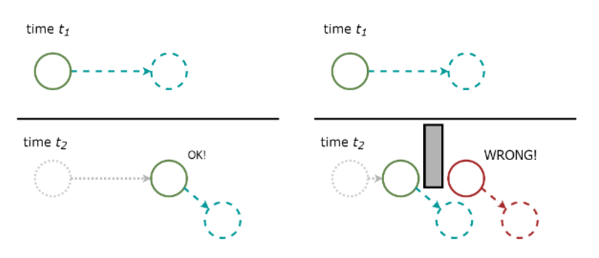
            </div>

        - 若客户端与服务器的结果不一致，意味着预测错误，需要和解
            - **环形输入缓存**：存储客户端前几帧的所有输入
            - 进程：用服务器结果覆写客户端结果，并重放所有输入，以赶上可确定的内容

    ??? example "例子"

        还是以《守望先锋》为例。被武器冻住的玩家尝试移动，但服务器不允许，于是玩家只能定在原地。

        <div style="text-align: center">
            
        </div>

    
#### Packet Loss

另外还得考虑**丢包**(packet loss)的问题，即客户端输入的数据包未能抵达服务器。

- 服务器尝试保持一个用于存放未处理输入的小型**输入缓冲区**
- 如果服务器用完了输入缓冲区，服务器将在窗口中**重复**最后输入
- 推送客户端尽快发送丢失的输入

---
???+ abstract "状态同步 vs 帧同步"

    | | 状态同步 | 帧同步 |
    | --- | --- | --- |
    | 确定性逻辑 | 不需要 | 必要 |
    | 响应速度 | 更快 | 更慢 |
    | 网络流量 | 通常较高 | 通常较低 |
    | 开发效率 | 复杂得多 | 开发容易，调试困难 |
    | 玩家数量 | 少量玩家 | 支持少量或大量玩家 |
    | 跨平台 | 相对容易 | 相对困难 |
    | 断线重连 | 相对容易 | 相对困难 |
    | 回放文件大小 | 大 | 小 |
    | 作弊 | 相对困难 | 相对容易 |