# Advanced Topics of OGA

## Character Movement Replication

???+ bug "问题"

    从玩家 2 的角度看，玩家 1 的动作非常不流畅并落后于玩家 1 的实际位置。

    

        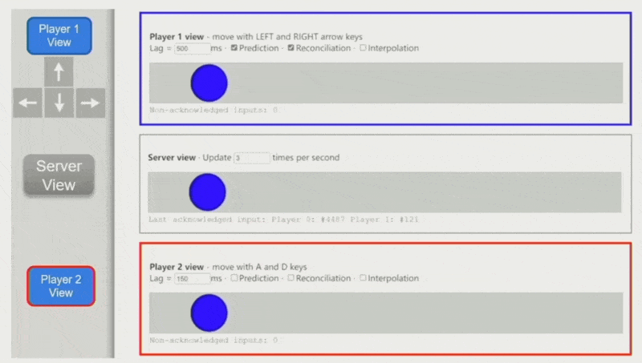
    

为了让玩家在屏幕中的移动看上去更加丝滑，常用的解决方案有：

- **插值**(interpolation)：基于过去且已知的状态计算状态
- **外推**(extrapolation)：预测实体从旧状态出发后怎么走

    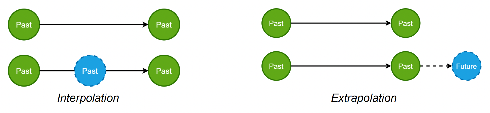

### Interpolation

可以在最近接收到的两个数据之间对**位置**(position)和**方向**(orientation)进行插值。

    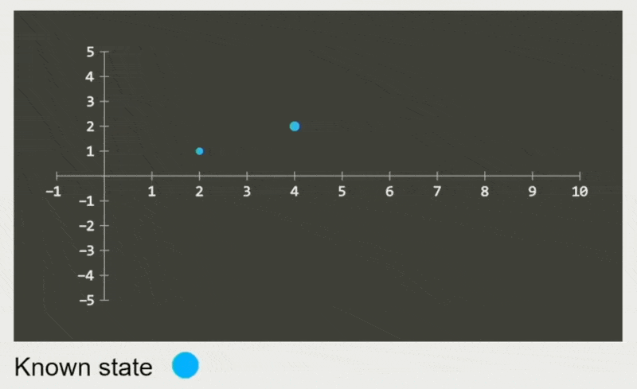

由于客户端与服务端之间传输数据需要一定时间，所以插值操作往往不会立马完成。这时就需要**缓存状态**(buffer states)，以实现**延迟渲染**(deferred rendering)。

- 接收数据包后不会立即进行渲染，而是将其存入内存并等待新的数据包
- 经过一段时间的偏移等待后，开始渲染首个接收到的数据包
- 插值偏移量是人造的一种延迟

    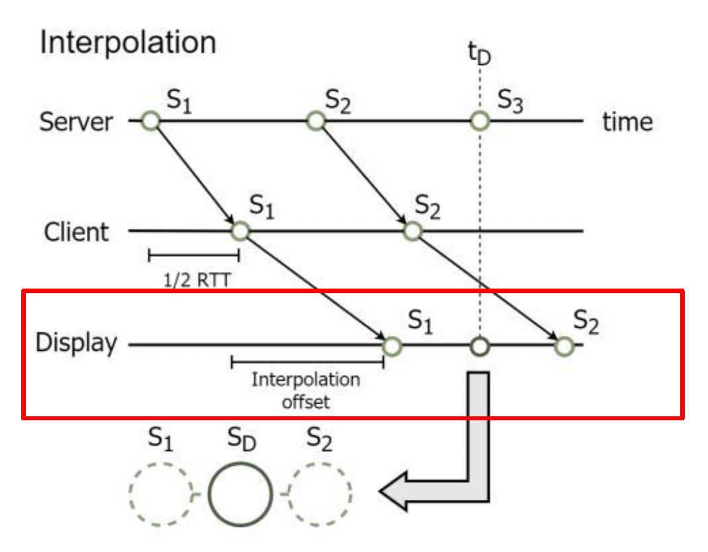

???+ example "效果"

    

        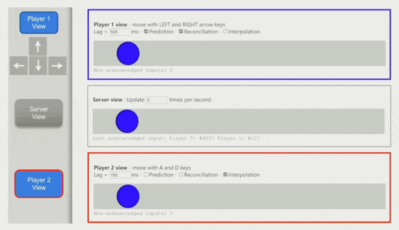
    

???+ warning "插值在载具移动复现时的挑战"

    

        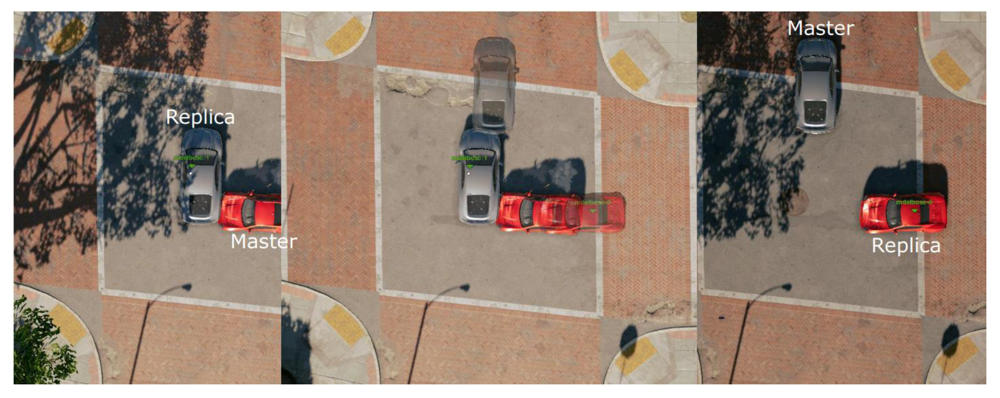
    

    如上图所示，由于插值被延迟了，所以很难处理这种情况。

    - 将红车对应到授权客户端，它认为自己会撞到灰车上
    - 然而，以灰车为授权客户端的话，它由于向上开走了，所以从它的视角看，它不会和红车相撞

### Extrapolation

为应对上述挑战，我们引入外推的方法。它的思路是利用**过去**状态来估计（预测）**当前**状态，以补偿网络延迟。

    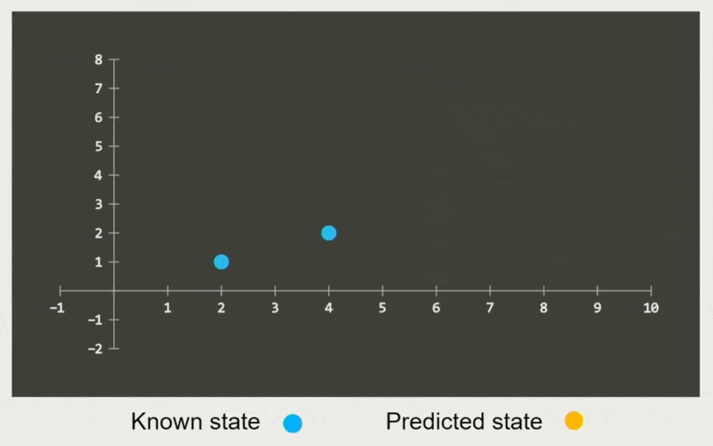

实现上借鉴了**航位推测法**(dead reckoning)的思想。抽象来说是根据已接收的状态来估计未来的状态。以航空为例，在没有 GPS 的年代，飞行员需根据已知的风向、风速等信息来修正飞机的方向和速度。

    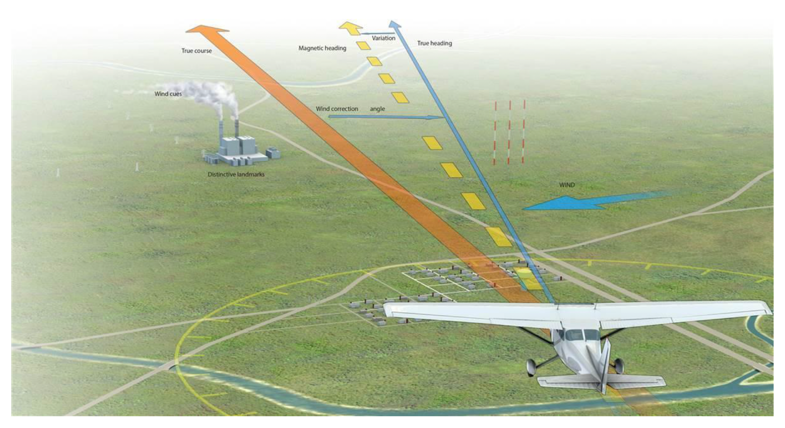

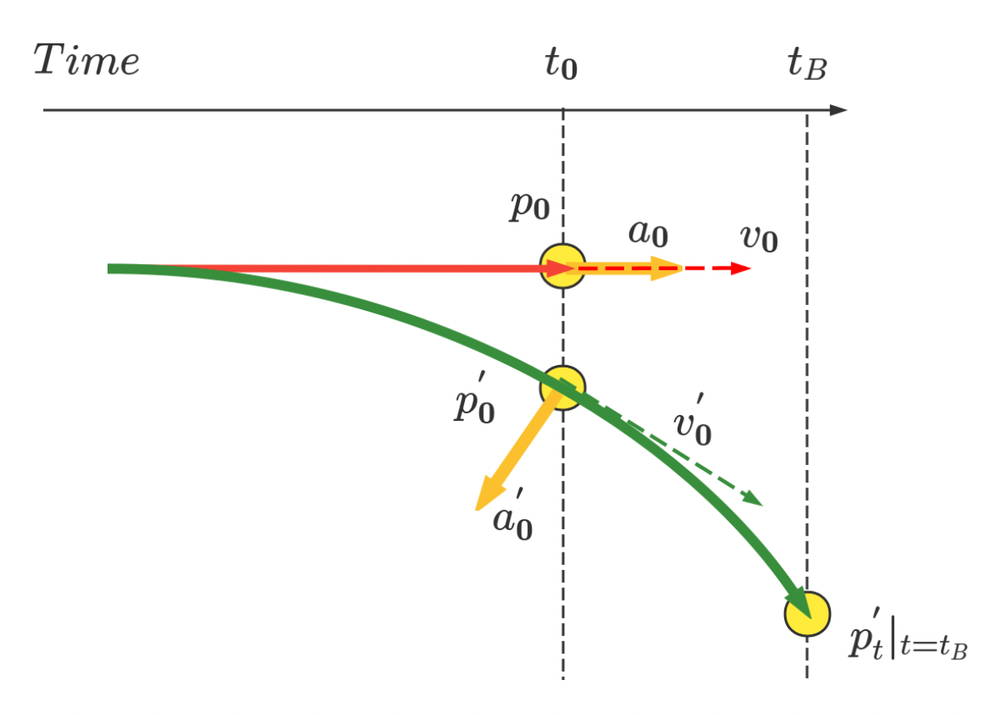{ align=right width=40% }

更具体地，我们采用名为**投影速度混合**(projective velocity blending)的算法。

- 在 $t_0$ 时刻，复现角色位于 $p_0$，速度和加速度分别为 $v_0, a_0$，并且接收到位置 $p_0'$，速度 $v_0'$ 和加速度 $a_0'$ 的同步状态
- 基于同步状态，我们能预测经过时间 $t$ 后的位置 $p_t' = p_0' + v_0' t + \dfrac{1}{2}a_0't^2$
- 我们的目标是在固定的混合时间 $t_B - t_0$ 后，能够平滑抵达 $p_t'|_{t=t_B}$

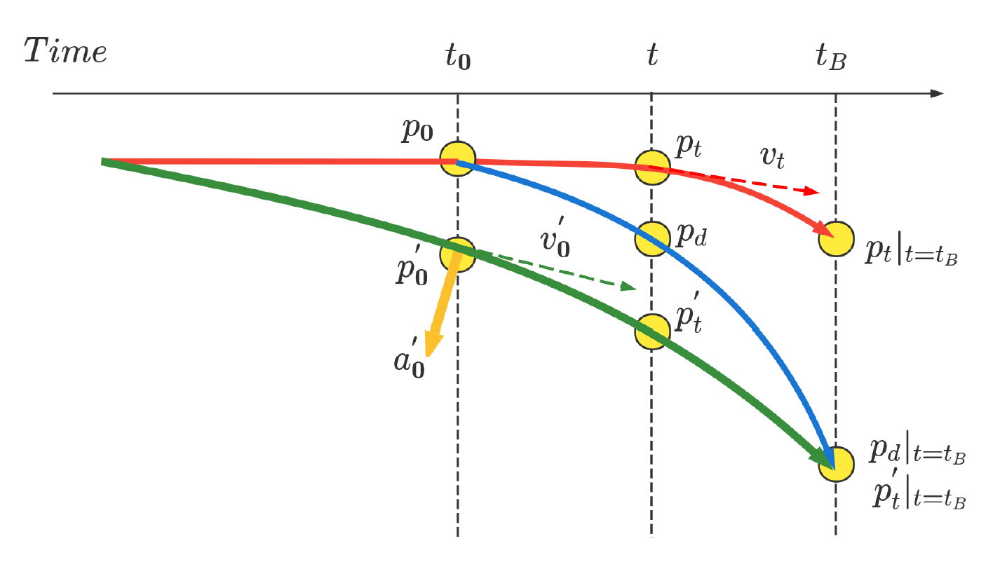{ align=right width=40% }

- 在任意时刻 $t$，我们可以得到混合速度 $v_t$

    $$
    \begin{aligned}
    \lambda & = \dfrac{t - t_0}{t_B - t_0} \\
    v_t & = v_0 + \lambda (v_0' - v_0)
    \end{aligned}
    $$

    以及从 $p_0$ 投影到的位置 $p_t = p_0' + v_0 t + \dfrac{1}{2}a_0 t^2$

- 然后结合 $p_t, p_t'$ 得到推算(dead reckoned)位置 $p_d = p_t + \lambda (p_t' - p_t)$

???+ bug "碰撞问题"

    航位推测得到的碰撞轨迹看起来很奇怪（两辆车碰撞时车头互相穿模了 + 碰撞效果不符实际）。因为上述算法并没有考虑到动力学原理，插值看起来很生硬。

    

        
    

    === "阶段 1"

        开始碰撞。

        

            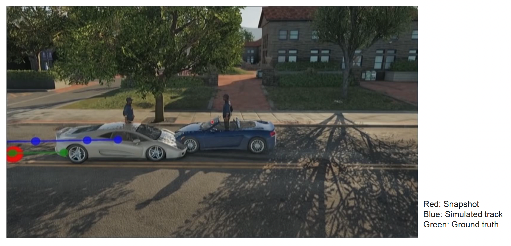
        

    === "阶段 2"

        复制品（复制客户端看到的车辆）继续前进，因为外推是基于最新快照进行的。

        

            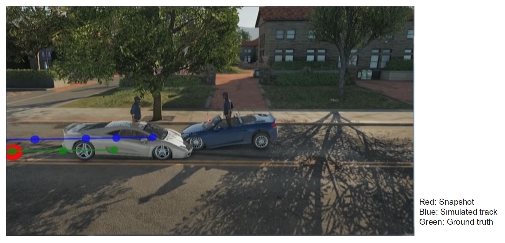
        

    === "阶段 3"

        最终（复制客户端）收到一个快照使复制品停止，但复制品已经给主控车辆的刚体施加了巨大速度，将其推开。

        

            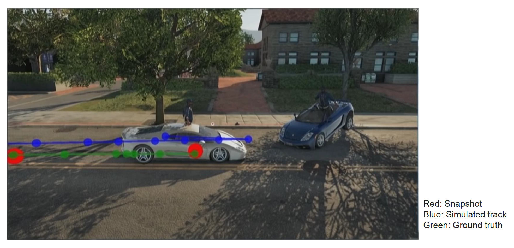
        

所以要在碰撞过程中加入**物理模拟的混合**，即在客户端**物理模拟**计算出的状态，和试图接近**推算位置**的状态这两种状态之间调整。当发生碰撞时，把位置同步的控制权从外推算法交给物理引擎算法，过一段时间后再换回来。

    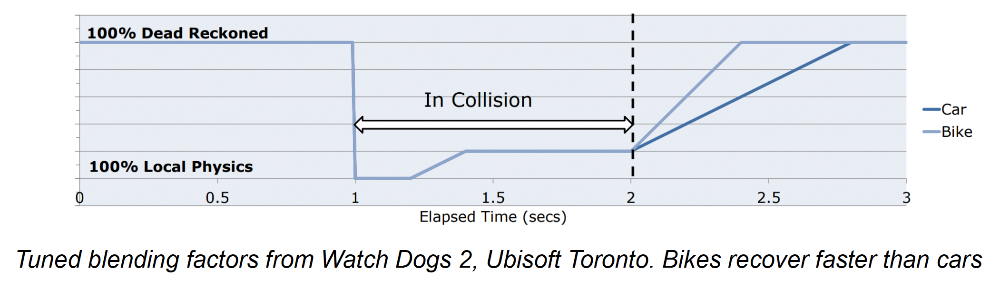

### Applications

使用**插值**的场景：

- 角色移动具有高度不确定性，加速度变化显著
- 当外推误差出现时，游戏玩法会受到画面突变（"wrap"）的影响
- 典型例子：FPS，MOBA

使用**外推**的场景：

- 玩家移动时采用真实的物理模型
- 网络传输延迟影响到了游戏玩法
- 典型例子：竞速游戏、载具系统（坦克、轮船等）

有时，我们需要同时应用插值和外推来确保游戏的正常运行。

- 对载具应用外推法
- 对角色使用插值法
- 若接收数据不足时则进行外推处理

## Hit Registration

要想实现网络射击类游戏中的爆头(headshot)可比我们中要复杂，因为网络消息从客户端传输到服务器需要一段时间，而且插值时还需要缓存一下，因此导致我们看到的敌人位置会有些滞后。

    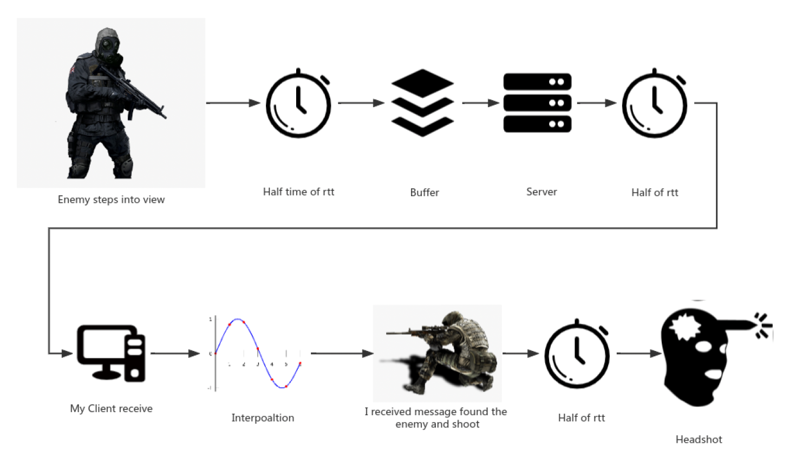

既然由于延迟、插值偏移和时间差，看到其他玩家的位置会略微落后于他们在服务器上的实际位置，那么该朝哪里射击呢？

    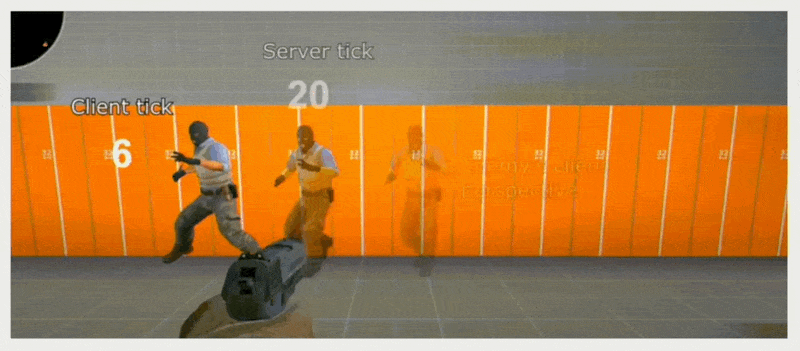

    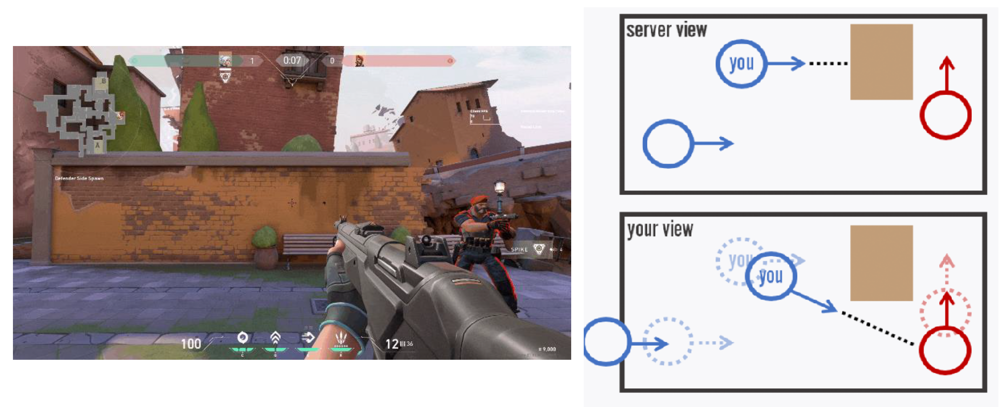

这里便引入了**命中判定**(hit registration)的概念，即让所有玩家（客户端）达成共识，确认是否确实击中了敌人。这一问题有两类处理办法，一类是由**客户端**处理的**命中检测**(hit detection)，另一类是由**服务器**处理的**命中判定**。

### Client-Side Hit Detection

客户端这边的方案是：

- 由客户端根据复制角色位置来检测命中事件
- 然后将命中事件发送至服务器，由服务器执行简单验证

???+ example "例子"

    

        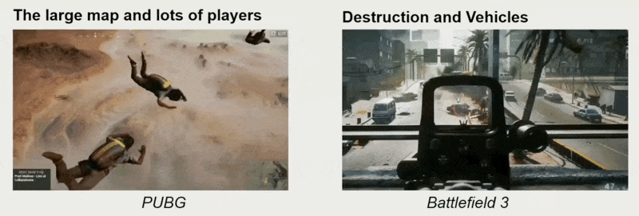
    

射击类游戏的不同弹道效果：不同于扫射类武器(hitscan weapons)（射速无限快，相当于射出一道激光），投掷类武器(projectile weapons)还能模拟出重力效果（弹道为抛物线）。

    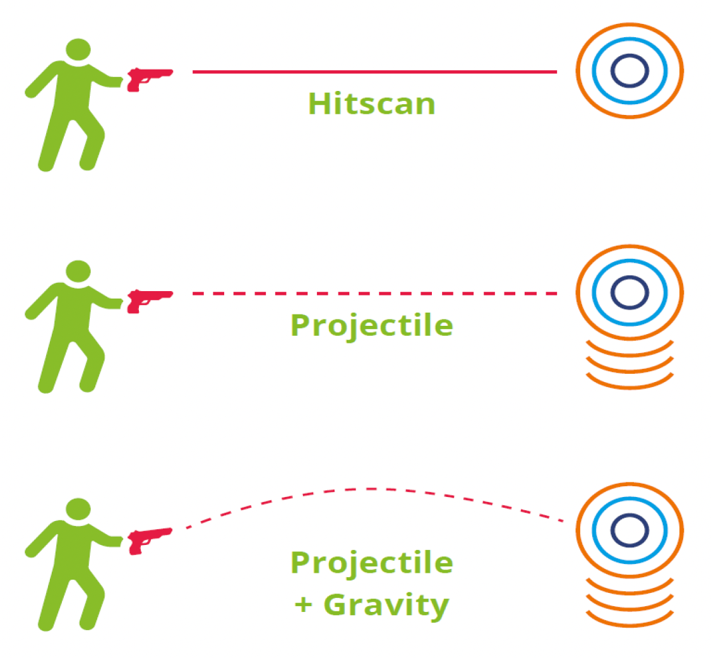

再来看服务器端是怎么验证的。客户端向服务器发送包含完整射线信息的命中事件，包括射线的起始点、命中点和命中对象。

1. 验证起始点是否确实足够接近射击者位置
2. 验证命中点是否真实属于该命中对象
3. 通过从起始点到命中点投射射线，确保路径上没有任何障碍物

这里只是简化的处理。在实际的游戏中，这一验证其实是**非常棘手且复杂的**。

???+ example "例子"

    《守望先锋》的做法是：服务器靠「猜」来验证的。只要命中图中红色方框部分，就算玩家命中面前用黄色圆圈圈出来的敌人，看起来十分反直觉。

    

        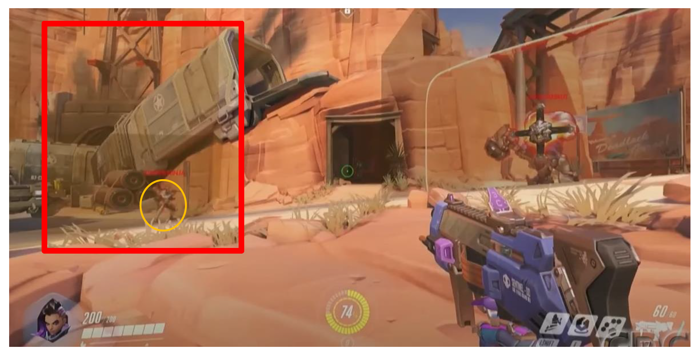
    

???+ recommend "优点"

    - 命中检测**效率**极高，无需庞大的服务器负载
    - 提供像素级**精度**的最佳射击体验

???+ bug "问题"

    有作弊风险：

    - 虚假的命中事件消息
    - 延迟开关
    - 无限弹药
    - ...

### Server-Side Hit Registration

第二种方法是让服务器检测是否命中。但这就带来另一个问题：由于客户端不知道目标在服务器（准确的）当前位置，当目标的客户端已经移动好了，服务器才知道目标已经开始动了，所以玩家看到的画面会慢一拍。

    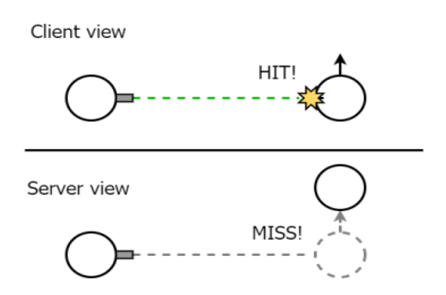

这个问题的解决办法叫做**延迟补偿**(lag compensation)，即服务器端通过状态回滚来补偿玩家指令执行时的网络延迟。具体做法为：

- 从客户端中获取信息
- 在缓存的状态快照中回滚(rewind)游戏状态，使其与客户端的行动时间匹配
- 在回滚后的游戏状态下运行客户端操作

    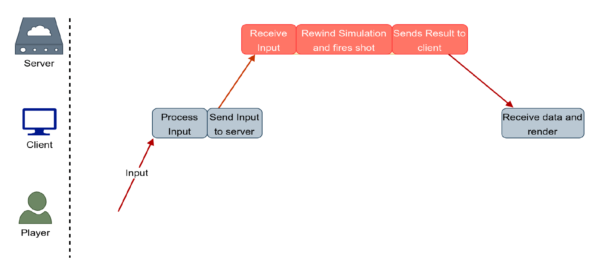

回滚时间 = 当前服务器时间 - 数据包时延 - 客户端插值偏移量

    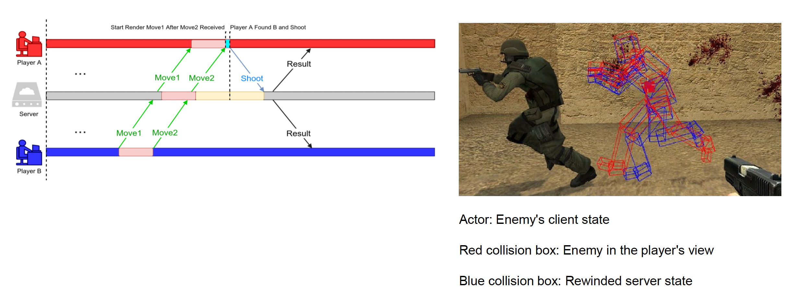

???+ bug "**掩体问题**(cover problem)"

    - 进入掩体 -> 对射击者(shooter)有利
    
        

            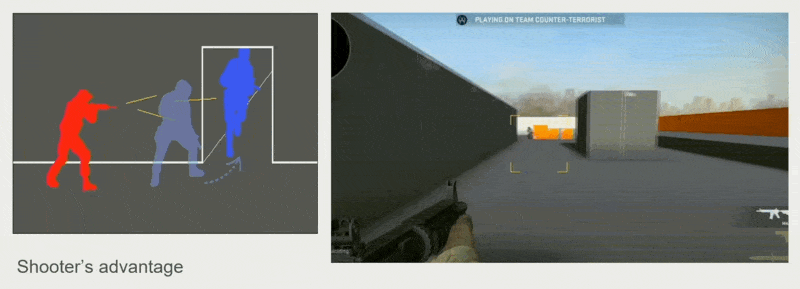
        

    
    - 离开掩体 -> 对窥看者(peeker)有利

        

            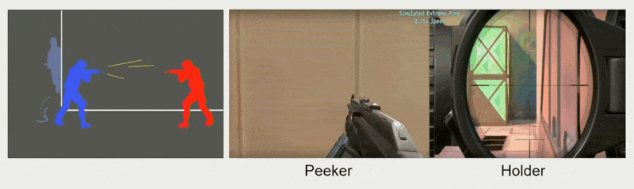
        

为了减小让网络延迟对命中判定的影响，有以下 hack 手段：

- 加入**前摇**(startup frame)：
    - 攻击或移动前的固定动画也能消除网络传输延迟带来的影响
    - 玩家会将注意力集中在动画上，从而忽略状态延迟

    

        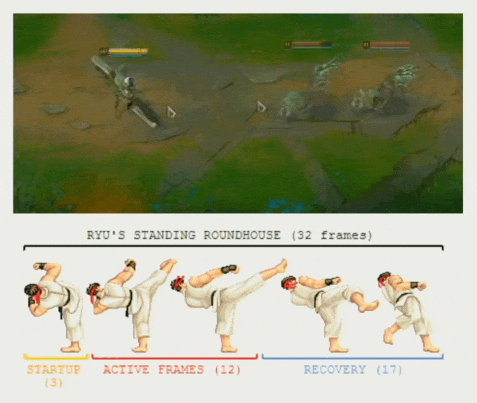
    

- 本地预测**视觉特效**（VFX）影响
    - 客户端可执行本地命中检测，为玩家提供即时反馈，例如显示血液飞溅的视觉效果
    - 然而，命中的任何持久性效果（如减少玩家的生命值）需在收到服务器确认后方可应用

    

        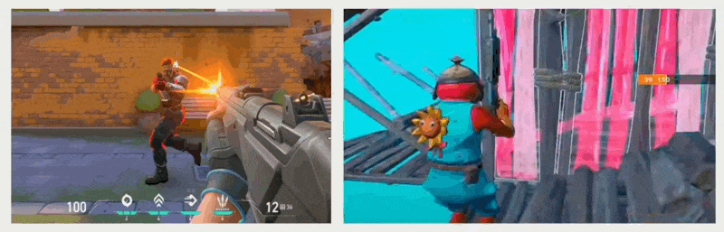
    

## MMOG Network Architecture

**MMOG**（大型多人在线游戏(massively multiplayer online game)，通常简称为 **MMO**）允许大量玩家（通常是数百甚至数千人）在同一服务器上进行大规模的合作与竞争，并涵盖多种玩法类型（如 MMORPG（大型多人在线角色扮演游戏）、MMORTS（即时战略类网游）、MMOFPS（第一人称射击类网游）等）。

    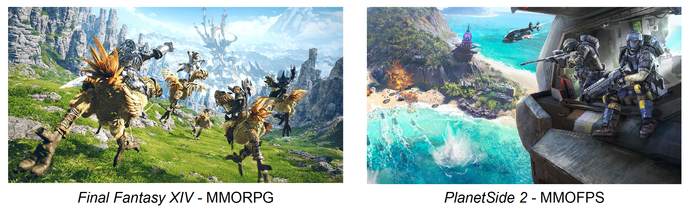

??? example "例子"

    - 第一款网络游戏：Mazewar（1974）

        

            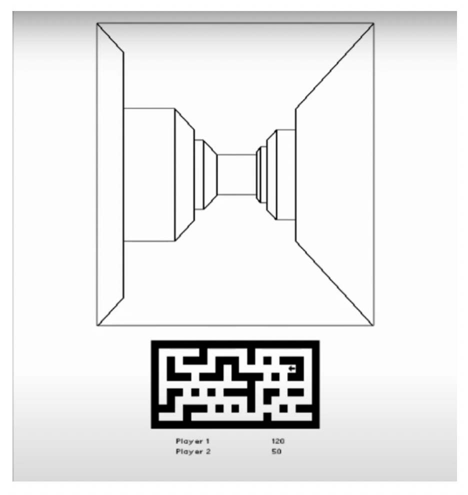
        

    - 第一款角色扮演游戏：Multi-User Dimension（1978）

        

            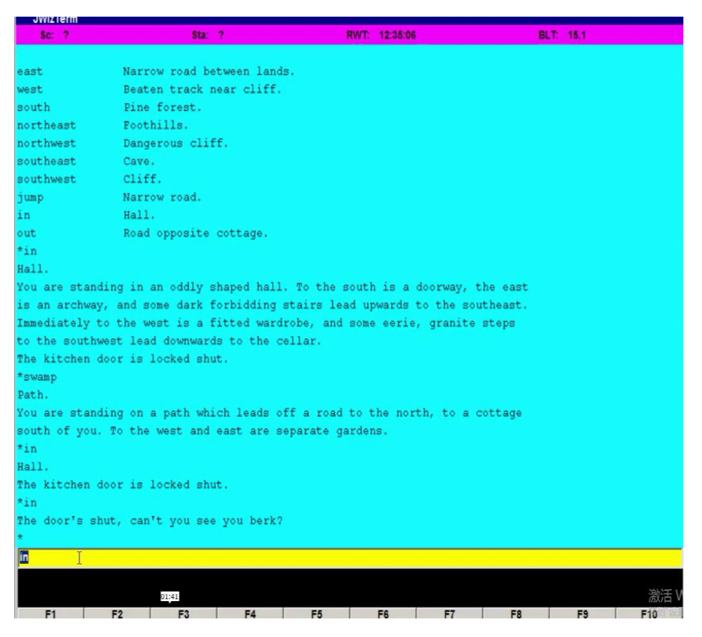
        

    - 现代 MMO 的多元性：

        

            
        

可以看到，MMO 游戏玩法多样，因此需要众多子系统的支持，包括：

- 用户管理
- 匹配系统
- 交易系统
- 社交系统
- 数据存储
- ...

这些系统通过类似下面这样（简化过）的架构被组织起来：

    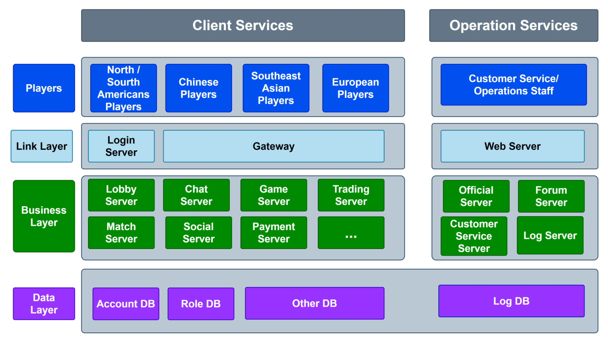

可以看到，架构从上到下由**玩家**、**链接层**、**业务层**和**数据层**这四层构成。下面就来详细介绍除玩家之外的层级。

### Link Layer

链接层包含以下服务：

- **登录服务器**(login server)：客户端连接验证
    - HTTPS 协议
    - 一般通过账号密码登录

- **网关**(gateway)：用于隔离内外网
    - 用户只能直接跟网关沟通，网关再去和内部服务器沟通
    - 类似防火墙，可以验证用户发送消息的合法性，并有一定的拦截功能
    - 一般会开启多个网关

    

### Business Layer

业务层包含以下服务：

- **大厅**(lobby)
    - 玩家可以聚集在大厅，查看并与其他玩家互动
    - 玩家数量的持续增加对服务器和客户端的性能构成了挑战
    - 可作为其他子系统的缓冲区，比如匹配系统的等待匹配

    

        
    

- **角色服务器**：所有玩家数据均在一个系统中管理（因为用户数据往往很多，若分散在不同服务器，查询角色信息就会很麻烦），例如账户信息、角色信息、背包信息和邮件信息等

    

        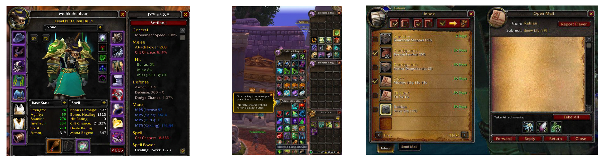
    

- **交易系统**
    - 在市场上买卖物品  
    - 通过游戏内邮件向其他玩家发送物品或金币  
    - 游戏设计师需要密切关注市场价格，以防失衡  
    - 为了让持久世界保持稳定的经济体系，必须在货币来源与消耗之间找到平衡点  
    - 玩家可以使用现实世界的金钱购买特定的游戏内物品
    - 对安全要求非常高，需具备回滚功能，从而让服务器在崩溃后能够恢复原来的数据

    

        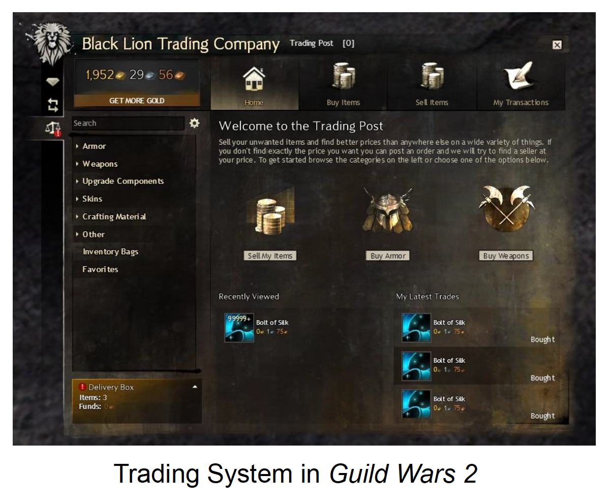
    

- **社交系统**
    - 玩家间的互动与交流
    - 增强游戏内的社会凝聚力

    

        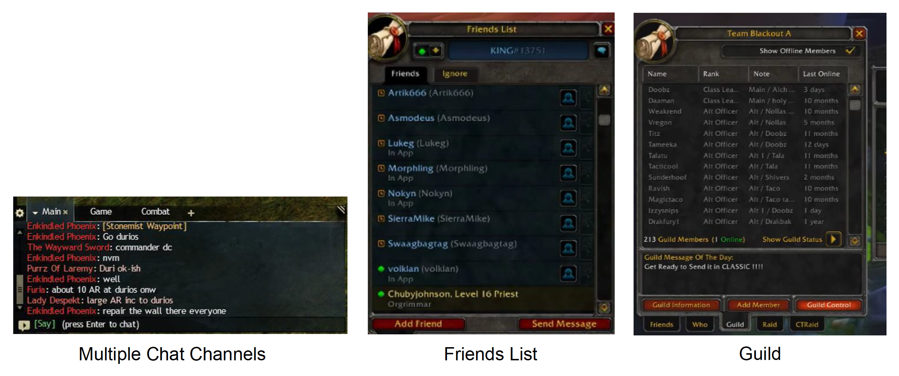
    

- **匹配系统**
    - 必须考虑技能、等级、延迟、等待时间等属性
    - 通常打造一个优秀的匹配服务是游戏设计的**核心**
    - 在**全球范围**内为玩家群体运行这项服务，会带来一系列全新的挑战

    

        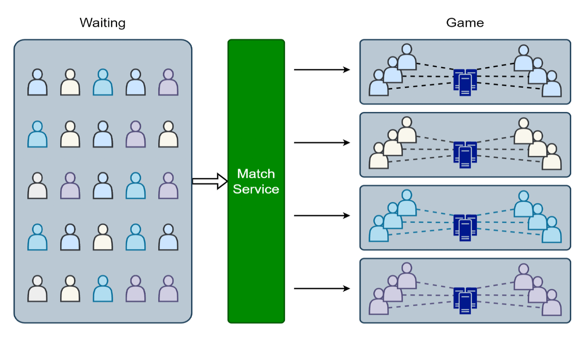
    

### Data Storage

最后考虑数据存储问题。游戏数据非常复杂且多样化，包括：

- 玩家数据（公会、地下城、仓库等）
- 监控数据
- 采矿数据

这些数据需要能被安全持久化，并且被高效组织起来，以便检索和分析等。而这样的工作往往由专门的数据库系统完成，下面介绍几类常见的数据库：

- **关系型数据存储**(relational data storage)
    - 特点：
        - 需要预先确定结构
        - 灵活的查询方式
        - 始终保持一致

    - 用途：
        - 玩家数据
        - 游戏数据
        - 库存系统
        - 物品商店/交易系统
        - ...

    - 代表：MySQL 等

- **非关系型数据存储**(non-relational data storage)
    - 特点：
        - 结构可随条目变化
        - 查询具有更高特异性(specificity)
        - 可能并不总保持一致

    - 用途：
        - 玩家/物品属性/档案游戏数据
        - 附魔与升级系统
        - 游戏状态管理
        - 任务数据

    - 代表：mongoDB 等

- **内存数据存储**(in-memory data storage)
    - 特点：
        - 极速性能（内存对比硬盘）
        - 键值存储
        - 快速排序/范围搜索
        - 服务器间持久化

    - 用途：
        - 匹配系统
        - 排行榜功能
        - 会话管理
        - 提升其他数据库性能

    - 代表：redis 等

就算现在数据库做的再好，也得考虑一个现实：网络游戏的玩家数量不断增长，对服务器提出了更高的要求。

    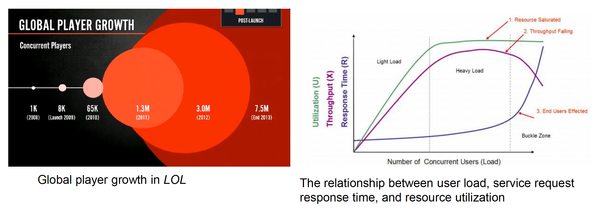

---
为了应对巨大的玩家数量，常用的解决方案是**分布式系统**(distributed system)，它是一种各组件分布在网络上的多台计算机（或其他计算设备）中的计算环境。

    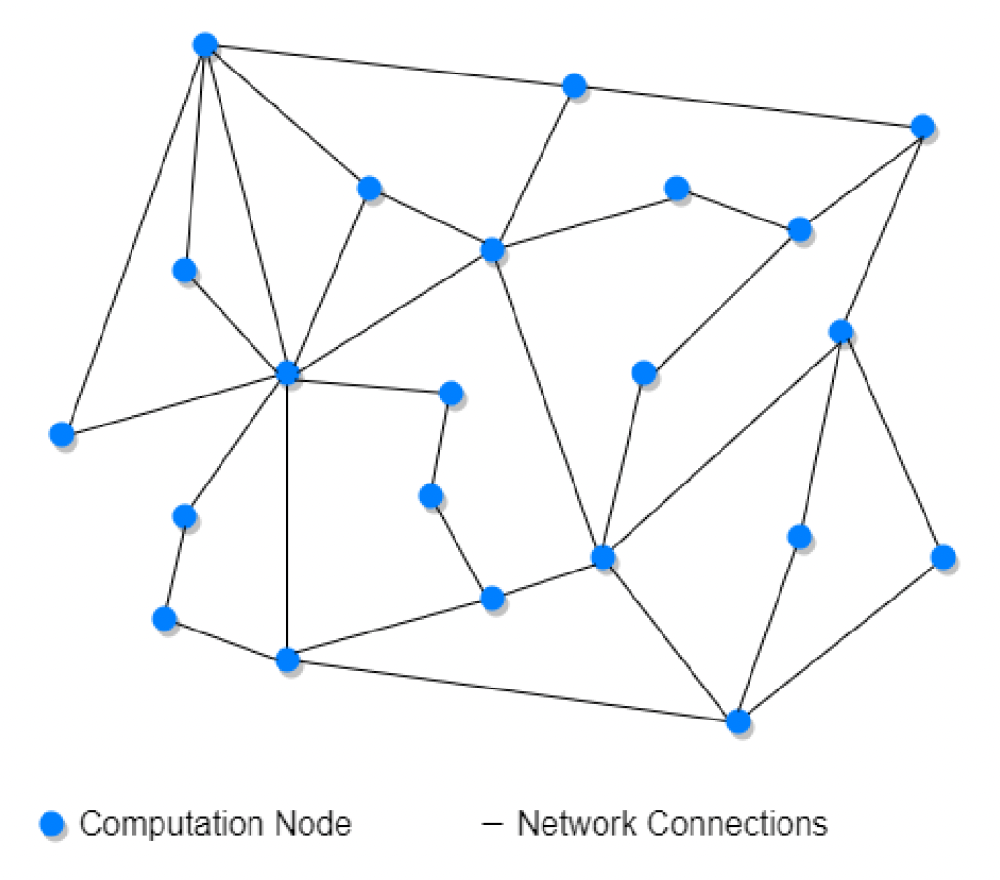

!!! warning "分布式系统的挑战"

    - 数据访问互斥(data access mutual exclusion)
    - 幂等性(idempotence)：同一个操作无论被执行多少次，其结果都与执行一次时所产生的影响相同
    - 故障与部分故障
    - 不可靠网络
    - 病毒般传播(spread epidemically)的分布式错误：一个小 bug 在系统里来回振荡并放大，传播给系统中的其他服务
    - 一致性与共识机制(consistency and consensus)
    - 分布式事务(distributed transaction)

为了应对上述挑战，分布式系统中常用到以下技术：

- **负载均衡**(load balance)：将一组任务分配到一组资源（计算单元）上的过程，目的是使整体处理更加高效
    - 优化响应时间
    - 避免某些计算节点过载而其他计算节点闲置的不均衡情况
    - 所有参与者被均匀分布在多个服务器上

    

        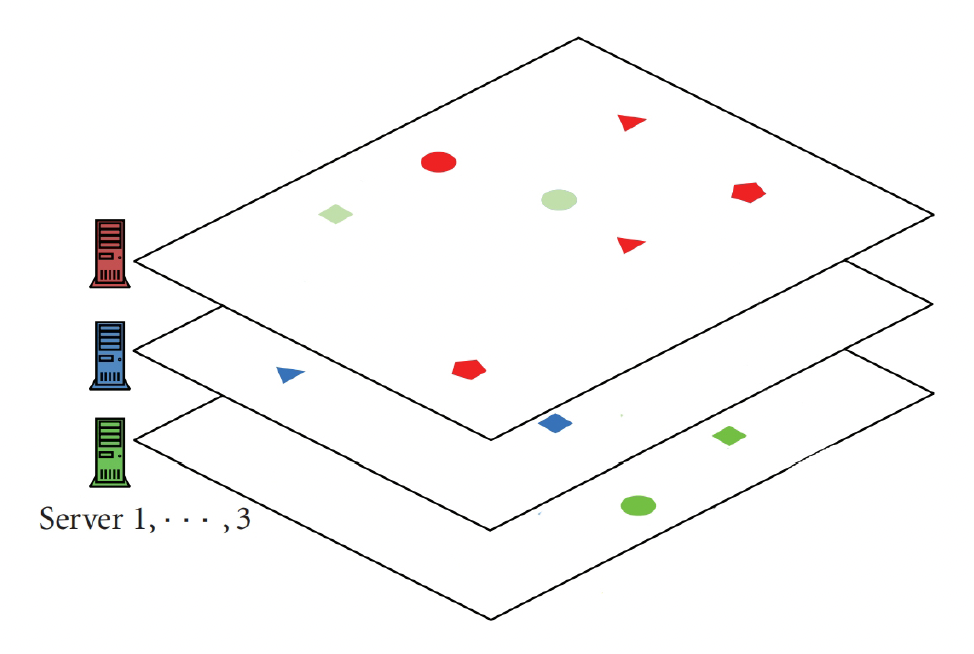
    

- 实现负载均衡的一种算法叫做**一致性哈希**(consistent hashing)，旨在解决集群中增加或移除服务器时需重新分配所有玩家的问题
    
    

        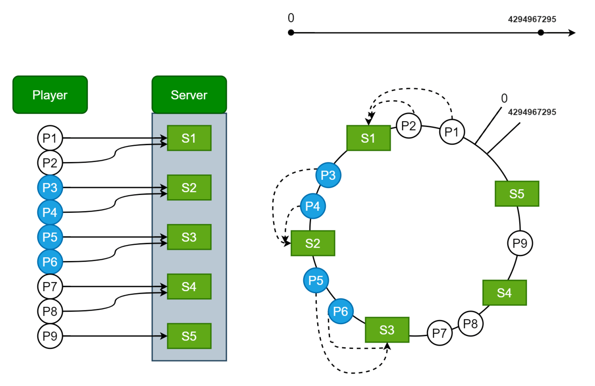
    

    
    - 同时为玩家和服务器设置一张环形的哈希表，以 IP 地址作为哈希的输入（因此取值范围为 [0, 2^32^-1]）
    - 一个简单的规则：对某个玩家，逆时针寻找最近的可用服务器
    - 好处：查询速度快，无需额外的 RPC，减小成本
    - 缺点：需要精心设计哈希函数（但很难设计），使玩家和服务器在哈希表的分布尽可能均匀
    - **删除**某个服务器（S2）：此时需为 P3, P4 重新选择一个服务器

        

            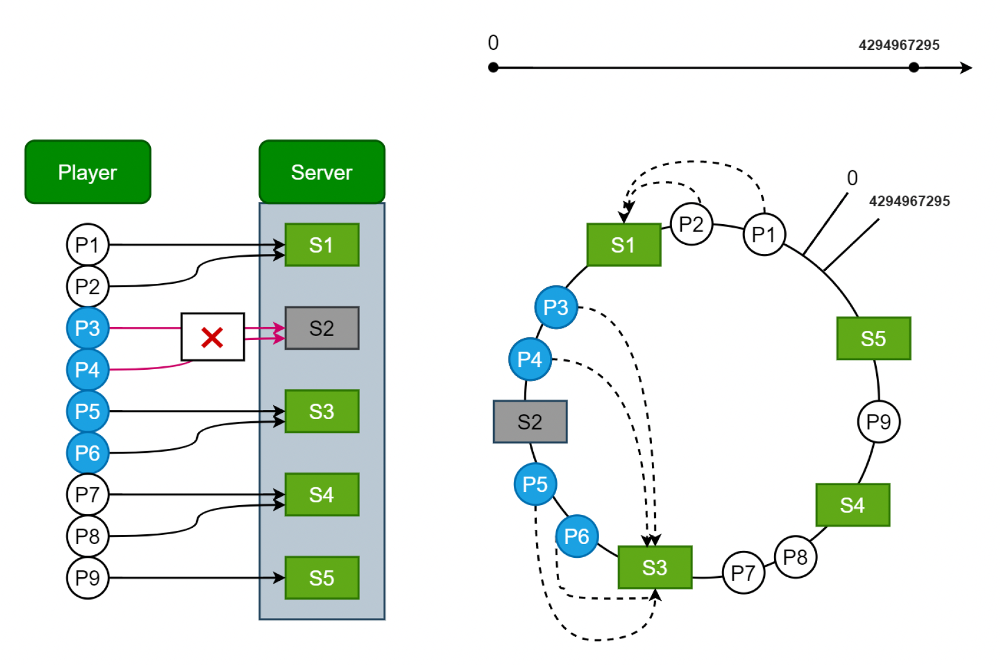
        

    - **增加**一些服务器：

        

            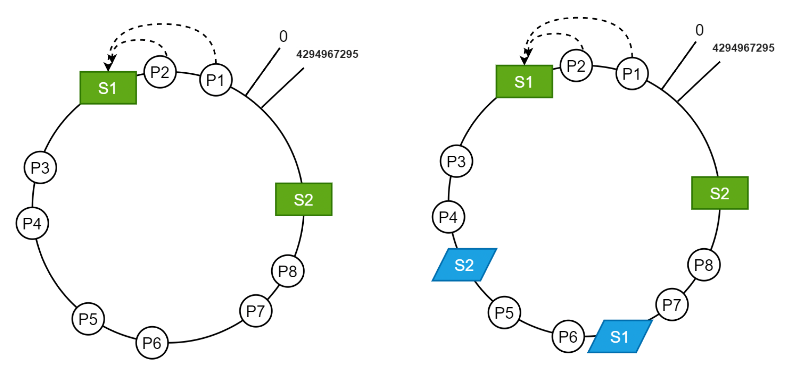
        

- 服务发现
    - 服务器管理的挑战：随着玩家数量增多，服务数量增加，服务器的管理会变得更加困难，到了后面就很难灵活更改服务器的 IP 或端口
    
        

            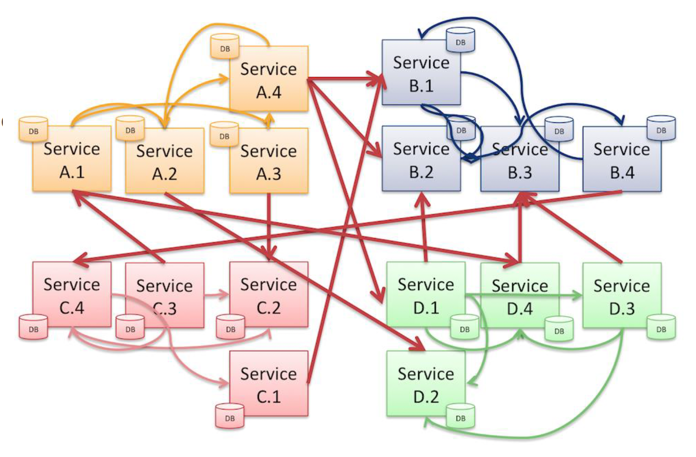
        

    
    - 流程：
        - **注册表**(registry)
            - 新建服务进入系统时向服务注册中心进行注册
            - 一个关于注册值的示例：`server type/server_name@server_ip:port`

            

                
            

        - **查询**(query)和**监控**(watch)：请求服务(request service)发现服务，从而通过服务类型查询所有值并对其监控
        
            

                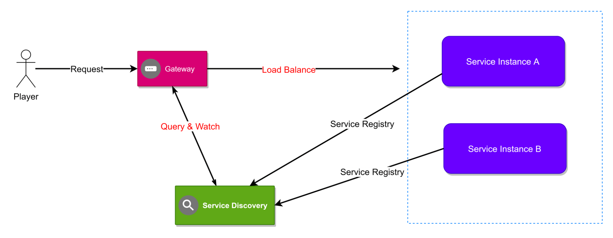
            

        
        - **健康检查**(health check)：当服务器实例 B 心跳超时时，网关服务器 B 通知故障

            

                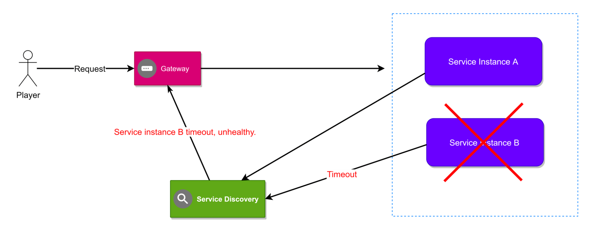
            

    - 应用：Apache ZooKeeper, etcd

## Bandwidth Optimization

???+ question "为什么带宽很重要？"

    - 很多服务按带宽的使用量计费，比如移动通信、云服务等
    - 带宽增加可能会导致延迟，出现数据包分割或丢包
    - 消息溢出会引发连接中断

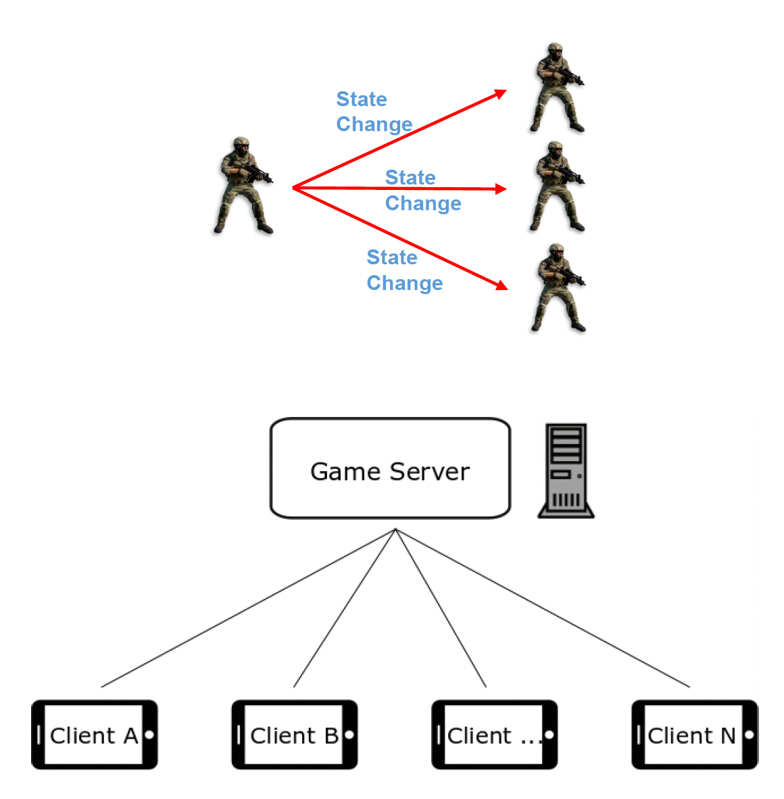{ align=right width=40% }

来看**带宽**(bandwidth)是如何计算的。

- 影响因子(affecting factors)
    - $n$：**玩家数量**
    - $f$：**更新频率**
    - $s$：**游戏状态大小**

- 每秒数据传输
    - 服务器：$O(n \cdot s \cdot f)$
    - 客户端（下游）：$O(s \cdot f)$
    - 客户端（上游）：$O(f)$

### Data Compression

第一种优化带宽的方法是**数据压缩**。

- 游戏同步数据中包含大量浮点数，如位置、旋转、速度等，**选择合适的浮点精度**可显著节省带宽

    

        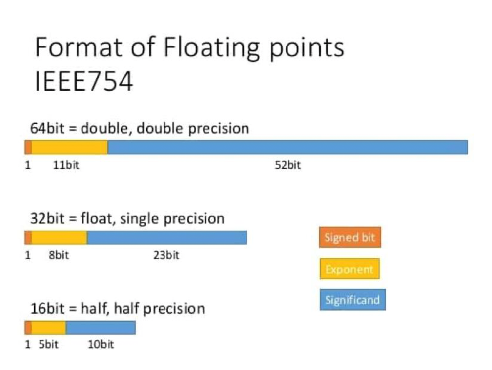
    

- 例如在表示人物奔跑速度时，仅需**半精度**即可满足需求
- 在表示玩家位置时，由于玩家速度限制，其移动范围将限定在一定区域内
    - 我们可以**将地图划分为不同的小块**，并利用**相对位置**来表示玩家的具体坐标，这有助于降低同步位置所需的浮点数精度

    

        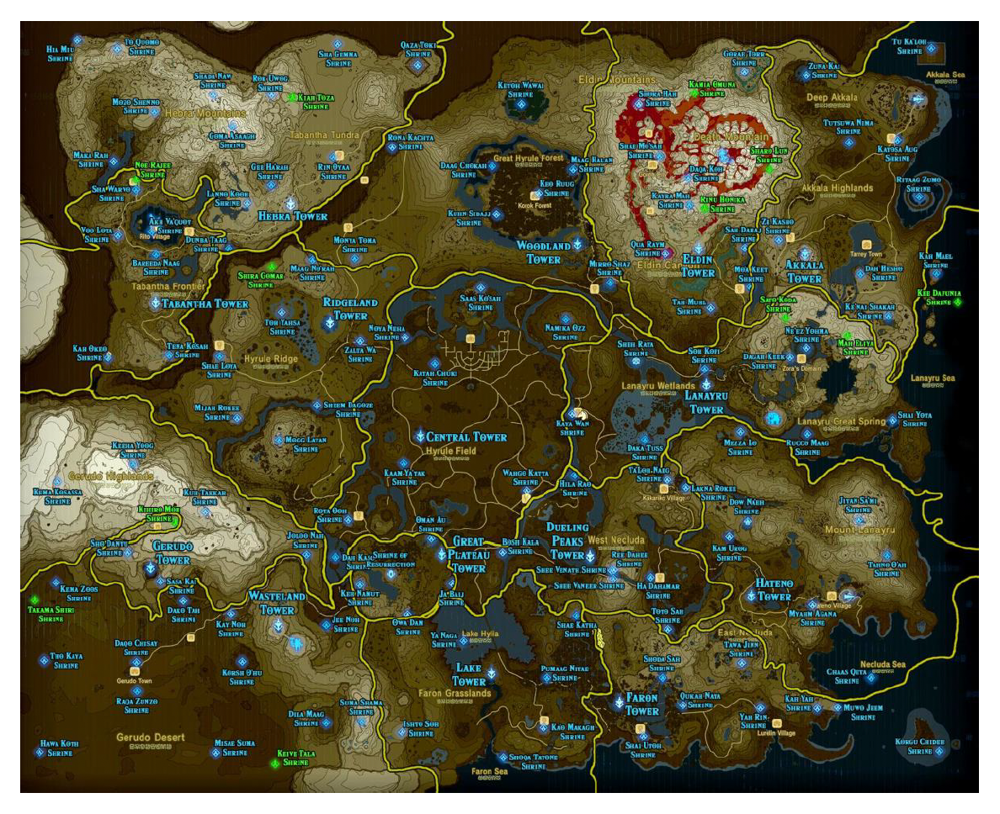
    

### Object Relevance

**相关对象**(object in relevance)通常指玩家可见并可互动的对象。

- 最简单的实现方式是让所有客户端关联所有的对象，但这种方法仅适用于只有少量玩家的情况
- 这是限制最大并发玩家的因素

    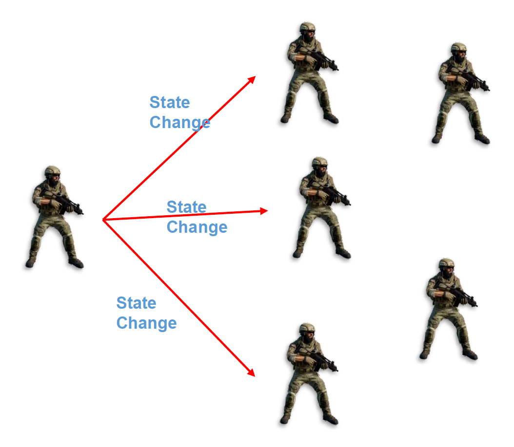

下面介绍一些实际用到的确定相关性的方法。

#### Static Zones

第一种方法是将世界划分为多个**静态区域**(static zones)。

- 玩家将被分配到不同的区域
- 同一区域内玩家是相关的
- 该方法通过屏蔽不必要的状态同步来降低带宽的浪费

    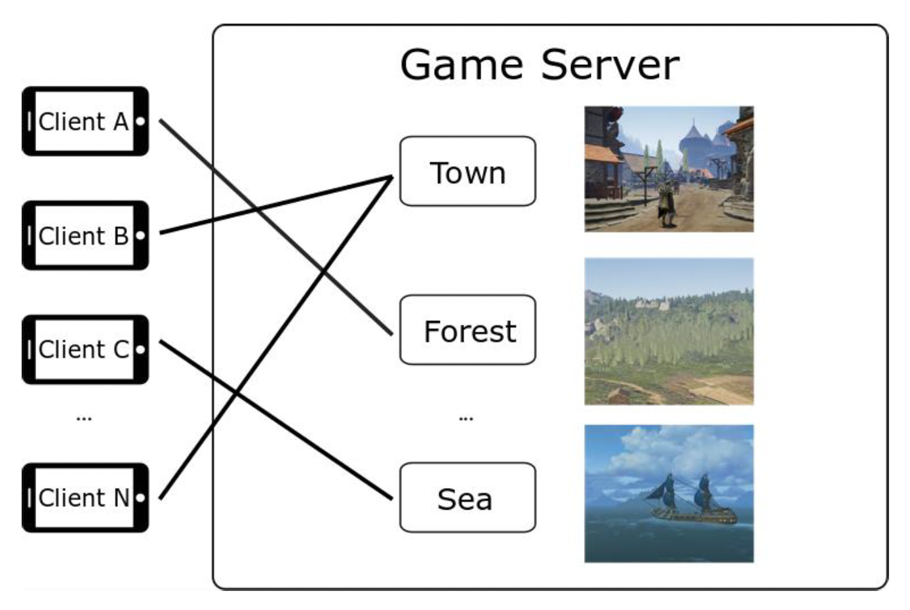

#### AOI

但采用上述方法就无法构建一个真正的开放世界（各个区域就是一个箱庭）。于是我们引入第二种方法，叫做**兴趣区域**(area of interest, **AOI**)

- 它是指与玩家或 NPC 相关的对象的作用范围
- 玩家只能看见并和范围内的物体交互
- 能移除不必要的网络数据

???+ example "例子"

    

        
    

AOI 的具体实现方法有：

- **直接范围查询**(direct range query)

    $$
    \sqrt{(x_{\text{player}} - x_i)^2 - (y_{\text{player}} - y_i)^2} \le r_{\text{AOI}}
    $$

    - 时间复杂度：$O(n^2)$
    - 易于实现
    - 但不适用于 MMOG
        - 例如一个区域内有 1000 名玩家，每秒 20 次更新：1000 \* 1000 \* 20 = 每秒 2000 万次距离计算

    

        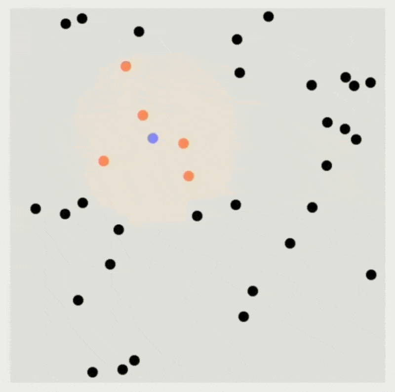
    

- **空间网格**(spatial grid)
    - **映射实体**

        

            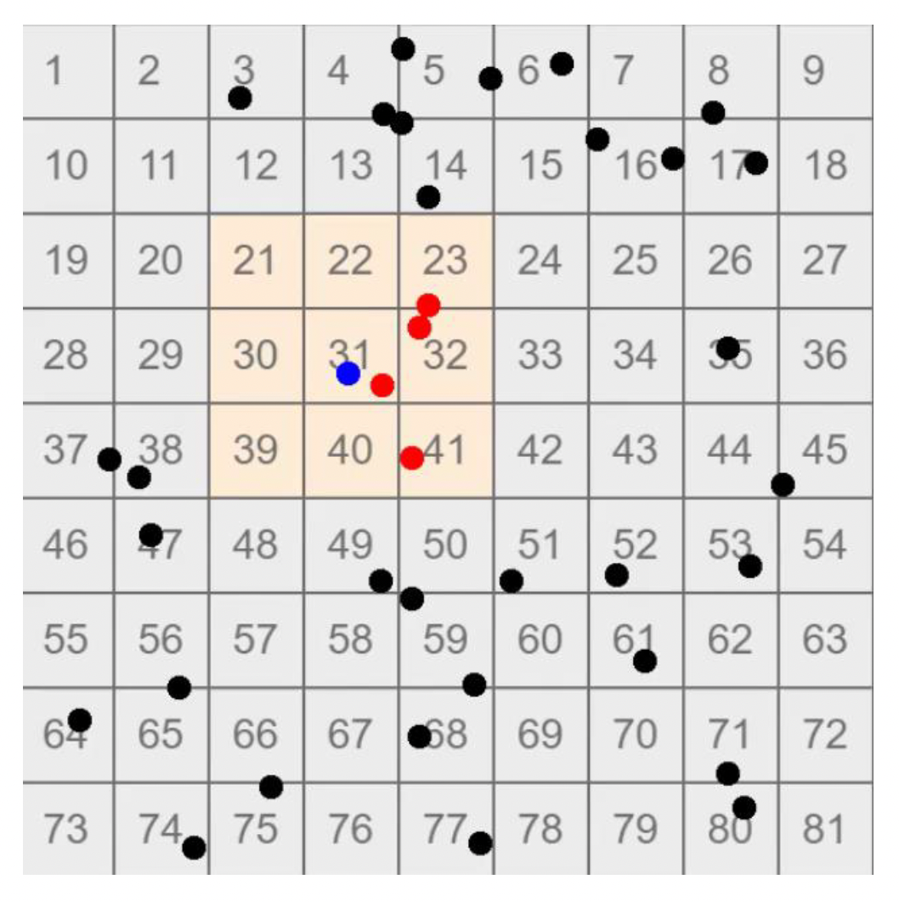
        

        - 将实体 (x, y) 映射到网格 N
        - 相关对象便是当前玩家所在网格周围的相关实体
        - 玩家的 AOI 列表可被缓存
    
    - **事件**
        
        

            
        

        - 进入：向观察列表中添加实体
        - 离开：从观察列表中移除实体
    
    - 优点：查询速度快（$O(1)$）
    - 缺点：
        - 小网格：内存成本高
        - 大网格：CPU 成本高
        - 对象的 AOI 半径可变

- **正交链表**(orthogonal linked-list)
    - 游戏实体位于两个**双向链表** `xlist`, `ylist` 中，按升序排序
            
        

            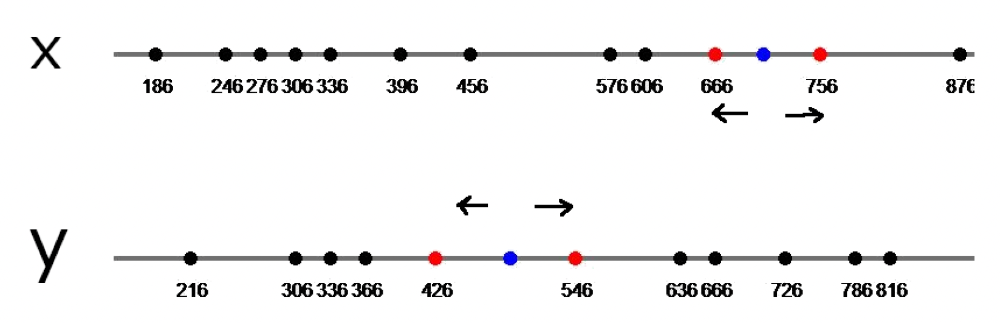
        

    
    - 遍历更少的对象
    - 遍历实体
        - 在 AOI 半径范围内
        - 可选择左/右方向，x/y 列表

        

            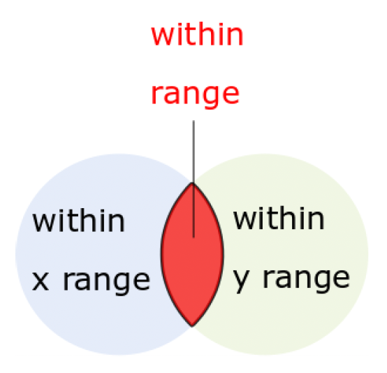
            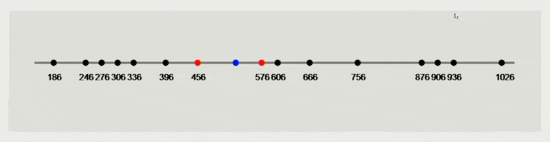
        

    - 更好的方法：**范围触发器**(range trigger)（图中的两个绿点）
        - 实体移动 -> 触发器移动
        - 和触发器比较
        - 事件驱动

        

            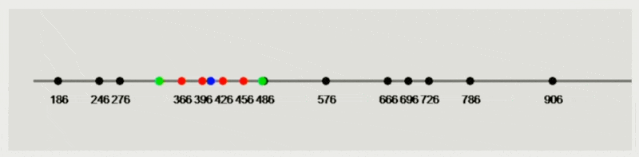
        

    - 优点：
        - 内存使用高效
        - 支持可变的 AOI 半径

    - 缺点：
        - 插入新对象的成本为 $O(n)$
        - 当实体频繁移动很大一段距离时不合适

- [**潜在可见集**](4.md#pvs)(potentially visible set, **PVS**)：潜在可见区域的集合
    - 可离线计算
    - 从 PVS 中确定相关对象
    - 例子：赛车游戏中的高速行驶的车辆

    

        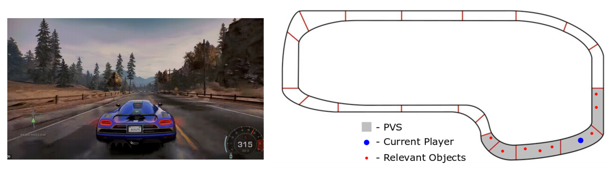
    

### Varying Update Frequency by Player Position

我们还可以通过调整**更新频率**来优化带宽。一种自然的做法是基于玩家位置（距离）来改变更新频率，因为离玩家足够近的对象才是可交互的。距离越远，频率越低，从而降低带宽。

    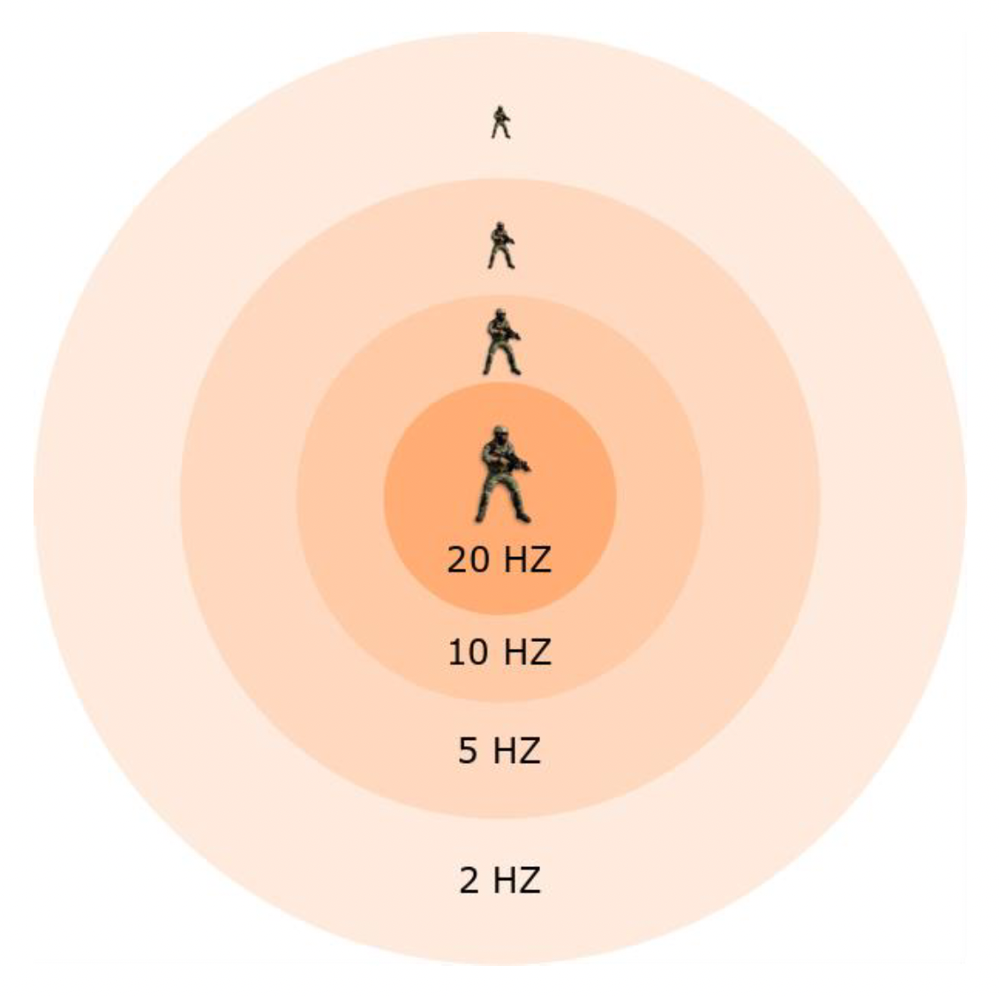

## Anti-Cheat

**作弊**(cheating)会对网络游戏产生严重的负面影响。一旦游戏中作弊泛滥，多数玩家很难会坚持玩这款游戏。

    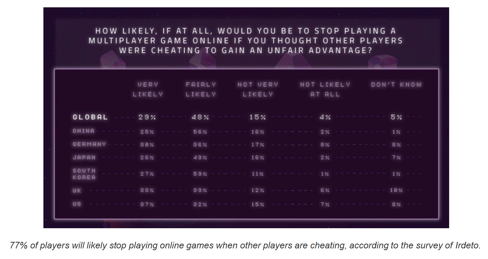

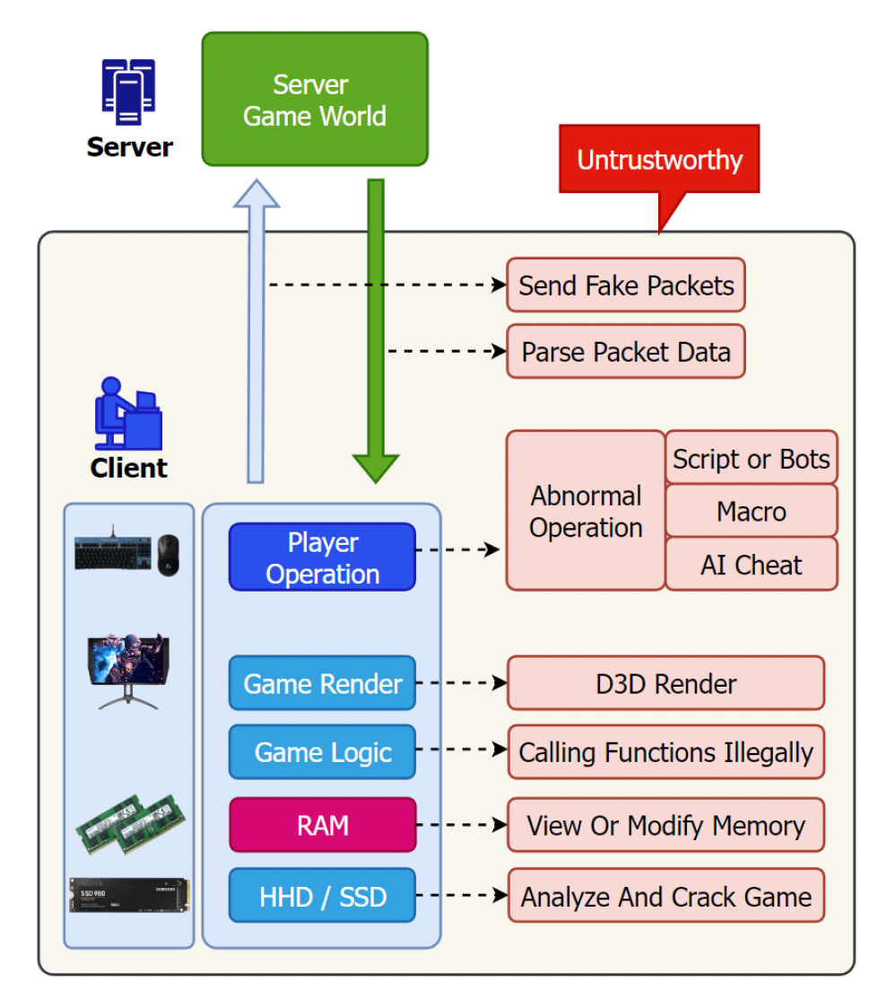{ align=right width=40% }

五花八门的作弊方式：

- 游戏代码修改
    - 读取或修改内存数据
    - 破解客户端

- 系统软件调用
    - D3D 渲染钩子
    - 模拟鼠标和键盘操作
    - ...

- 网络数据包拦截
    - 发送假数据包
    - 修改数据包数据

下面具体阐述其中一些作弊手段及应对措施。

### Obfuscating Memory and

比较直接的一种作弊方法是**内存混淆**：

- 作弊者获取玩家坐标（等敏感数据）在内存中的位置，并绕过游戏规则来移动角色，比如穿墙
- 此外，作弊者可以利用这些值的位置来映射出内存中更大的数据结构，比如玩家对象本身

    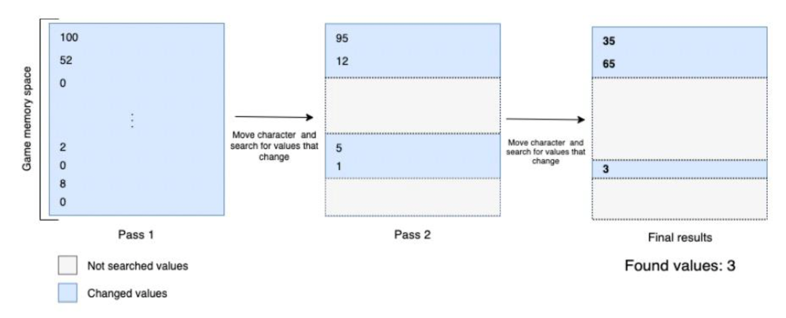

这一作弊手段的应对方法是**可执行文件加壳器**：

- 作弊者通过逆向工程还原游戏核心逻辑；具体来说，玩家可通过分析代码、寻找游戏漏洞、制作插件等方式破解游戏

    

        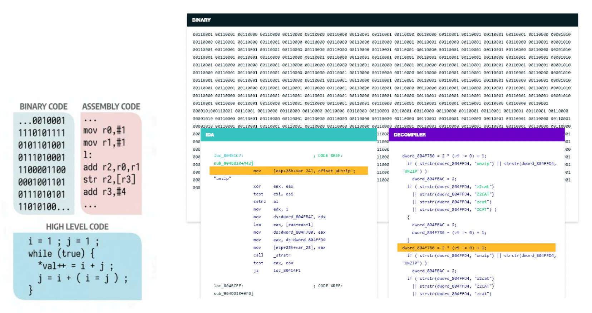
    

- 文件加壳器的做法：
    - 对源程序进行混淆(obfuscate)，并添加解压代码
    - 执行解压代码，并在内存中解密源程序

    

        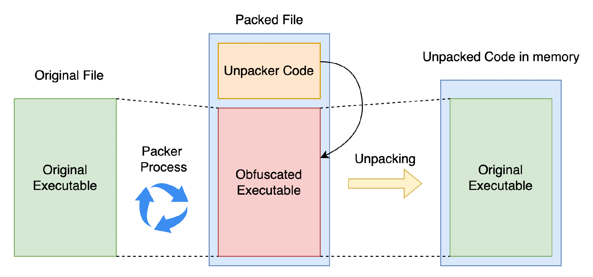
    

### Verifying Local Files by Hashing

第二种作弊方式是修改本地文件资源。例如：

- 将墙壁纹理改为透明，从而透过墙壁看到所有敌人
- 调整光照设置，以便更容易发现敌人
- ...

    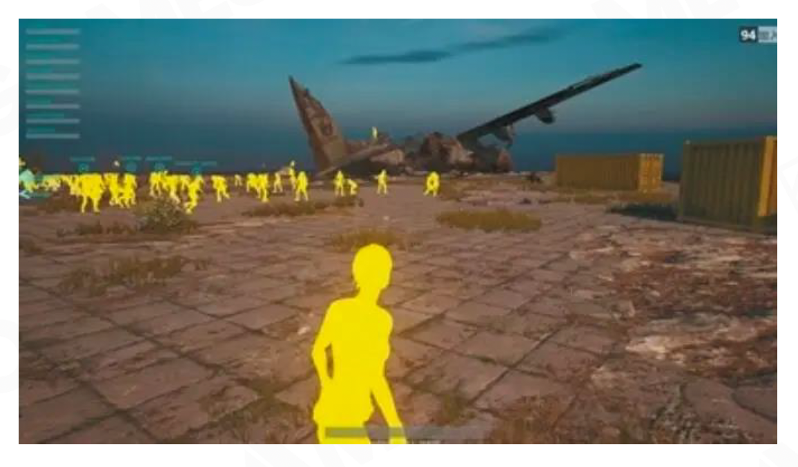

解决措施是为本地文件计算**哈希值**，然后将哈希值上传到服务器中验证。若发现哈希值不对，说明本地数据遭到篡改，就会被判作弊。

### Packet Interception and Manipulation

第三种作弊方式是数据包的拦截和操纵。

- 当数据未加密或遭黑客攻击时，玩家即便不启动游戏也能基于数据包构建游戏逻辑
- 此类作弊程序常沦为牟利工具，严重削减游戏的总体收益

    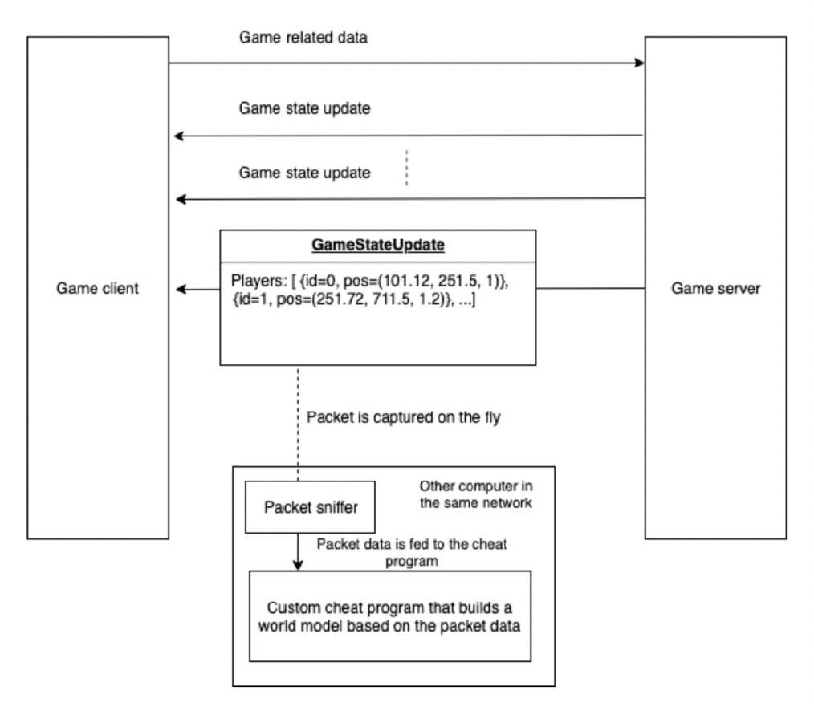

因此需要对网络流量加密。常见的两类加解密算法有：

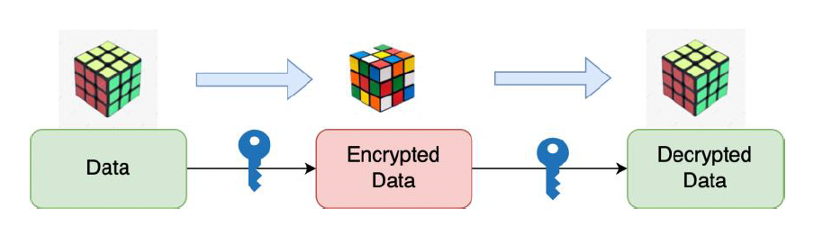{ align=right width=30% }

- **对称加密**(symmetric encryption)
    - 使用相同的密钥来混淆和恢复数据
    - 快速且高效

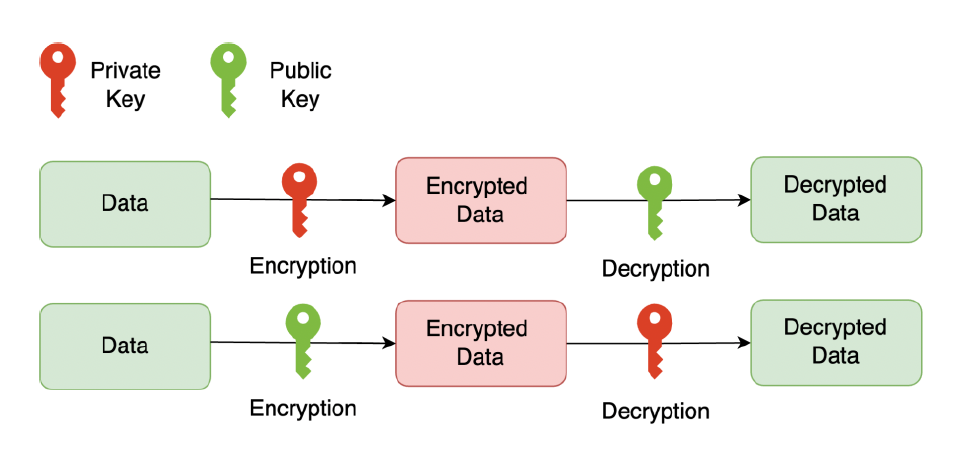{ align=right width=30% }

- **非对称加密**(asymmetric encryption)
    - 加密和解密采用不同密钥
    - 速度慢，仅用于加密关键数据

游戏中的实际做法是将两者的优势结合起来：

- 使用**非对称加密**安全分发对称密钥
- 利用**对称加密**密钥传输数据

    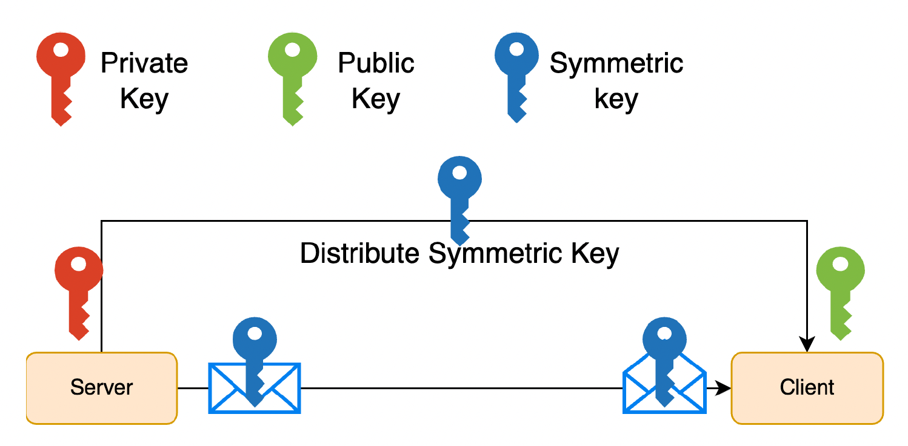

### System Software Invoke

第四种作弊方式是系统软件的调用：

- 修改 DirectX 内核，改变渲染函数的执行流程
- 能够强制渲染引擎调整遮挡关系
- 实现透视墙壁来观察敌方移动

    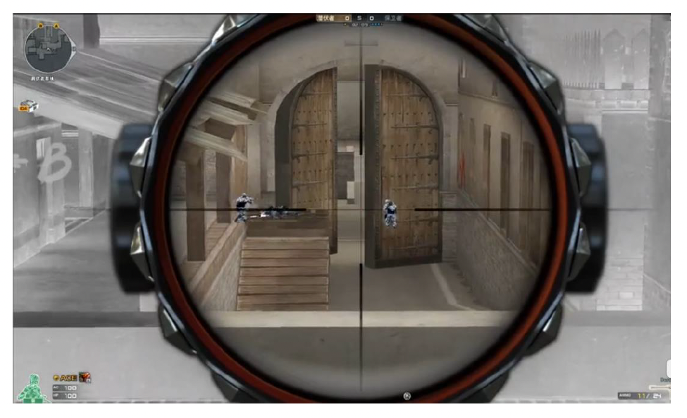

### Anti-Cheat Software

典型的反作弊软件包括 Valve 反作弊（VAC）和 Easy 反作弊（EAC）。它们的共同之处是：

- 检测游戏交互过程中因任何文件冲突引发的恶意行为
- 完全阻止作弊玩家启动游戏
- 防止任何非法修改及配置变更，杜绝利用游戏漏洞的行为

### AI Cheat

还有一种更新颖且更难对付的作弊手段是 **AI 作弊**。这类作弊的特点是：

- 全平台支持
- 无需修改代码
- 独立于游戏运行
- 功能：
    - 游戏画面捕捉
    - 目标检测功能
    - 光标移动控制
    - 开火操作
    - ...

???+ example "例子"

    

        
    

AI 作弊有着丰富的 AI 中间件支持，比如：

- 实时目标检测：YOLO V5、V7...
- 基于骨架的动作识别

    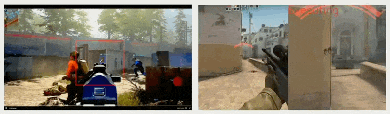

---
应对方法有：

- CS（反恐精英）提出的**监察者模式**(overwatch)：
    - 该系统基于其他玩家对涉嫌作弊玩家的录像进行审查
    - 多位评审员共同查看同一案例，多数意见决定嫌疑人是否作弊

    

        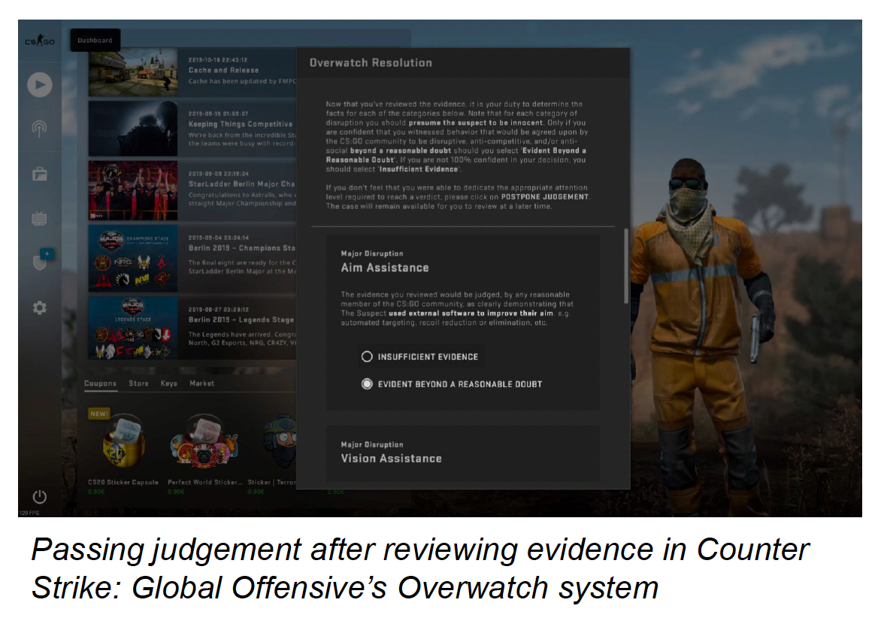
    

- **基于统计的系统**(statistic-based system)
    - 收集用户的游戏信息，如胜率和暴击率
    - 对比自身历史数据、某些阈值规则或其他玩家的举报来标记玩家
    - 手动核查以确认是否存在作弊行为

    

        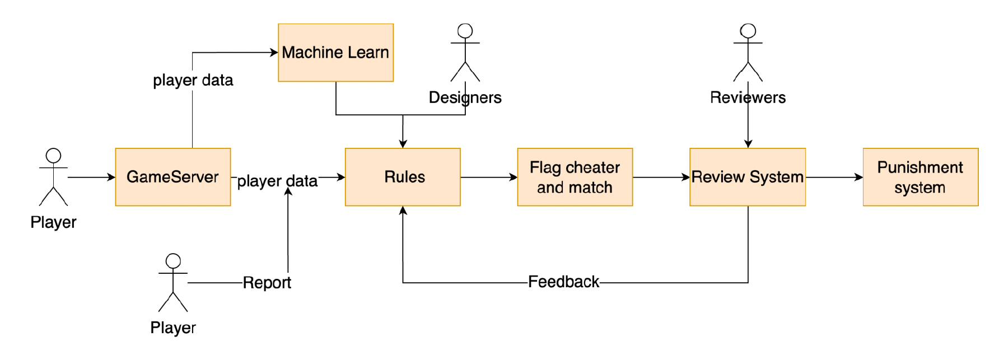
    

- **检测已知的作弊程序**
    - 一个合理的反作弊程序应具备扫描用户计算机，基于多种特征识别已知作弊软件的能力
    - 最简单的方法是仅涉及比对哈希值或进程名称

    

        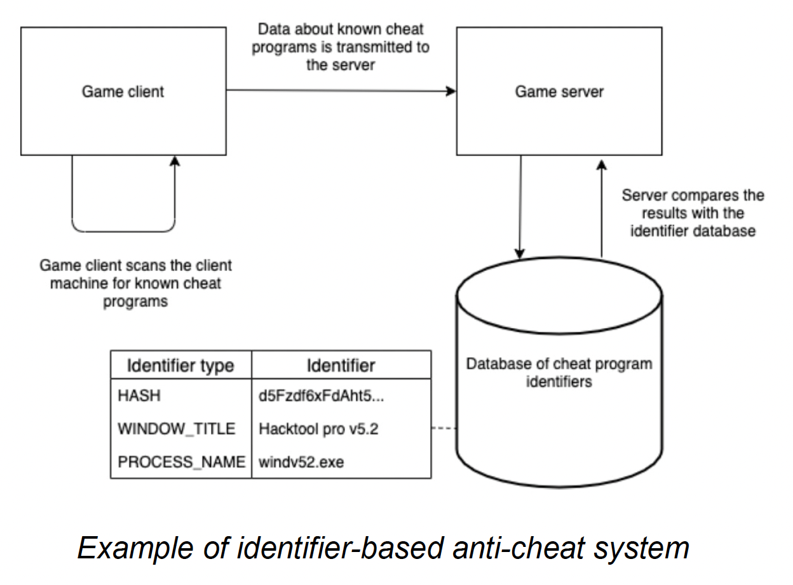
    

## Build a Scalable World

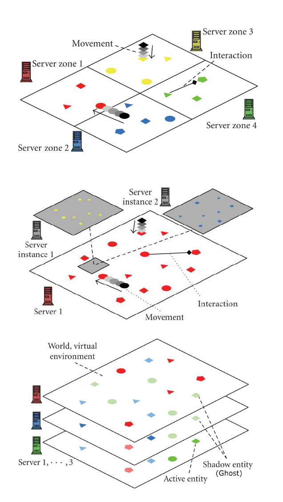{ align=right width=30% }

最后一部分来谈一下如何构造一个真正的开放世界。要实现这一目标，服务器应当是**可扩展的**(scalable)，应当支持以下几种操作：

- **区域划分**(zoning)
    - 大量玩家分布在广阔的游戏世界中
    - 分布可能不均匀

- **实例化**(instancing)
    - 并行独立运行大量的游戏区域
    - 减少拥堵/竞争压力

- **复制**(replication)
    - 支持高用户密度场景
    - 比如高密度的 PVP 对战游戏

### Zoning

我们对**区域划分**的期望是划分出无缝的区域，具体做法如下：

- 玩家们合理分布在一个广阔的世界中
- 客户端仅连接至其中一个负责的服务器
- 玩家跨过边界后，自动将客户端转移至另一台服务器

    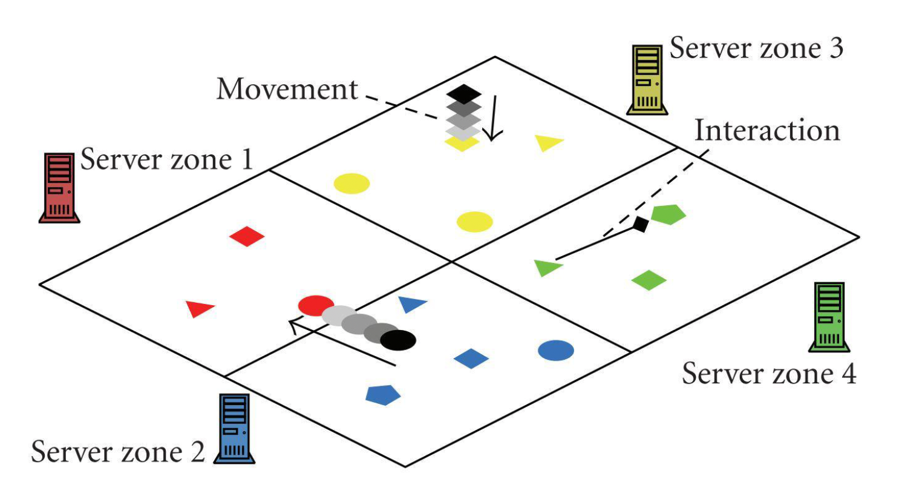

- 为了得到平滑过渡的体验，设定跨越边界的条件为：边界宽度 >= 最大的 AOI 半径
- 还得考虑边界附近的两个实体，虽然它们在不同区域，但也应该能和彼此交互
    - **活跃实体**(active entity)
        - 位于连接的区域服务器中（权威）
        - 在其他区域拥有幽灵代理(ghost agent)
        - 能够看到另一区域的幽灵实体
    
    - **幽灵实体**(ghost entity)
        - 也称为影子实体
        - 是由另一区域拥有的代理实体
        - 从原始实体处接收更新

    

        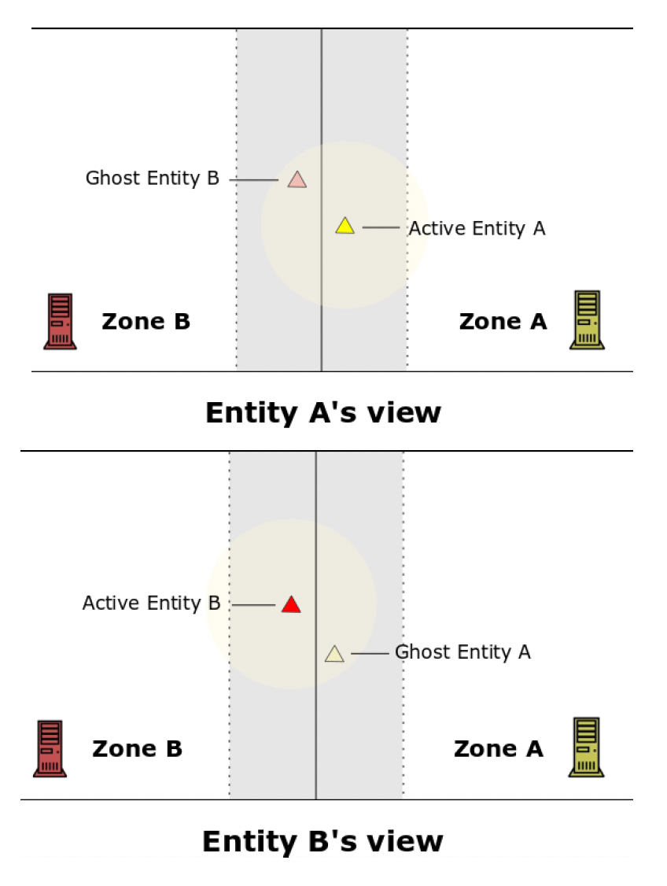
    

- 穿过边界（A -> B）：
    1. 移动前：区域 A 中的一个活跃实体
    2. 接近边界 A ：在 A 中活跃；在 B 中为幽灵状态
    3. 位于边界时：实体已转移至区域 B
    4. 接近边界 B：在 B 中活跃；在A中为幽灵状态
    5. 越过边界 B：从区域 A 中移除

    

        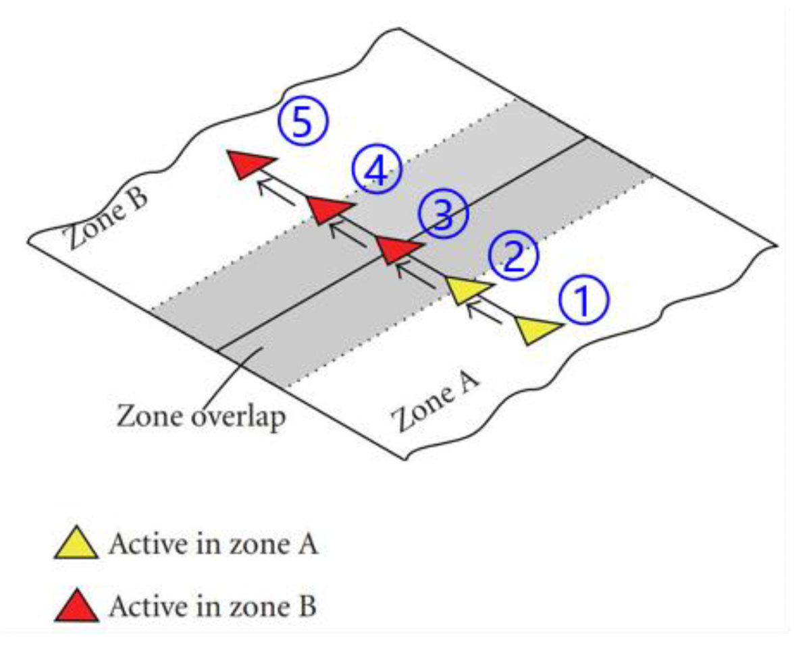
    

### Replication

**复制**操作的具体处理如下：

- 协同处理同一世界区域
- 在服务器间分配实体更新
- 每台服务器创建自己的活跃实体
- 活跃实体的更新将自动复制到所有其他服务器（作为幽灵实体）

    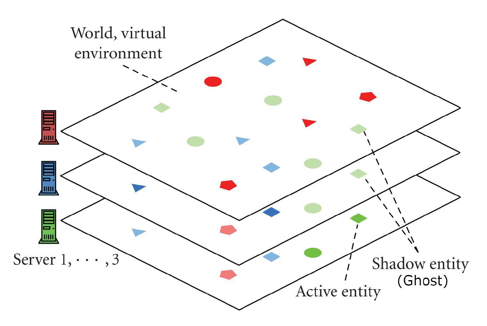

---
???+ abstract "三种技术的结合"

    

        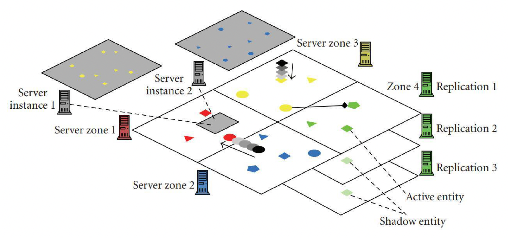
    
