# Data-Oriented Programming and Job System

代码的执行并没有我们看上去那么简单。由于代码是执行在操作系统和硬件之上的，所以要想编写一份高性能的程序，必须要考虑到硬件和 OS。

<div style="text-align: center">
    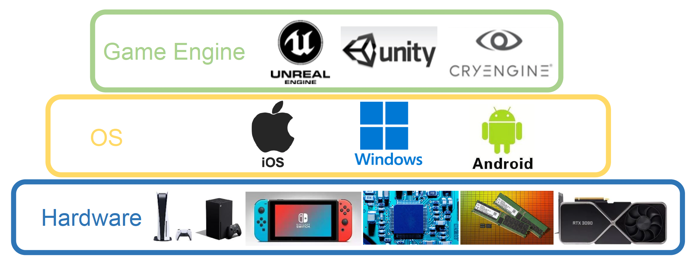
</div>

??? abstract "总结：CPU 各种操作的大致时间"

    <div style="text-align: center">
        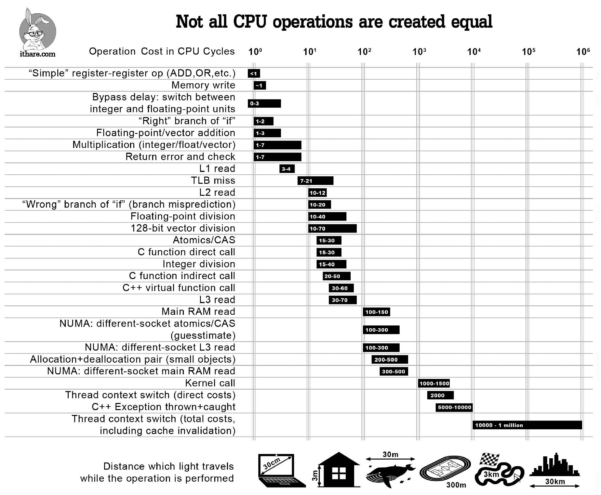
    </div>


## Basics of Parallel Programming

在学计算机系统时，我们认识了**摩尔定律**(Moore's Law)：集成电路（IC）中的晶体管数量大约每两年翻一番。但是从最近十几年开始，这条定律逐渐失效，晶体管数量增长放缓，即将触碰到物理极限了。因而**多核处理器**(multi-core processors)成为了新的工业发展趋势。

<div style="text-align: center">
    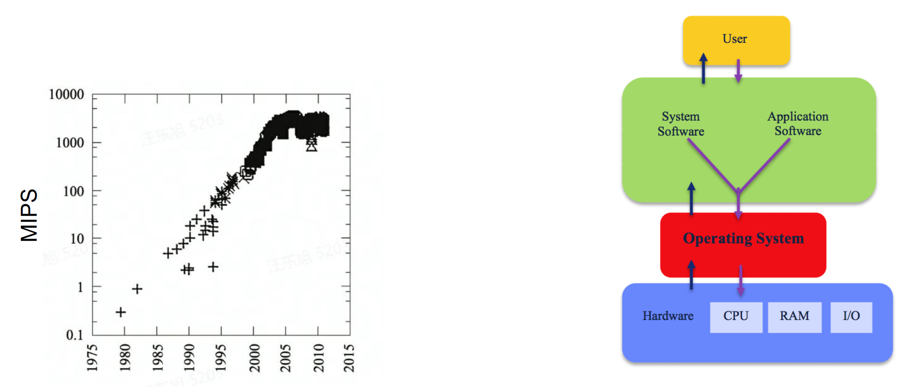
</div>

!!! note "进程与线程"

    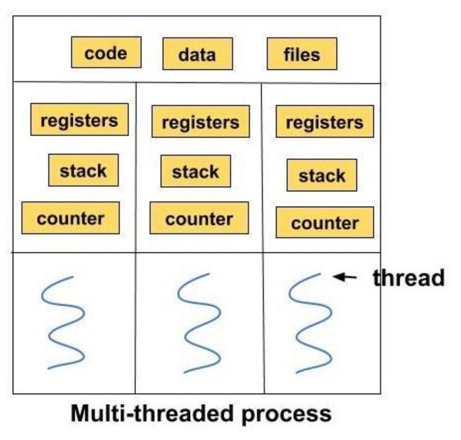{ align=right width=40% }

    - **进程**(process)：
        - 应用（或程序）的实例
        - 有自己的内存区域
    
    - **线程**(thread)：
        - **抢占式多任务**
        - OS 任务调度的最小单位
        - 必须位于进程中
        - 相同进程中的线程共享内存

!!! info "多任务的类型"

    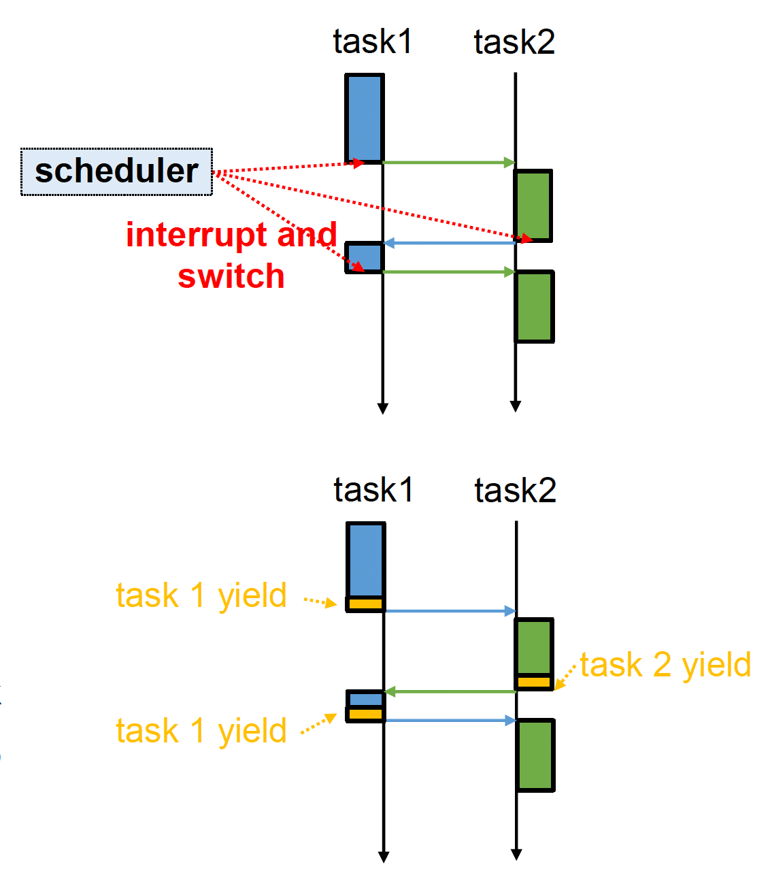{ align=right width=40% }

    - **抢占式多任务**(preemptive multitasking)
        - 当前执行的任务可在**调度器指定的时间后被中断**
        - 调度器接着决定下一个要执行的任务
        - 该策略应用于大多数操作系统中
    
    - **非抢占式多任务**(non-preemptive multitasking)
        - 任务必须**被显式编程以让出控制权**
        - 任务之间需要协作才能使调度方案生效
        - 目前许多实时操作系统（RTOS）也支持这种调度方式

对于一个多线程程序，线程间的**上下文切换**(context switch)自然是无法避免的事情。它是指保存当前线程状态，以便下次继续从此处开始执行的行为。更具体地，

- 状态包括寄存器、栈以及其他 OS 需要的数据
- 线程的上下文切换包含额外的用户-内核模式切换
- 上下文切换后的缓存失效(cache invalidation)成本更高（因为原来缓存里的数据很多时候对新线程而言毫无意义，所以一开始会有很多的缓存失效）

<div style="text-align: center">
    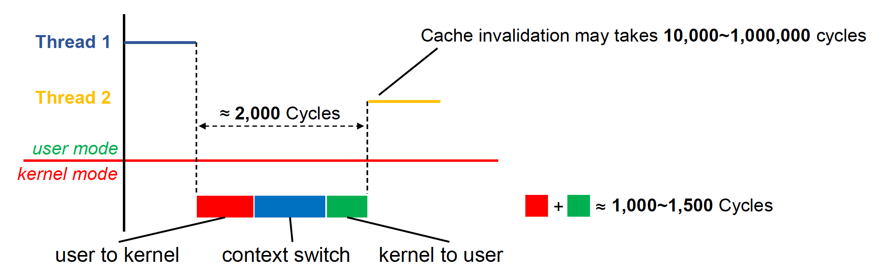
</div>

在并行计算中，我们经常会遇到以下并行问题：

- **令人尴尬的并行**(embarrassingly parallel problem)（或完美并行(perfect parallel)）：并行任务之间几乎没有依赖关系或通信需求
- **不令人尴尬的并行**(non-embarrassingly parallel problem)：并行任务之间需要通信

<div style="text-align: center">
    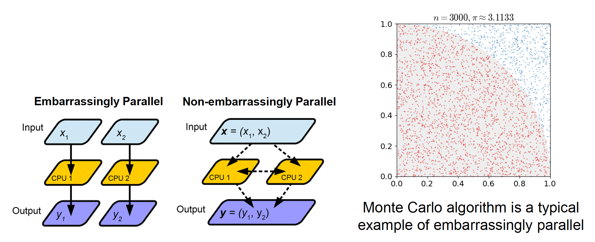
</div>

常遇到的另一个问题是**数据竞争**(data racing)，即多个线程同时访问相同的内存位置，并且其中至少有一个线程是在对其进行写操作。

<div style="text-align: center">
    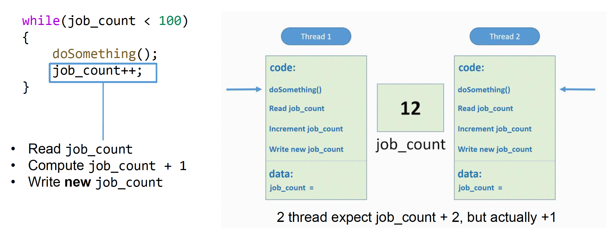
</div>

为避免这一问题，一种方法是采用叫做**锁**(lock)的阻塞算法(blocking algorithm)。

- 保证同一时间只有一个线程能获取锁
- 为共享资源访问部分设置一个**临界区**(critical section)，只有拿到锁的线程才能进入这段代码

<div style="text-align: center">
    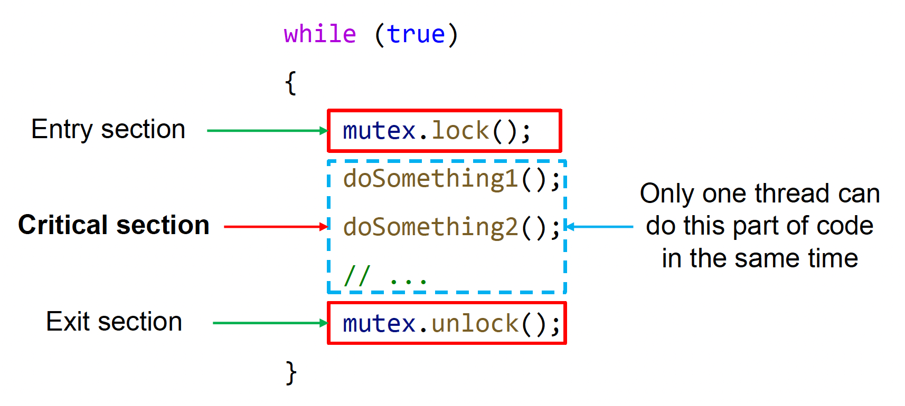
</div>

!!! bug "锁的问题"

    - 线程的挂起和恢复会带来额外的性能开销
    - 若持有锁的线程异常退出，被挂起的线程将无法恢复
    - 优先级反转问题：高优先级的任务可能会尝试获取已被低优先级的任务持有的锁

    <div style="text-align: center">
        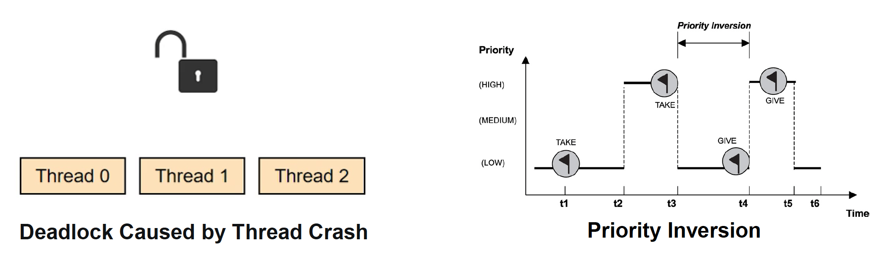
    </div>

于是我们引入一种叫做**原子操作**(atomic operations)的**无锁**(lock-free)编程。常见的原子操作有：

- 原子加载和存储
    - **加载**(load)：将数据从共享内存加载到寄存器或线程的特定内存中
    - **存储**(store)：将数据移动至共享内存中

- 原子读-改-写(read-modify-write, RMW)
    - **测试并设置**(test and set)：将 1 设置到共享内存，并返回之前的值
    - **比较并交换**(compare and swap)：若共享内存中的数据等于预期值，则更新该数据
    - **获取并增加**(fetch and add)：将共享内存中的数据加上一个值，并返回之前的值

<div style="text-align: center">
    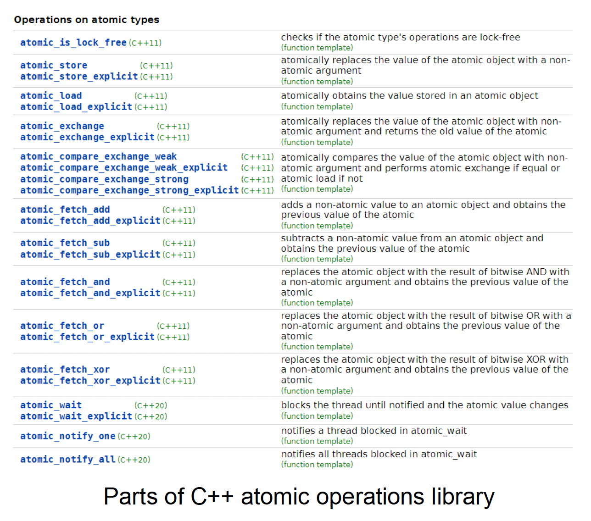
</div>

除了无锁编程外，还有**无等待**(wait-free)编程。理论上它能保证所有线程尽可能占据所有的 CPU 资源。但实际上在一个复杂系统中，这是很难做到的，因此仅在部分对性能有极高要求的场合中用到，在这里我们不必深究。

<div style="text-align: center">
    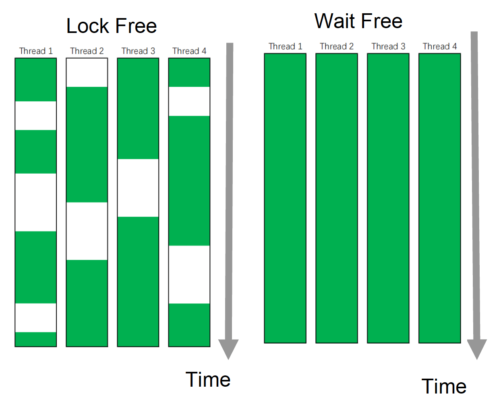
</div>

出于性能需求，编译器和 CPU 在优化过程中往往会对指令进行**重排**(reordering)。但有时候这样会给多线程编程带来困扰。如下图所示，如果按正常顺序执行，线程 2 就会触发断言的（除非还有别的线程修改 `b` 的值）。但由于指令重排，线程 1 中 `a = b + 1;` 和 `b = 0;` 两条语句可能会颠倒，此时断言就不再触发。

<div style="text-align: center">
    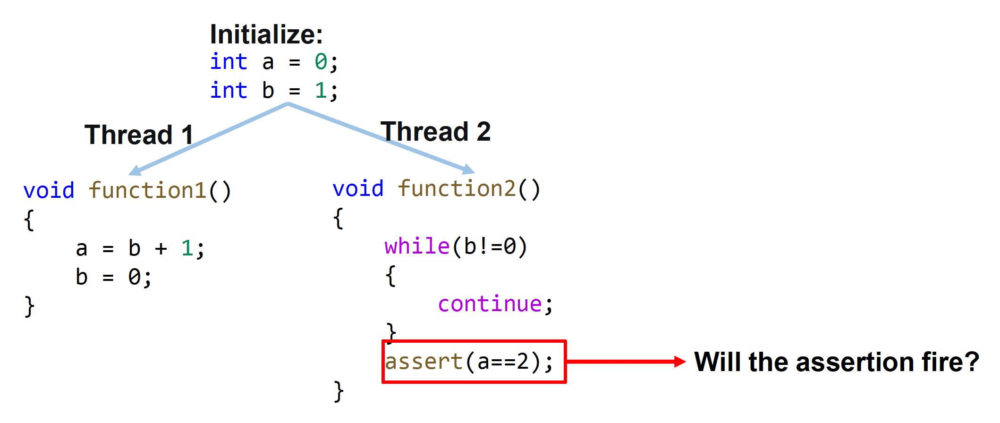
</div>

更麻烦的是，像这种乱序执行在各种 CPUs 中都会发生，而且它们：

- 会采用截然不同的优化策略
- 提供不同类型的内存顺序
- 因此并行程序需要**不同的处理**

<div style="text-align: center">
    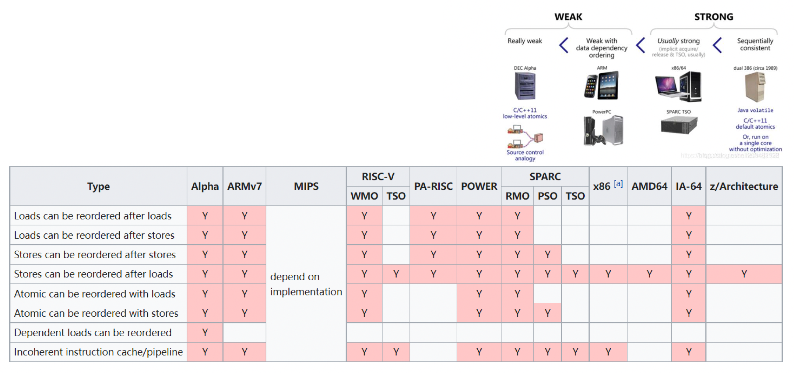
</div>

>游戏开发中会分 release 版和 debug 版。后者的执行顺序基本上认为是对的，但前者由于采取了更激进的优化策略，执行逻辑可能往往和程序员想的不一样，因而产生一些意想不到的 bug，而且这种 bug 很难排查。


## Parallel Framework of Game Engine

下面来看游戏引擎中是如何实现并行编程的。


### Fixed Multi-thread

最简单的做法，也是大多数现代游戏引擎的做法是为每一类任务（游戏逻辑的一部分）分配一个固定的线程。比如一个专门负责渲染，一个专门负责模拟等。

<div style="text-align: center">
    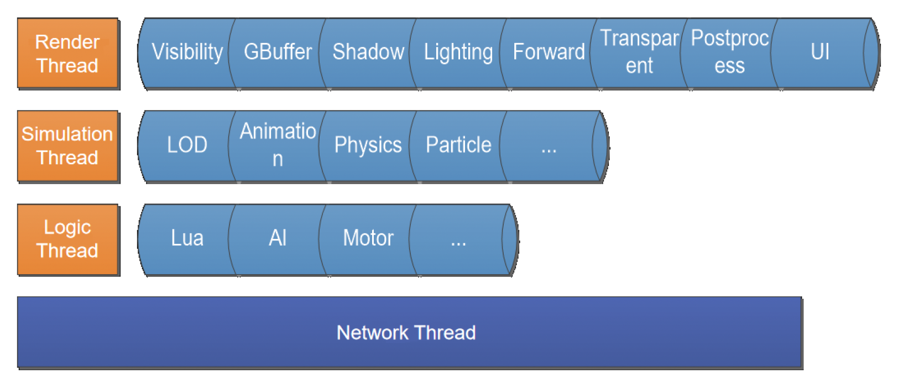
</div>

!!! recommend "优点：易于实现"

!!! bug "缺点"

    - 线程（核心）的工作量不均衡
        - 短板效应，整个任务的完成得等那个工作量很大的线程执行完毕
        - 不能直接将某个线程的任务分出一点给另一个空闲线程完成，因为这破坏了局部性；也不能让它们共享内存，否则会出现数据竞争问题
    
    - 当处理器核心增多时无法扩展

    <div style="text-align: center">
        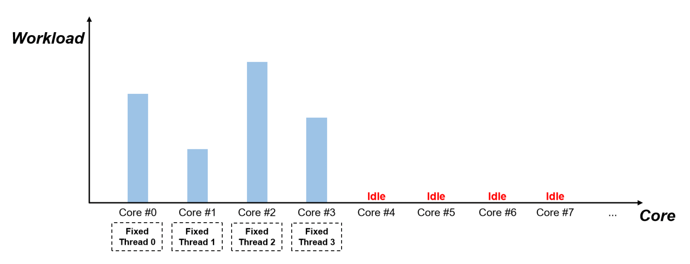
    </div>


### Thread Fork-Join

第二种方法叫做**分叉-合并**(fork-join)。它仍然基于第一种方法，但特别适合用来解决数据可并行的任务。

- 比如模拟线程的动画计算非常复杂，那它会创建一些子线程进行并行计算，最后合并子线程的结果
- 使用**线程池**(thread pool)来组织频繁的线程创建和销毁

<div style="text-align: center">
    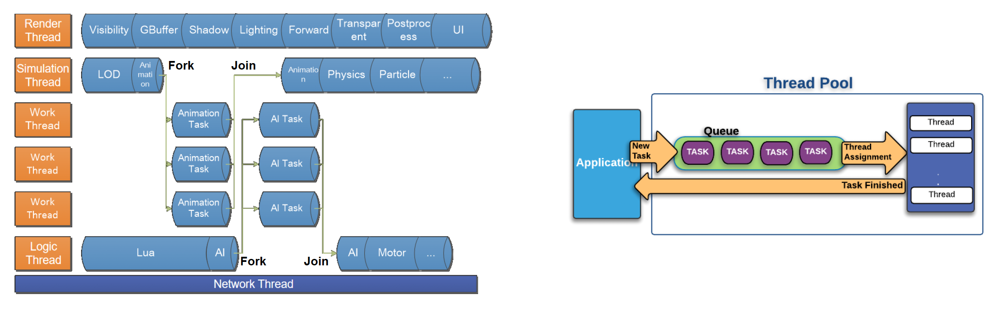
</div>

!!! bug "问题"

    - 对负责撰写逻辑的程序员而言不容易实现（需要手动分割工作、确定工作线程数量等）
    - 线程过多可能导致额外的上下文切换的性能开销
    - 各线程（核心）间的工作负载仍然不均衡

    <div style="text-align: center">
        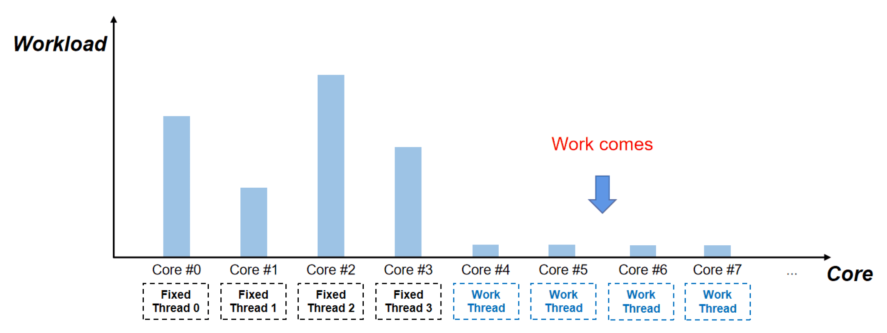
    </div>


### Unreal Parallel Framework

Unreal 的并行架构中有两类线程，分别是：

- **命名线程**(named thread)：由其他系统创建，并附加到并行框架中
- **工作线程**(worker thread)
    - 三种优先级：高、中、低
    - 数量根据 CPU 核心数确定
    - 和分叉-合并方法类似

<div style="text-align: center">
    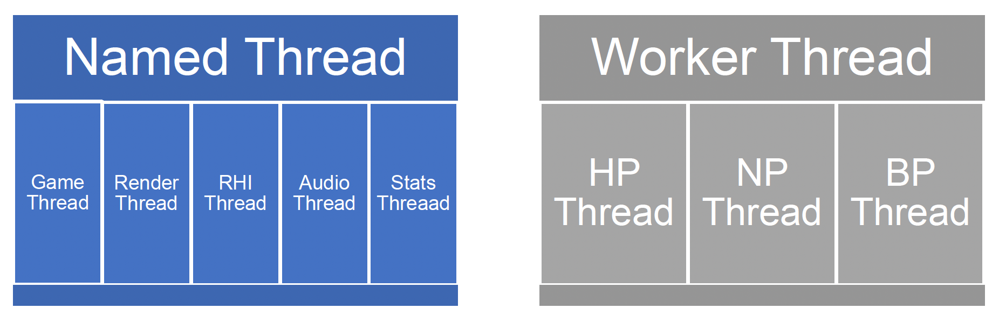
</div>


### Task Graph

**任务图**(task graph)是一种更复杂的方法。它是一个有向无环图（DAG），用节点表示任务，用边表示依赖关系，从而确定任务执行的先后顺序以及是否可以并行执行。

<div style="text-align: center">
    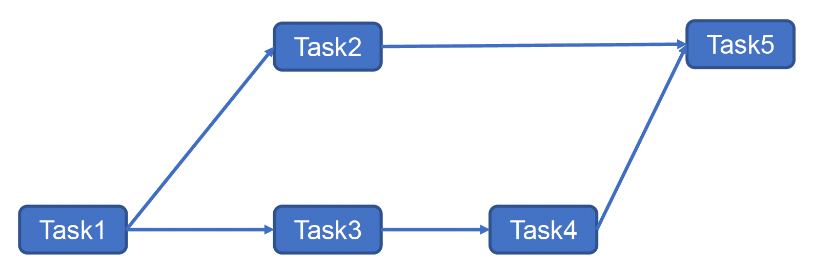
</div>

通过链接(links)来构建任务图。

<div style="text-align: center">
    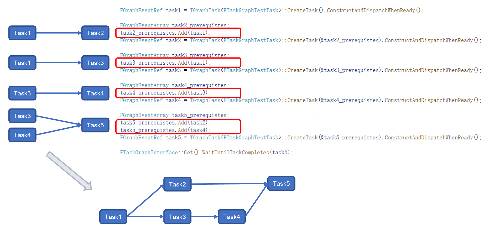
</div>

!!! bug "问题"

    - 它是一种静态方法，难以应对动态环境
    - 它要求任务必须完整做好才能继续下一个任务，但在游戏中有时会出现执行了一半就要转头做另一项任务的情况


## Job System

### Coroutine

**协程**(coroutine)是一种轻量级的执行上下文。每个协程也都有自己的用户栈、寄存器等。它的一大特点是协作式的执行，这意味着它可以（随时）交互式地切换到另一个协程中，切换开销会很小。因而**作业**(jobs)的创建正是在协程中完成的。

<div style="text-align: center">
    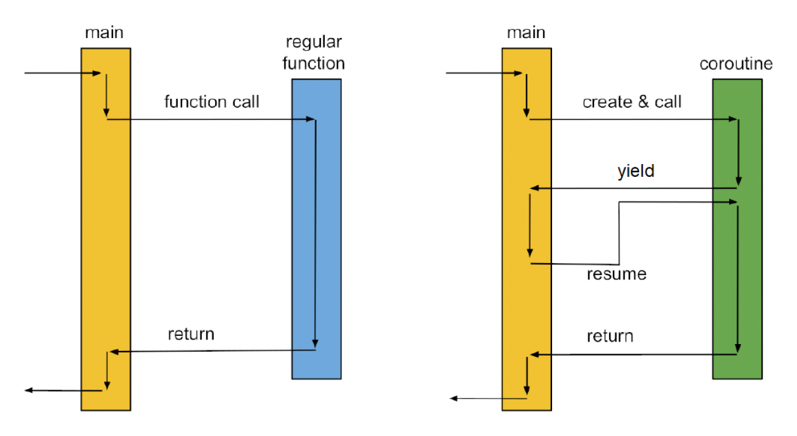
</div>

!!! abstract "协程 vs 线程"

    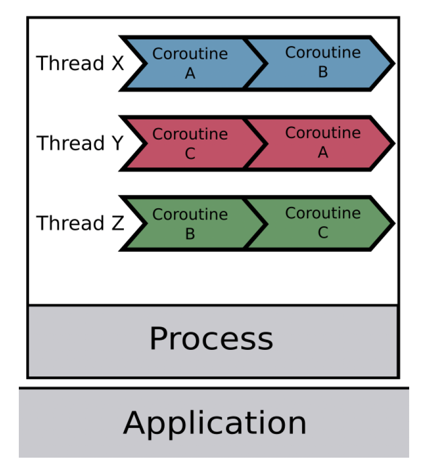{ align=right width=30% }

    - 协程
        - 由程序员调度
        - 在线程中执行
        - 上下文切换更快，无需切换到内核模式
    
    - 线程
        - 由操作系统调度
        - 位于进程内
        - 上下文切换成本高，需切换到内核模式

协程分为两类：

- **有栈协程**(stackful coroutine)：协程拥有一个独立的运行时栈，该栈在协程 `yield`（挂起）之后被保留
    - 功能更强大，允许在嵌套栈帧内进行 `yield` 操作
    - 可以像普通函数一样使用局部变量
    - 需要更多内存，来为每个协程预留栈空间
    - 协程的上下文切换耗时更长

    <div style="text-align: center">
        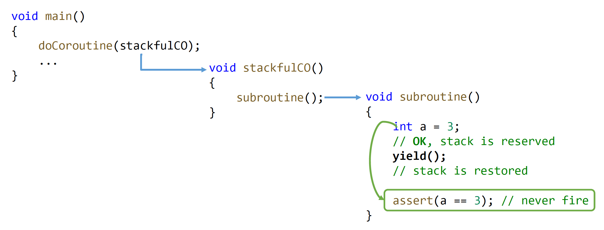
    </div>

- **无栈协程**(stackless coroutine)：协程在 yield 时没有独立的运行时栈需要保留
    - 只有顶层例程可以 yield（而子例程在没有栈的情况下不知道返回何处）
    - 恢复执行所需的数据应与栈分开存储
    - 无需额外内存空间
    - 更快的上下文切换
    >给少部分高手使用的

    <div style="text-align: center">
        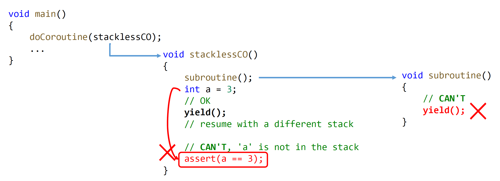
    </div>


### Fiber-Based Job System

**基于纤程的作业系统**(fiber-based job system)允许通过创建**作业**而非线程来实现多任务。

- **纤程**(fibers)类似于协程，不同之处在于纤程由调度器进行调度
- 线程是执行单元，而纤程则是上下文环境；每个处理器核心对应一个线程，以最小化上下文切换的开销
- 任务在纤程的上下文中执行

<div style="text-align: center">
    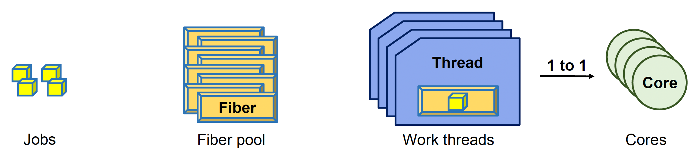
</div>

一个原则是尽可能保证一个工作线程对应一个核心，以最小化线程上下文切换的开销（因为单核中的多工作线程仍会遭受上下文切换的影响）。

<div style="text-align: center">
    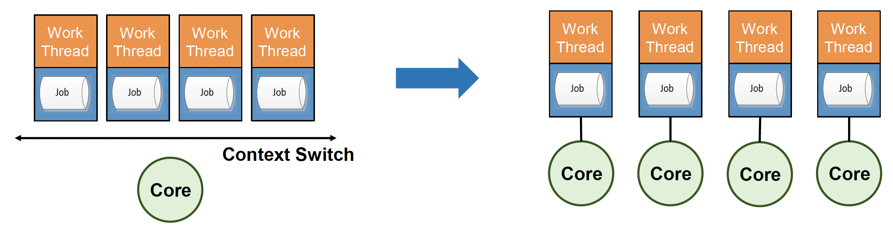
</div>

现在来看作业是如何被调度的。

- **全局作业**(global job)：
    - 将作业分配给相对空闲的工作线程，确保各线程负载均衡
    - 采取 **LIFO** 模式（即**栈**）

    <div style="text-align: center">
        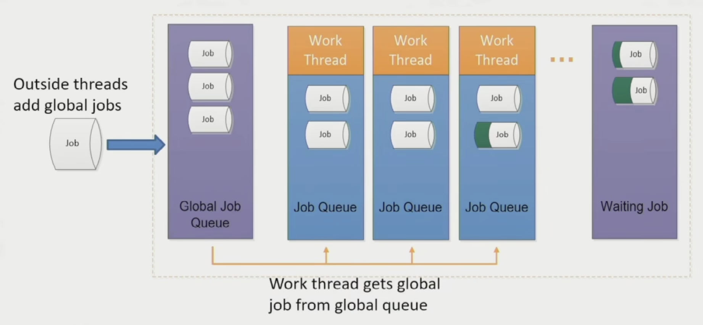
    </div>

- **作业依赖性**(job dependency)：
    - 多数时候作业间的依赖关系形成一棵树
    - 有时要先执行优先级更高的作业，但资源有限，所以会把低优先级的作业暂时放到一个等待队列中；这个作业和新进来的高优先级作业之间建立了一个依赖关系，等这个高优先级作业结束后，该作业又回到原来的线程中运行

    <div style="text-align: center">
        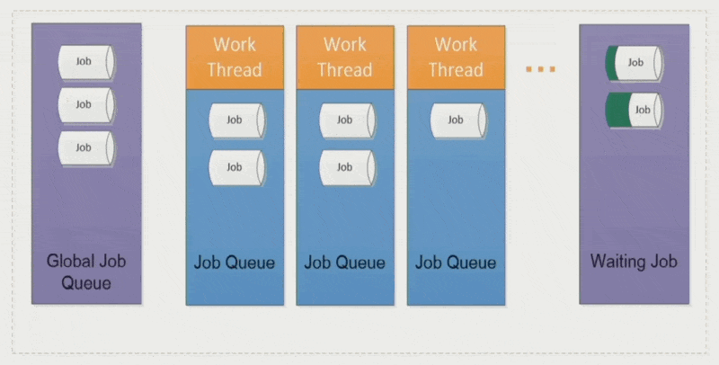
    </div>


- **作业窃取**(job stealing)：空闲的工作线程会从其他线程中「偷」些作业过来，避免某些线程执行时间过长而拖累整体表现

    <div style="text-align: center">
        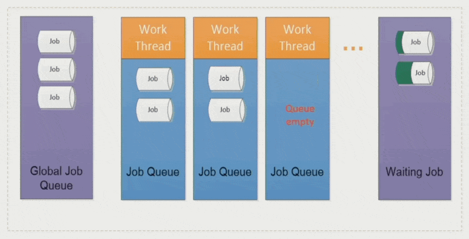
    </div>

!!! recommend "优点"

    - 任务调度实现容易
    - 便于处理任务的依赖关系
    - 作业的栈是独立的
    - 减少频繁的上下文切换

!!! bug "缺点"

    - C++ 原生不支持纤程
    - 不同操作系统间的实现存在差异
    - 存在一些限制（比如 `thread_local` 无效）


## Programming Paradigms

游戏引擎中有很多不同的**编程范式**(programming paradigms)，而其中某些编程范式在实践中被广泛使用。并且编程语言往往不局限于采用某一种特定的范式。

<div style="text-align: center">
    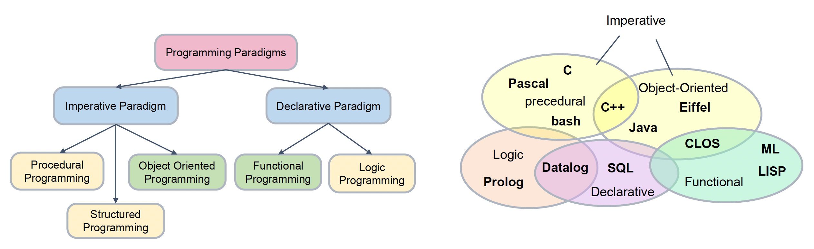
</div>

下面来看两类我们熟知的范式：

- **面向过程编程**(procedural oriented programming, **POP**)
    - 采用逐步方法，通过一系列指令将任务分解为变量和例程（或子例程）的集合
    - **无法用这种方式编写游戏引擎**，因为数据通常不会良好维护的，且现实世界对象之间的相互关系是很复杂的

- **面向对象编程**(object oriented programming, **OOP**)
    - 基于「**对象**」(objects)的概念，对象包含了**数据**和**代码**
    - 以面向对象的方式对现实世界抽象化是很自然的

    <div style="text-align: center">
        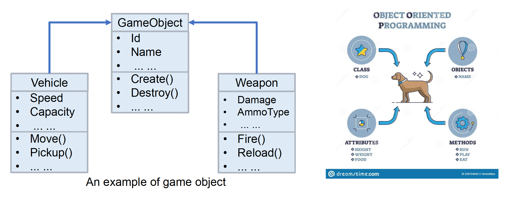
    </div>

    !!! bug "OOP 的问题"

        - **代码该放在哪个对象里**：比如造成伤害的代码是放在攻击者这边还是放在被攻击者这边
        
            <div style="text-align: center">
                
            </div>
        
        - **方法分散在继承树内**：难以知道父类是否有方法实现，经常要通过检查很多不同的类与方法来寻找答案
        
            <div style="text-align: center">
                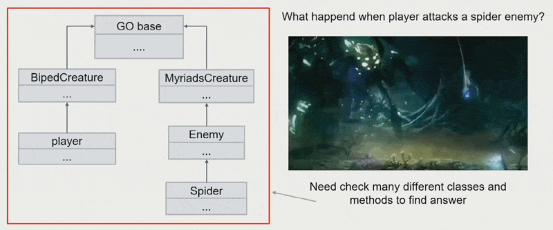
            </div>
        
        - **混乱的基类**（如果将通用方法都放在基类里）
        
            ??? code "代码示例"

                ```cpp
                class ENGINE_API AActor: public UObject
                {
                    ...
                    const FTransform& GetTransform() const;
                    const FTransform& ActorToWorld() const;
                    FVector GetActorForwardVector() const;
                    FVector GetActorUpVector() const;
                    FVector GetActorRightVector() const;
                    virtual void GetActorBounds(...) const;
                    virtual FVector GetVelocity() const;
                    float GetDistanceTo(constAActor*OtherActor) const;
                    virtual void SetActorHiddenInGame(boolbNewHidden);
                    bool GetActorEnableCollision() const;
                    bool HasAuthority() const;
                    UActorComponent* AddComponent(...);
                    void AttachToActor(...);
                    void DetachFromActor(const FDetachmentTransformRules& DetachmentRules);
                    bool GetTickableWhenPaused();
                    bool IsActorInitialized() const;
                    void ReceiveAnyDamage(...);
                    void GetOverlappingActors(...) const;
                    virtual void SetLifeSpan(float InLifespan);
                    virtual void Serialize(FArchive& Ar) override;
                    virtual void PostLoad() override;
                    ...
                }
                ```
        
        - **性能**
            - 数据分散在各个对象中，而对象创建时被分配到不连续的内存中
            - 虚函数丛林
        
            <div style="text-align: center">
                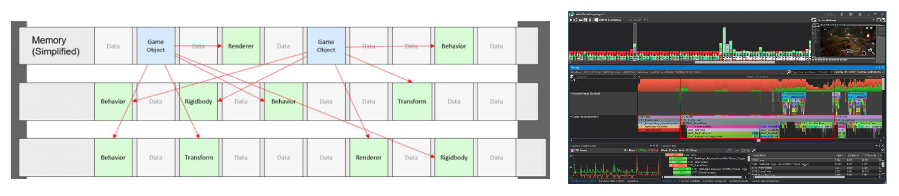
            </div>
        
        - **可测试性**(testability)：OO 设计通常需要大量设置才能进行测试，给针对某个特定模块测试的单元测试带来麻烦

            <div style="text-align: center">
                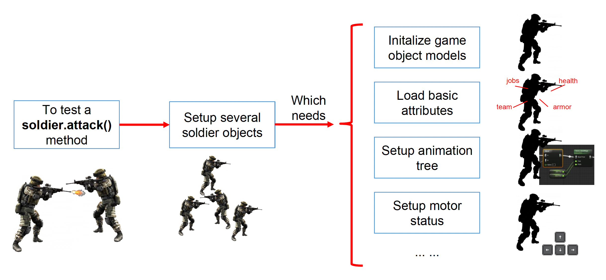
            </div>


## Data-Oriented Programming (DOP)

在正式介绍 DOP 前，我们得先了解一些硬件层面的原理。首先得意识到处理器和内存之间的性能存在巨大差距

- 内存的性能增长比处理器慢很多
- 而且这个差距还在被拉大，这使得**内存**成为了性能的**主要瓶颈**

<div style="text-align: center">
    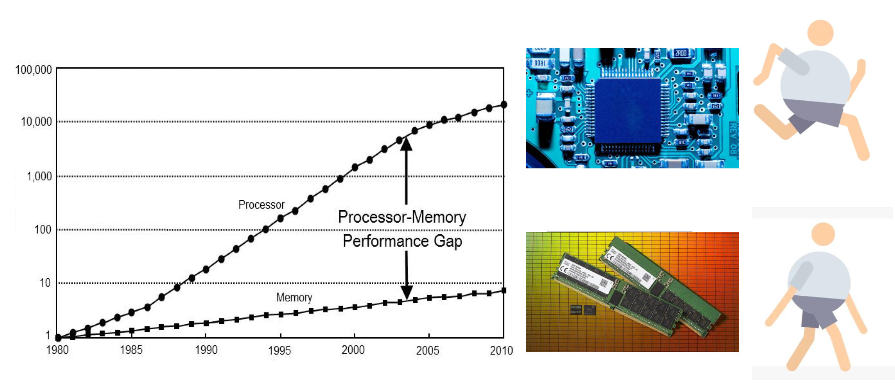
</div>

为缓减内存带来的影响，我们引入了**高速缓存**(cache)。将它置于处理器和内存之间便能加速数据的读取。通常高速缓存自顶（靠近处理器）向下（靠近内存）分成了三级：

- L1：大小在 256KB 至不超过 1MB 之间，但这已足够
- L2：通常为几兆字节，最大可达 10MB
- L3：大于 L1 和 L2，容量从 16MB 到 64MB 不等，在所有核心之间共享

另外，虽然从 L1 到 L3 容量逐渐变大，速度却越来越慢。

<div style="text-align: center">
    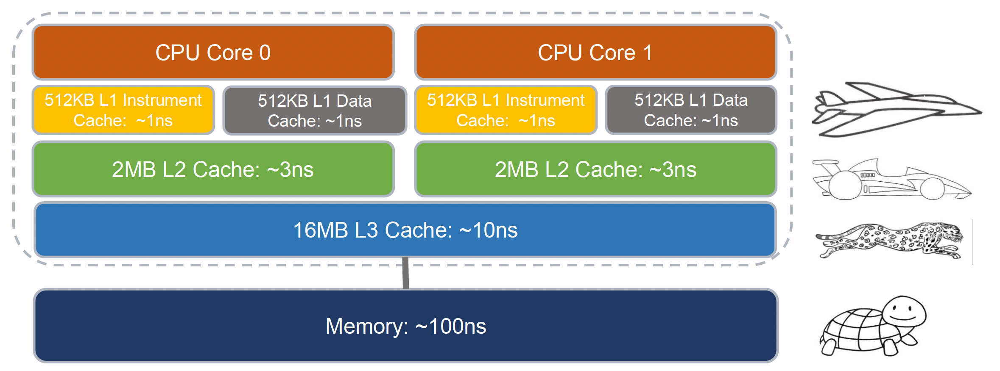
</div>

为充分利用高速缓存对性能的提升，在编程时要遵循**局部性原理**(principle of locality)，包括：

- 时间局部性：处理器在短时间内很可能会重复访问同一组内存位置
- **空间局部性**：处理器倾向于使用在相对较近的存储位置中的数据元素

<div style="text-align: center">
    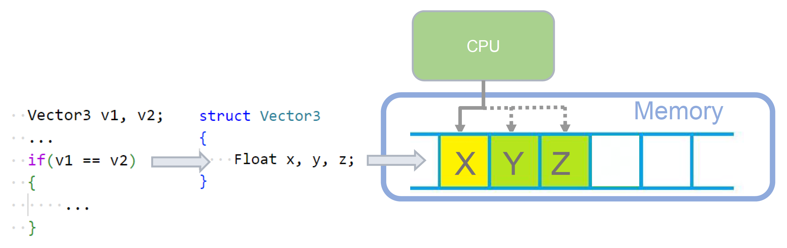
</div>

现代 CPU 中 **SIMD**（单指令多数据(single instruction multiple data)）技术就利用到了这一点。简单来说就是把同类型的数据放进一个向量里，然后某条指令能够处理这个向量，也就是说能一次性能操纵多个内存位置上的数据。

<div style="text-align: center">
    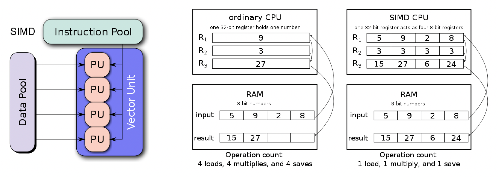
</div>

由于高速缓存空间大小有限，如果有新数据进入高速缓存时，发现里面已经被填满了，这时就要挑其中一个数据将其抛弃。一种常用的替换策略是 **LRU**（最少最近使用(least recently used)），它的思路是抛弃**最久未被访问过**的缓存行。具体实现为：

- 为每个内存行记录「使用时间」
- 每一时刻下抛弃最久未使用的缓存行
- 当访问了缓存行的数据时，更新其「使用时间」

<div style="text-align: center">
    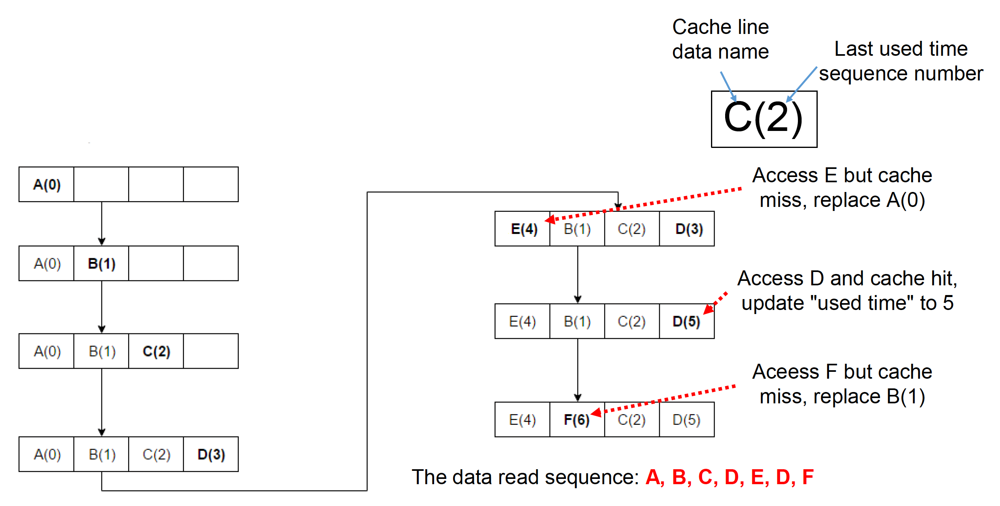
</div>

>其实还可以采用**随机丢弃**某个缓存行的策略，其效果也并不比 LRU 差很多。
>
>这里有关 LRU 的实现方法其实不太好：像缓存这种寸土寸金的区域，每个缓存行的计数器就占了不少地方（肯定不会放在内存中，不然缓存有什么意义啊）。另一种做法是**双向链表 + 哈希表**（见 LeetCode [LRU 缓存](https://leetcode.cn/problems/lru-cache)）。

这里还得补充**缓存行**(cache line)（或缓存块）的概念，它是一个固定大小的块（通常为 **64B**），使数据在内存与缓存之间进行传输。

- 缓存只能容纳有限数量的行，取决于缓存大小。比如一个 64KB 的缓存，每行 64B，就有 1024 个缓存行
- 每次加载任何内存时，实际上都在加载一个完整的缓存行字节

<div style="text-align: center">
    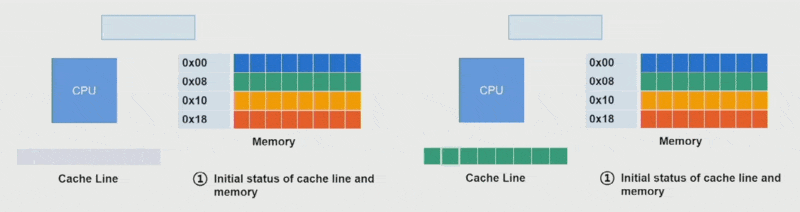
</div>

由于这样的特点，在访问矩阵时往往采用**按行访问**的迭代方式，因为：

<div style="text-align: center">
    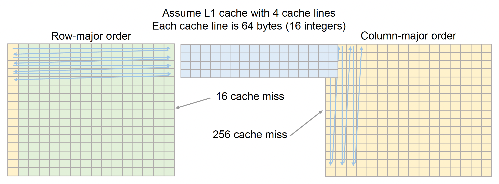
</div>

- 当缓存已满时，新行将替换最旧的行
- 当元素不在缓存中时，将加载整行数据
    - 所以按列访问的话就会触发大量的**缓存失效**(cache miss)，严重影响到系统性能

---
让我们回到正题。**面向数据编程**(data oriented programming)的核心就是「一切皆数据」。下图指出的各个部分（也包括没指出的）本质上都是数据。

<div style="text-align: center">
    
</div>

代码（或指令）本质上也是二进制数据。

<div style="text-align: center">
    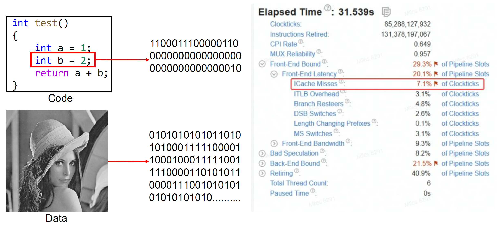
</div>

因此我们需要将代码和数据看作一个整体，尽量保证代码和数据在高速缓存中紧密放置，从而保证代码执行完后也能把数据处理完，接下来就交换进下一批的代码和数据了。

<div style="text-align: center">
    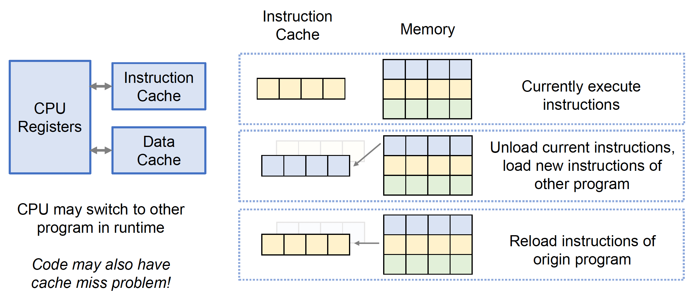
</div>


## Performance-Sensitive Programming

要想编写出超高性能的代码，第一个思路是要**减少顺序依赖**。

- 一旦预测错误，就不得不撤销现在进行的工作
- 变量一旦初始赋值，就不要再修改

<div style="text-align: center">
    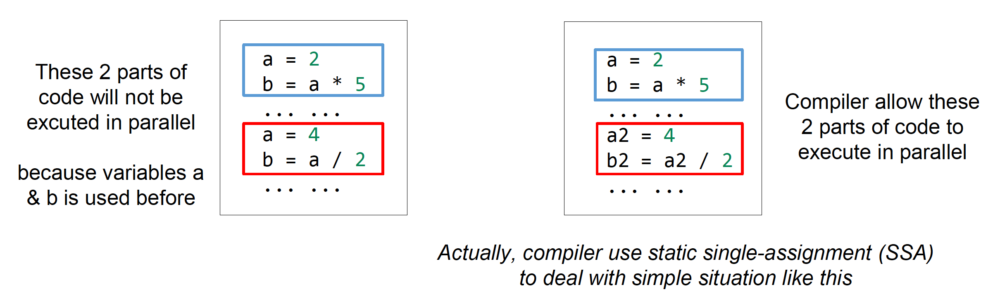
</div>

要做到这一点，一个不容忽视的问题是缓存行中的**伪共享**(false sharing)。每个线程可能都有各自针对同一内存位置的缓存副本，如果其中一个线程要修改这个内存内容，而其他线程也在对其进行读/写操作，那么要确保线程对内存的修改对其他所有线程可见。要做到这一点，要么线程写完后就立马更新其他线程的缓存，要么其他线程在读/写之前先读一遍内存更新缓存内容，但不管怎么做都挺耗时的。所以应尽量避免这一情况的出现。

<div style="text-align: center">
    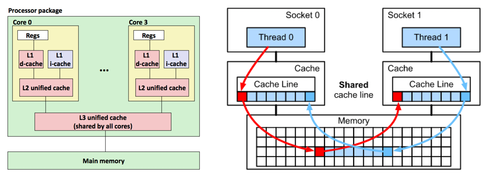
</div>

还有一个需要关注的问题是**分支预测**(branch prediction)

- CPU 为追求效率，将提前预取指令和数据，通常采用分支预测技术来决定预取内容

    <div style="text-align: center">
        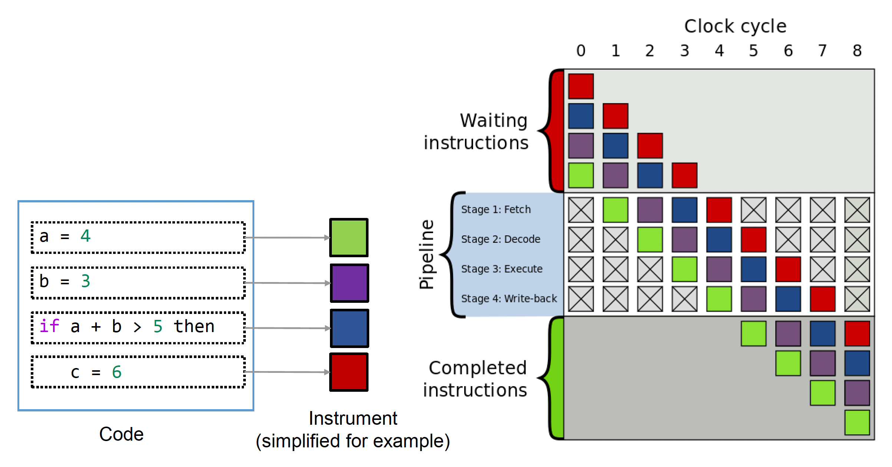
    </div>

- 但有时候会预测失败，此时各种缓存就会失效，需要等待不少时间，因此尽量避免这一情况出现
    - 如下例所示，由于数组元素是乱序放置的，所以处理 `11 3` 这两个元素时，CPU（沿用分支历史）的预测都是错误的

        <div style="text-align: center">
            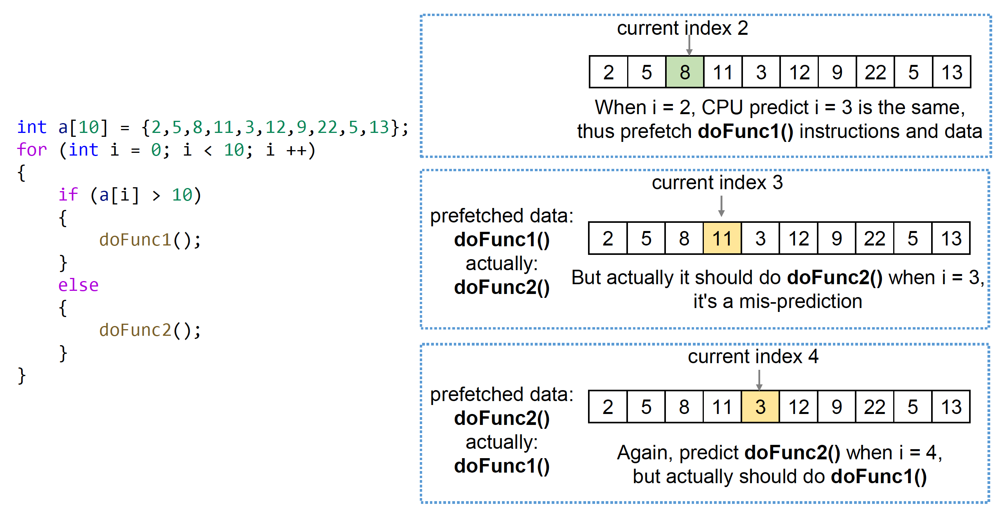
        </div>

        解决方案是对数组元素排序，这样中间就只有一次预测错误了。

        <div style="text-align: center">
            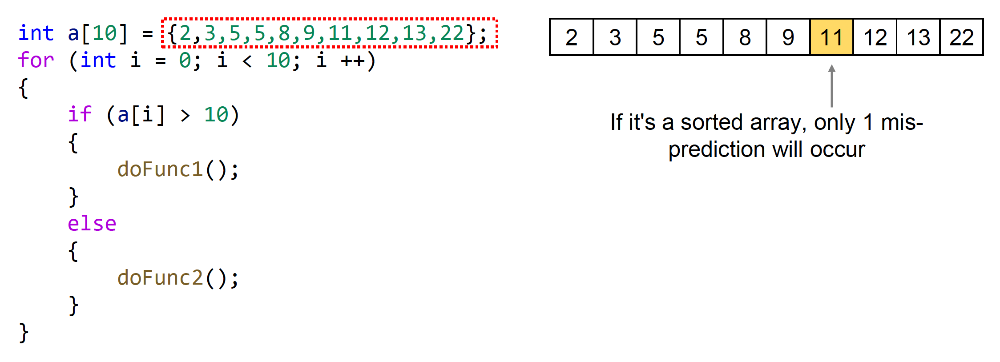
        </div>

- 尽可能消除 `if` 语句，以根除分支预测失败的来源
    - 比如仅处理现有元素，而非在运行时决定是否应进行处理

    <div style="text-align: center">
        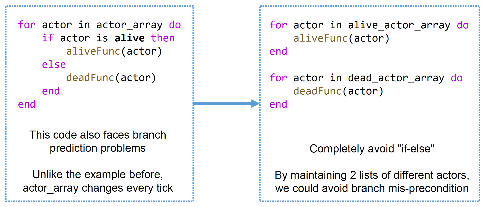
    </div>


## Performance-Sensitive Data Arrangements

接下来考虑数据的排布。同样地，我们需要**减少内存间数据的依赖**。典型代表便是通过指针相连的**链表**，通常链表中的元素是不连续的。如果将其中某个元素所在行加载到缓存中，访问下一个元素时很有可能会去加载另一个完整的缓存行（出现了缓存失效），显然会对性能造成很大的影响。

<div style="text-align: center">
    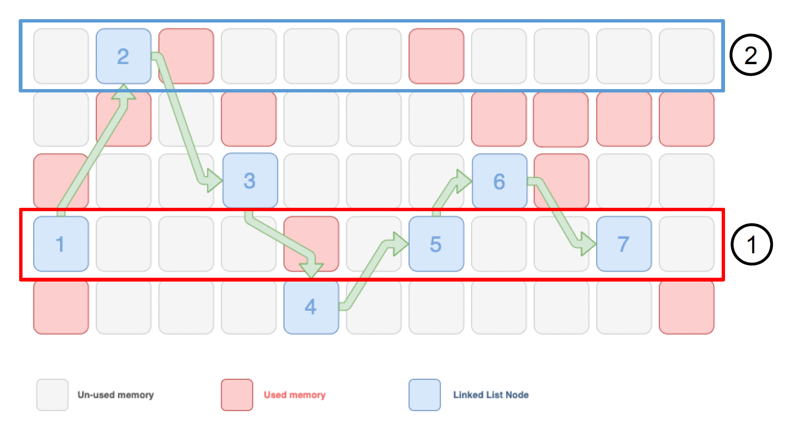
</div>

这里便涉及到一对重要的概念：**结构数组**(array of structure, **AOS**)和**数组结构**(structure of array, **SOA**)，它们分别对应<u>元素为结构体的数组</u>，以及<u>字段为数组的结构体</u>。以粒子的存储为例，AOS 就是一个粒子一个粒子的存储，每个粒子都有位置、速度等属性；而 SOA 就是先存储所有粒子的位置，再存储所有粒子的速度，以此类推。不难发现，当我们想要一次性读取所有粒子的某一个特定字段时，SOA 的存储方式会带来更好的性能。

<div style="text-align: center">
    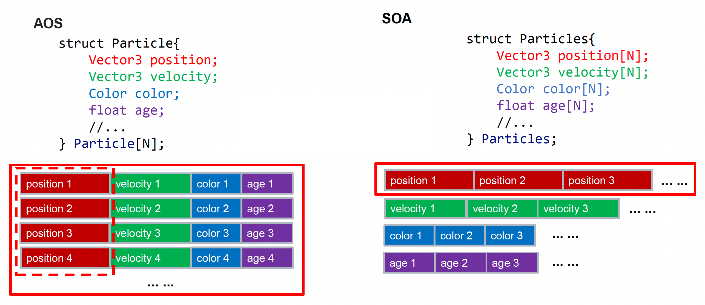
</div>

???+ abstract "AOS 和 SOA 优缺点总结"

    >by GPT 5.4

    - SOA
       - 优点：符合人类直觉，代码更自然；适合“按对象”访问；更方便和面向对象设计结合
       - 缺点：不利于 SIMD / 向量化；可能读入不需要的数据；GPU / 高性能场景下常常不如 SOA
    
    - AOS
       - 优点：同类数据连续，cache 友好；更适合 SIMD / 自动向量化；只访问需要的字段时更省带宽；适合并行和批处理
       - 缺点：代码可读性可能变差；不适合频繁按对象整体操作；封装性较弱；增删字段或维护一致性更麻烦


## Entity Component System (ECS)

最后要介绍大名鼎鼎的**实体组件系统**(entity component system, **ECS**)。它能将我们前面提到的所有比较零碎的概念串在一起，包括本课程一开始就介绍过的**基于组件的设计**。

<div style="text-align: center">
    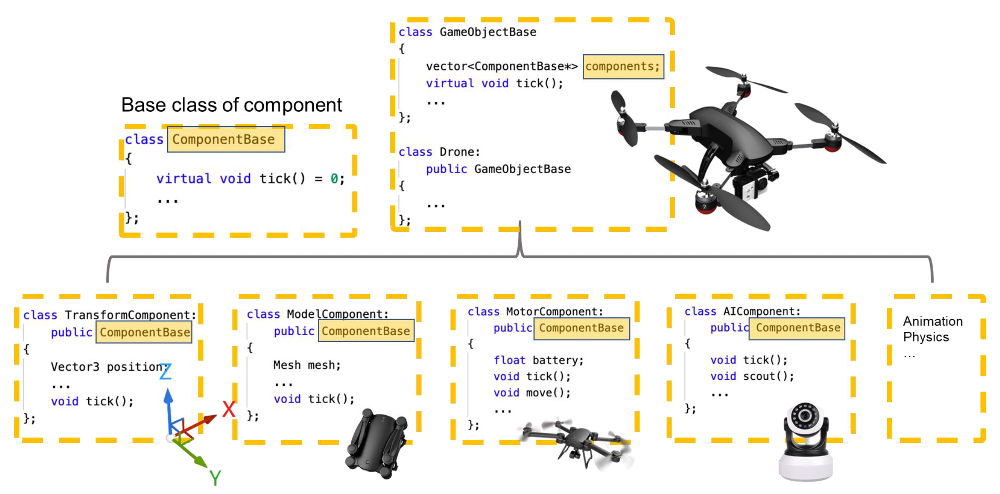
</div>

很自然地，我们会想通过 OOP 方法来实现。但正如[之前](#programming-paradigms)提到的那样，OOP 并不适合游戏开发。而 ECS 正是来解决这个问题的。它是一种以**数据**为导向构建游戏代码的模式，旨在实现最佳性能（可并行化）。它的三部分分别为：

- **实体**(entity)：指代组件集合的 ID（对应之前介绍的**游戏对象**（GO））
- **组件**(component)：被系统处理的数据，不包含逻辑
- **系统**(system)：逻辑所在，会读/写组件数据
    - 可以同时处理好几类组件的数据

<div style="text-align: center">
    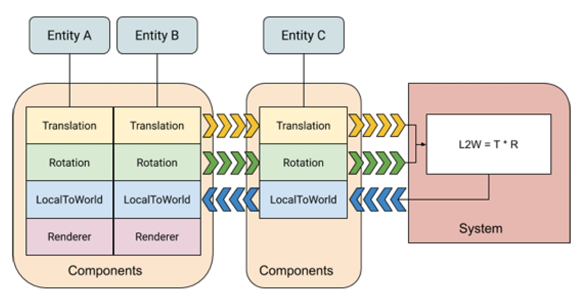
</div>


### Unity Data-Oriented Tech Stack (DOTS)

这种模式的一个典型应用是 Unity 的**面向数据的技术栈**(data-oriented tech stack, **DOTS**)，它是多种技术相结合，共同实现以数据为导向的编程方法，包含以下三类子系统：

- **ECS**：提供了面向数据的编程框架
- **C# 作业系统**：提供了一种生成多线程代码的简单方法
- **Burst 编译器**：可生成快速且优化的原生代码

<div style="text-align: center">
    
</div>


#### ECS

Unity 引入了一个叫做**原型**(archetype)的概念，它是一组特定组件的结合。实体便是基于原型分组的，所以可将原型简单理解为游戏对象的类型。这么做有助于我们快速查找指定的实体和组件。

<div style="text-align: center">
    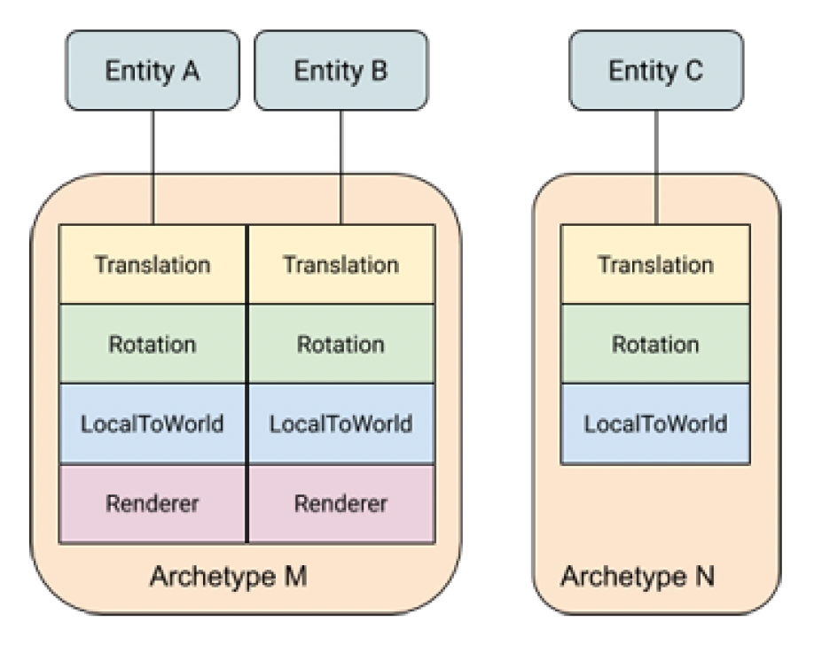
</div>

为了充分利用缓存，原型中的**相同组件**会被紧密地打包成**块**(chunks)。「块」通常是固定大小的一个内存区域，比如 16KB 大小。

<div style="text-align: center">
    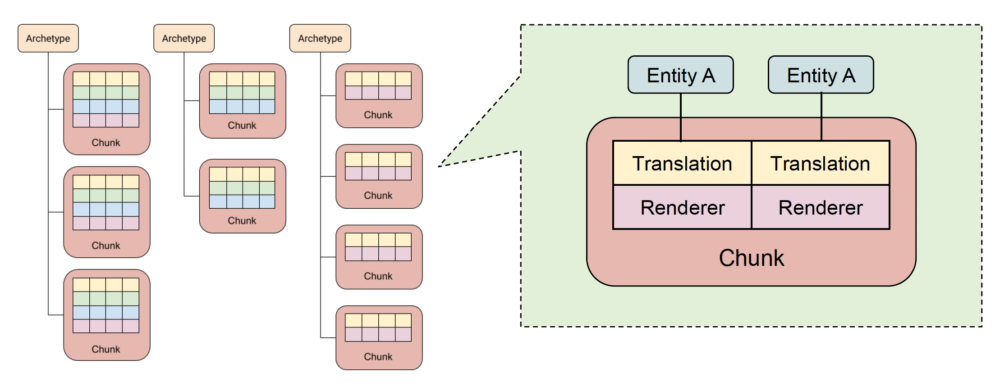
</div>

???+ example "例子"

    以下代码实现了位置的更新

    <div style="text-align: center">
        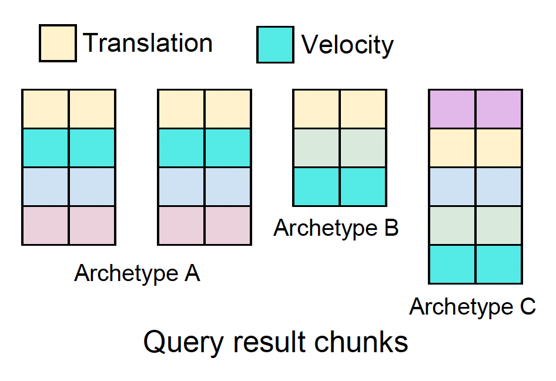
    </div>

    ```cs
    public class MoveSystem: SystemBase {
        protected override void OnUpdate() {
            // For each entity which has Translation and Velocity
            Entities.ForEach(
                // Write to Displacement (ref), read Velocity (in)
                (ref Translation trans, in Velocity velocity) => {
                    // Execute for each selected entity
                    trans = newTranslation() {
                        // dT is a captured variable
                        Value = trans.Value + velocity.Value * dT
                    };
                }
            )
            .ScheduleParallel(); // Schedule as a parallel job
        }
    }
    ```


#### C# Job System

Unity 为 C# 的作业系统设计了一套**原生容器**(native container)，这是一种可以在作业内被访问的共享内存。

- 若无原生容器，作业无法输出结果（所有数据均为副本）
- 原生容器支持全部**安全检查**
- 原生容器需**手动释放**

```cs
// Allocate one float with "TempJob" policy
// Allocator.Temp:       Fastest allocation, lifespan is 1 frame or fewer
// Allocator.TempJob:    Slower than Temp, lifespan is 4 frames
// Allocator.Persistent: Slowest allocation, can last as long as needed
NativeArray<float> a = newNativeArray<float>(1, Allocator.TempJob);
...
// Need to dispose manually for unmanaged memory
a.Dispose();
```

鉴于原生容器的特性，我们还需要一个**安全系统**，支持对作业进行安全检查，比如越界检查、释放检查、竞态条件检查等。

- 向每个作业发送其运行所需数据的副本，以消除竞态条件
- 作业只能访问可复制数据类型（引用无效）

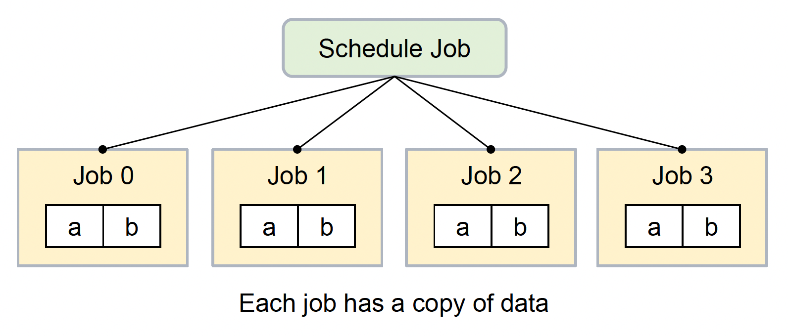{ align=right width=60% }

```cs
public structJob: IJob {
    public float a;
    public float b;
    public void Execute() {
        ...
    }
}
```

<br/>

#### High-Performance C# and Burst Compiler

**高性能 C#**（HPC#）是 C# 的一个子集，它放弃大部分标准库功能（如 `#!cs StringFormatter`、`#!cs List`、`#!cs Dictionary` 等），并且禁止内存分配、反射、垃圾回收和虚函数调用。

**Burst 编译器**通过 LLVM 将 IL/.NET 字节码转换为高度优化的原生代码，为特定平台生成预期的机器指令。相比直接使用 C# 自带的编译器，性能得到了不小的提升。

<div style="text-align: center">
    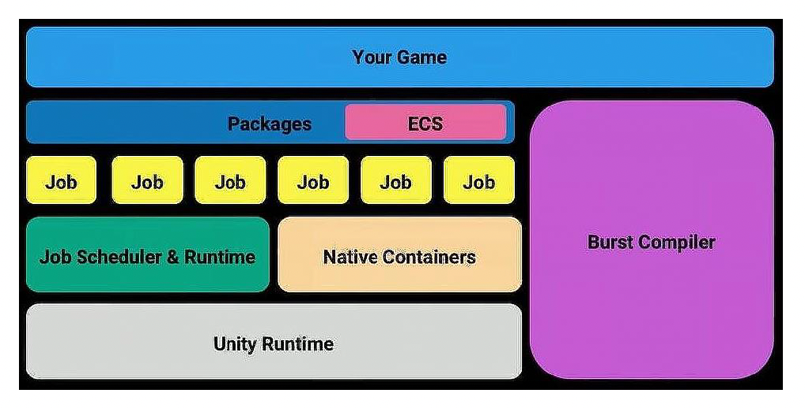
</div>


### Unreal Mass Framework

ECS 的另一个例子是 Unreal 的 **Mass** 系统。

<div style="text-align: center">
    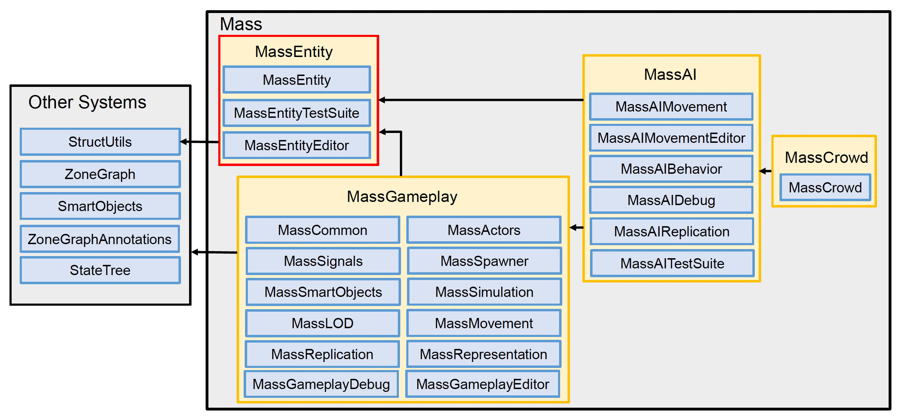
</div>


#### Entity

其中一个重要部分是 **`MassEntity`**，它对应了 ECS 的**实体**。

- `FMassEntityHandle` 是 ECS 实体的**纯 ID**
- `Index` 代表在 `FMassEntityManager` 的实体数组中的索引
- `SerialNumber` 作为索引的盐值(salt)
    - 释放旧实体
    - 用相同索引创建新实体
    - 但 `SerialNumber` 会递增，因此 ID 会发生变化

<div class="grid" markdown>

```cpp
struct FMassEntityHand1e {
    ...
    int32 Index = 0;
    int32 SerialNumber = 0;
    ...
}
```

```cpp
struct MASSENTITY_API FMassEntityManager {
    ...
    TChunkedArray<FEntityData> Entities;
    TArray<int32> EntityFreeIndexList;
    ...
}
```

</div>


#### Component

Mass 的**组件**部分和 Unity 类似，每一类实体也有对应的原型(archetype)。不过组件是由**片段**(fragments)和**标签**(tags)两部分构成，其中标签是用于过滤不必要处理的常量布尔组件。

```cpp
struct FMassArchetypeCompositionDescriptor {
    ...
    FMassFragmentBitSet Fragments;
    FMassTagBitSet Tags;
    FMassChunkFragmentBitSet ChunkFragments;
    FMassSharedFragmentBitSet SharedFragments;
}
```

<div style="text-align: center">
    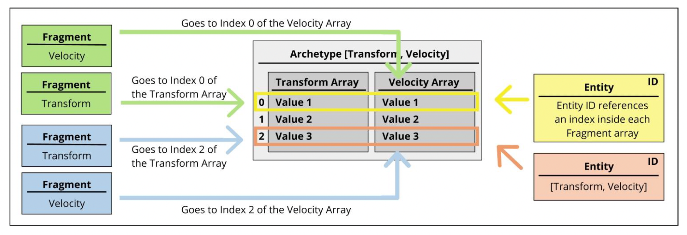
</div>


#### System

最后来看**系统**部分。`MassEntity` 里的 ECS 系统是派生自 `UMassProcessor` 的**处理器**。它有两个重要的接口（高亮标出）：

```cpp hl_lines="4 6"
class MASSENTITY_API UMassProcessor: publicUObject {
    ...
protected:
    virtual void ConfigureQueries() PURE_VIRTUAL(UMassProcessor::ConfigureQueries);
    virtual void PostInitProperties() override;
    virtual void Execute(
        FMassEntityManager& EntityManager,
        FMassExecutionContext& Context
    ) PURE_VIRTUAL(UMassProcessor::Execute);
    ...
}
```

- `ConfigureQueries()`：片段查询(fragment query)
    - 在处理器初始化时运行
    - 使用 `FMassEntityQuery` 筛选符合系统需求的实体原型（其实只拿到片段的引用而非实际数据）
    - `FMassEntityQuery` 会缓存筛选出来的原型，以加速之后的执行

    <div style="text-align: center">
        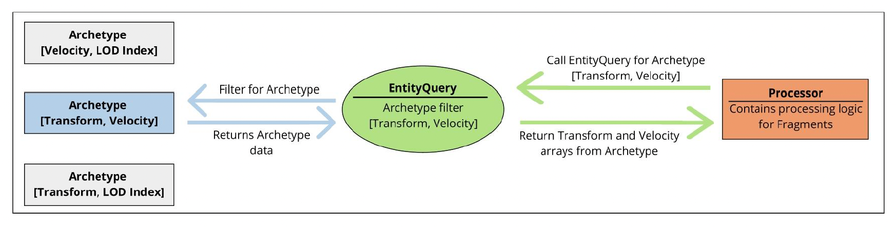
    </div>

    ```cpp
    void UMassApplyMovementProcessor::ConfigureQueries() {
        EntityQuery.AddRequirement<FMassVelocityFragment>(EMassFragmentAccess::ReadWrite);
        EntityQuery.AddRequirement<FTransformFragment>(EMassFragmentAccess::ReadWrite);
        EntityQuery.AddRequirement<FMassForceFragment>(EMassFragmentAccess::ReadWrite);
        EntityQuery.AddTagRequirement<FMassOffLODTag>(EMassFragmentPresence::None);
        EntityQuery.AddConstSharedRequirement<FMassMovementParameters>(EMassFragmentPresence::All);
    }
    ```

- `Execute(...)`：

    ```cpp hl_lines="12-14"
    void UMassApplyMovementProcessor::Execute(
        FMassEntityManager& EntityManager,
        FMassExecutionContext& Context
    ) {
        // Clamp max delta time to avoid force explosion on large time steps (i.e. during initialization).
        constfloatDeltaTime = FMath::Min(0.1f, Context.GetDeltaTimeSeconds());
        EntityQuery.ForEachEntityChunk(
            EntityManager, 
            Context, 
            [this, DeltaTime](FMassExecutionContext& Context) {
                const int32 NumEntities = Context.GetNumEntities();
                const TArrayView<FTransformFragment> LocationList = Context.GetMutableFragmentView<FTransformFragment>();
                const TArrayView<FMassForceFragment> ForceList = Context.GetMutableFragmentView<FMassForceFragment>();
                const TArrayView<FMassVelocityFragment> VelocityList = Context.GetMutableFragmentView<FMassVelocityFragment>();
                for (int32 EntityIndex = 0; EntityIndex < NumEntities; ++EntityIndex) {
                    FMassForceFragment& Force = ForceList[EntityIndex];
                    FMassVelocityFragment& Velocity = VelocityList[EntityIndex];
                    FTransform& CurrentTransform = LocationList[EntityIndex].GetMutableTransform();
                    // Update velocity from steering forces.
                    Velocity.Value += Force.Value * DeltaTime;
                    ...
                    FVector CurrentLocation = CurrentTransform.GetLocation();
                    CurrentLocation += Velocity.Value * DeltaTime;
                    CurrentTransform.SetTranslation(CurrentLocation);
                }
            }
        );
    }
    ```