# Dynamic Global Illumination and Lumen

## Global Illumination (GI)

全局光照的目标就是要实现**渲染方程**(rendering equation)【Kajiya】指出的光照效果：

<!-- $$
L_o(\mathbf{x}, \omega_o) = L_e(\mathbf{x}, \omega_o) + \int_{H^2} f_r(\mathbf{x}, \omega_o, \omega_i) L_i(\mathbf{x}, \omega_i) \cos \theta_i d\omega_i
$$ -->

<div style="text-align: center">
    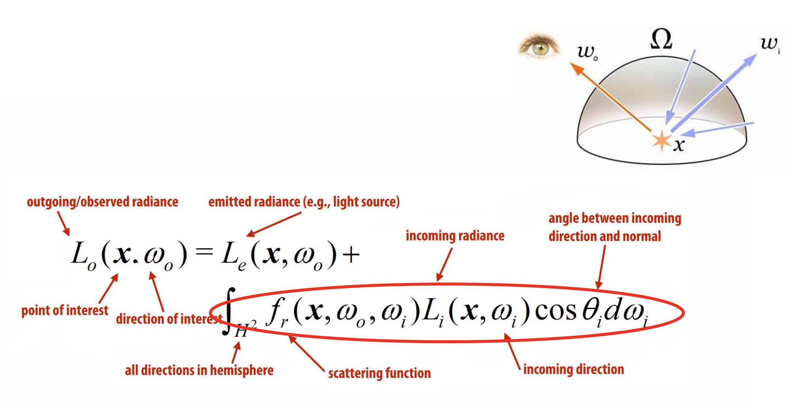
</div>

但到目前为止，还没有哪一种技术能够完全满足渲染方程的要求。因为渲染方程除了考虑直接光照，还考虑来自四面八方的光照（间接光照），并且还要和不同材质的 BRDF 进行复杂的积分计算。这对计算机而言计算量实在太大了，并且在游戏中还得保证 1s 内渲染几十帧，想想看就知道是一个难题。

右图就是 CG 领域的一个知名案例**康奈尔盒**(Cornell Box)。可以看到位于天花板中央的面光源，并且左右两面分别是红色和绿色的墙。它们的反光打在中间的两个几何体上，呈现出相应的颜色。

<div style="text-align: center">
    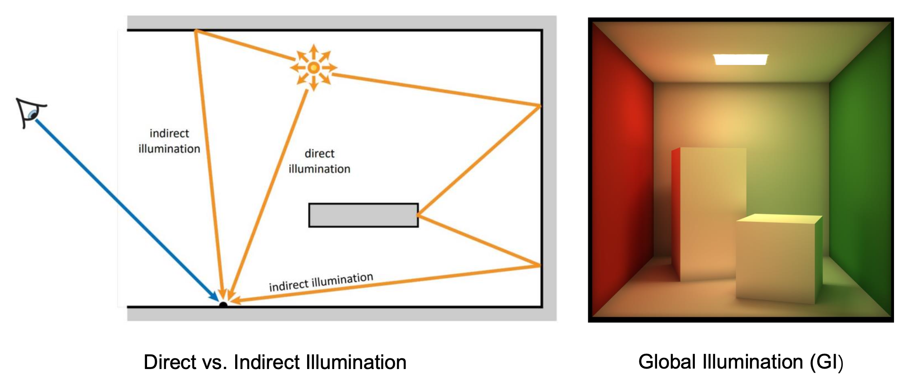
</div>

???+ example "例子"

    比较关闭/开启全局光照的效果，不难看出全局光照在游戏中相当重要。

    <div style="text-align: center">
        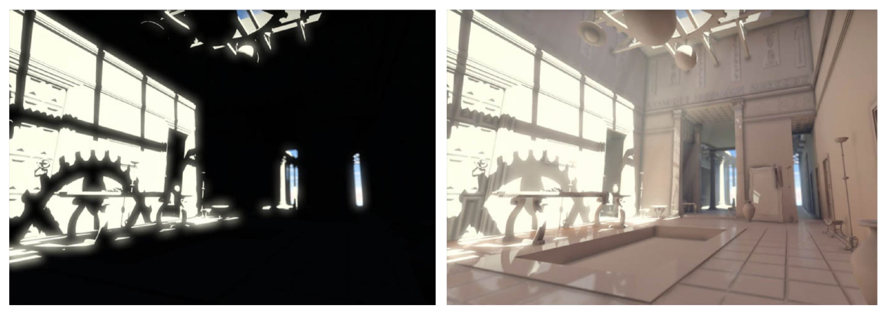
    </div>


### Monte Carlo Integration

既然积分的解析解计算很复杂，那么该怎么解呢？一种常用算法是**蒙特卡洛积分法**(Monte Carlo integration)，取随机采样值的平均值作为积分的近似结果。

<div style="text-align: center">
    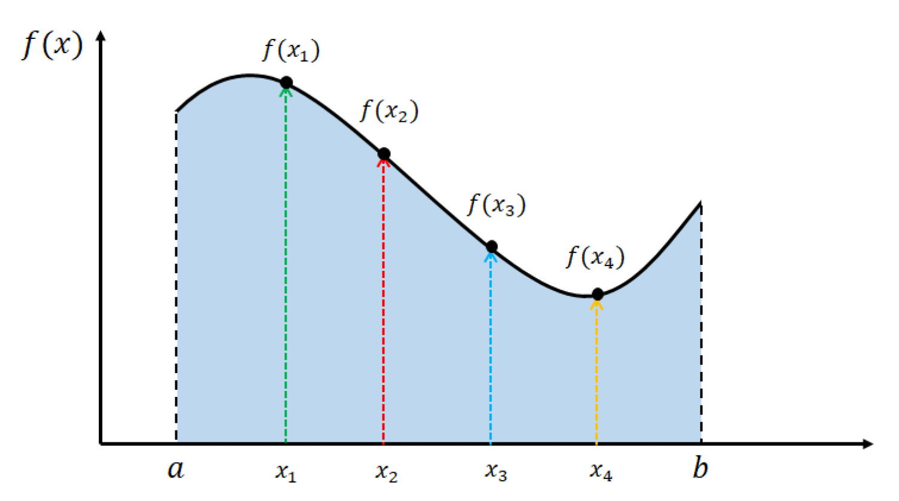
</div>

???+ example "例子"

    可以看到，由于采样数有限，所以渲染结果中存在较多的噪点。

    <div style="text-align: center">
        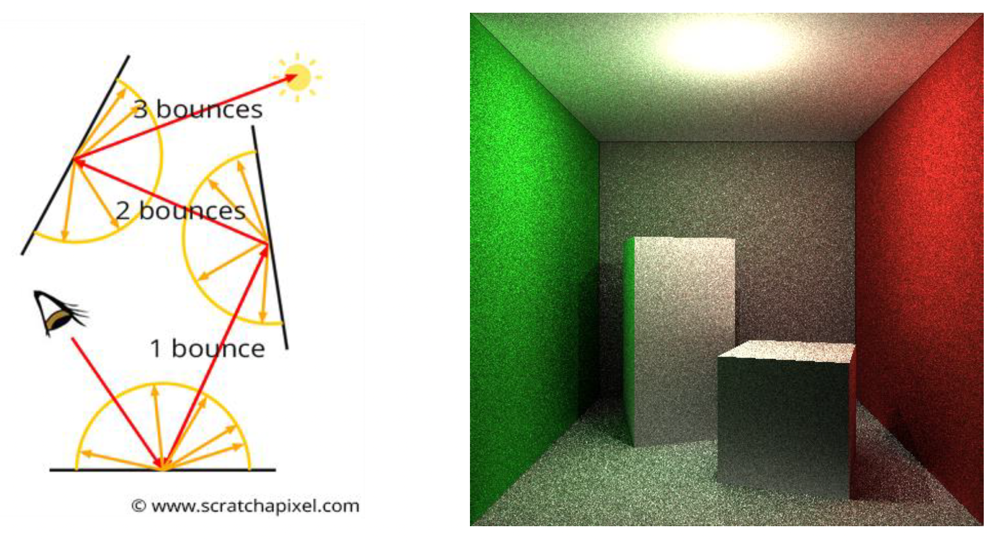
    </div>


### Sampling

所以**采样**就成为了关键。随着**每个像素的样本数量**（SPP）增加，噪点逐渐减少。左上角显示的是每像素 1 个样本，从左到右每个方格的样本数依次翻倍。

<div style="text-align: center">
    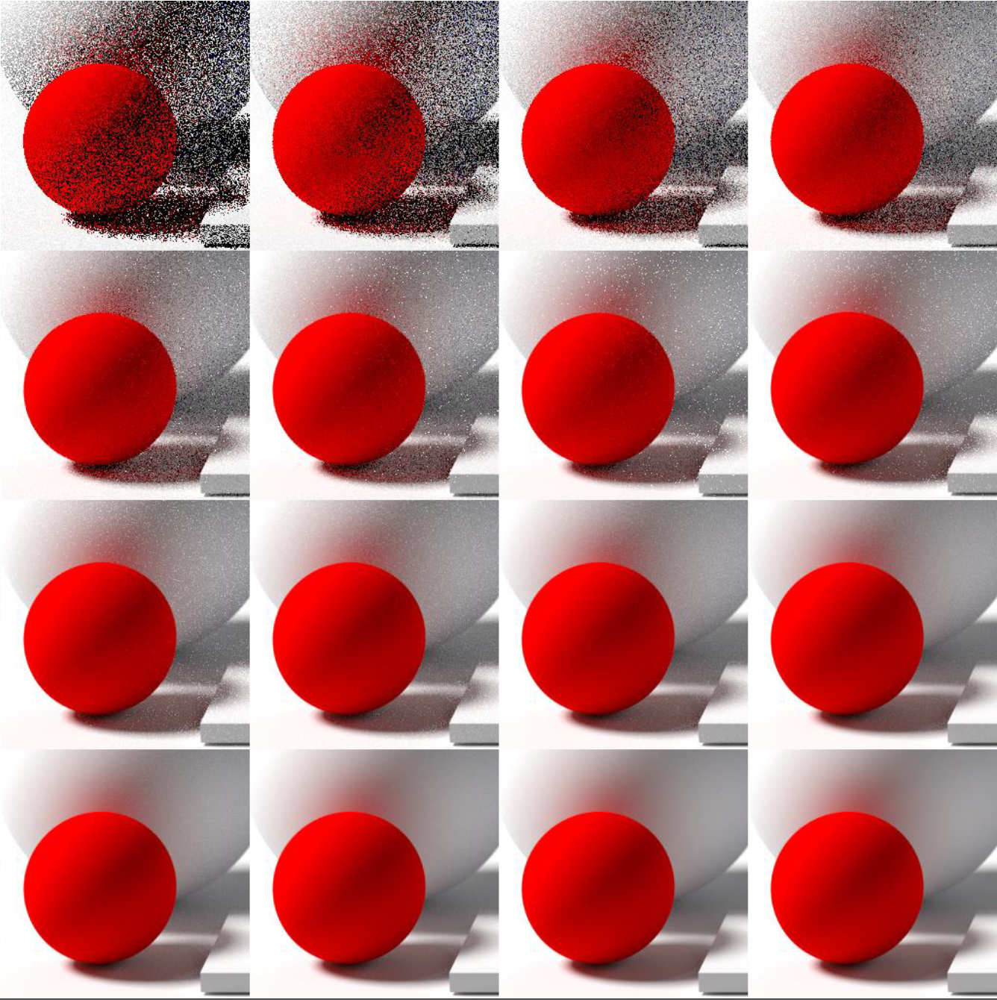
</div>

最简单的采样方式是**均匀采样**(uniform sampling)。但很显然，假如信号分布不均匀，如果采样率不高，均匀采样可能就会漏掉分布集中的信号。

<div style="text-align: center">
    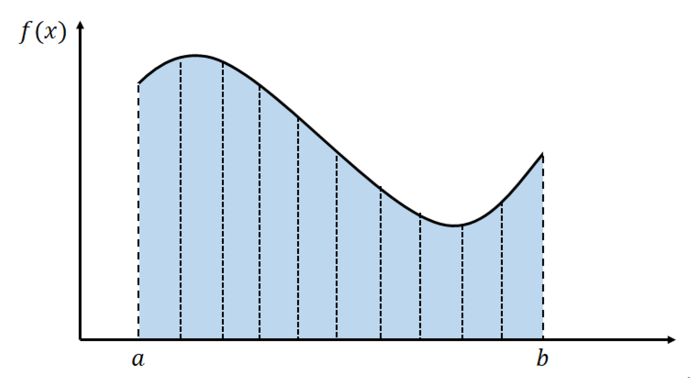
</div>

积分计算公式为：

$$
\begin{aligned}
\int_{a}^{b} f(x) \mathrm{d}x &= \lim_{n \to \infty} \frac{1}{n} \sum_{i=1}^{n} f(x_i)(b-a) \\
&= \lim_{n \to \infty} \frac{1}{n} \sum_{i=1}^{n} \frac{f(x_i)}{\textcolor{red}{\frac{1}{b-a}}}
\end{aligned}
$$

其中红色部分是**概率密度函数**(probability density function, **PDF**)，它描述了这个随机变量取特定值的相对可能性，数值越高表示被选中的可能性越大。这给我们的启示是：如果采样也按照这样的概率分布进行的话，那么少量采样点就有可能得到不错的近似结果。一般形式的公式如下：

$$
\int_a^b f(x) \mathrm{d}x \sim F_n(X) = \frac{1}{n} \sum_{k=1}^n \frac{f(X_k)}{\color{red}{PDF(X_k)}}
$$

<div style="text-align: center">
    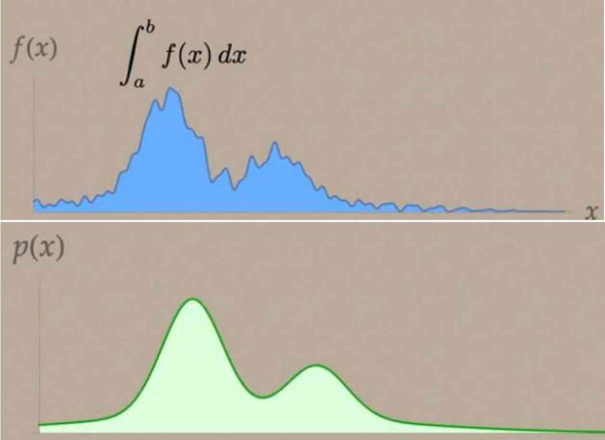
</div>

既然 PDF 可以是任意的，那么什么样的 PDF 能得到最佳采样效果呢？我们先将渲染方程表示成用蒙特卡洛积分法近似后的形式：

$$
L_{o}\left(p, \omega_{o}\right) \approx \frac{1}{N} \sum_{i=1}^{N} \frac{L_{i}\left(p, \omega_{i}\right) f_{r}\left(p, \omega_{i}, \omega_{o}\right)\left(n \cdot \omega_{i}\right)}{p\left(\omega_{i}\right)}
$$

其中 $L_{i}\left(p, \omega_{i}\right) f_{r}\left(p, \omega_{i}, \omega_{o}\right)\left(n \cdot \omega_{i}\right)$ 是被积函数，PDF 就是 $p(\omega_i)$。

- 均匀采样：$p(\omega_i) = \dfrac{1}{2\pi}$
- **余弦加权**(cosine-weighted)：$p(\omega_i) = \dfrac{\cos \theta}{\pi}$

    <div style="text-align: center">
        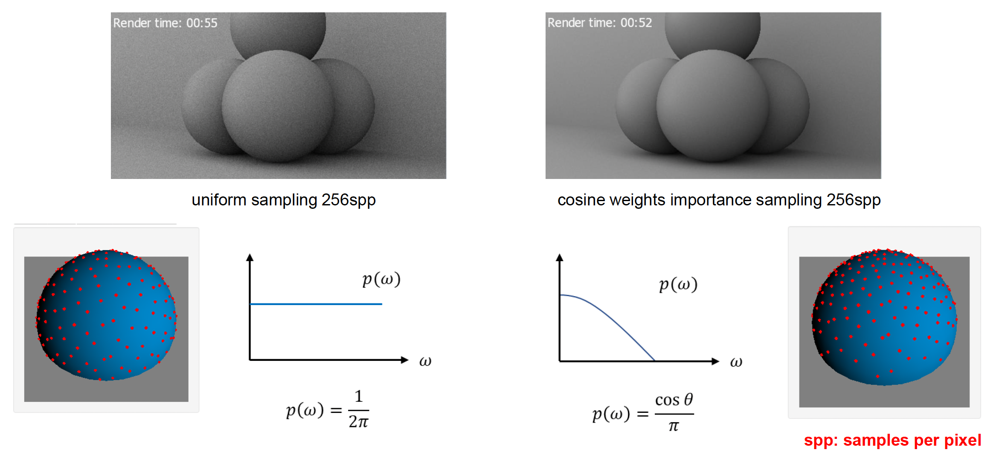
    </div>

    显然余弦加权取得更好的效果，因此采样点的分布会根据球形特征变化，比如球顶部分采样点会更密集些

- **GGX**：$p(\omega_i) = \dfrac{\alpha^2 \cos \theta}{\pi((\alpha^2 - 1) \cos^2 \theta + 1)^2}$

    <div style="text-align: center">
        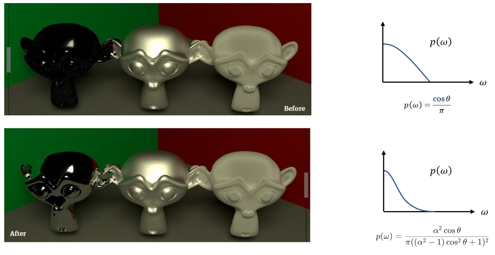
    </div>

    GGX 更适合表现高光效果


## Reflective Shadow Maps (RSM)

然而，基于蒙特卡洛积分的光线追踪只能进行离线渲染，难以满足实时渲染的需求。于是有人发明了一种叫做**反射阴影贴图**(reflective shadow map, RSM)的方法，它要做的是将光「注入」到场景中。整体思路如下：

>注：这和另一种渲染算法**光子映射**(photon mapping)很像。

- 阴影贴图上的每个像素都是一个间接光源

    <div style="text-align: center">
        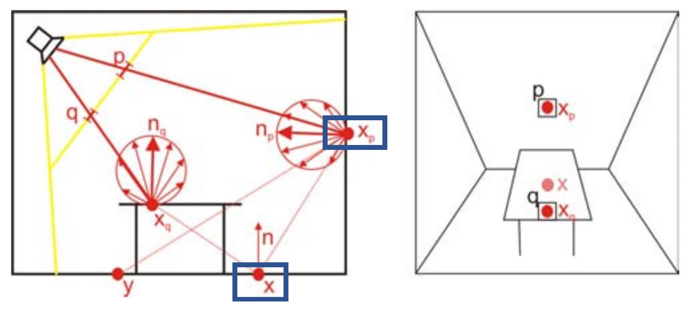
    </div>

- RSM 像素 $X_p$ 照亮位置 $x$ 的程度：

    $$
    E_{p}(x, n)=\phi_{p} \frac{\max \left\{0,\left\langle n_{p} \mid x-x_{p}\right\rangle\right\} \max \left\{0,\left\langle n \mid x_{p}-x\right\rangle\right\}}{\left\|x-x_{p}\right\|^{4}}
    $$

- 表面点 $x$ 处的间接辐照度可以通过累加所有像素光源的照明效果来近似计算（不考虑遮挡）

    $$
    E(x, n) = \sum_{\text{pixel } p} E_p(x, n)
    $$

    <div style="text-align: center">
        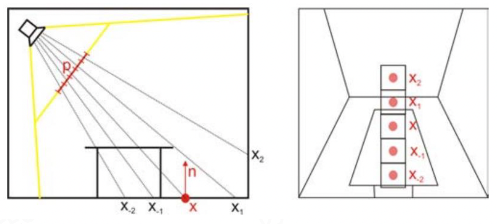
    </div>

- **锥体追踪**(cone tracing)：收集间接光照
    - 随机采样 RSM 像素
    - 预先计算这样的采样模式，并在所有间接光照计算中重复使用
        - 400 个采样点足够多了
        - 使用**泊松采样**以获得更均匀的样本分布（后来人们发现了更好的采样方法）

    <div style="text-align: center">
        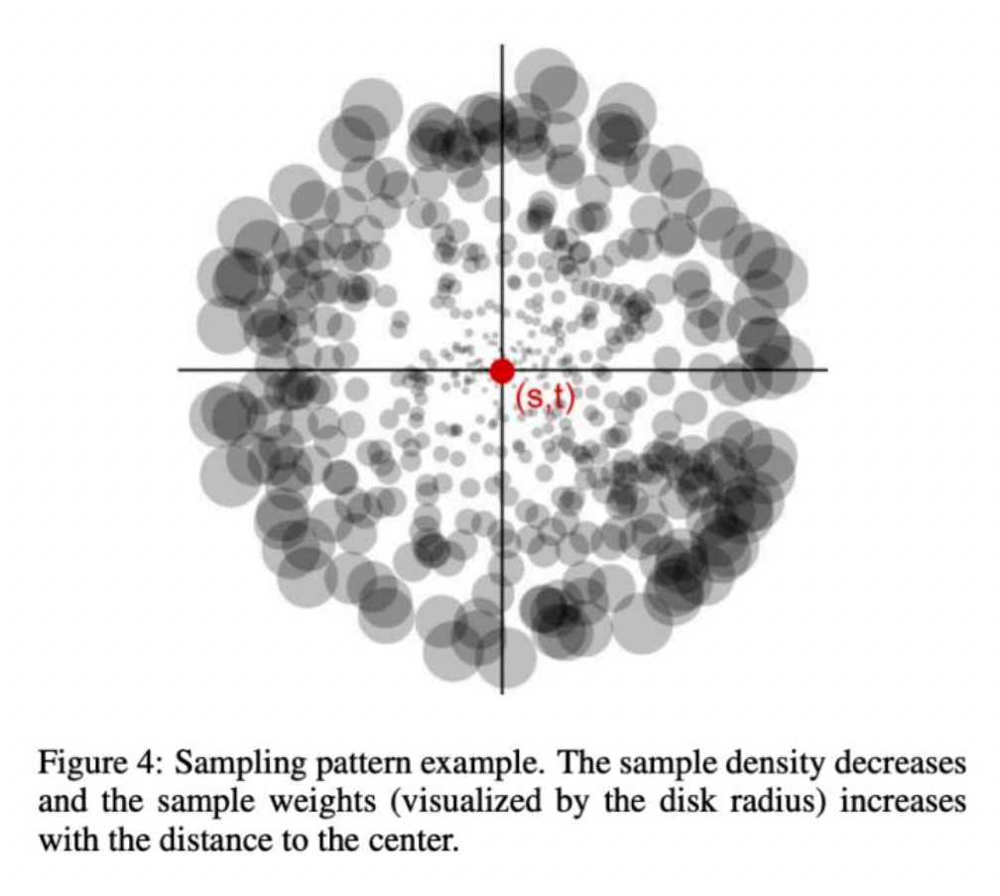
    </div>

- 使用**低分辨率**(low-res)的间接光照加速
    - 对于完整分辨率图像中的每个像素：
        - 获取其周围的四个低分辨率的采样点
        - 通过比较法线和世界空间位置进行验证
        - 双线性插值
    
    - 下图的红色像素表示对应采样点的法线差异过大的像素点，需要进行一次完整的采样

    <div style="text-align: center">
        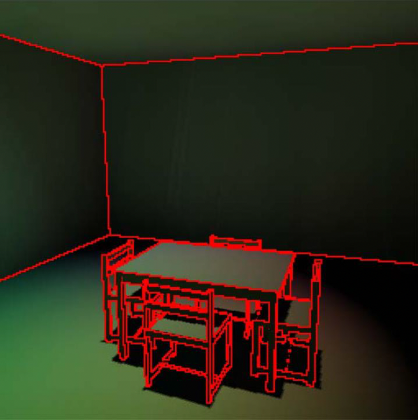
    </div>

???+ example "例子"

    <div style="text-align: center">
        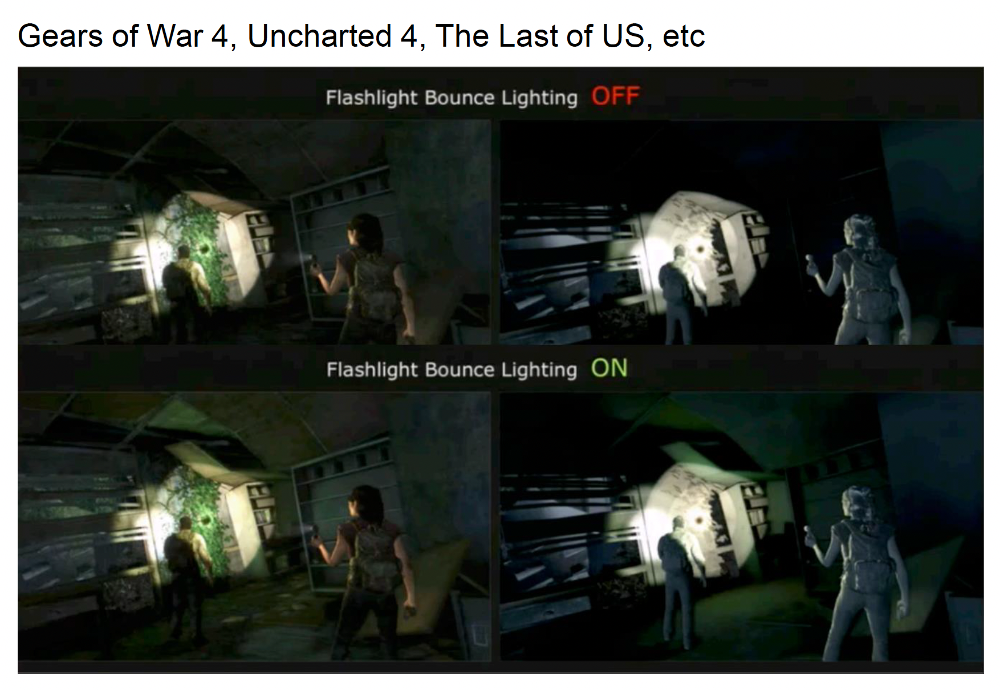
    </div>

???+ success "一些新颖的思路"

    - 容易实现
    - 使用 RSM 进行光子注射
    - mipmap 中的锥体采样
    - 带有误差检查的低分辨率间接光照

???+ bug "缺点"

    - 单次弹射
    - 不对间接光照进行可见性检查


## Light Propagation Volumes (LPV)

**光线传播体积**(light propagation volumes, **LPV**)技术最早引入于 CryEngine 3（2009）。

<div style="text-align: center">
    
</div>

其核心思路是：使用 3D 网格将辐射从直接照亮的表面传播到其他任何地方。

<div style="text-align: center">
    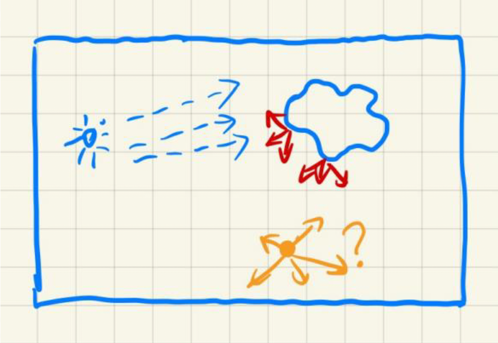
</div>

执行步骤如下（其中最关键的是第三步）：

1. 辐射点集场景表示的生成
2. 将虚拟光源点云注入到辐射体积中
    - 将场景预先细分为 3D 网格
    - 针对每个网格单元，定位其内部包含的虚拟光源
    - 汇总这些光源的方向性辐射分布
    - 投影至前两阶**球谐函数**（SH）（共 4 个系数）

    <div style="text-align: center">
        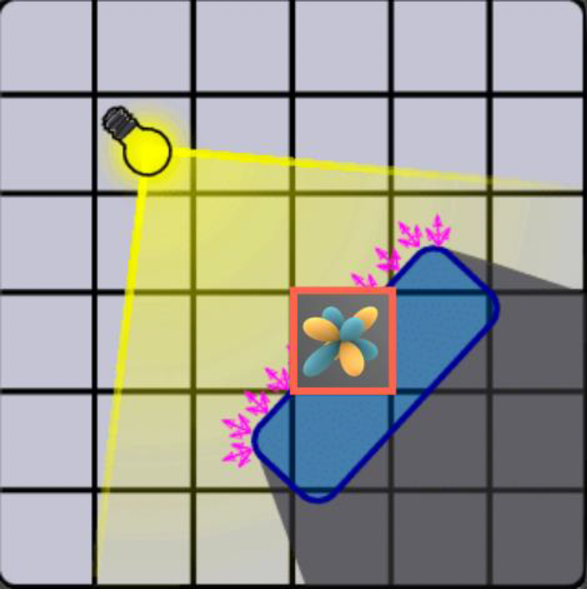
    </div>

3. **体积辐射传播**(volumetric radiance propagation)
    - 对于每个网格单元，收集其六个面接收到的辐射度
    - 进行求和，并再次使用 SH 表示
    - 重复此传播过程数次，直至体积达到稳定状态

    <div style="text-align: center">
        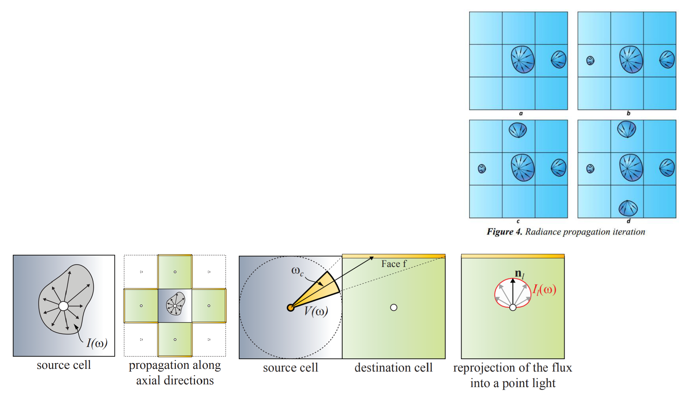
    </div>

4. 采用最终的光照传播体积进行场景照明

光的传播速度和范围和迭代次数有关：

<div style="text-align: center">
    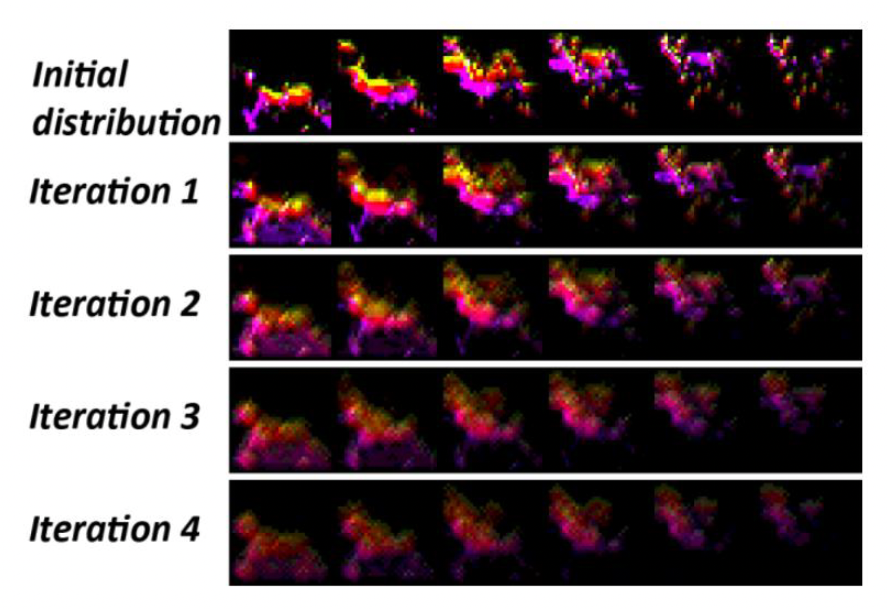
</div>

>注：该方法在物理学层面可能有不太严谨的地方。


### Sparse Voxel Octree for Real-time Global Illumination (SVOGI)

**用于实时全局光照稀疏体素八叉树**(sparse voxel octree for real-time global illumination, **SVOGI**)由 NVIDIA 某团队发明。以下是体素化的过程：

<div style="text-align: center">
    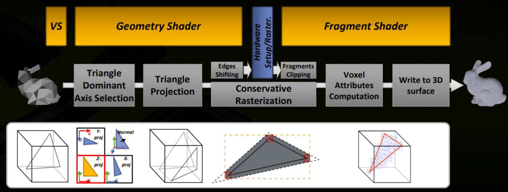
</div>

- **保守光栅化**(conservative rasterization)：保证再薄再小的三角形也能被体素化

收集表面体素：

<div style="text-align: center">
    
</div>

接下来的计算过程：

- 将辐照度(irradiance)注入体素中的光源
- 过滤八叉树内的辐照度

<div style="text-align: center">
    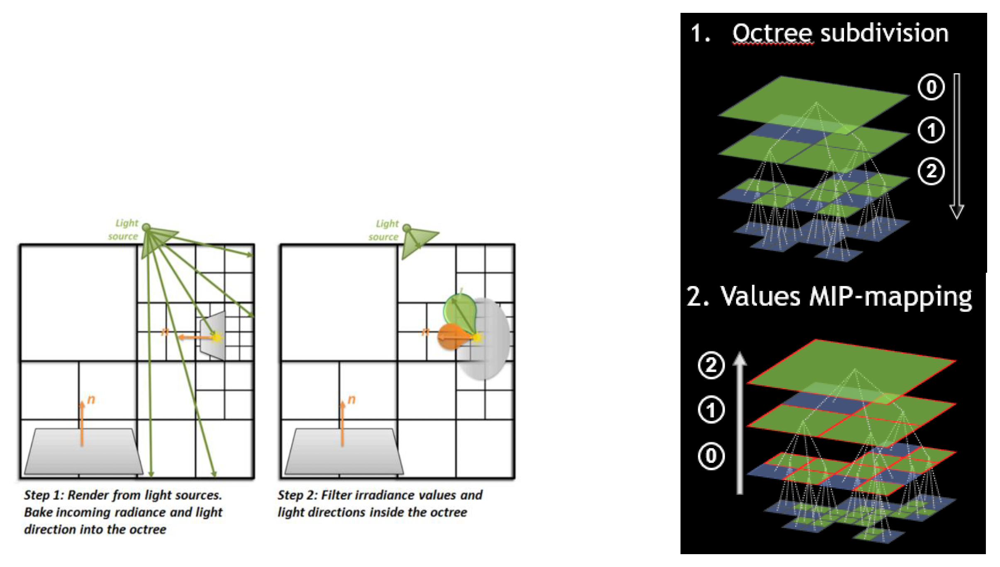
</div>

在八叉树内用**锥体**追踪来着色（对于来自相机的第 2 趟）：

- 基于漫反射 + 镜面 BRDF 发射若干锥体
- 根据锥体的（增长）尺寸在八叉树中进行查询

<div style="text-align: center">
    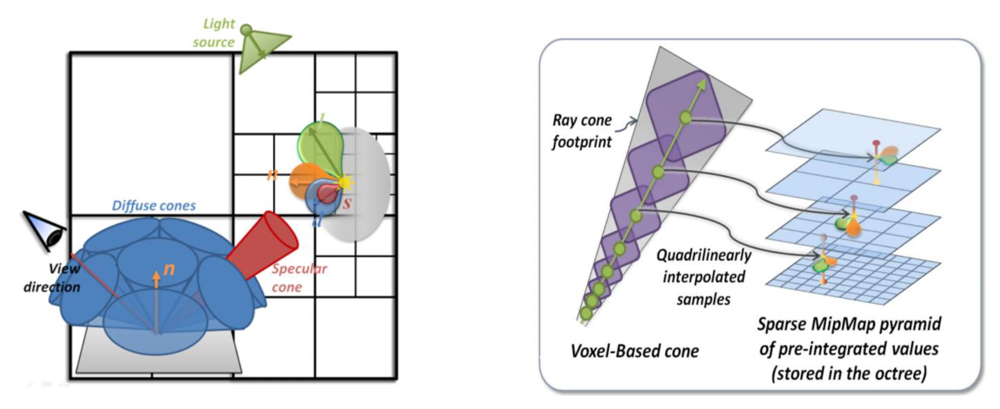
</div>

!!! bug "问题"

    数据结构过于复杂，难以在 GPU 上表达。


### Voxelization Based Global Illumination (VXGI)

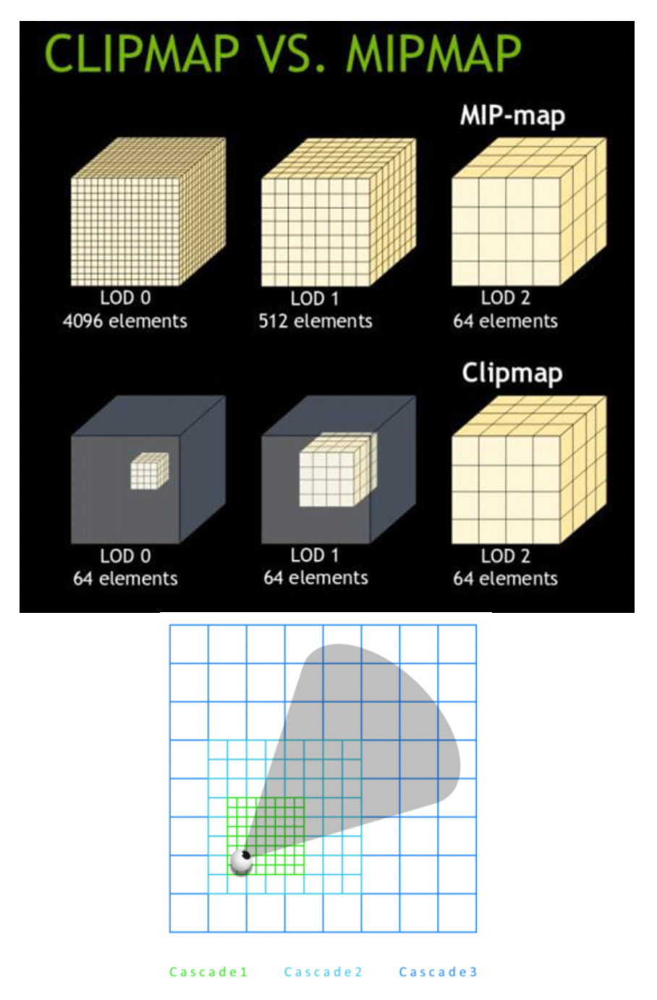{ align=right width=40% }

**基于体素化的全局光照**(voxelization based global illumination, **VXGI**)的特点：

- 将体素数据存储在裁剪图中
    - 多分辨率纹理
    - 靠近中心的区域具有更高的空间分辨率
    - 似乎自然地适用于锥体追踪需求

- 构建裁剪图比 SVO 更简单
    - 无需节点、指针等，由硬件处理
    - 从剪辑映射读取更为便捷

- 裁剪图尺寸为 (64~256)^3^，包含 3~5 级细节层次
    - 每个体素占用 16~32 字节 => 需要 12 MB~2.5 GB的显存

由于相机可能随时会动，所以体素会不断更新。为应对这一问题，我们采用环形寻址方法。

- 空间中的固定点始终映射到裁剪图中的同一地址
- 背景显示纹理地址：`frac(worldPos.xy / clipmapSize.xy)`

<div style="text-align: center">
    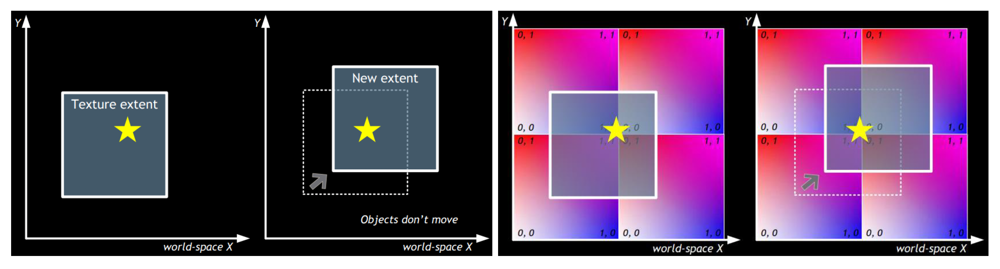
</div>

???+ example "例子"

    <div style="text-align: center">
        
    </div>

每个体素都是有一个不透明度的，所以光有可能会透过体素穿出。

- 存在一个三角形与一个体素
- 选择能产生最大投影面积的投影平面
- 使用 MSAA 技术对三角形进行光栅化，为每个像素计算覆盖掩码
- 获取 MSAA 采样点并将其重投影至其他平面
- 对所有被覆盖的采样点重复此过程
- 通过模糊所有重投影采样点来增厚处理结果

<div style="text-align: center">
    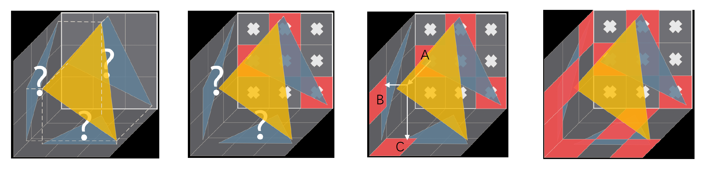
</div>

<div align=center markdown>
不透明度 = 覆盖的 MSAA 采样数 / MSAA 分辨率^2^
</div>

???+ example "直接覆盖的结果"

    <div style="text-align: center">
        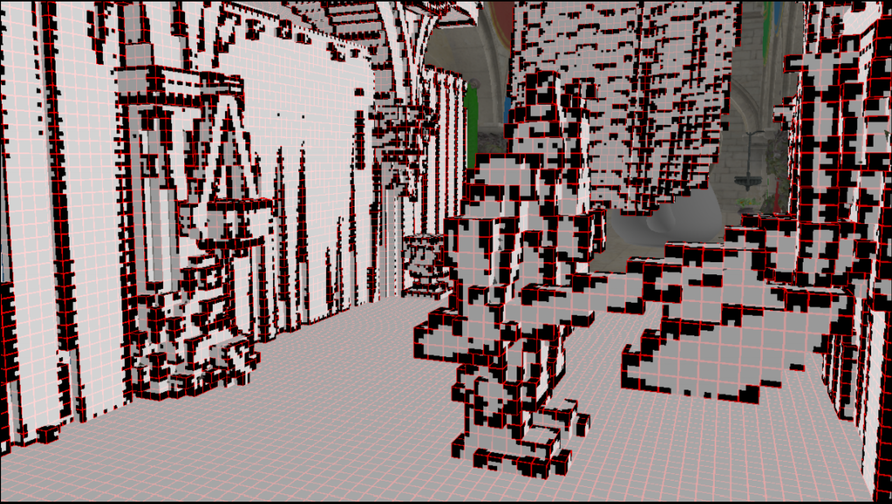
    </div>

光线注入

- 计算包含被直接光照亮的表面的体素的辐射度
- 从 **RSM** 中获取信息

<div style="text-align: center">
    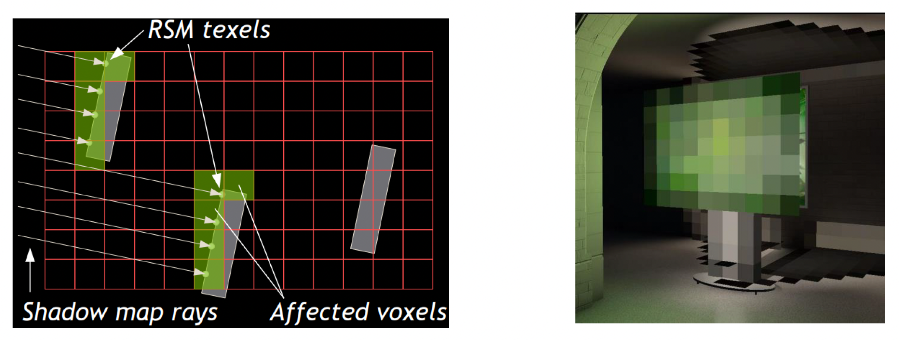
</div>

???+ example "例子"

    <div style="text-align: center">
        
    </div>

使用锥体追踪来着色（基于 BRDF 生成不同锥体）：

<div style="text-align: center">
    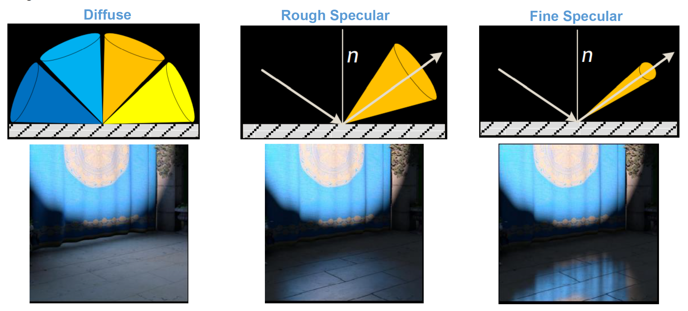
</div>

沿路径累积体素辐射度与不透明度：

$$
\begin{aligned}
C_{\mathrm{dst}} & \leftarrow C_{\mathrm{dst}}+\left(1-\alpha_{\mathrm{dst}}\right) C_{\mathrm{src}} \\
\alpha_{\mathrm{dst}} & \leftarrow \alpha_{\mathrm{dst}}+\left(1-\alpha_{\mathrm{dst}}\right) \alpha_{\mathrm{src}}
\end{aligned}
$$

<div style="text-align: center">
    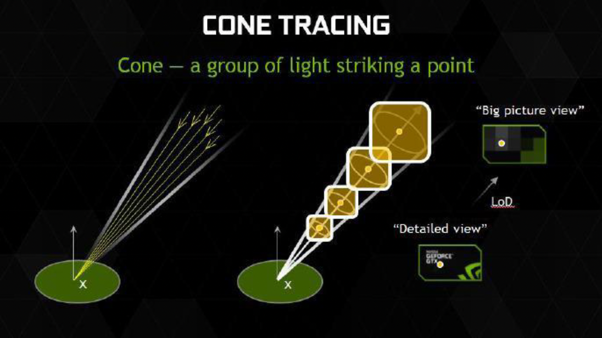
</div>

???+ example "例子"

    <div style="text-align: center">
        
    </div>

???+ bug "问题"

    - 不正确的遮挡（不透明度）：简单结合 alpha 混合 + 不透明度
    - **漏光**(light leaking)：当遮挡墙远小于体素大小时

    <div style="text-align: center">
        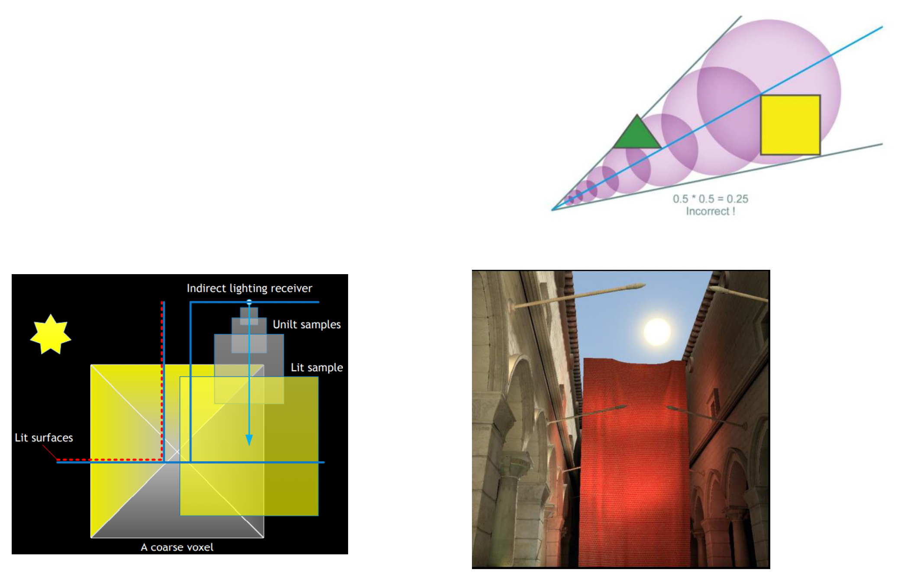
    </div>


## Screen Space Global Illumination (SSGI)

寒霜(Frostbite)引擎于 2015 年提出了**屏幕空间全局光照**(screen space global illuminatino, **SSGI**)技术。它的大致思路是复用屏幕空间上的数据。比如对于下图，由于地面潮湿，看起来像镜面一样，所以红框标出的建筑在地面上有了倒影（白框标出），这些倒影可直接利用红框标出的实际内容得到，无需重新创建。

<div style="text-align: center">
    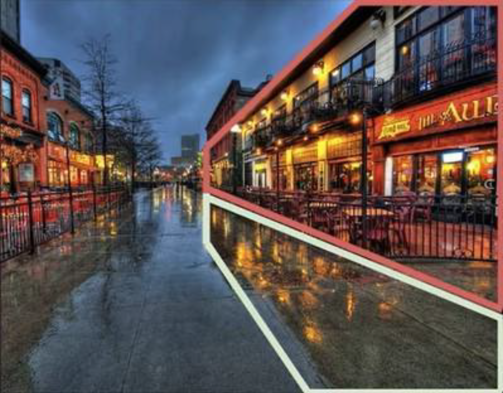
</div>

屏幕空间的辐射度采样（对于每个片元）：

1. 计算很多**反射光线**
2. 沿光线方向行进（在深度 gbuffer 中）
3. 使用**命中点的颜色**作为间接光照

<div style="text-align: center">
    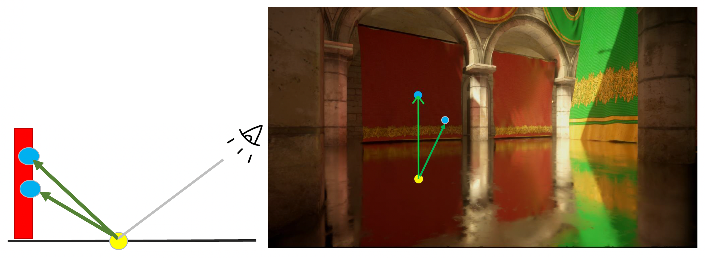
</div>

最简单的光线行进算法是线性光线行进：

- 一般步骤：
    - 以固定步长前进
    - 每一步检查深度值
- 特点：
    - 快速
    - 但可能会跳过较薄的物体

<div style="text-align: center">
    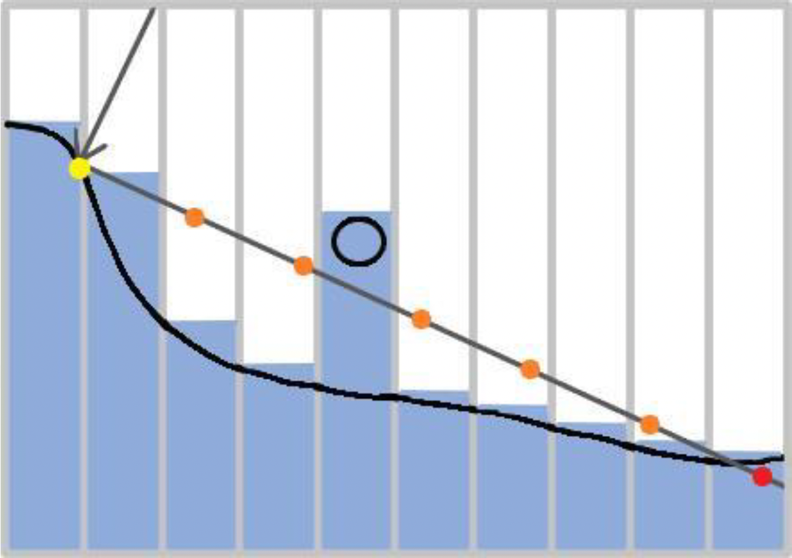
</div>

但更好的方法是采用**层级追踪**(hierarchical tracing)：

- 生成最小深度 mipmap

    <div style="text-align: center">
        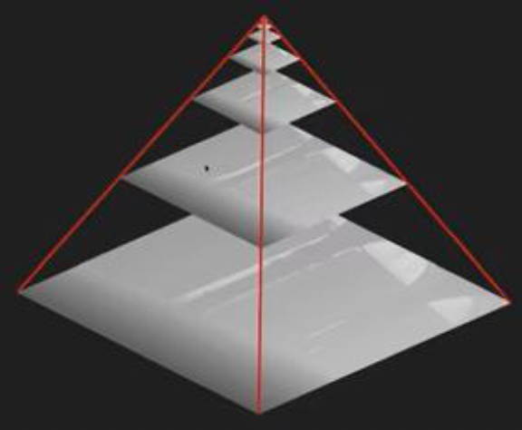
    </div>

- 无栈光线遍历最小深度 mipmap

    ```cpp
    level = 0;
    while (level > -1) {
        stepCurrentCell();
        if (above Z plane) level++;
        if (below Z plane) level--;
    }
    ```

???+ example "例子"

    <div style="text-align: center">
        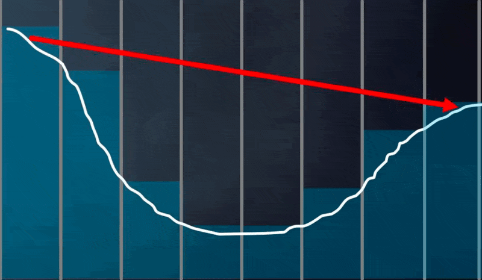
    </div>

另一个有意思的思路是对临近像素的光线复用：

- 存储**命中点数据**
- 假设相邻节点间的可见性相同
- 将**指向邻居命中点的光线**视为有效

<div style="text-align: center">
    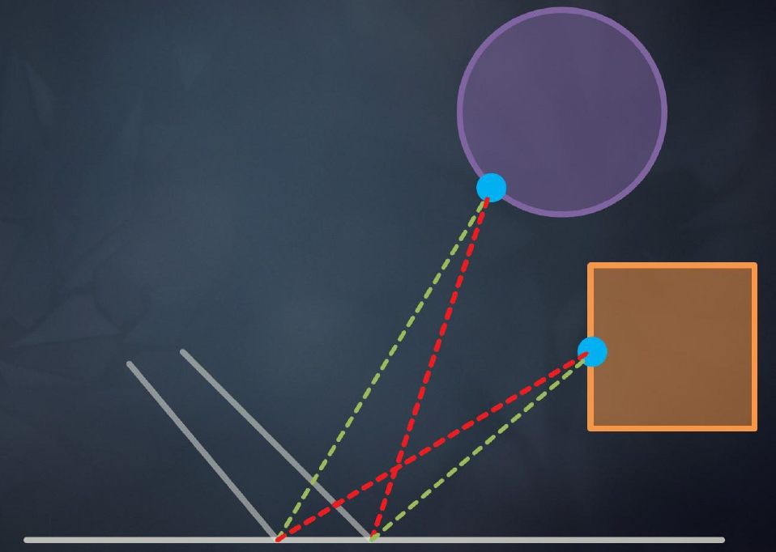
</div>

带有 mipmap 过滤的锥体追踪：

- 估算**锥体**在命中点的**足迹**(footprint)，包括粗糙度以及到命中点的距离
- 对颜色 mipmap 采样，mip 层级由**足迹**决定
- 对颜色 mipmap（金字塔）预过滤

<div style="text-align: center">
    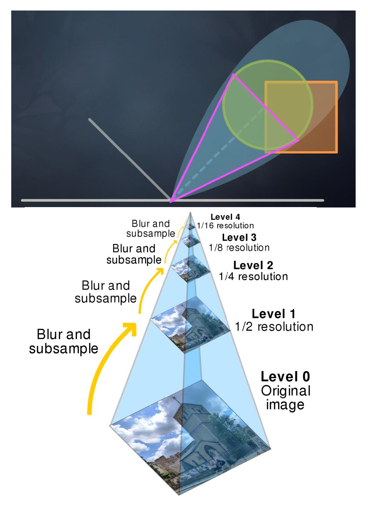
</div>

!!! success "优点"

    - 快速实现光泽和镜面反射效果
    - 质量优良
    - 无遮挡问题

    以下是 SSGI 的独特优势：

    - 易于处理近距离接触阴影
    - 精确命中点计算
    - 与场景复杂度解耦
    - 处理动态物体

!!! bug "缺点"

    - 屏幕外信息缺失
    - 邻近光线复用的可见性错误的影响

    <div style="text-align: center">
        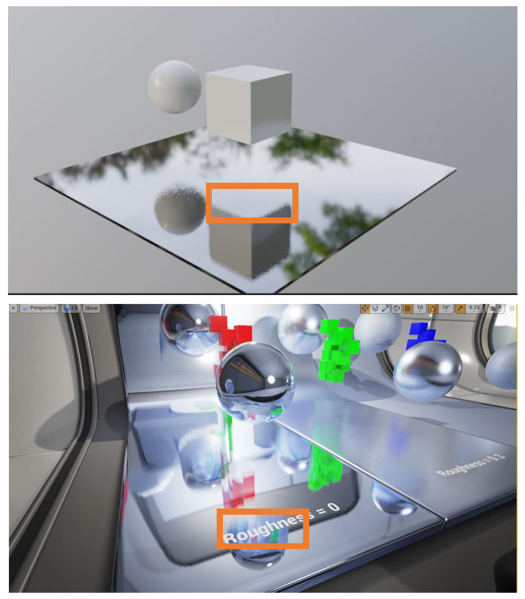
    </div>

    >以第一张图为例：立方体底部的倒影本该是黑色的，但由于屏幕空间中并没有黑色像素点，所以呈现出来的是白色。


## Lumen

???+ warning "光线追踪的挑战（我们为什么需要 Lumen？）"

    - 速度慢
        
        - 每个像素仅能负担 1/2 的光线
        - 但是高质量 GI 需要数百条光线
    
        <div style="text-align: center">
            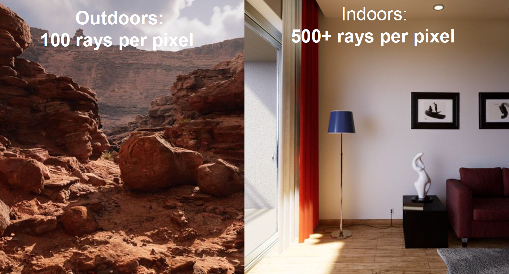
        </div>
    
    - 采样难
        
        - **辐照度场**(irradiance fields)
            - 漏光与过度遮挡
            - 探针放置问题
            - 光照更新缓慢
            - 独特的平面化外观
        
        - **屏幕空间去噪器**(screen space denoiser)
            - 许多复杂室内环境的渲染结果中噪点过多
            - 但噪点并非一直存在

        <div style="text-align: center">
            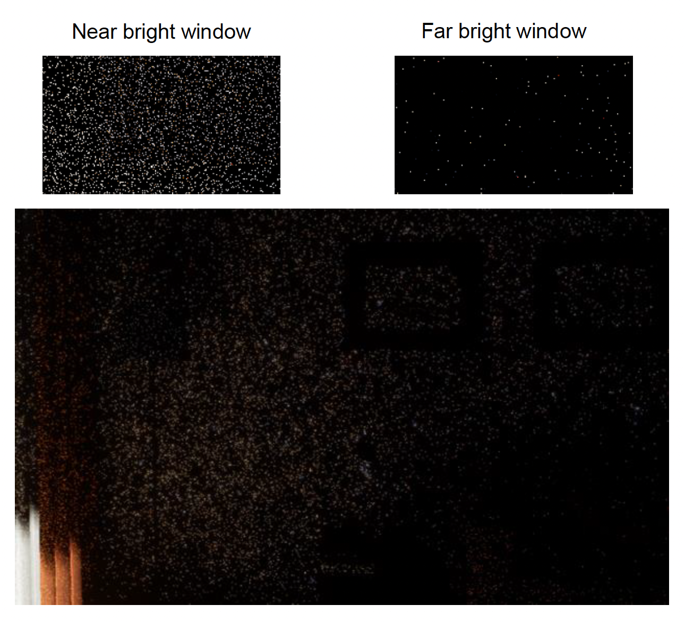
        </div>

        >远离窗口后，采样点数量骤降，滤波器也救不了一点。

        - 低分辨率过滤场景空间的探针照亮完整的像素

            <div style="text-align: center">
                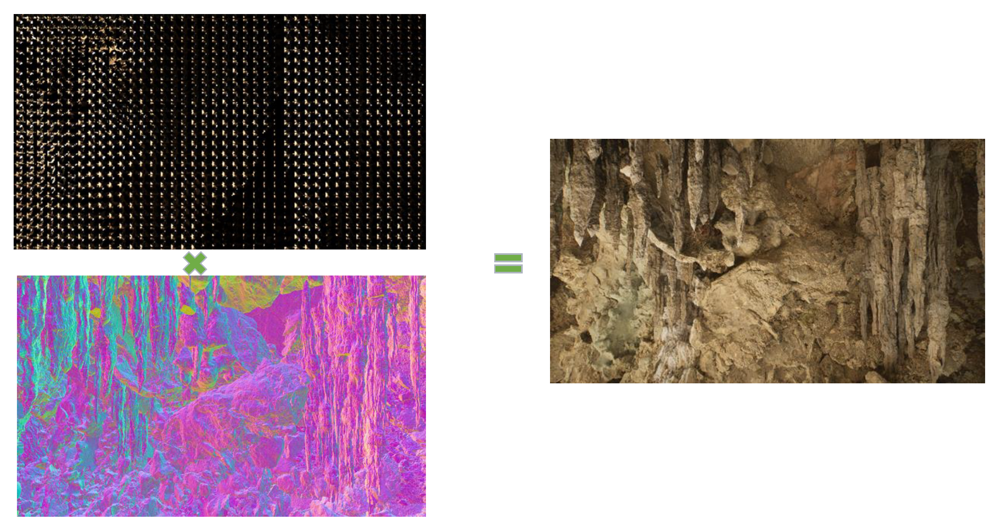
            </div>


### Phase 1: Fast Ray Trace in Any Hardware

第一个要面对的问题是在任何硬件设备上都能做到快速的光线追踪。为解决这一难关，Lumen 用到了**符号距离场**(signed distance field, **SDF**)。SDF 指的是每个点离最近表面的距离，并规定**内部**区域存储**负**距离（「符号」一词的来由）。不难想到，距离为 0 意味着该点就在表面上。

<div style="text-align: center">
    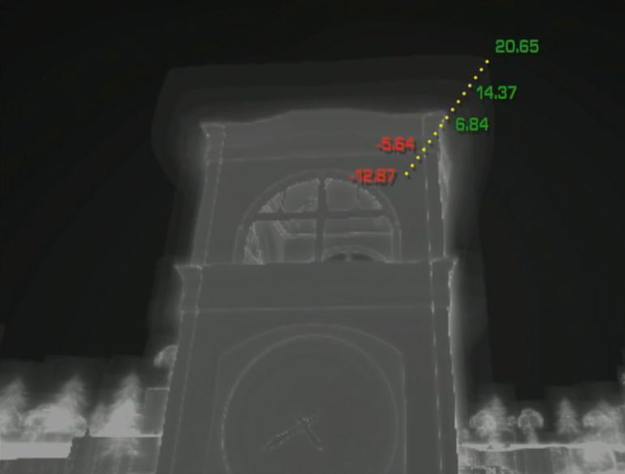
</div>


#### Mesh SDF

由于为整个场景存储 SDF 开销太大，因此只考虑为每个网格生成 SDF。

- 基于网格大小的分辨率
- Embree（Intel 开发的高性能光线追踪）点查询
- 追踪光线，并统计命中三角形背面的数量以确定符号（若超过 25% 的光线命中背面，则符号为负）

<div style="text-align: center">
    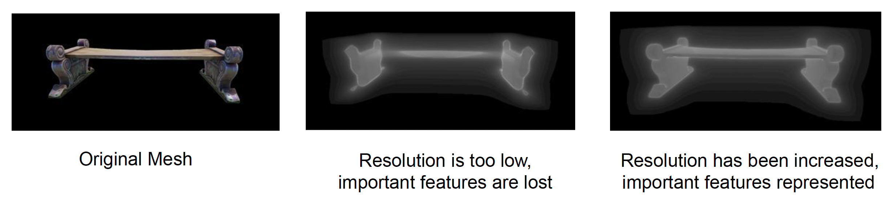
</div>

对于偏薄的网格，对其进行半体素扩张(half voxel expand)以解决漏光问题。不过由于引入了表面偏差，导致接触阴影丢失。尽管如此，过度遮挡总比漏光问题好一点。

<div style="text-align: center">
    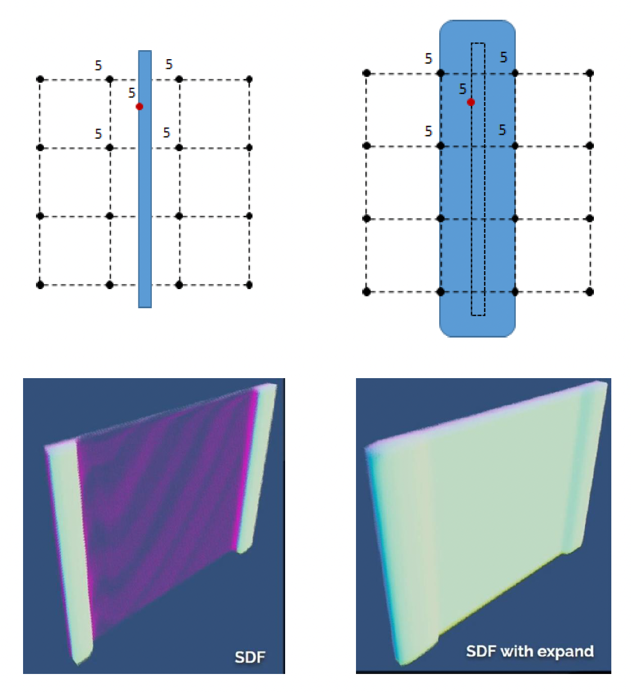
</div>

有了 SDF 后，光线追踪就变得更加高效了：光线与表面相交时，可根据距离跳过空的区域。

- 安全且快速
- 位于点 p 处时，只需行进 SDF(p) 的距离

<div style="text-align: center">
    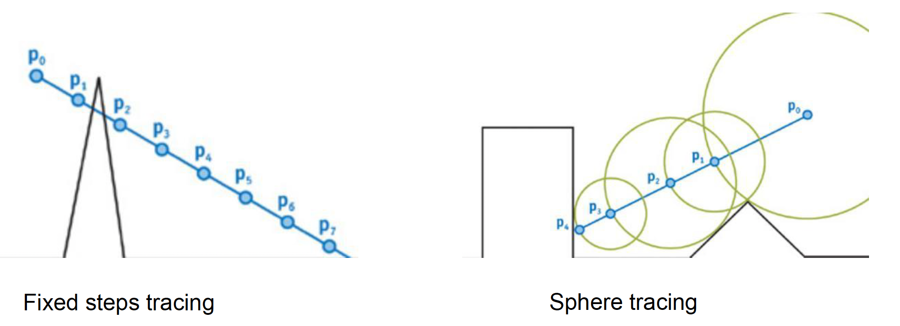
</div>

借助 SDF，**锥体追踪**的计算也变得高效，便于实现**软阴影**效果。

<div style="text-align: center">
    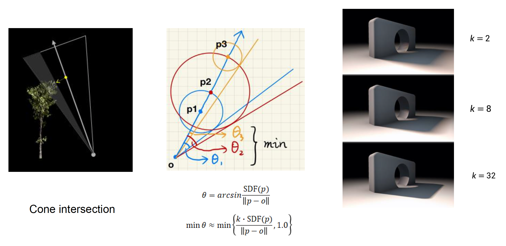
</div>

如果采样率很大，我们可以考虑用**稀疏的网格 SDF**，即将网格 SDF 划分成块，这有助于节省存储空间。

- 定义一个 `max_encode_distance`
    - 当任意的 `sdf(brick) > max_encode_distance` 时无效

- `IndirectionTable` 存储每个块的索引

    <div style="text-align: center">
        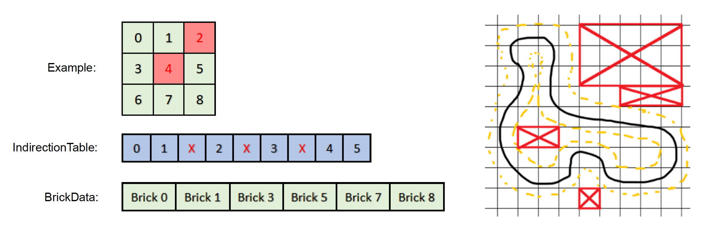
    </div>

我们还可以对网格 SDF 进行 **LOD** 操作

- GPU 收集每帧的请求
- CPU 下载请求，并流式调入/调出页面
- 生成 3 个 mip 层级
    - 始终加载最低分辨率，其余两个进行流式传输

<div style="text-align: center">
    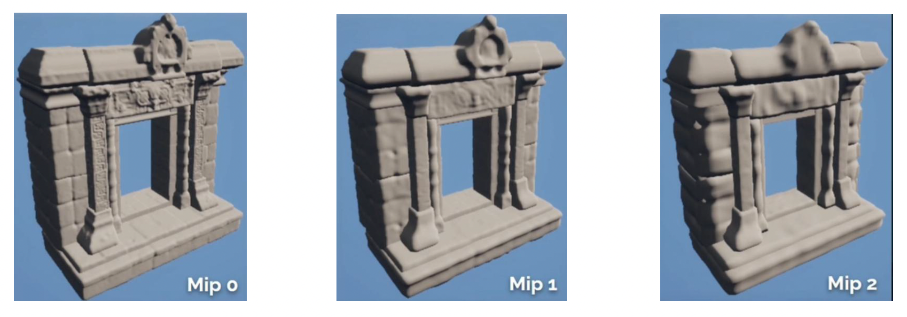
</div>

???+ example "例子"

    <div style="text-align: center">
        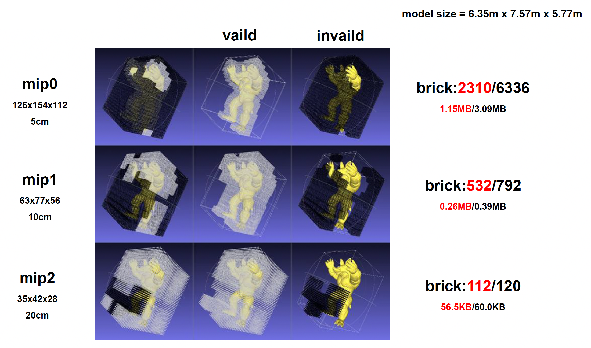
    </div>


#### Global SDF

虽然网格 SDF 能一定程度上减小开销，但是假如场景中存在很多物体，意味着存在大量网格，那么计算量还是特别大。

- 追踪相机射线并可视化步数

    <div style="text-align: center">
        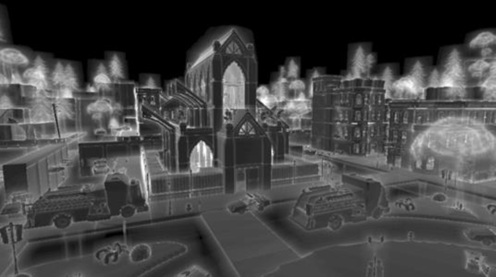
    </div>

- 每条射线上的命中物体的数量

    <div style="text-align: center">
        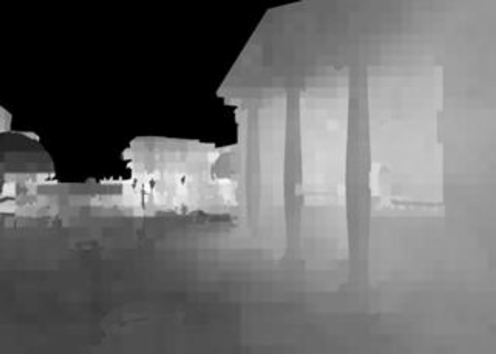
    </div>

解决方案是采用**全局 SDF**。它能表达出不精确的近表面，因为仅在锥体开头对物体 SDFs 采样，剩余部分用的就是全局 SDFs。采用全局 SDF 能大幅降低重叠对象的追踪成本。

???+ example "例子"

    右图便是用到全局 SDF 的效果：

    <div style="text-align: center">
        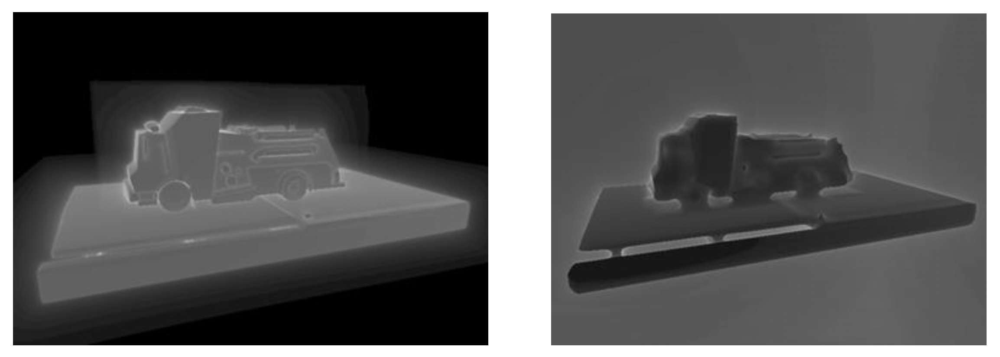
    </div>

    <div style="text-align: center">
        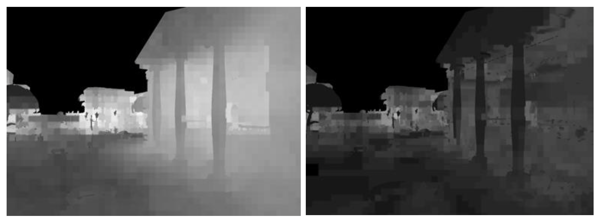
    </div>

我们可以**缓存**相机周围的全局 SDF。

- 围绕相机设置 4 个裁剪图
- 裁剪图随移动而滚动
- 远处裁剪图的更新频率较低
- 同时采用稀疏存储（节省约 16 倍的内存）

<div style="text-align: center">
    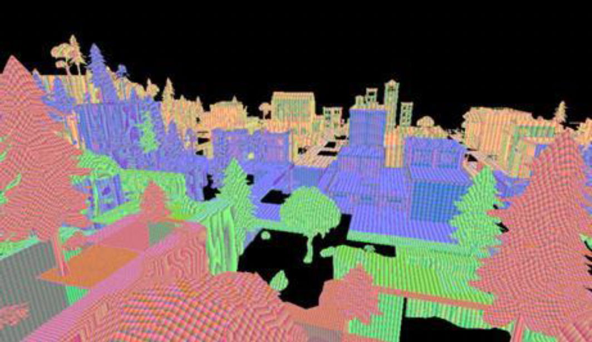
</div>


### Phase 2: Radiance Injection and Caching

通过**网格卡片**(mesh card)技术，沿轴对齐方向（AABB）对物体的六个面拍摄六张快照，获取其光照信息。

<div style="text-align: center">
    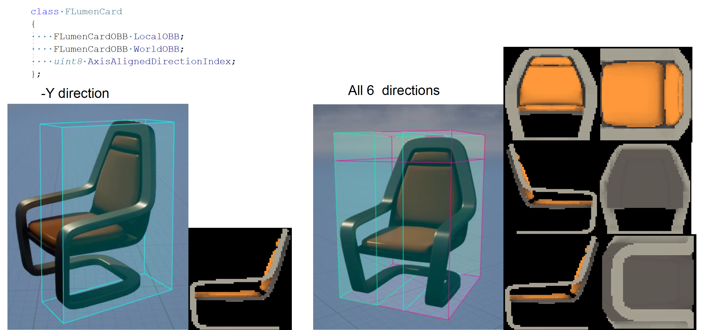
</div>

???+ example "例子"

    <div style="text-align: center">
        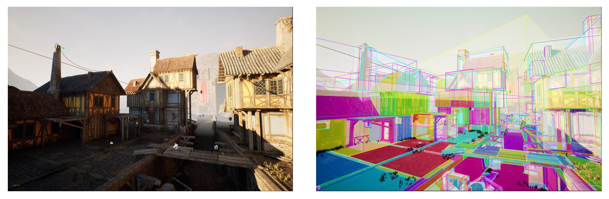
    </div>

接下来根据卡片结果来生成表面数据的缓存，该过程分为两趟：

- 第一趟：卡片捕捉
    - 固定每帧的纹素预算（512x512）
    - 按与摄像机的距离及 GPU 的反馈顺序排序
    - 捕获分辨率取决于卡片在屏幕上的投影（LOD），离相机近分辨率越高

    <div style="text-align: center">
        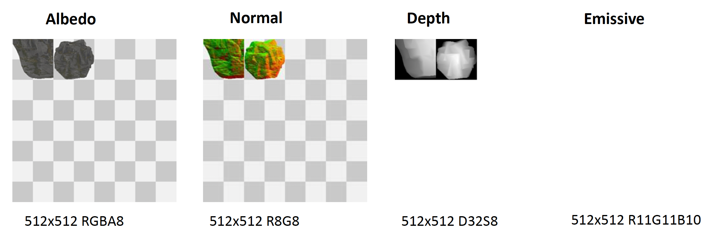
    </div>

    >Albedo：反射率。

    - 表面缓存的大小为 4096x4096，里面有多个 128x128 大小的物理页，在里面把每一个网格实例打包好
        - 若卡片捕捉 >= 128x128，将其划分为多个 128x128 的物理页
        - 否则从 128x128 的物理页中分配一部分给它

        <div style="text-align: center">
            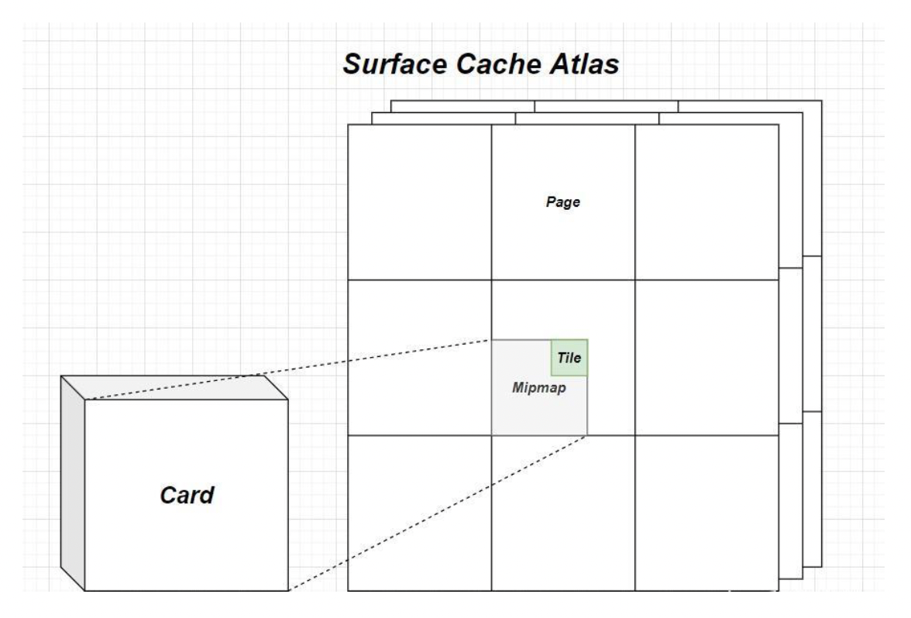
        </div>

- 第二趟：将卡片复制到表面缓存并压缩

    <div style="text-align: center">
        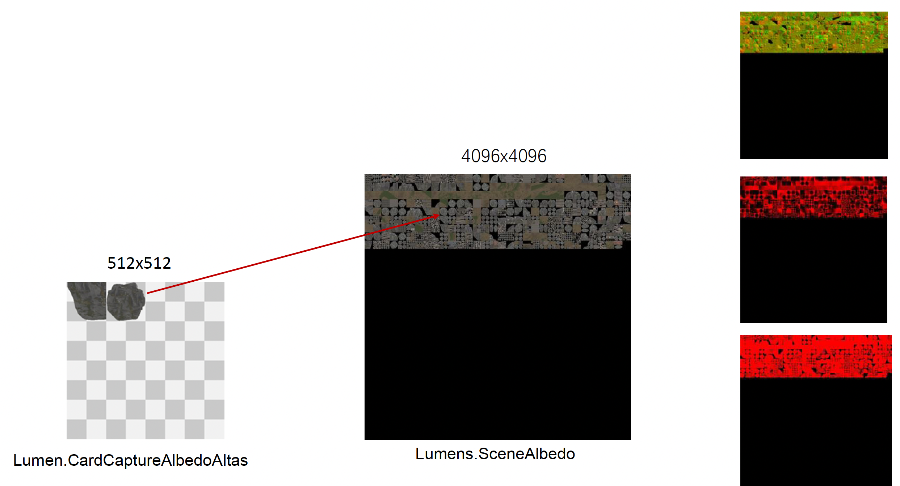
    </div>

    <div style="text-align: center">
        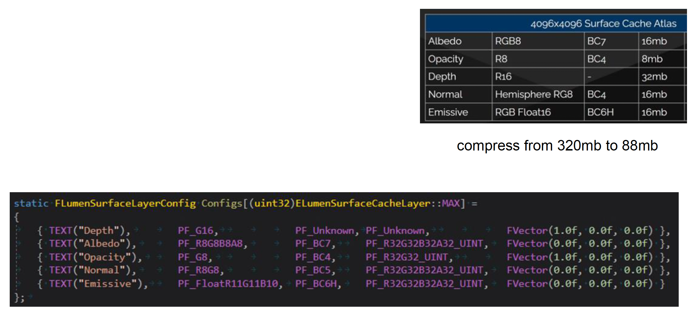
    </div>

接下来得考虑如何固定表面缓存中的光照。在计算命中点光照的时候，我们会遇到两个问题：

- 像素是否在阴影中
- 如何处理光线的多次弹射

Lumen 的解决流程如下（简化版）：

<div style="text-align: center">
    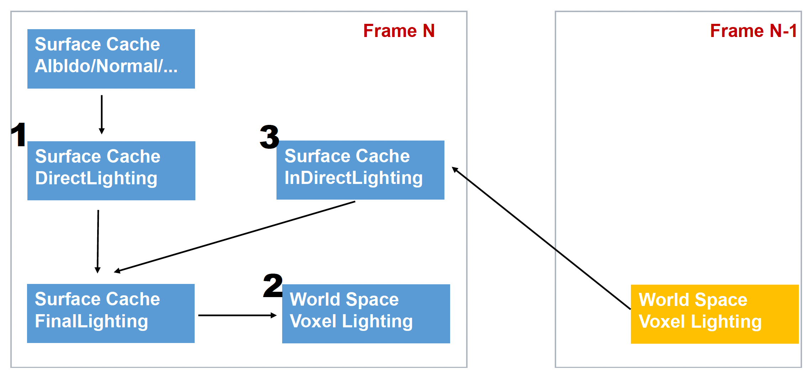
</div>

1. 根据表面缓存（和阴影贴图）计算每个像素的直接光照
    - 将 128x128 的页划分为 8x8 的块
    - 使用 8x8 的块来剔除光源
    - 每个块选择前 8 个光源
    - 1 位阴影掩码

    <div style="text-align: center">
        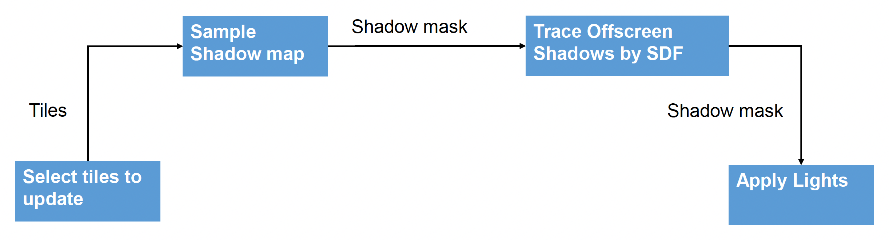
    </div>

    - 假设一个块可以被多个光源照亮，那么可叠加光照效果

        <div style="text-align: center">
            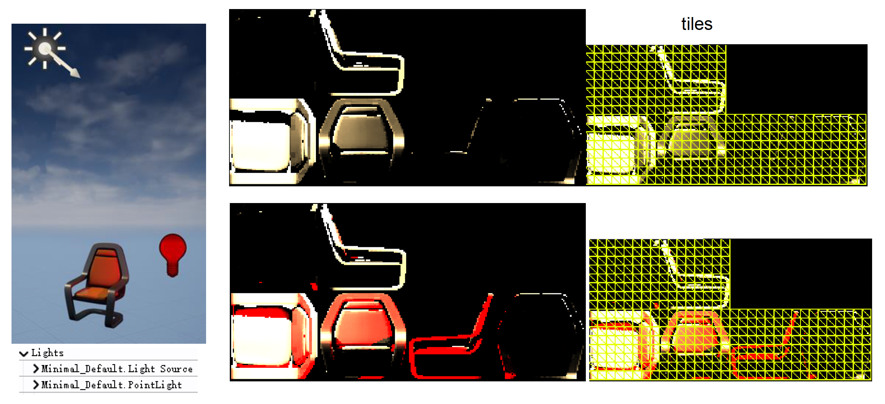
        </div>

2. 在世界坐标中计算上一帧的体素光照
3. 得到的最终光照作为下一帧计算的依据

对于场景中较远的点，要知道光源命中该点时会进过哪些物体是比较困难的事，因为远处物体用到的是**全局 SDF**，它不记录网格信息，只记录命中位置和法线。因此使用体素光照来采样的结果如下：

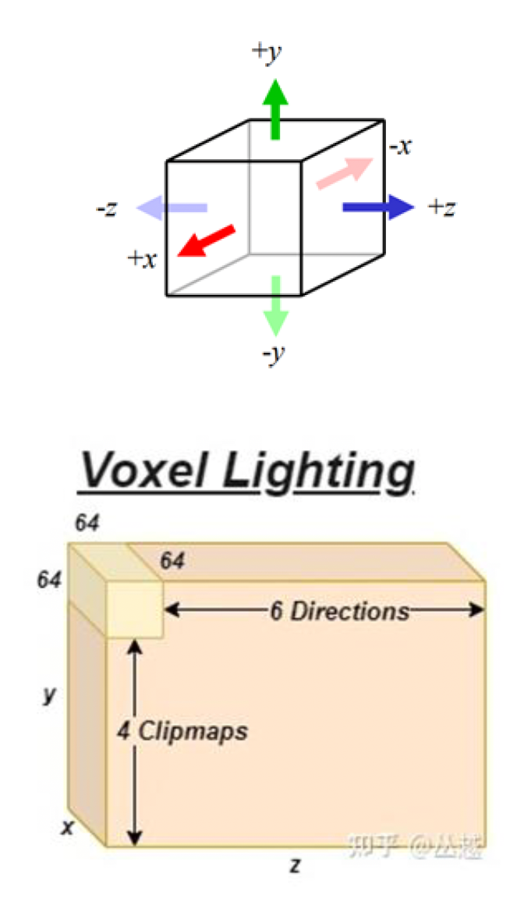{ align=right width=25% }

<div style="text-align: center">
    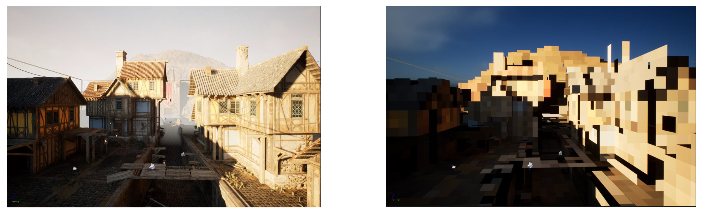
</div>

解决方法是构建对于整个场景的辐射度缓存的体素裁剪图，具体来说是构建大小为 64x64x64 的 4 级裁剪图：

- 存储每个体素在 6 个方向上的辐射度
- 对法线采样并沿 3 个方向插值
- 裁剪图 0 覆盖 50 立方米的体积，且体素尺寸为 0.78 米
- 存储在 3D 纹理中

裁剪图更新频率的规则：

||裁剪图0|裁剪图1|裁剪图2|裁剪图3|
|:-|:-|:-|:-|:-|
|起始帧|0|1|3|7|
|更新间隔|2|4|8|8|

然后通过**短射线投射**(short ray cast)来构建纹素面：

- 在每个体素上沿 6 个方向追踪网格 DF
- 记录命中网格的 ID 和命中距离
- 射线起点 = 体素中心 - 轴向单位向量 × 体素半径
- 射线终点 = 体素中心 + 轴向单位向量 × 体素半径

<div style="text-align: center">
    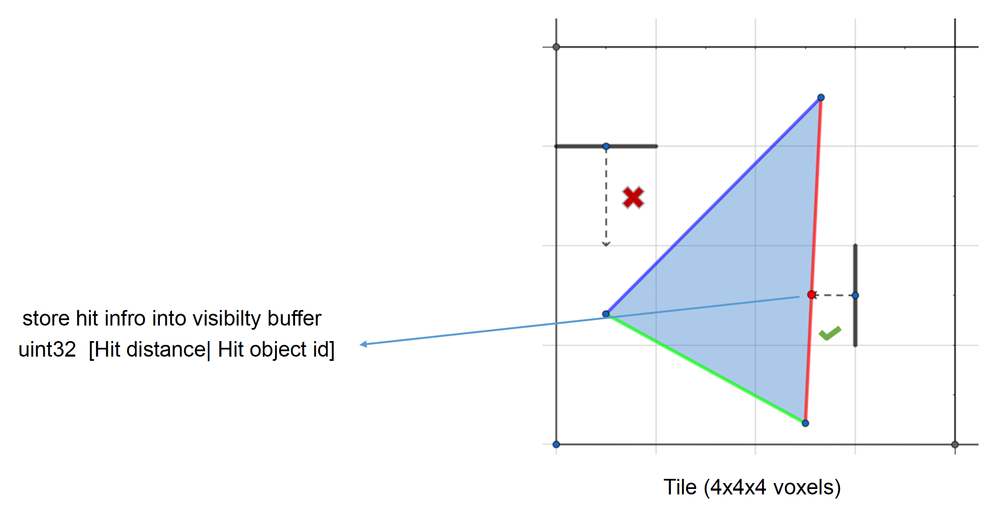
</div>

接下来将空间划分为 4x4x4 的块(tile)，以滤除大多数物体。

<div style="text-align: center">
    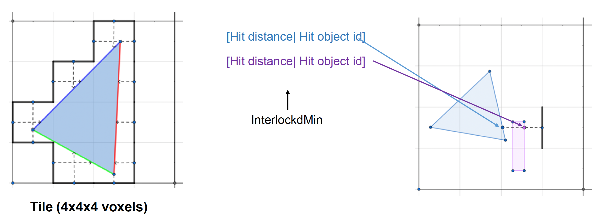
</div>

目前我们已经求出了空间中体素的表达和光线命中点，于是下一步便是求体素受到的光照，也就是将光注入到裁剪图中。

- 清除整个 Clipmap 中的所有体素光照
- 压缩 Clipmap 中所有有效的 VisBuffer
- 从 VisBuffer 中采样 FinalLighting 并注入光照

<div style="text-align: center">
    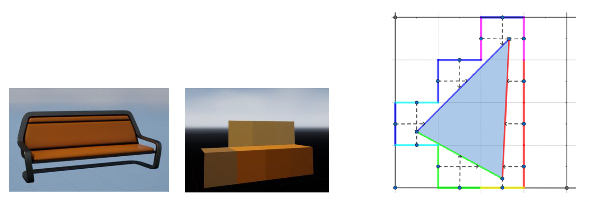
</div>

!!! warning "后面不想写了"

    因为我的理解能力有限 + 个人感觉后面实在讲的太乱了，所以实在没动力整理下去了 QAQ。也许后面会补上？


### Phase 3: Build a lot of Probes with Different Kinds

#### Screen Space Probe

#### Importance Sampling

#### Denoising and Spatial Probe Filtering

#### World Space Probes and Ray Connecting


### Phase 4: Shading Full Pixels with Screen Space Probes