# Introduction

这门课程的主题是「**实时高质量渲染**」(real-time high quality rendering)，属于比较进阶的内容。下面分别解释主题中的三个关键词：

- **实时**：
    - **速度**：通常要快于 **30 FPS**（帧每秒），在虚拟/增强现实领域的要求更高（>= 90 FPS）
        - 交互式(interactive)：每秒只有几帧
    
    - **互动性**(interactivity)：每一帧都需要**在线**(on the fly)生成

- **高质量**：
    - **真实感**(realism)：使渲染更加真实的高级方法
    - **可靠性**(dependability)：总是**正确（精确/近似）**，对（无法控制的）失败（瑕疵(artifact)）零容忍

- **渲染**：在三维场景（网格、光照等）中计算光是如何从光源发出，进入到人眼中，形成一幅图像

    

        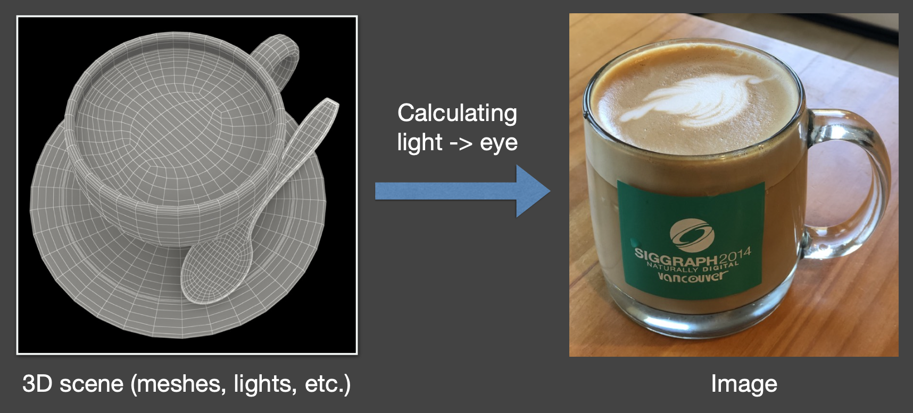
    

本课程主要涉及到以下四个关于实时渲染的大主题：

- **阴影**(shadow)
- **全局光照**(global illumination)（场景/图像空间，预计算）
- **基于物理的着色**(physical-based shading)
- **实时光线追踪**(real-time ray tracing)

在这些大主题中，我们又会详细探讨以下话题：

- 阴影(shadow)和**环境映射**(environment mapping)（环境光）

    

        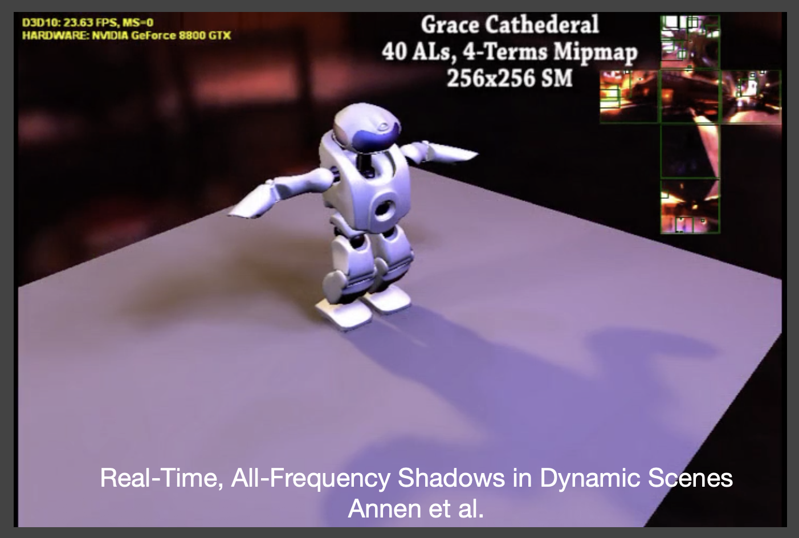
    

- **交互式全局光照技术**(interactive global illumination techniques)
    
    

        
    

- **预计算辐射传输**(precomputed radiance transfer)
    - 球面谐波函数，需大量存储
    - 下面是闫老师若干年前写的 demo（跑在远古的 GTX 780 上，那时候的硬件还不支持光线追踪加速...）

    

        
    

- 实时光线追踪

    

        
    

- **参与介质渲染**(participating media rendering)、**图像空间效果**(image space effects)等

    

        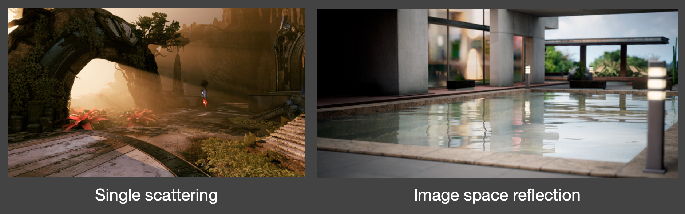
    

- **非真实感渲染**(non-photorealistic rendering)
    - 服从于艺术效果，具有非科学性
    - 本课程不会深入探讨这一话题

    

        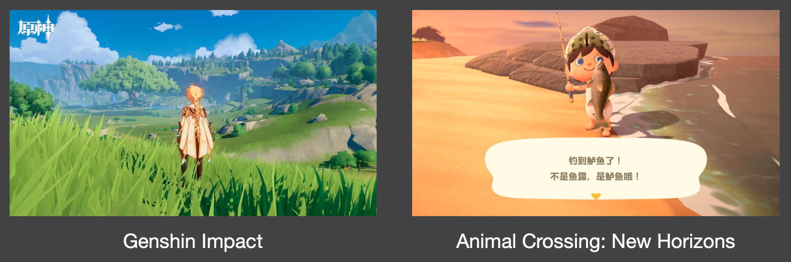
    

- **反走样**(antialiasing)和**超采样**(supersampling)
    - 代表技术：时间反走样、DLSS

    

        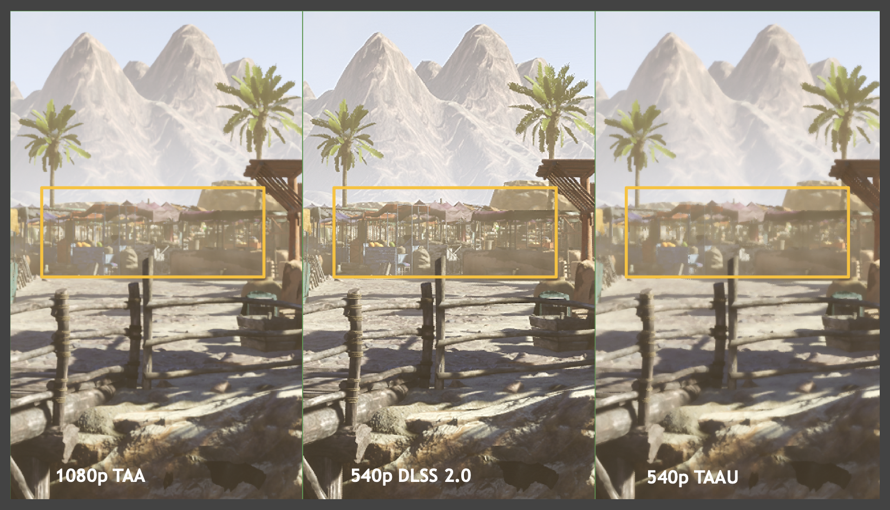
    

- 聊聊前沿技术

    

        
    

- 聊聊游戏

    

        
    

!!! failure "这门课**不会**讲什么"

    - 使用游戏引擎（比如 UE）进行 3D 建模或游戏开发
    
        

            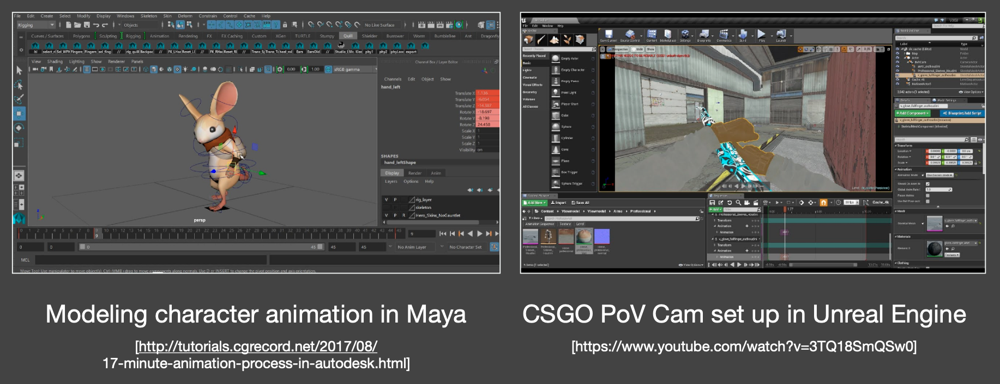
        

    
    - 在电影/动画行业中用到的昂贵（但更准确）的光传输技术（**离线渲染**）
    
        

            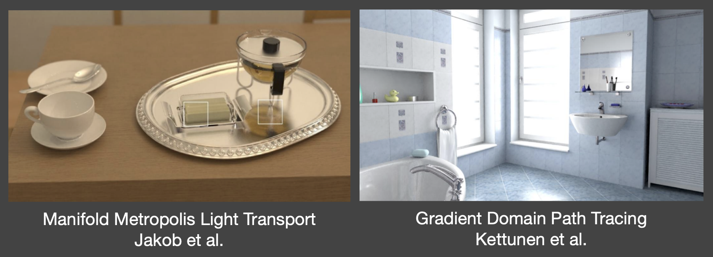
        

    
    - 神经网络渲染(neural rendering)（无法做到「实时」和「高质量」）

        

            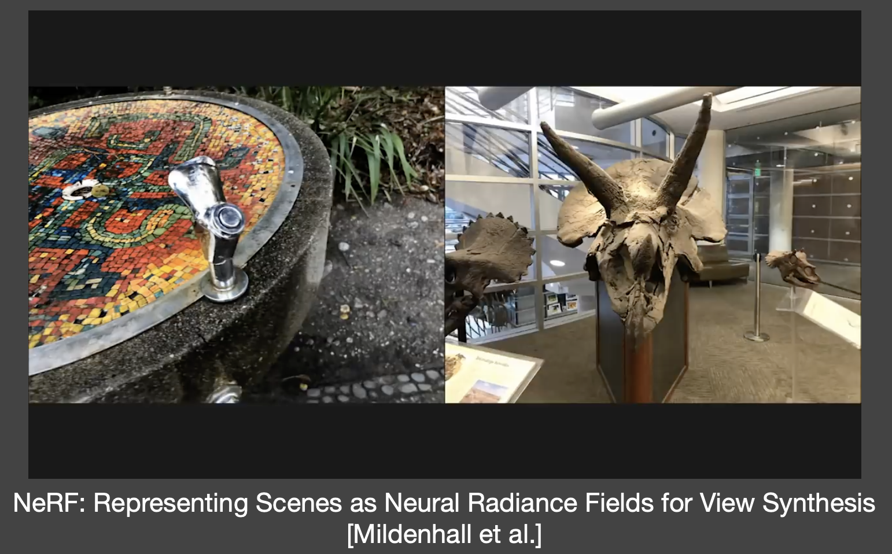
        

        >其实现在还有更吊的 3DGS 和 2DGS（之前做 CV 大作业的时候了解过）。

    - 使用特定的图形学 API（比如 OpenGL）
    - 场景/着色器优化
    - 着色器逆向工程（~~也违背道义~~）
    - 高性能渲染，比如 CUDA 编程

???+ note "如何学习这门课程？"

    - 理解科学与技术的不同
        - 科学 == 知识
        - 技术 == 将科学转换为产品的工程技能
    - 实时渲染 = 快速且近似的离线渲染 + 系统工程
    - 一个事实：在实时渲染领域，业界（封闭、知识产权）总是领先于学界
    - 熟能生巧
    - 建议倍速观看视频（~~我直接提取字幕阅读的，连视频都没看（doge）~~）

??? question "为什么要学这门课程？"

    依旧：

    

    Computer Graphics is **AWESOME**!
    

    >这也是笔者为什么想从事相关行业的原因。

## Motivation

如今，我们可通过计算机图形学生成**逼真的**(photorealistic)图像。

- 涉及到复杂的几何、光照、材质、阴影
- 计算机生成的电影/特效，使我们难以或无法区分什么是真实的，什么是渲染出来的

    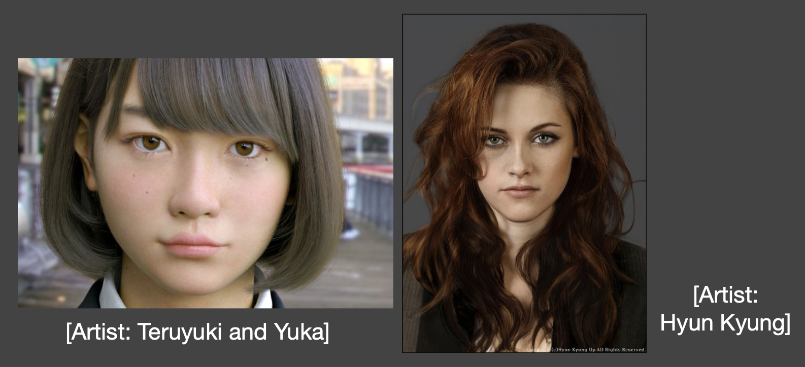

但是这些准确的算法（尤其是光线追踪）跑起来**非常慢**，所以它们被称为**离线渲染**方法。以《疯狂动物城》为例，影片中的 1 帧画面在一个 GPU 核心上需要花 10000h 时间渲染！

    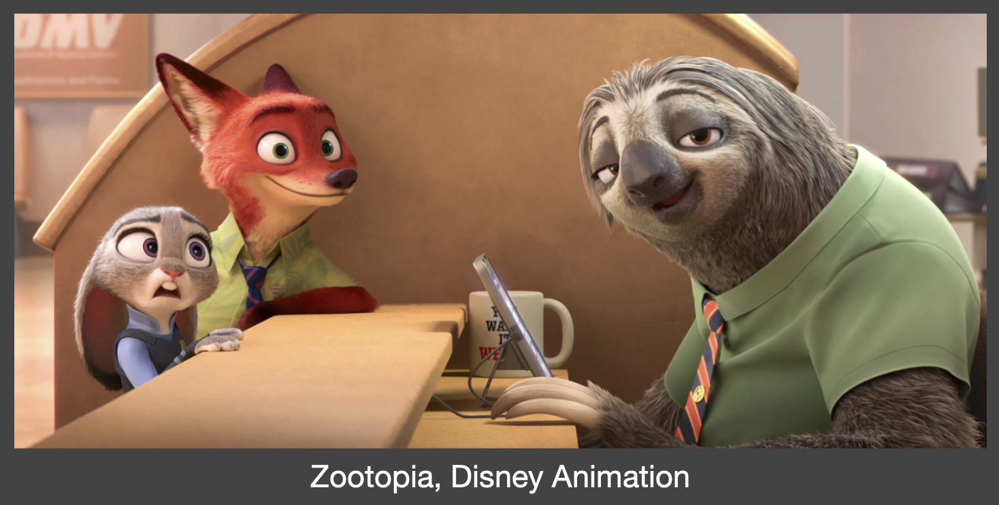

通过适当的近似，我们生成**看似合理的**(plausible)结果，但运行速度会快很多。比如右图的车看起来也比较不错的（~~不过截的图不太好~~）。

    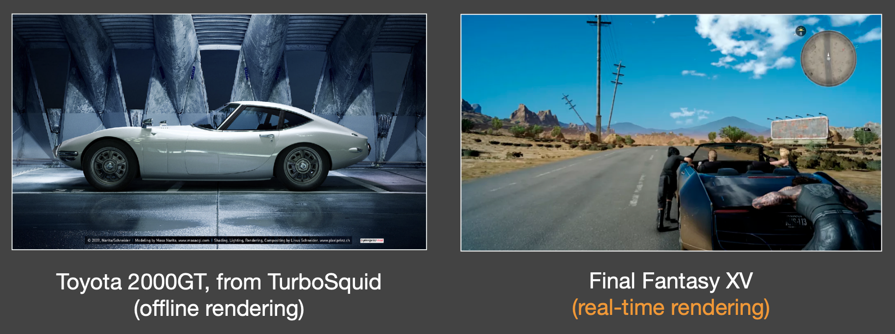

## Evolution of Real-Time Rendering

实时渲染领域有着 ~~悠久的~~ 历史（可能比离线渲染还要久远）：

- 交互式 3D 图形管线，如 OpenGL 所示
    - 从最早的 SGI 机器（Clark 82）开始至今
    - 主要关注更多几何与纹理映射技术
    - 通过部分调整来增强真实感（如阴影映射、累积缓冲区）

    

        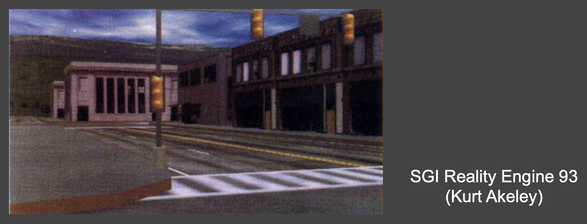
    

- 近三十年前：交互式 3D 几何体，带有简单的纹理映射和伪阴影（支持 OpenGL、DirectX）

    

        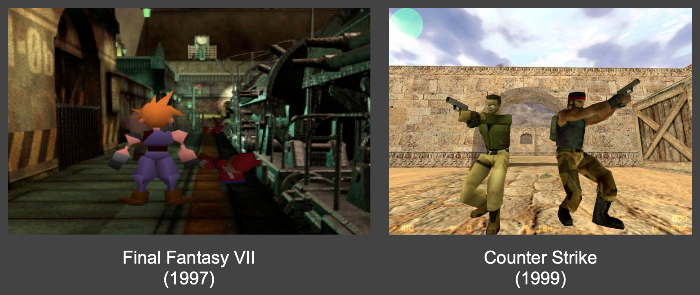
    

- 20-10 多年前
    - 自可编程着色器问世（2000）以来有了很大的飞跃
    - 复杂环境光照，真实材质（天鹅绒、缎面、涂料），软阴影
    - 问题：下面两个游戏，一个太暗，一个太油

    

        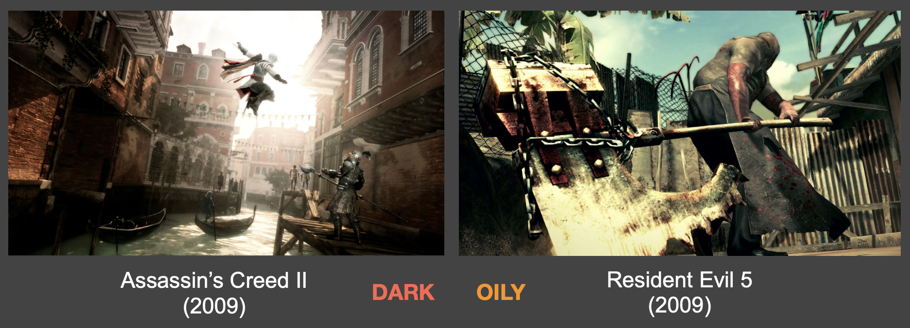
    

- 近十年
    - 惊艳的图形
    
        

            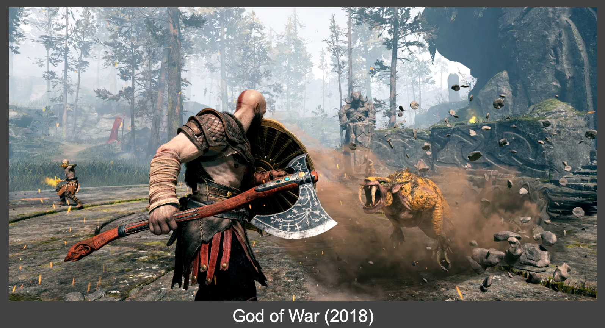
        

    
    - 扩展到虚拟现实（VR）乃至电影领域
    
        

            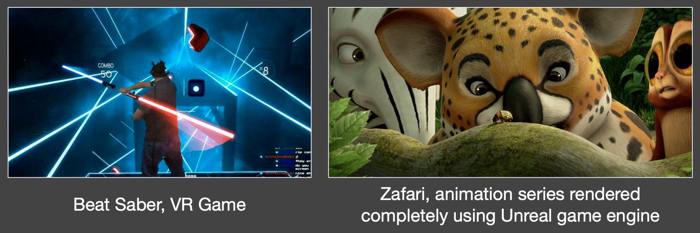
        

    - 使用 UE4 制作的逼真森林
    
        

            
        

    
    - 实时光线追踪 Demo（2018，NVIDIA）

        

            
        

- 未来
    - 《黑客帝国》（*Matrix*，1999）
    - 《头号玩家》（*Ready Player One*，2018）

## Technological and Algorithmic Milestones

最后介绍一些 CG 领域发展史上的里程碑技术：

- **可编程图形硬件**(programmable graphics hardware)（着色器）（二十多年前）
    - 程序员可以自己编写顶点着色器和片元着色器了
    - 现在还有计算着色器

    

        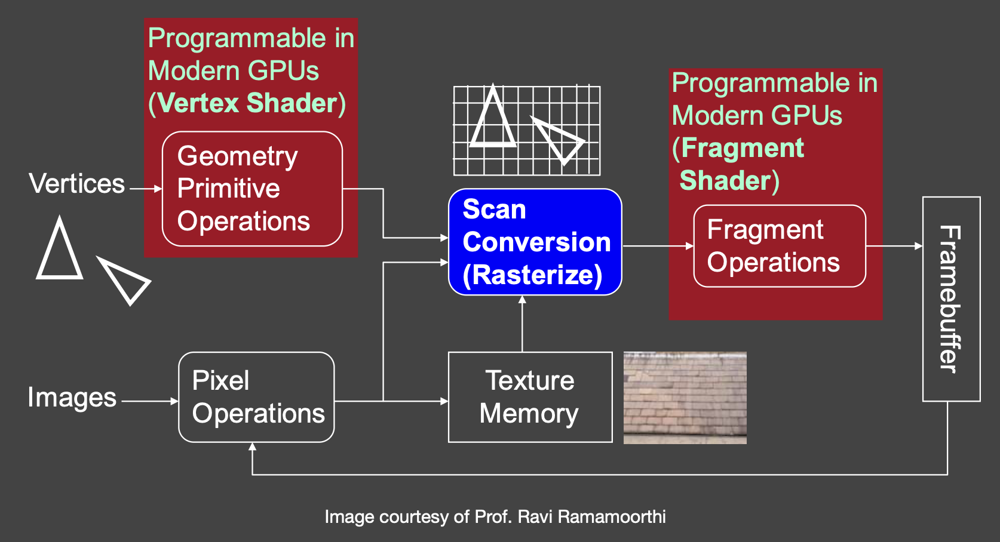
    

    ??? example "例子"

        现在看起来不咋地，但在当时属于跨时代的产物。

        

            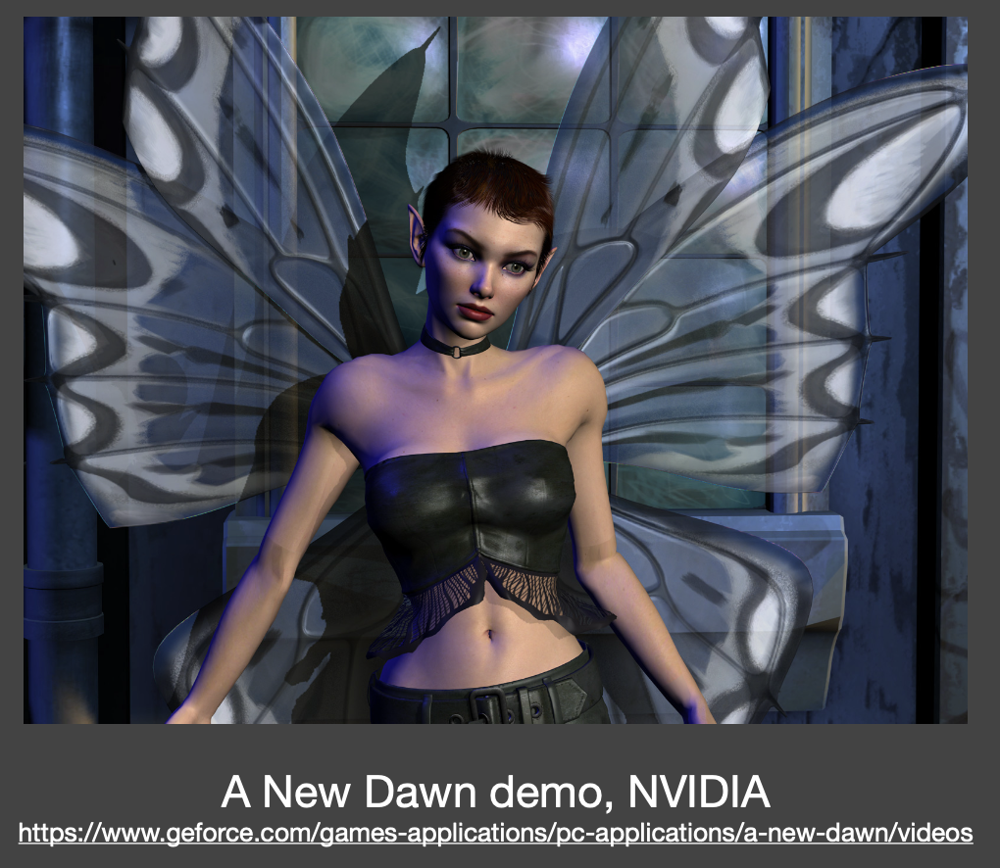
        

- **基于预计算的方法**(precomputation-based methods)（二十年前）
    - 复杂的视觉效果被（部分）**预计算**
    - 最小化**运行时**的渲染成本（但以额外存储为代价）

    

        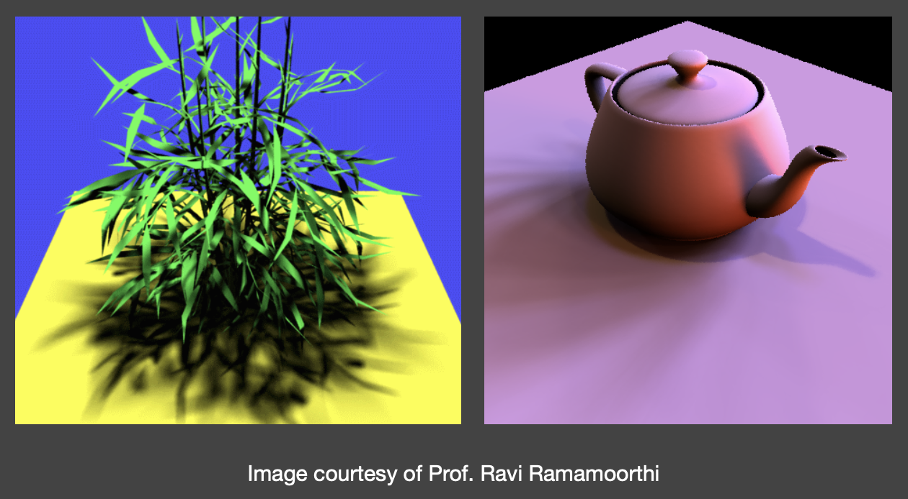
    

    ??? example "例子"

        >09 年的论文，很难想象到时就已经有这么不错的渲染技术了（看左上角的帧率）。

        

            
        

    - **重新照明**(relighting)：固定几何与观察点，动态改变光照（作者是闫老师博士时候的老板，一位相当厉害的大牛！）

        

            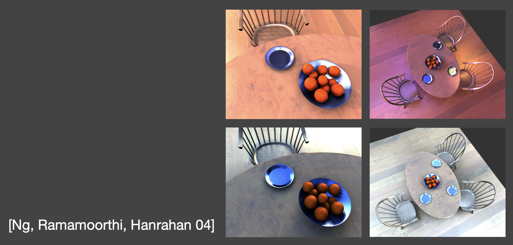
        

- **交互式光线追踪**(interactive ray tracing)（十年前，CUDA + OptiX）
    - 硬件发展使得 GPU 能够在低采样率下实现光线追踪（约每像素 1 个样本（SPP））
    - 随后通过后处理进行去噪

    

        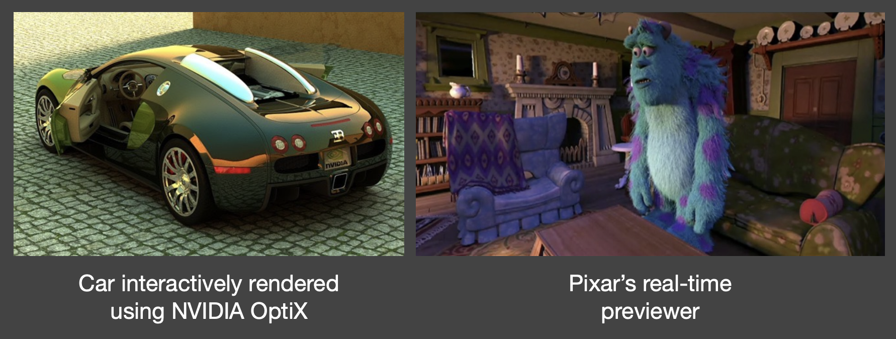
    
