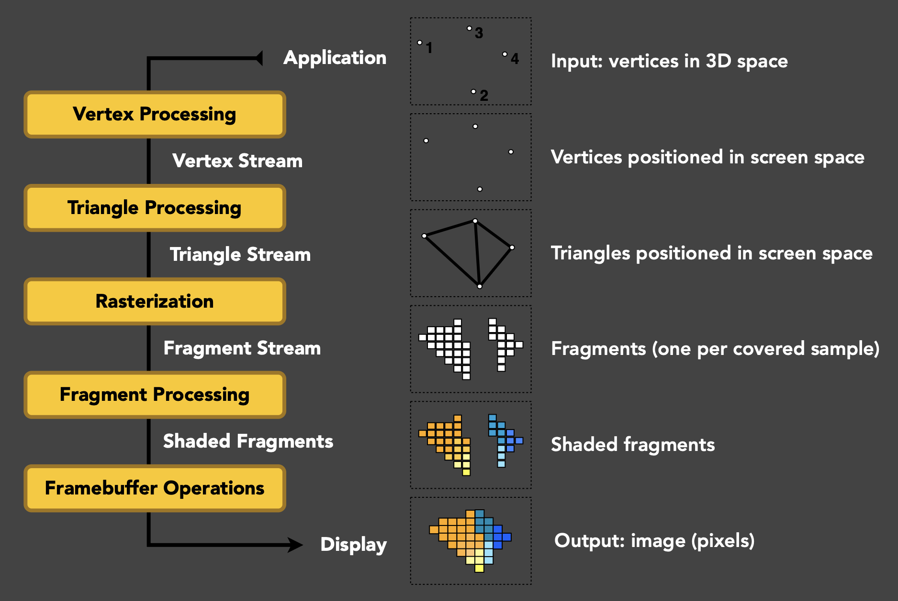
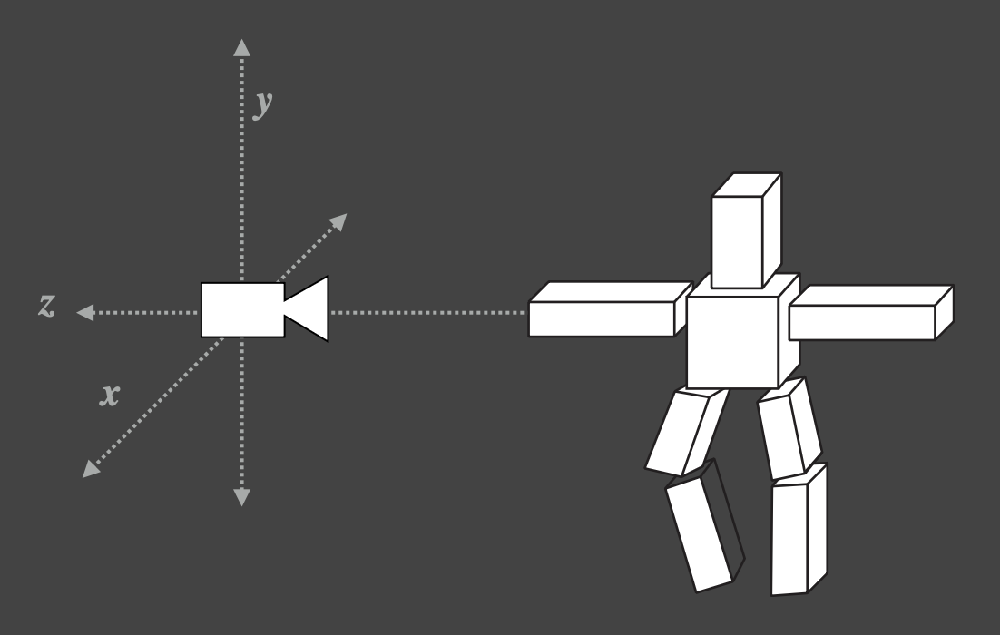
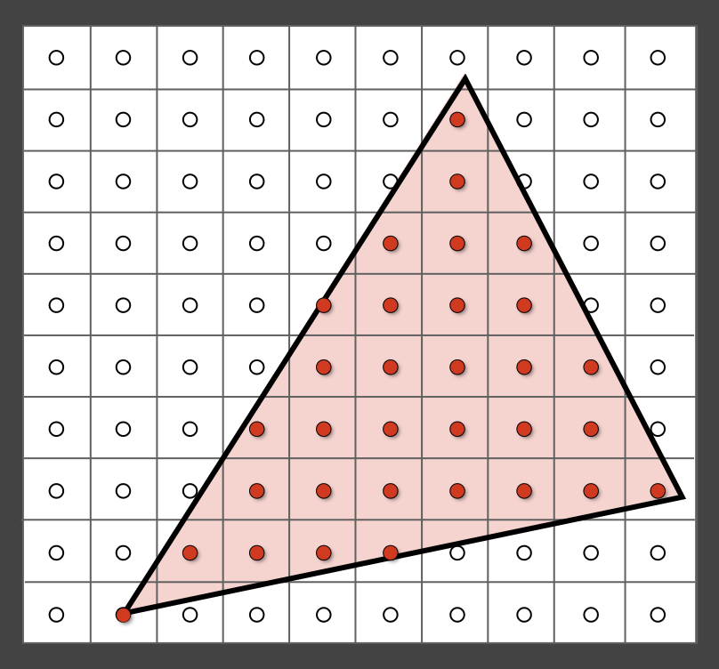
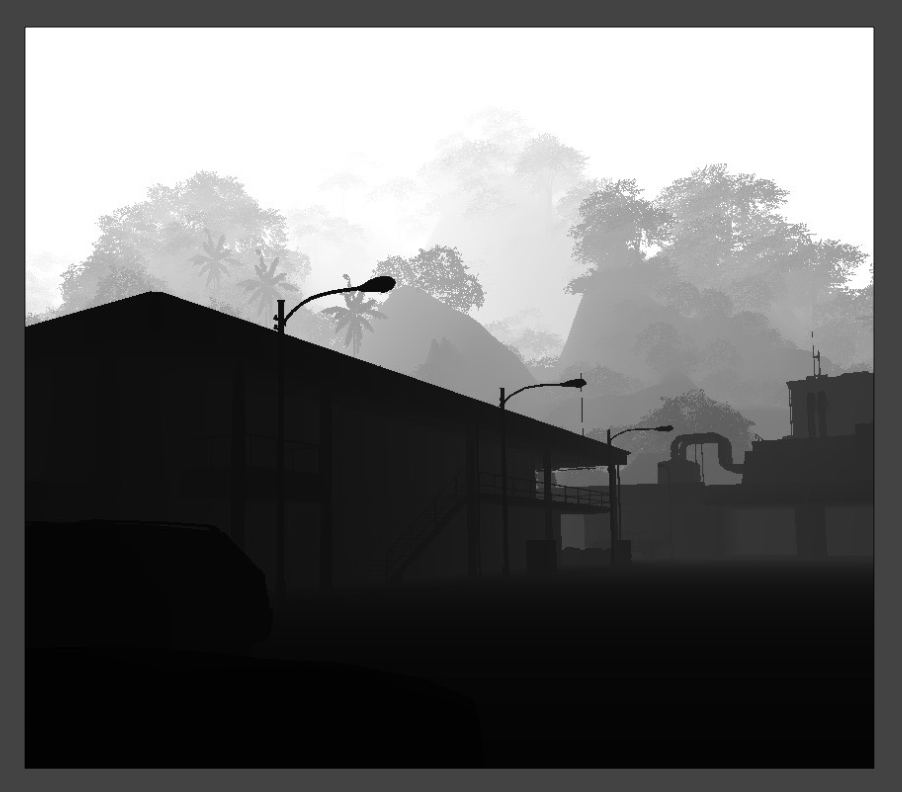
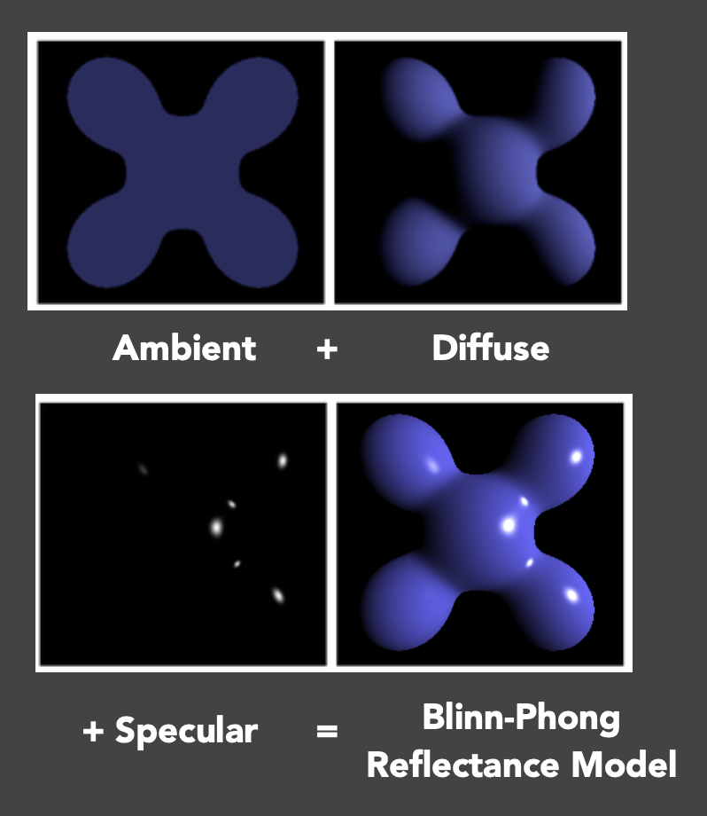
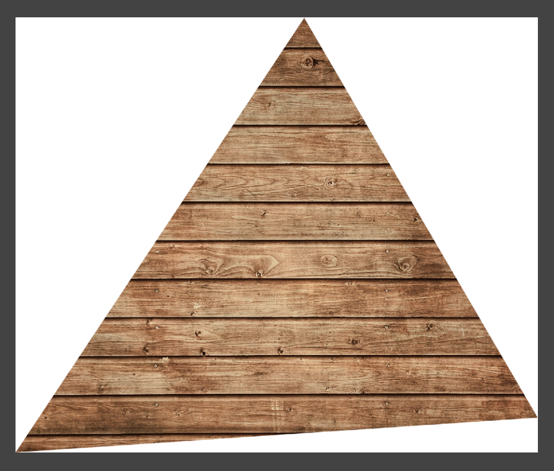
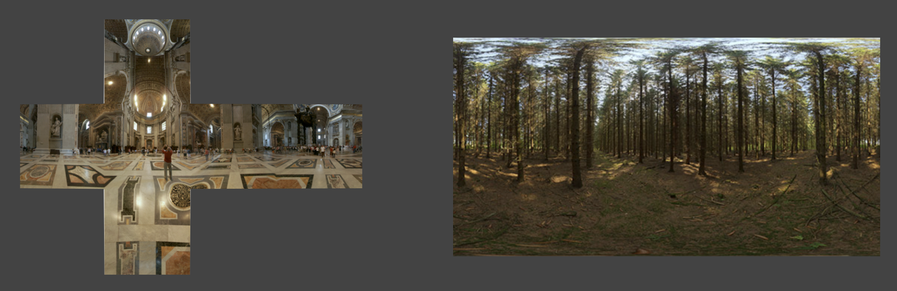
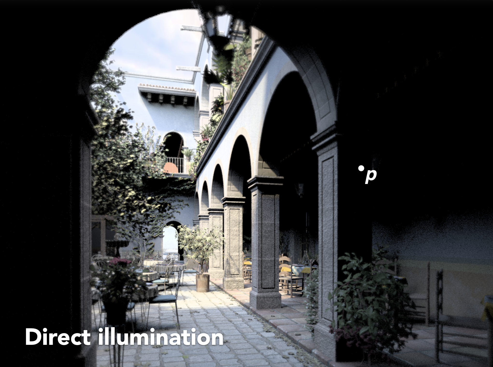

# Recap of CG Basics

## Basic GPU Hardware Pipeline

首先来回顾一下渲染管线的内容：

<div style="text-align: center">
    
</div>

- 通过**模型、视图、投影变换**(model, view, projection transforms)，以及最后的视口(viewport)变换，将 3D 空间中的物体表示在屏幕上

    <div style="text-align: center">
        
    </div>

- 然后对三角形进行**光栅化**，用一组片元(fragment)（有时也可直接称为像素）表示三角形

    <div style="text-align: center">
        
    </div>

- **深度缓冲区可见性测试**(z-buffer visibility tests)，记录三角形的远近（深度）

    <div style="text-align: center">
        
    </div>

- **着色**(shading)
    - 比如 Blinn-Phong 反射模型，看起来还不错，但缺少真实感，原因在于环境光只是个常数，没有考虑间接光照、阴影等
    - 这一过程在 GPU 上跑会快很多，原因是多个单元可以并行处理

    <div style="text-align: center">
        
    </div>

- **纹理映射**(texture mapping)和**插值**(interpolation)：根据三角形三个顶点的纹理坐标，插值计算得到三角形内任意一点的纹理坐标（重心坐标）

    <div style="text-align: center">
        
    </div>


## OpenGL

**OpenGL** 是一组从 CPU 调用 GPU 管道的 API。因此用什么语言实现 OpenGL 都没关系，我们更关心 GPU 是怎么执行的，这确保了它的**跨平台**(cross-platform)特性。

>类似的现代图形学 API 有 DirectX, Vulkan 等。

!!! bug "缺点"

    - 碎片化(fragmented)：由社区维护，因而存在众多不同版本，这些版本有着不同的特性
    - C 语言风格（意味着没有 OOP 的概念），不易使用
    - 难以调试（不过这一问题在最近有所改善）

如果学过 GAMES101，那么 OpenGL 还是比较容易掌握的，因为课中提到的每一步在 OpenGL 都有对应的实现，比如要实现投影变换只需调用它提供的 API 即可。

---
我们可以把整个渲染过程类比画一幅油画。

1. 放置物体/模型
2. 设置画架(easel)的位置
3. 将画布(canvas)附在画架上
4. 在画布上绘画
5. （（保持位置不变，绘制更多油画）将其他画布附在画架上，并继续作画）
6. （使用先前的绘画作为参考）

实际上 OpenGL 也是严格遵循这六个步骤的。现在我们要用 OpenGL 渲染一个 3D 场景，流程如下：

1. 放置物体/模型：
    - **模型描述**(model specification)：用户指定了对象的顶点、法线、纹理坐标，存储在**顶点缓冲对象**(vertex buffer object, **VBO**)中，发送给 GPU（与 `.obj` 文件的存储方式很像）
    - **模型变换**(model transformation)：使用 OpenGL 函数来获取矩阵，比如 `glTranslate`, `glMultMatrix` 等，无需自己编写任何东西

2. 设置画架的位置：**视图变换**
    - 创建或使用**帧缓冲区**(framebuffer)
    - 只需简单调用就能设置相机（视图变换矩阵），例如 `gluPerspective`

        ```c
        void gluperspective( 
            GLdouble fovy,
            GLdouble aspect,
            GLdouble zNear,
            GLdouble zFar
        );
        ```

3. 将画布附在画架上 / 5. 保持位置不变，绘制更多油画：OpenGL 中的**一次渲染过程**(one rendering **pass**)
    - 指定要使用的帧缓冲区
    - 输出一个或多个纹理（着色、深度等）
    - 渲染（片段着色器定义每个纹理上的内容）
    - 多渲染目标(multiple render target)：只要指定一个帧缓冲区就能渲染出很多不同的纹理
    - 实时渲染中不会立马将渲染结果显示在屏幕上，因为如果当前帧来不及渲染完的话，就会出现画面撕裂的问题，即同一时刻出现上下两半不同的渲染结果
        - 游戏中通过选中「垂直同步」选项避免这一问题
        - 一般的解决方案是将渲染结果暂时存在缓冲区中，等确保没问题后再一起渲染（双重缓冲）

4. 在画布上绘画：如何**着色**，这时要用到顶点着色器和片元着色器
    - 并行处理每个**顶点**：OpenGL 调用用户指定的**顶点着色器**，变换顶点（模型视图、投影）及其他操作
    - OpenGL 光栅化每个**图元**(primitives)，为每个像素生成一个片元
    - 并行处理每个**片元**：
        - OpenGL 调用用户指定的**片元着色器**，进行着色与光照计算
        - OpenGL 还默认处理深度缓冲区测试，也可以自己写
    
    - 我们最需要关注的操作是自定义顶点和片段着色器，因为即便在 GUI（比如游戏引擎的编辑器）中，其他操作也都封装好了

!!! abstract "总结"

    在每一趟(pass)中，

    - 指定对象、相机、MVP 矩阵等
    - 指定帧缓冲区和输入/输出纹理
    - 指定顶点/片元着色器
    - 当所有内容都在 GPU 上设置完毕后就可以开始渲染啦！

    最后还有多趟渲染没讲。实际上之前在 CG 课中学过的[**阴影映射**](../cg/5.md#shadow-mapping)就是一个很经典的两趟渲染。


## OpenGL Shading Language (GLSL)

顾名思义，**着色语言**(shading language)就是一种描述着色器怎么运作，怎么操作的语言，比如如何对顶点、片元着色。它采用一种和 C 类似的语法，但有更多的限制（其实也有更多好用的东西）。

??? info "着色语言的历史"

    >参考 Cook 关于着色树的论文和 Renderman 离线渲染技术

    - 上古时代：在 GPUs 上进行汇编编程
    - Stanford 实时着色语言，在SGI工作
    - 还是很久以前：NVINDA 的 Cg
    - DirectX 的 HLSL（顶点 + 像素）
    - OpenGL 的 **GLSL**（顶点 + 片元）

着色器的设置流程：

- 初始化（着色器本身稍后讨论）
    - 创建（顶点与片元）着色器
    - 编译着色器
    - 将着色器附加到程序
    - 链接程序
    - 使用程序

- 着色器的源码本质上是字符串序列
- 编译步骤与常规程序类似

??? code "代码样例（FYI）"

    === "着色器初始化代码"

        ```glsl
        GLuint initshaders(GLenum type, const char *filename) {
            // Using GLSL shaders, OpenGL book, page 679
            GLuint shader = glCreateShader(type);
            GLint compiled;
            string str = textFileRead(filename);
            GLchar * cstr = new GLchar[str.size()+1];
            const GLchar * cstr2 = cstr; // Weirdness to get a const char
            strcpy(cstr,str.c_str());
            glShaderSource(shader, 1, &cstr2, NULL);
            glCompileShader(shader);
            glGetShaderiv(shader, GL_COMPILE_STATUS, &compiled);
            if (!compiled) {
                shadererrors(shader);
                throw 3;
            }
            return shader;
        }
        ```

    === "链接着色器程序"

        ```glsl
        GLuint initprogram(GLuint vertexshader, GLuint fragmentshader) {
            GLuint program = glCreateProgram();
            GLint linked;
            glAttachShader(program, vertexshader);
            glAttachShader(program, fragmentshader);
            glLinkProgram(program);
            glGetProgramiv(program, GL_LINK_STATUS, &linked);
            if (linked) glUseProgram(program);
            else {
                programerrors(program);
                throw 4;
            }
            return program;
        }
        ```

    === "作业 0 中的 Phong 着色器"

        ```glsl title="顶点着色器"
        attribute vec3 aVertexPosition;
        attribute vec3 aNormalPosition;
        attribute vec2 aTextureCoord;

        uniform mat4 uModelViewMatrix;
        uniform mat4 uProjectionMatrix;

        varying highp vec2 vTextureCoord;
        varying highp vec3 vFragPos;
        varying highp vec3 vNormal;

        void main(void) {
            vFragPos = aVertexPosition;
            vNormal = aNormalPosition;

            gl_Position = uProjectionMatrix * uModelViewMatrix * vec4(aVertexPosition, 1.0);

            vTextureCoord = aTextureCoord;
        }
        ```

        ```glsl title="片元着色器"
        uniform sampler2D uSampler;
        uniform vec3 uKd;
        uniform vec3 uKs;
        uniform vec3 uLightPos;
        uniform vec3 uCameraPos;
        uniform float uLightIntensity;
        uniform int uTextureSample;

        varying highp vec2 vTextureCoord;
        varying highp vec3 vFragPos;
        varying highp vec3 vNormal;

        void main(void) {
            vec3 color;
            if (uTextureSample == 1) {
                color = pow(texture2D(uSampler, vTextureCoord).rgb, vec3(2.2));
            } else {
                color = uKd;
            }

            vec3 ambient = 0.05 * color;

            vec3 lightDir = normalize(uLightPos - vFragPos);
            vec3 normal = normalize(vNormal);
            float diff = max(dot(lightDir, normal), 0.0);
            float light_atten_coff = uLightIntensity / length(uLightPos - vFragPos);
            vec3 diffuse = diff * light_atten_coff * color;

            vec3 viewDir = normalize(uCameraPos - vFragPos);
            float spec = 0.0;
            vec3 reflectDir = reflect(-lightDir, normal);
            spec = pow(max(dot(viewDir, reflectDir), 0.0), 35.0);
            vec3 specular = uKs * light_atten_coff * spec;

            gl_FragColor = vec4(pow((ambient + diffuse + specular), vec3(1.0/2.2)), 1.0);
        }
        ```

        - `varying` 关键字用于在顶点着色器和片元着色器之间传递插值
        - `uniform` 关键字表示全局变量
        - `highp` 表示高精度
        - `sampler2D` 表示定义一个纹理，可以利用 `texture2D` 函数以及纹理坐标参数查询特定位置上的纹理值，通常有 4 个通道
        - `gl_Position` 表示顶点变换后的位置，而 `gl_FragColor` 用来表明片元的颜色，需要往这些变量设置值


### Debugging Shaders

- 多年前：NVIDIA Nsight + Visual Studio
    - 调试 GLSL 时需多个 GPUs
    - 必须在HLSL中以软件模拟模式运行

- 现在的调试方案：
    - Nsight Graphics（跨平台，但只能用在 N 卡上）
    - RenderDoc（跨平台，无 GPUs 限制）
    - 对于 WebGL，前者在官网中明确说明可以调试，而后者没有提供官方支持

- 闫老师的建议：由于没法直接打印中间值（因为这只能由 CPU 完成，但着色器工作在 GPU 中），所以一种比较粗暴的方法是直接拿电脑的颜色提取器（比如 macOS 自带的数码测色计(digital color meter)）获取渲染结果的颜色


## The Rendering Equation

**渲染方程**(rendering equation)是渲染领域中一个非常重要的概念，像路径追踪等技术就是以它为基础的。它是一个描述了光线的传播的方程，具体公式如下：

$$
\underbrace{L_o(p,\omega_o)}_{\substack{\text{outgoing} \\ \text{radiance}}} = \underbrace{L_e(p,\omega_o)}_{\text{emission}} + \int_{H^2} \underbrace{f_r(p,\omega_i \rightarrow \omega_o)}_{\text{BRDF}} \underbrace{L_i(p,\omega_i)}_{\substack{\text{incident} \\ \text{radiance}}} \cos\theta_i d\omega_i
$$

在**实时渲染**中，需要对这个方程做一点小改动：

- 需显式考虑**可见性**(visibility)
- BRDF 项通常和余弦项一起考虑

$$
\underbrace{L_o(p,\omega_o)}_{\substack{\text{outgoing} \\ \text{lighting}}} = \int_{\Omega^+} \underbrace{L_i(p,\omega_i)}_{\substack{\text{incident} \\ \text{lighting} \\ (\text{from source})}} \underbrace{f_r(p,\omega_i \rightarrow \omega_o) \cos\theta_i}_{\text{(cosine-weighted) BRDF}} \underbrace{V(p, \omega_i)}_{\text{visibility}} d\omega_i
$$

这种调整的一个好处是可以很自然地处理**环境光照**(environment lighting)，即考虑各个方向的入射光。通常会用一个立方体或球形贴图（纹理）表示，不过这两种方法都有各自的问题。之后将会引入一种新的表示方法。

<div style="text-align: center">
    
</div>

另外一个相关技术是**全局光照**，它包含直接光照和间接光照两部分。其中直接光照可直接通过上面的渲染方程计算出来；而间接光照则可以通过渲染方程的递归定义计算，比如某个点的入射光很有可能是来自其他物体表面的反射光。

???+ example "例子"

    === "直接光照"

        <div style="text-align: center">
            
        </div>

    === "弹射一次的全局光照"

        <div style="text-align: center">
            
        </div>

    === "弹射两次的全局光照"

        <div style="text-align: center">
            
        </div>

    可以看到，弹射一次后就可以得到不错的间接光照效果，之后多弹几次效果提升就不那么明显了。
