# Real-Time Shadows

## Recap: Shadow Mapping

先来简单回顾一下**阴影映射**(shadow mapping)的原理。

- 它是一种**两趟**(2-pass)**算法**
    - 第一趟：从光源位置出发看向场景，生成**阴影图**（SM），即来自光源的「深度纹理」
    
        

            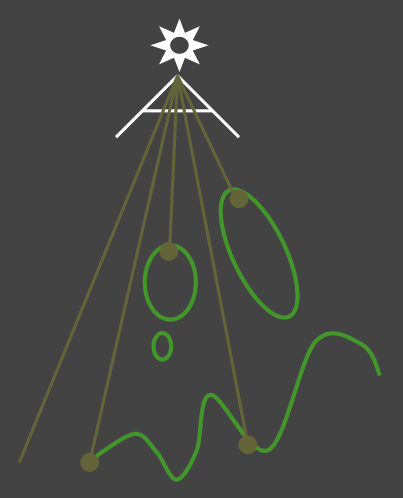
        

    
    - 第二趟：从相机位置出发渲染场景，根据 SM 确定场景中任何一点是否在阴影中
        - 从眼睛（相机）处渲染标准图像

            

                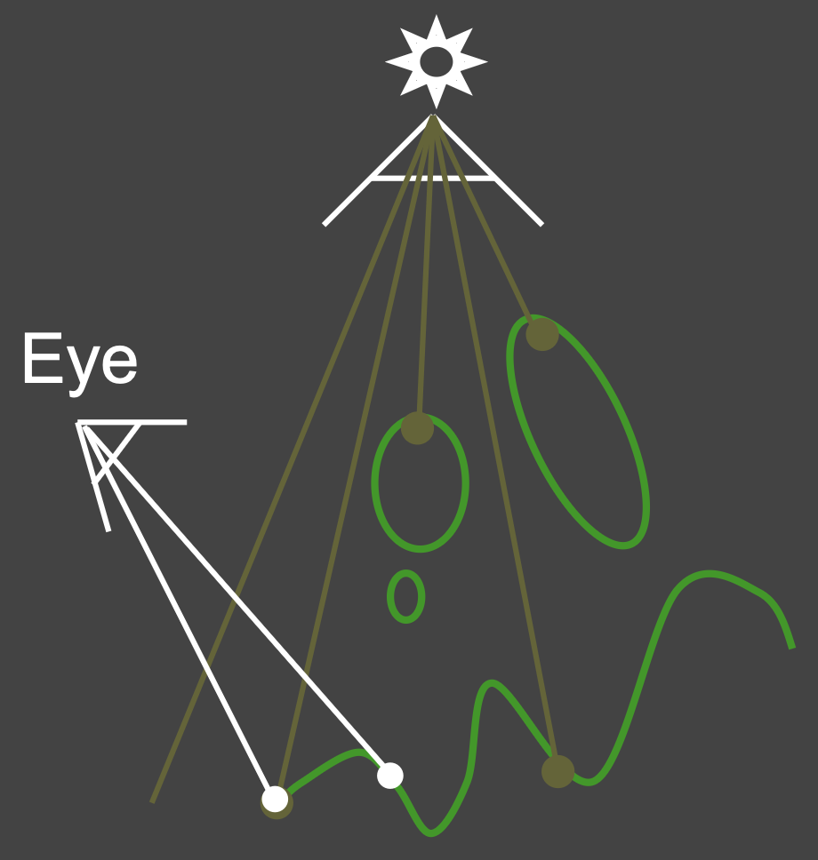
            

        - 重投影：将眼睛视角下的可见点投影回光源
            >注：深度值既可以用 z 值（投影变换后），也可以用顶点间的实际距离，选择其一即可。

            - 若某一点的深度对于眼睛与光源是相同的，说明该点是**可见的**(visible)
            
                

                    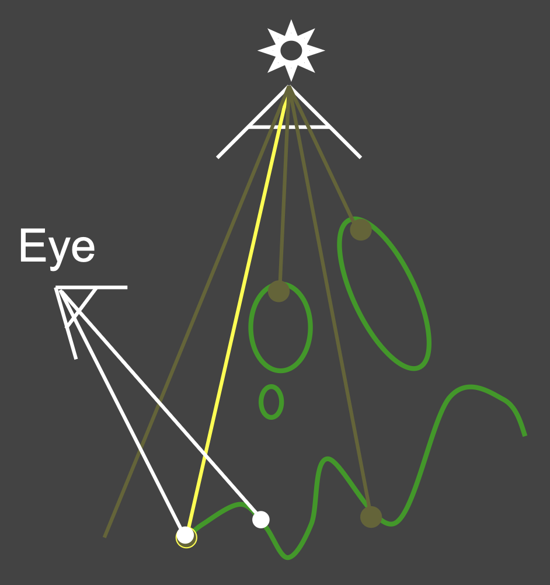
                

            
            - 否则说明该点是**被阻挡的**(blocked)

                

                    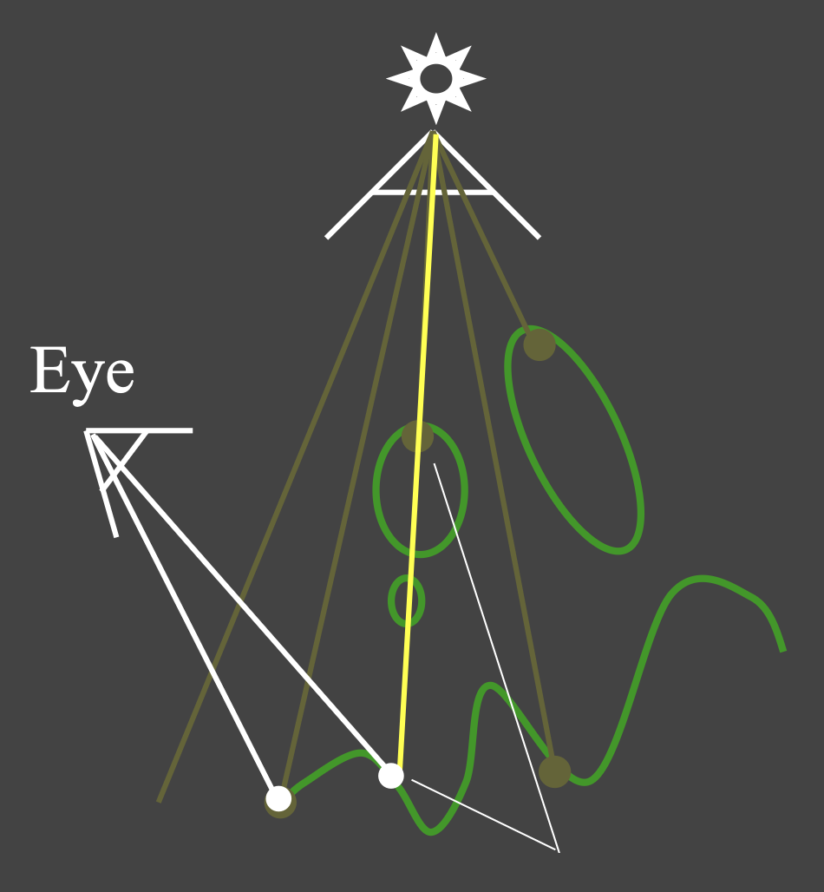
                

- 它也是一种**图像空间算法**
    - 优点：无需了解场景的几何属性
    - 缺点：导致自遮挡(self occlusion)和走样(aliasing)问题

- 它还是一种知名的阴影渲染技术
    - 甚至用在早期的离线渲染中，比如在动画电影《玩具总动员》

下面展示了阴影映射的结果，可以看到即便在相当复杂的场景（主要指遮挡关系复杂）中也能取得不错的效果。

    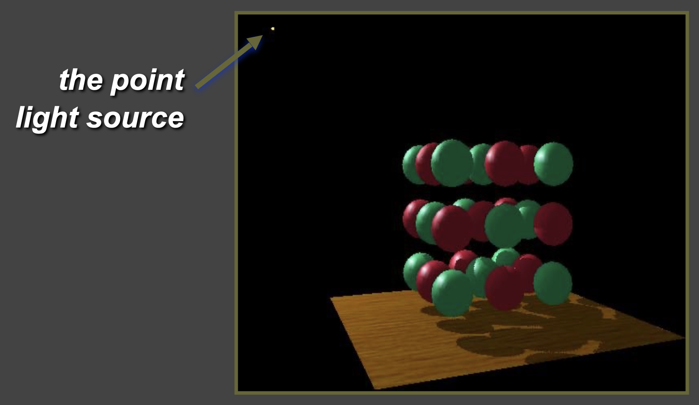

比较有阴影和无阴影的结果。很明显，有了阴影后，整个场景的空间感就更加真实了。

    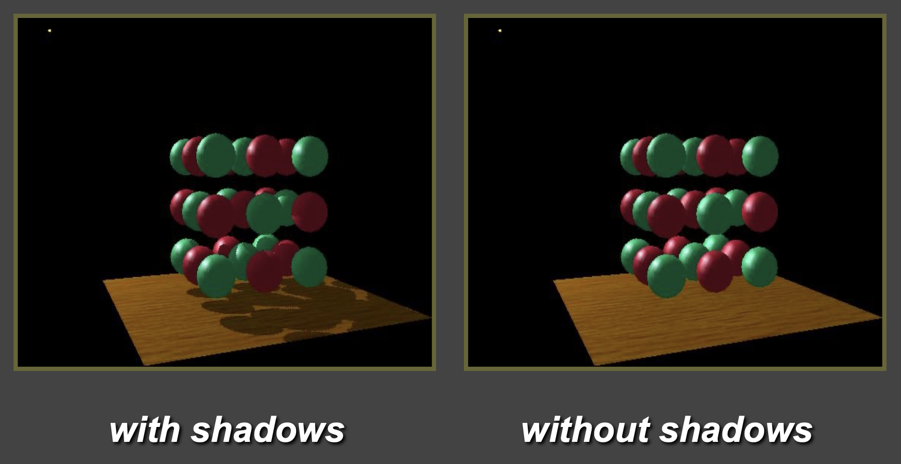

以上面的渲染结果为例，我们来感受一下更直观的阴影映射的过程：

- 光源视角下的场景

    

        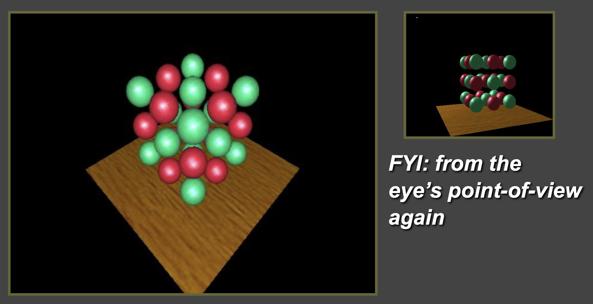
    

- 光源视角下的深度缓冲区

    

        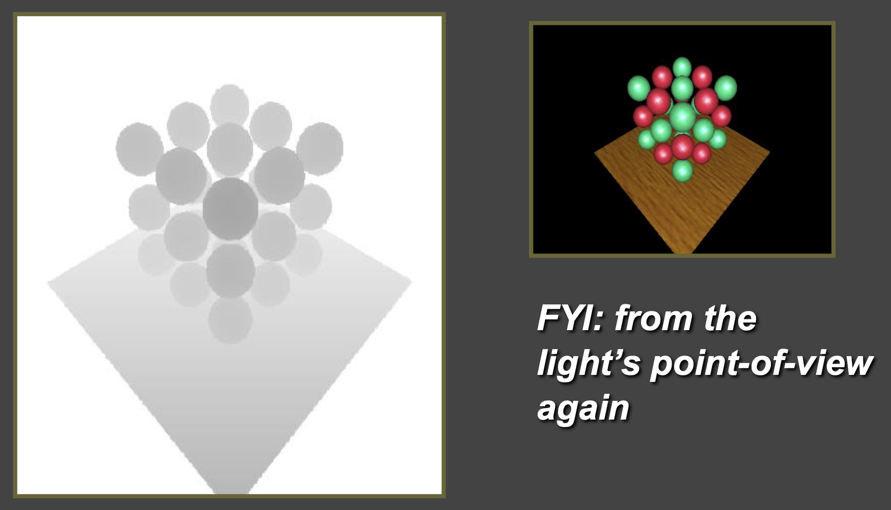
    

- 将深度图投影到眼睛的视角中

    

        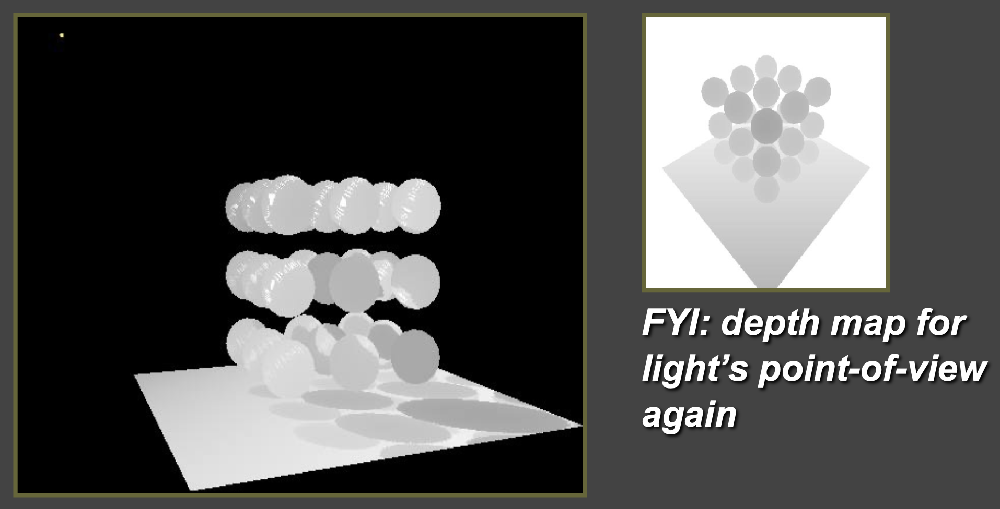
    

- 带阴影的场景

    

        
    

    - 高光部分不会出现在阴影中
    - 注意曲面如何相互投射阴影

!!! bug "阴影映射的问题"

    === "**自遮挡**"

        - 左图中虽然人物的阴影是正常的，但是地面上却有一圈圈的纹路。这并非摩尔纹（即不是采样问题），而是由**数值精度**导致的问题。
        - 来看右边的示意图，光源照射场景后会得到图中用红色线条标出的阴影图，它是离散的，且每个点的深度即为光源到该点的距离。
        - 现在从眼睛处看向某一点，然后取该点和光源的连线（蓝色虚线）。但由于数值精度问题，实际上该点的深度位于橙色线条标记的地方，也就是说光源对应的深度实际上会更浅。这就导致了橙色线条处的地板「挡住了」该点，误以为该点处在阴影中。
        - **掠射角**(grazing angle)越大，该问题越严重（所以垂直照射时问题最小）。

        

            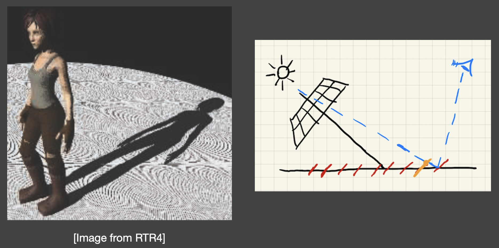
        

        解决方案有：

        - 增加一个**偏移量**(bias)，即要求当 SM 存储的深度比眼睛看到的深度**明显更小**时才算做被阻挡

            - 还可以根据光线与表面之间的角度来动态调整偏移量大小，比如垂直照射时偏移量设置得小一些
            - 但会引入**分离**(detach)的阴影（又称**彼得潘效应**(Peter Panning)）问题（因为偏移量设置过大）

            

                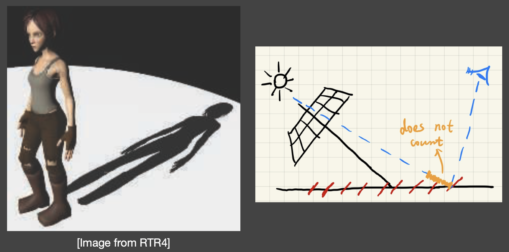
            

        - **第二深度阴影映射**
            - 使用 SM 中最小和次小深度的中点
            - 问题：要求物体必须是密闭的，且开销过大
            - 即便对于复杂度的影响不大，但「**实时渲染不相信复杂度**」，它只相信绝对的速度（所以常数也是很重要的）

            

                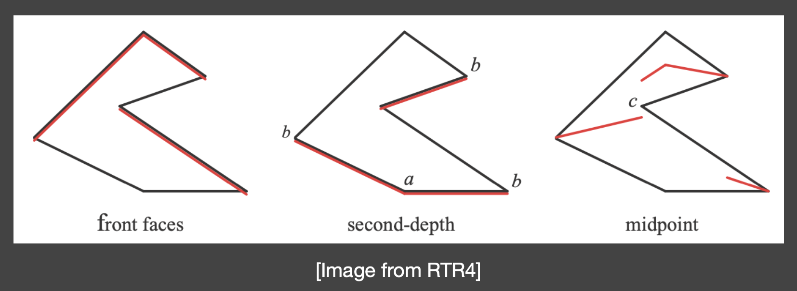
            

    === "**反走样**"

        阴影图的分辨率有限，如果分辨率不够大，很容易出现锯齿状的阴影。

        

            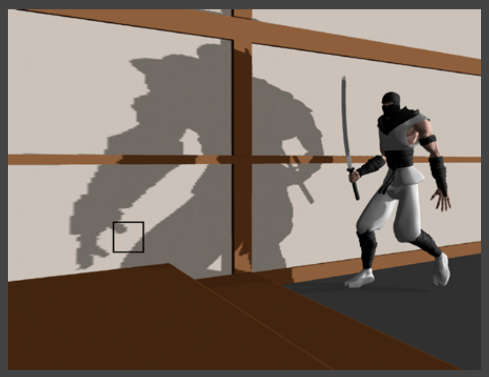
        

        解决方案有：

        - **级联阴影映射**(cascaded shadow mapping)：为阴影图的不同位置设置不同分辨率，在工业界中得到应用
        - 动态分辨率的阴影图

## The Math Behind Shadow Mapping

微积分中有很多有用的不等式，这里就列举其中两个对实时渲染计算有帮助的不等式：

- **施瓦兹**(Schwarz)**不等式**

    $$
    \left[\int_a^b f(x)g(x) dx\right]^2 \le \int_a^b f^2(x) dx \cdot \int_a^b g^2(x) dx
    $$

- **闵可夫斯基**(Minkowski)**不等式**

    $$
    \left[\int_a^b [f(x) + g(x)]^2 dx\right]^{\frac{1}{2}} \le \left[\int_a^b f^2(x) dx\right]^{\frac{1}{2}} + \left[\int_a^b g^2(x) dx \right]^{\frac{1}{2}}
    $$

之所以要用到这些不等式，不是因为我们关心不等，而是关心**近似相等**，所以会将上述不等式中的不等号看作约等号。所以下面给出在实时渲染中很重要的一个近似等式：

$$
\int_\Omega f(x)g(x)dx \approx \dfrac{\int_\Omega f(x) dx}{\int_\Omega dx} \cdot \int_\Omega g(x) dx
$$

上述式子将乘积的积分拆分为积分的乘积。约等号右边的分母看起来是空的，实际上起到了归一化常数的作用，确保数量级不变。当满足以下两个条件时，可认为这个式子是准确的：

- $g(x)$ 的**积分区间**(support)（即 $\Omega$）**很小**时
- $g(x)$ 足够**光滑**，也就是说在积分区间中 $g(x)$ 的变化不要太剧烈

这两个条件在**渲染方程**中均得到满足。先来回顾原方程内容：

$$
L_o(p,\omega_o) = \int_{\Omega^+} L_i(p,\omega_i) f_r(p,\omega_i \rightarrow \omega_o) \cos\theta_i \boxed{V(p, \omega_i)} d\omega_i
$$

利用上述近似公式，将其拆成两部分乘积（可见性（对应阴影映射）* 着色）：

$$
L_o(p,\omega_o) \approx \boxed{\dfrac{\int_{\Omega^+} V(p, \omega_i) d\omega_i}{\int_{\Omega^+} d\omega_i}} \cdot \int_{\Omega^+} L_i(p,\omega_i) f_r(p,\omega_i \rightarrow \omega_o) \cos\theta_i d\omega_i
$$

- 积分区间小：点光源（甚至不需要积分）+ 直接光照
- 光滑：物体是漫反射 BRDF（高光部分就不满足这一点）+ 恒定辐射区域光照（面光源，光照是均匀的）

>注：这一近似公式在**环境光遮蔽**(ambient occlusion)中也得到应用，之后再介绍。

## Percentage Closer Soft Shadows

通过前面介绍的阴影映射方法，虽然能得到阴影，但得到是**硬阴影**(hard shadow)，即有明确边界的阴影。我们更希望得到的是**软阴影**(soft shadow)的效果，也就是说没有明确的阴影边界，这样看上去会更自然。

    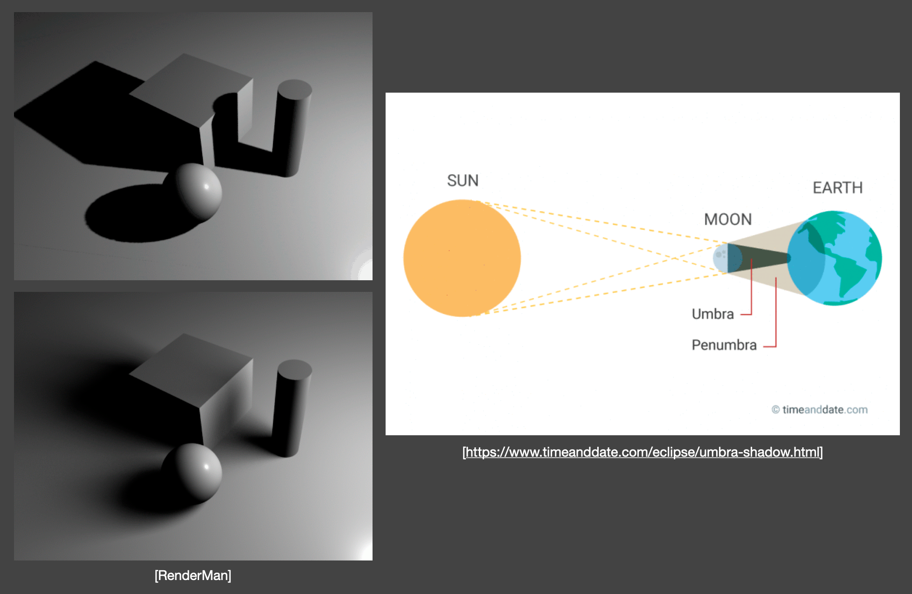

因为世界上的绝大多数光源都是面光源而非点光源，比如太阳对地球而言就是面光源。假如月球正好居于地球和太阳之间，那么月球的阴影就会打在地球表面。阴影有**本影**(umbra)和**半影**(penumbra)之分，其中半影对应区域是只有部分区域被遮挡的地方，作为阴影与无阴影区域间的过渡。

为了实现软阴影的效果，在实时渲染中常用到的一种工具叫做**百分比渐进滤波**(percentage closer filtering, **PCF**)。

- 该技术最初是为了实现阴影边缘的**反走样**
    - 而不是为了实现软阴影效果（也就是后面介绍的 PCSS）
    - 对**阴影比较结果**（对于任意一点，在阴影中记为0，否则记为1）进行**滤波**(filtering)（模糊）

- **不直接对阴影图做滤波**的原因：
    - （第一趟中）这样的纹理滤波仅对颜色分量计算平均值，这导致先会得到一个模糊的阴影贴图（比如把物体本身边缘给模糊掉了）
    - （第二趟中）而计算深度值平均值后再进行比较，则仍然得到的是**二元**可见性（硬阴影），并没有起到模糊阴影的效果

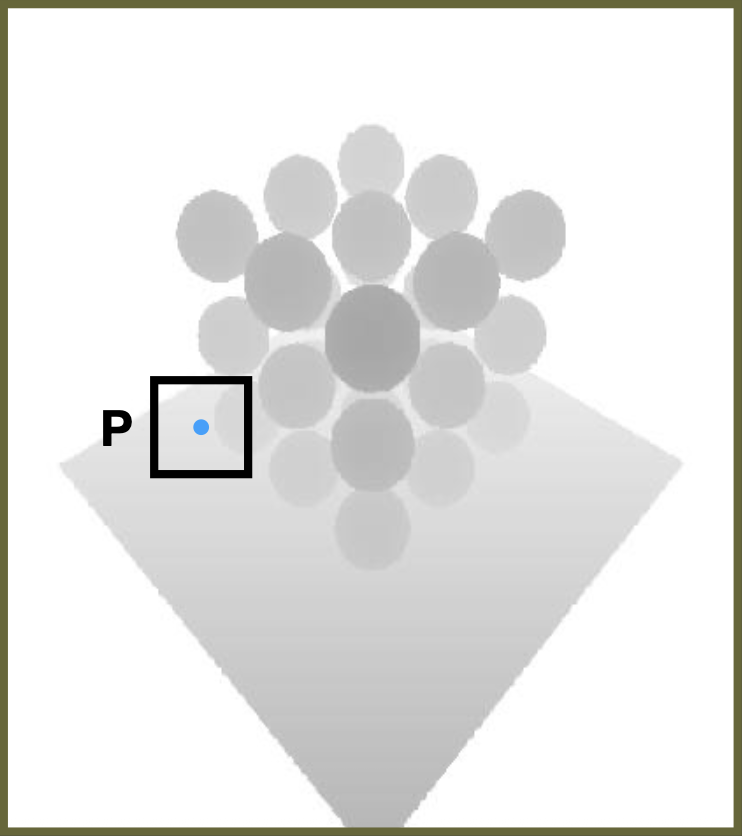{ align=right width=30% }

- 正确的做法是：
    - 为每个片元执行多次（比如 7x7）深度比较
    - 然后计算比较**结果**的均值
    - 例子：对于右图地板上的 P 点
        1. 和黑方框周围的所有像素比较，比如 3x3
        2. 获取比较值，比如

            1, 0, 1,
            1, 0, 1,
            1, 1, 0,

        3. 取均值，计算可见性，比如 0.667

???+ example "例子"

    >注意，效果是阴影的反走样而非生成软阴影。

    

        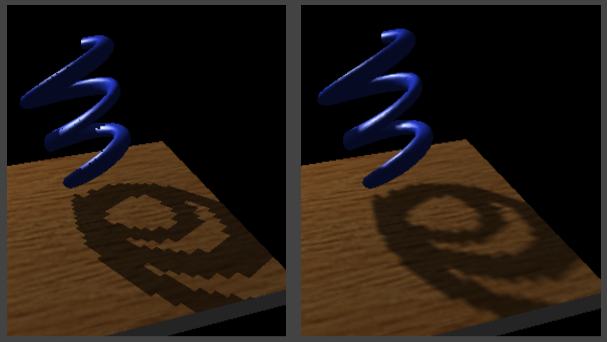
    

    

        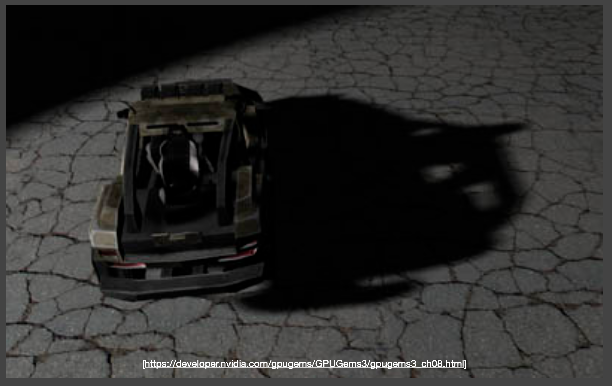
    

**滤波器的大小**会影响到滤波效果：滤波器越小，阴影越锐利；滤波器越大，阴影越模糊。于是有人发现当滤波器取得很大时，可以达到近似软阴影的效果。所以我们可以沿这样一条思路生成软阴影：

- 先生成硬阴影
- 采用什么样大小的滤波器比较合适
- 需不需要为不同位置使用相同大小的滤波器

下面这张图是一个很好的例子。观察发现，钢笔的笔尖阴影较硬，笔杆阴影较软，也就是说离纸面越近的部位产生的阴影越硬。

    

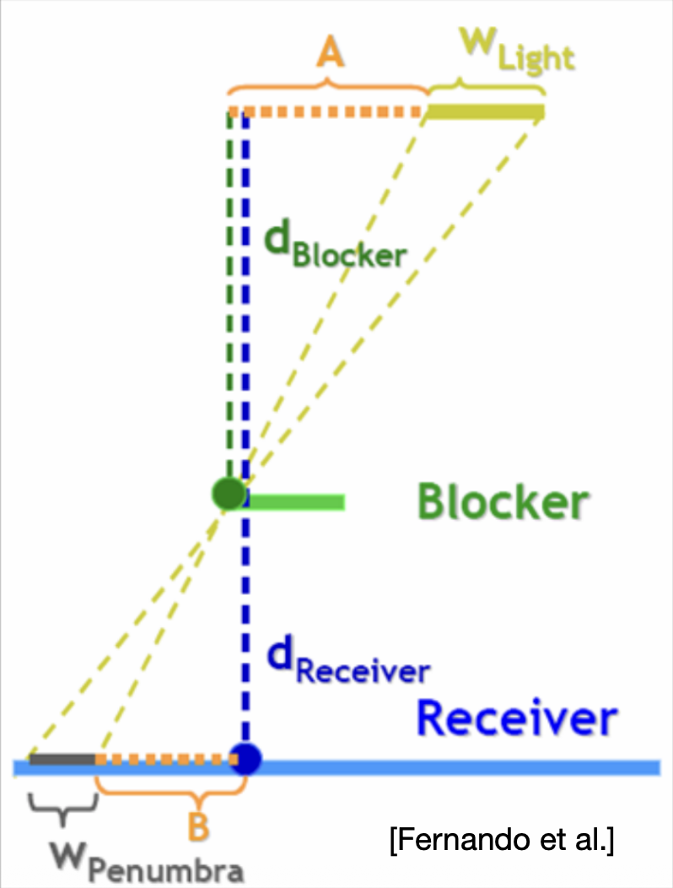{ align=right width=30% }

所以我们得到以下关键结论：

- 滤波器的大小和**遮挡物的距离**(blocker distance)有关
- 更准确地说，是投影后遮挡物的深度的**相对平均值**

PCSS 的示意图如右侧所示，对应数学上的转换公式为：

$$
w_{\text{penumbra}} = (d_{\text{receiver}} - d_{\text{blocker}}) \cdot w_{\text{light}} / d_{\text{blocker}}
$$

>注：$w_{\text{penumbra}}$ 值越大，说明半影区域越大，阴影会更软。

现在就差最后一个问题没解决了：$d_{\text{blocker}}$ 怎么算？下面就直接给出完整的 PCSS 算法：

1. **遮挡物搜索**：获取**特定区域**内遮挡物深度的平均值
    - 检查着色点和光源的连线上是否有点处在阴影中，若是则说明该点是遮挡物上一点，于是记录其深度，最后对所有存下来的深度取平均
    - 特定区域（下图红色区域）可以是**常量**，但更好的方法是**启发式算法**（取决于**光源大小**和**接收者和光源的距离**）
    - 问题：开销很大

    

        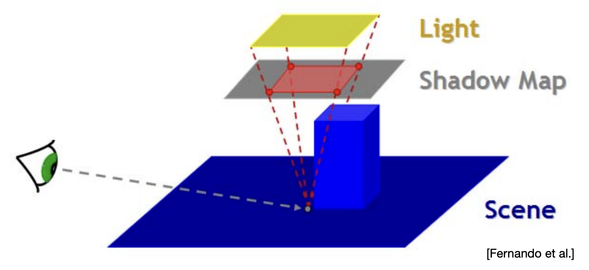
    

2. **半影估计**：使用平均遮挡物深度来确定滤波器大小
3. **百分比接近滤波**

导致上述算法执行变慢的地方有：

- 第 1 步和第 3 步需查看区域内的每个纹素（的深度）
    - 加速方法：在区域内进行有限次数的采样，但只是近似结果，带来了更大的噪声（工业界还会采取一些降噪方法以减轻影响）
- 要想实现更「软」的阴影效果，就得设定更大的滤波区域，那么计算量就会更大

???+ example "例子"

    可以看到，相比树干部分，树叶对应的阴影的滤波器大小会大一些，从而形成效果不错的软阴影。

    

        
    

### A Deeper Look at PCF

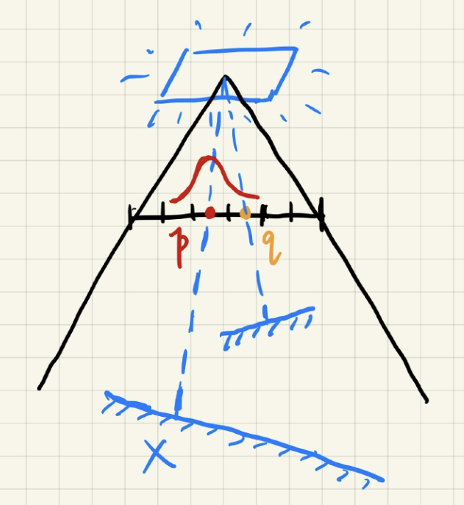{ align=right width=30% }

说到滤波，不难想到 PCF 背后的数学知识就是**卷积**(convolution)：

$$
[w * f](p) = \sum\limits_{q \in \mathcal{N}(p)} w(p, q) f(q)
$$

于是可以得到 PCSS 的公式：

$$
V(x) = \sum\limits_{q \in \mathcal{N}(p)} w(p, q) \cdot \chi^+ [D_{\text{SM}}(q) - D_{\text{scene}}(x)]
$$

其中：

- $x$ 为着色点，它的阴影来自 $p$ 点周围的区域
- $\chi^+$ 是一个符号函数，当 $D_{\text{SM}}(q) - D_{\text{scene}}(x) > 0$ 时值为 1，否则值为 0

通过这个公式，我们就能理解之前为什么说

- PCF != 先对阴影图滤波再比较的结果

    $$
    V(x) \ne \chi^+ \{[w * D_{\text{SM}}](q) - D_{\text{scene}}(x)\}
    $$

- PCF != 对二元可见性的结果图像进行滤波的结果

    $$
    V(x) \ne \sum\limits_{q \in \mathcal{N}(p)} w(p, q) V(q)
    $$

## Variance Soft Shadow Mapping

**方差软阴影映射**(variance soft shadow mapping, **VSSM**)就是在 PCSS 的基础上加速了第 1 步和第 3 步的计算，实现了更快的遮挡物搜索和滤波。

先来好好理解 PCF 这件事（即 PCSS 的第三步）。「百分比」是指在着色点前面的纹素的比例，即有在搜索区域内有多少纹素比着色点深度 $t$ 更小。

我们可以用“考试中有多少学生表现比自己好”来类比。为了得到答案，我们往往会根据一张关于成绩的**直方图**(histogram)来计算：只要找到自己成绩在直方图中的位置就行了。不过，如果只想了解**大致的**排行情况，也许只要一个关于成绩的分布（通常认为是**正态分布**）就能完成。

    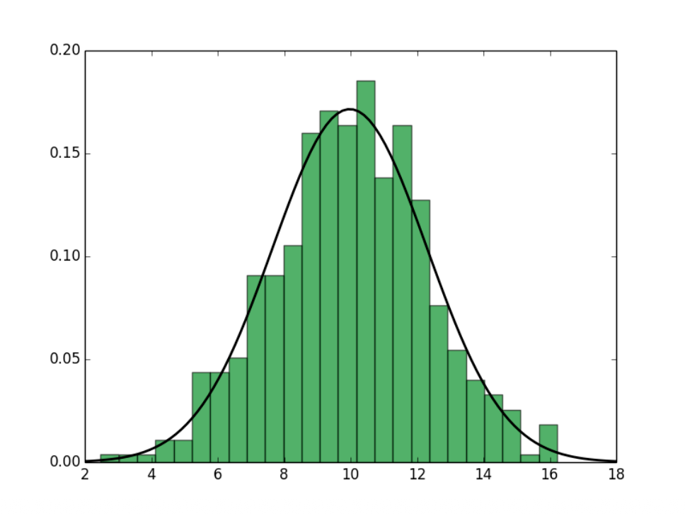

类似地，VSSM 的关键思路便是快速计算区域内关于深度分布的**均值**(mean)和**方差**(variance)。具体的计算方式有：

- 均值：
    - 硬件 MIPMaping
    - **求和面积表**(summed area table, **SAT**)

- 方差：
    - $\text{Var}(X) = E(X^2) - E^2(X)$
    - 所以只需额外计算深度平方的均值
    - 也就是说只要生成另一张阴影图，记录深度的平方值（不会产生很多额外的开销）

回到前面有关「百分比接近」的讨论。在已经得到均值和方差的基础上，阴影区域的精确解（多少百分比的纹素的深度比着色点的更浅）便是着色点深度在对应正态分布的 **CDF**（累计分布函数）值（即曲线下方的面积）。

    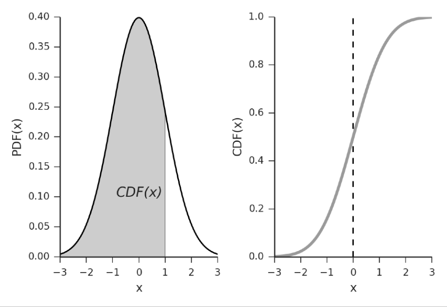

>注：对于通用高斯的 PDF，其积分值会被记录在一张表上（打表），这些值被称为**误差函数**(error function)。这类积分无解析解，但有数值解。

VSSM 并没有这样做。它利用**切比雪夫不等式**(Chebychev’s inequality)进行近似表示深度比 $t$ 大的纹素的百分比（上界），这样比计算什么 CDF 简单多了，甚至都不需要知道具体什么分布（但隐含了**简单单峰**的条件，并在正态分布时最准确）。

$$
P(x > t) \le \dfrac{\sigma^2}{\sigma^2 + (t - \mu)^2}
$$

>要求 $t > \mu$

    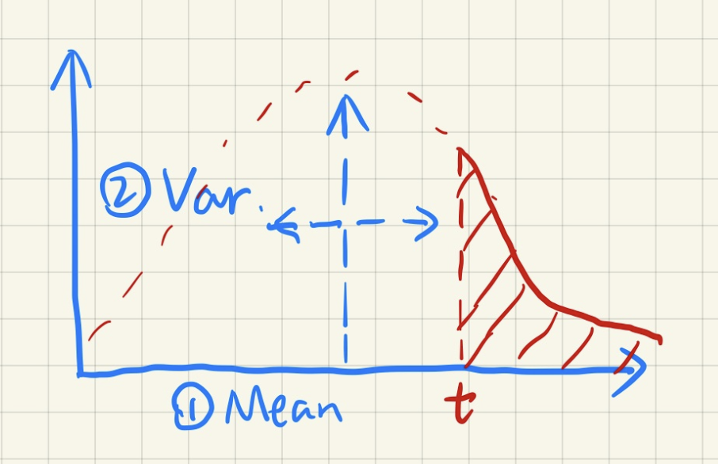

总结一下 VSSM 在第三步中的改进：

- 阴影图生成：
    - 「平方深度图」：和普通的深度图并行计算，计算量取决于像素个数
    - 计算均值：MIPMAP 或 SAT（稍后介绍）
- 运行时：
    - 区域内深度和深度平方的均值计算：$O(1)$
    - 切比雪夫不等式：$O(1)$
    - **无需任何采样/循环**

回到第一步的遮挡物搜索。为了计算遮挡物的平均深度，这一步也存在效率不高的采样/循环操作。需要明确的一点是，遮挡物的深度并不是区域内所有纹素深度的平均值 $z_{\text{arg}}$。真正的遮挡物平均深度 $z$ 是小于 $t$ 的，因此

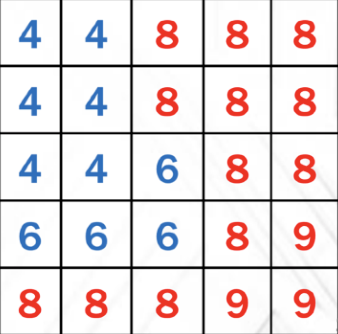{ align=right width=30% }

- 遮挡物（$\textcolor{cornflowerblue}{z < t}$）深度平均值 $z_{\text{occ}}$（我们想要计算的）
- 非遮挡物（$\textcolor{red}{z > t}$）深度平均值 $z_{\text{unocc}}$
- 显然有公式 $\dfrac{N_1}{N} z_{\text{unocc}} + \dfrac{N_2}{N} z_{\text{occ}} = z_{\text{avg}}$ 成立
- 可以利用切比雪夫不等式近似计算比例：$N_1 / N = P(x > t), N_2 / N = 1 - P(x > t)$
- $z_{\text{unocc}}$ 也是未知的，但大胆假设 $z_{\text{unocc}} = t$（也就是认为阴影的接收者是个平面，当然很多时候也正是如此）
- 完成步骤 1 产生的额外成本可忽略不计

???+ example "例子"

    

        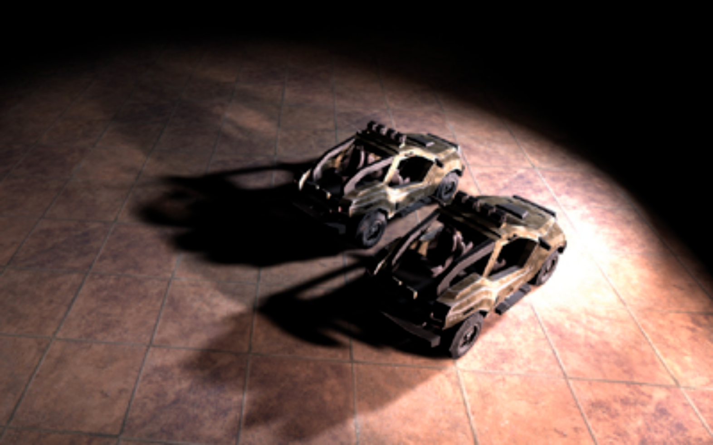
    

## MIPMAP and Summed-Area Variance Shadow Maps

VSSM 中还未讲到的一块是如何加速计算任意范围（深度和深度平方）的均值 $\mu$ 和方差 $\sigma$。不过可以确定的是，范围的形状一定是个**矩形**(rectangle)。因此可以用 MIPMAP 和 SAT 来解决。

不过 [**MIPMAP**](../cg/5.md#mipmap) 的局限性较多，比如得到的只是**近似结果**（即便用了三线性插值（每一级之间还要再做一次 LERP）），且只能处理方形区域。

于是我们转向第二种方法 **SAT**。它用到了一种很经典的数据结构和算法————**前缀和**(prefix sum)。SAT 存的就是每个位置的前缀和。有了前缀和后，就能直接计算任意范围的总和，也就相当于求出了均值。

- 1D 情况

    

        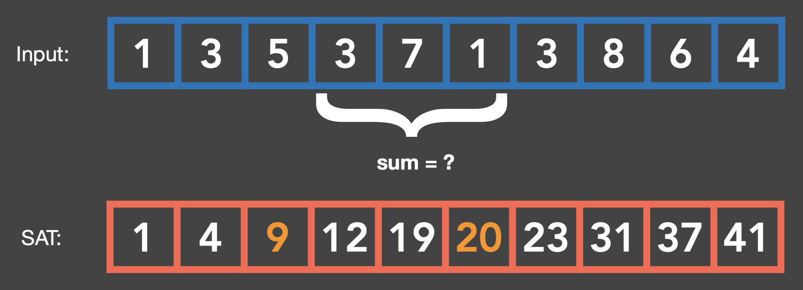
    

- 2D 情况：蓝色区域 = 绿色区域 - 黄色区域

    

        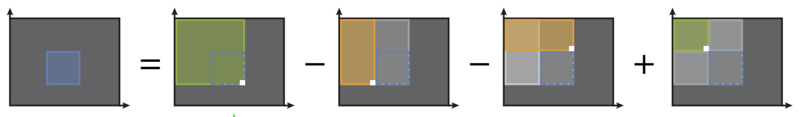
    

该方法的优点是精确，缺点是需要额外花费 $O(n)$ 时间和空间进行预计算（$n$ 理解为所有元素的个数）。存储可能不是问题，关键在于速度。借助 GPU 的能力，可以实现并行加速。

## Moment Shadow Mapping

虽然 VSSM 是为了解决 PCSS 的问题而诞生的，但它自身也有一定的局限性。首先它假设区域内纹素在着色点之前的占比与深度差呈正态分布。光照在复杂物体（比如左图的树枝）产生的投影确实可以近似为正态分布，但假如光照在像右图那种钻洞的网格上，对应的分布可能存在多个峰值。

    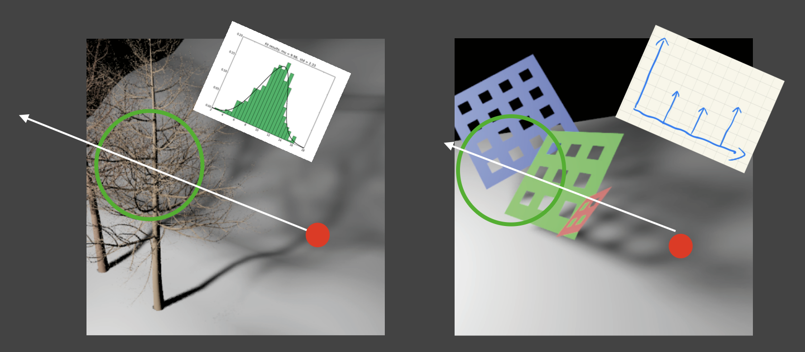

如果深度分布描述得不够准确，可能会带来一系列问题：

- 过暗（高估遮挡物占比）：可能会被接受（毕竟阴影再暗也是阴影，不会感觉特别突兀）
- 过亮（低估遮挡物占比，如下图所示）：**漏光**(light leaking)（显然人们无法接受阴影中有块地方变白了）

    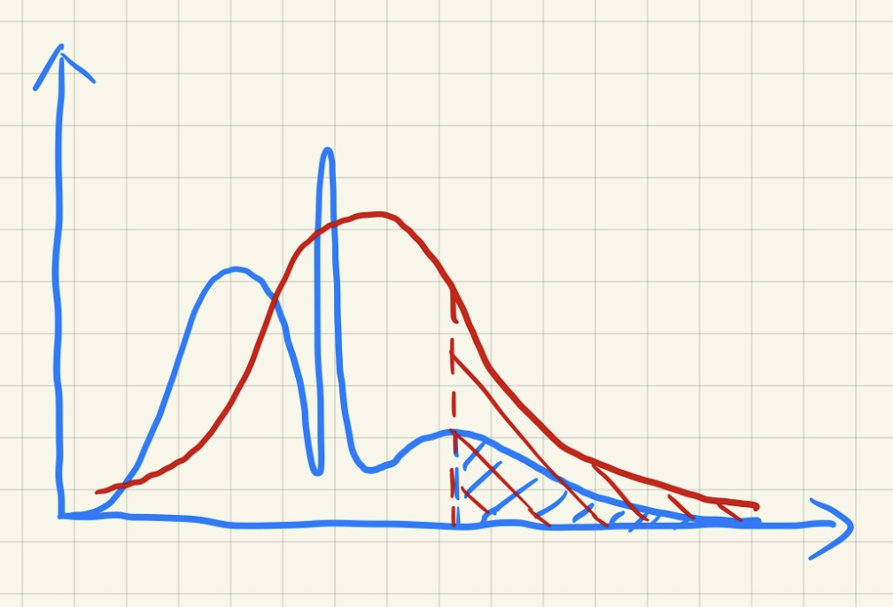

???+ example "例子"

    可以看到车底的阴影存在漏光现象，因为车的底盘、天窗等部分的深度分布不会是正态分布。

    

        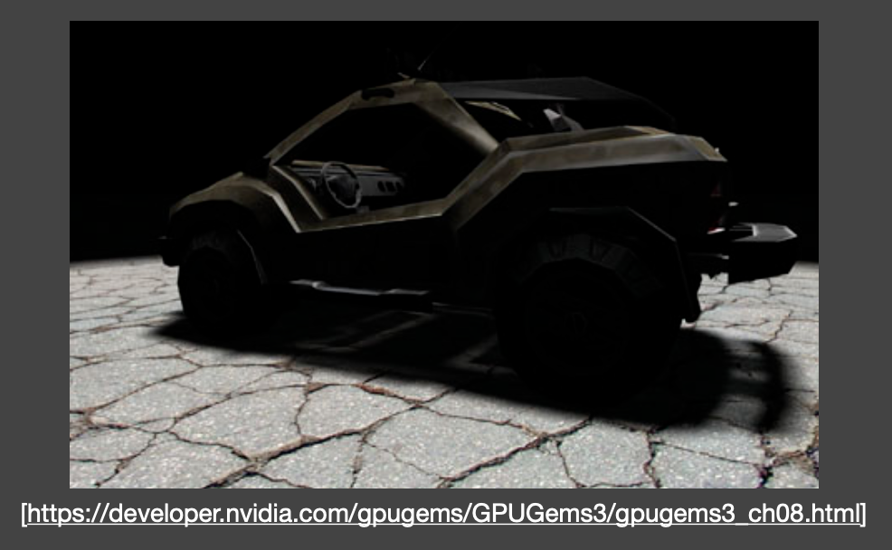
    

除了漏光问题外，VSSM 还会导致非平面物体上的阴影上的瑕疵，比如下图中阴影断裂的问题。因为只有当 $t > z_{\text{avg}}$ 时，切比雪夫不等式才是有效的。

    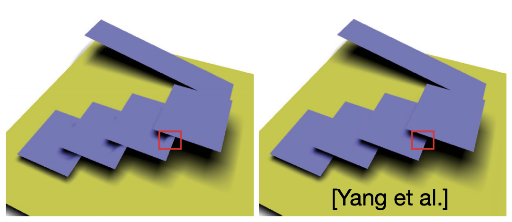

为了更准确地表示分布（但仍然不能在存储上消耗太多），我们引入了更加先进的**矩阴影映射**(moment shadow mapping)，它的思路是使用**高阶矩**(higher order moments)来表示分布。

???+ info "**矩**(moment)"

    矩有许多不同版本的定义，我们就用其中最简单的：$x, x^2, x^3, x^4, \dots$。而 VSSM 本质上用的就是矩的**前两**阶。

    矩的作用是：前 $m$ 阶的矩能用 $\dfrac{m}{2}$ 步表示一个函数。通常而言，$m = 4$ 足以近似表示深度分布的 CDF，如图所示。

    

        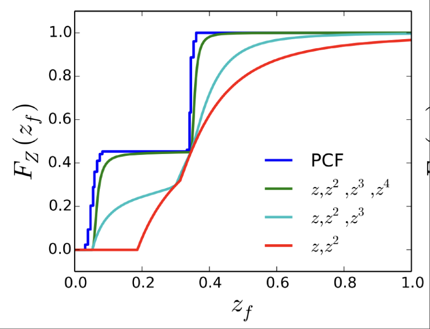
    

矩阴影映射的做法和 VSSM 极其相似，但它要生成关于 $z, z^2, z^3, z^4$ 的阴影图（4 张），并在执行遮挡物搜索和 PCF 期间恢复 CDF。

!!! recommend "优点：能产生非常好的结果。"

!!! bug "缺点"

    - 存储开销大（或许可以接受）
    - 影响到性能（在重建过程中）

    

        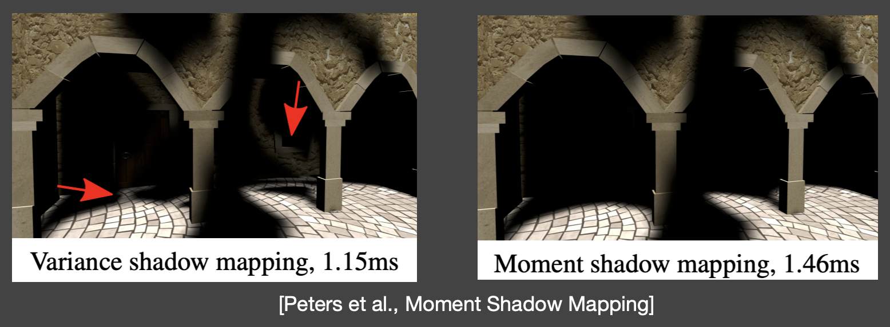
    

