# Real-Time Environment Mapping

???+ info "回顾：环境光照"

    **环境光照**(environment lighting)是表示来自所有方向的直接光照（来自无限远的光）的图像。常见形式有：

    - **球体贴图**(spherical map)
    - **立方体贴图**(cube map)

    <div style="text-align: center">
        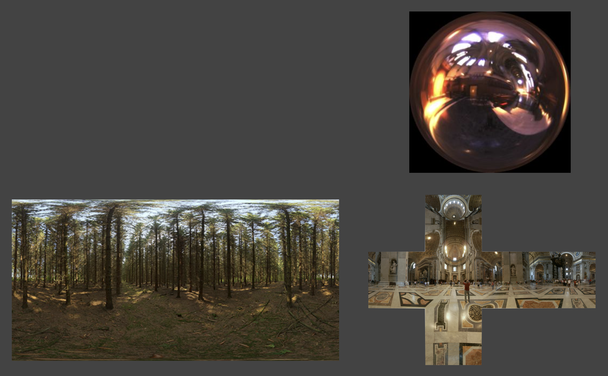
    </div>


## Shading from Environment Lighting

根据环境光照进行着色的技术有一个非正式的名称，叫做**基于图像的光照**(image-based lighting, **IBL**)。对场景中任意一点着色便是在求解**渲染方程**（**不考虑阴影**）：

$$
L_o(p,\omega_o) = \underbrace{\int_{\Omega^+}}_{\substack{\text{For all directions from} \\ \text{the upper hemisphere}}} L_i(p,\omega_i) f_r(p,\omega_i, \omega_o) \cos\theta_i \cancel{V(p, \omega_i)} d\omega_i
$$

通用解法便是**蒙特卡洛积分法**，可以得到近似的数值，但需要大量采样点，因此计算很慢。那么我们能否避免采样呢？

??? tip

    不过最近几年出现了时间、空间的滤波，采样复用等研究进展，使得采样方法得以在实时渲染领域得到应用。尽管如此，我们还是希望尽可能避免做采样。

在着手解决之前先做一些观察吧。注意到：

- 镜面材质的 BRDF -> 只覆盖了很小的球面面积（因为反射光线比较集中）
- 漫反射材质的 BRDF -> 覆盖了大多数球面，且十分平滑（因为反射光线沿四面八方发射）

<div style="text-align: center">
    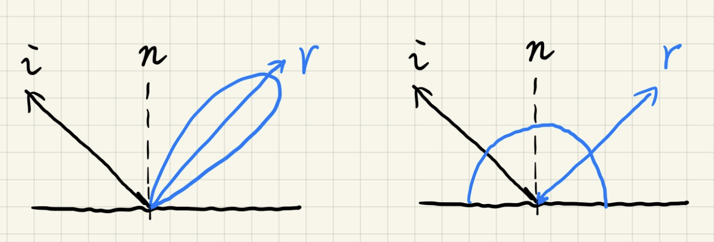
</div>

之前提到的积分近似公式就在这里派上用场了，因为 BRDF 正好满足了近似公式的使用条件（积分区域小，或者函数平滑变化）！

$$
\int_{\Omega} f(x) g(x) \mathrm{d} x \approx \frac{\int_{\Omega_{G}} f(x) \mathrm{d} x}{\int_{\Omega_{G}} \mathrm{d} x} \cdot \int_{\Omega} g(x) \mathrm{d} x
$$

将渲染方程代入，得到（方框标出来的就是光照项）：

$$
L_{o}\left(p, \omega_{o}\right) \approx \boxed{\frac{\int_{\Omega_{f_{r}}} L_{i}\left(p, \omega_{i}\right) \mathrm{d} \omega_{i}}{\int_{\Omega_{f_{r}}} \mathrm{d} \omega_{i}}} \cdot \int_{\Omega^{+}} f_{r}\left(p, \omega_{i}, \omega_{o}\right) \cos \theta_{i} \mathrm{d} \omega_{i}
$$

??? note "回顾近似公式在计算阴影中的应用"

    当时我们分离出来的是可见性函数项。所以要根据情况灵活使用近似公式。

    $$
    L_{o}\left(\mathrm{p}, \omega_{o}\right) \approx \boxed{\frac{\int_{\Omega^{+}} V\left(\mathrm{p}, \omega_{i}\right) \mathrm{d} \omega_{i}}{\int_{\Omega^{+}} \mathrm{d} \omega_{i}}} \cdot \int_{\Omega^{+}} L_{i}\left(\mathrm{p}, \omega_{i}\right) f_{r}\left(\mathrm{p}, \omega_{i}, \omega_{o}\right) \cos \theta_{i} \mathrm{d} \omega_{i}
    $$

拆出来的那一项相当于对环境光照进行了一个**预滤波**(prefiltering)（模糊，渲染之前就算好了）的处理：

- 预生成一组不同过滤的环境光照
- 中间过渡的滤波器大小可通过**三线性插值**近似得到（类似 [Mipmap](../cg/5.md#mipmap)）
    - 比如知道大小为 4x4 和 8x8 的滤波器，可通过插值得到 5x5 大小的滤波器
    - 对于球形贴图，滤波器大小对应了立体角大小

<div style="text-align: center">
    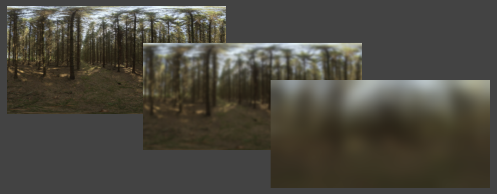
</div>

之后便能查询 **$r$（镜面反射）方向**的预滤波环境光照。

<div style="text-align: center">
    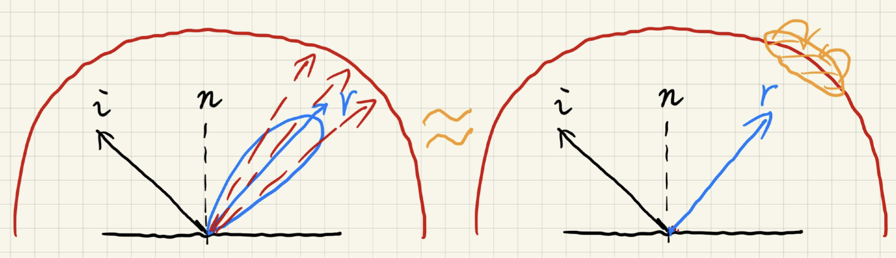
</div>

不过等号右边的第二项依然是一个积分，它也应当避免采样。一种思路是预先计算所有可能变量组合的值，包括**粗糙度**、**颜色（菲涅尔项）**等。但这需要一个维度极高的巨大表格。

??? info "回顾：**微表面 BRDF**"

    <div style="text-align: center">
        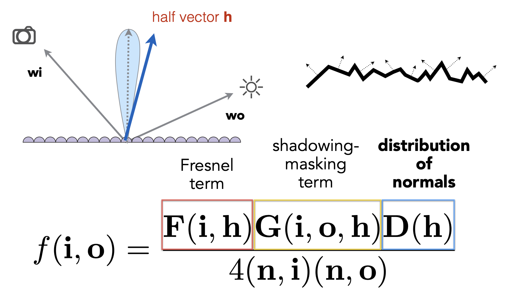
    </div>

    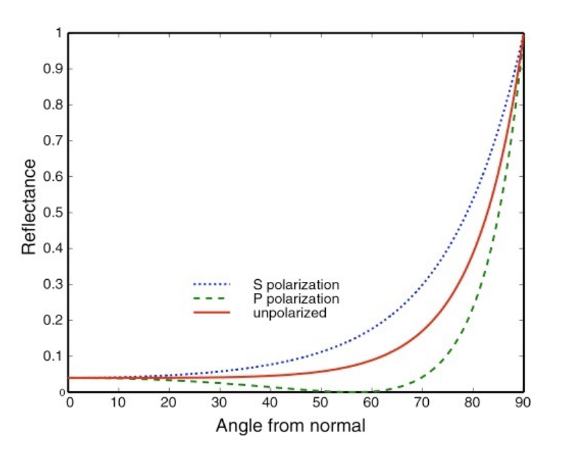{ align=right width=40% }

    - 用 **Schlick 近似**表示菲涅尔项（基础反射率（颜色）$R_0$ 和入射角度 $\theta$）

        $$
        \begin{aligned}
        R(\theta) &= R_0 + (1 - R_0)(1 - \cos \theta)^5 \\
        R_0 &= \left( \frac{n_1 - n_2}{n_1 + n_2} \right)^2
        \end{aligned}
        $$

    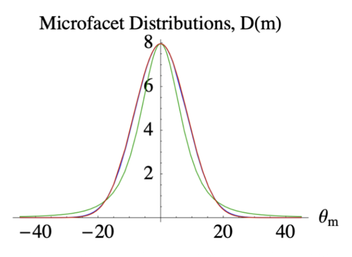{ align=right width=30% }

    - NDF 项以 **Beckmann 分布**为例（粗糙度 $\alpha$，半程向量与法线的夹角 $\theta_h$）

        $$
        D(h) = \frac{e^{-\frac{\tan^2 \theta_h}{\alpha^2}}}{\pi \alpha^2 \cos^4 \theta_h}
        $$

人们发现，如果菲涅尔项采用 Schlick 近似，就可以把「基础颜色」项给提取出来。

$$
\begin{aligned}
\int_{\Omega_{+}} f_{r}\left(p, \omega_{i}, \omega_{o}\right) \cos \theta_{i} \mathrm{~d} \omega_{i} \approx & R_{0} \int_{\Omega_{+}} \frac{f_{r}}{F}\left(1-\left(1-\cos \theta_{i}\right)^{5}\right) \cos \theta_{i} \mathrm{~d} \omega_{i}+ \\
& \int_{\Omega_{+}} \frac{f_{r}}{F}\left(1-\cos \theta_{i}\right)^{5} \cos \theta_{i} \mathrm{~d} \omega_{i}
\end{aligned}
$$

经过这样的转换后，消除了原来积分项对基础反射率的依赖，里面只剩下了两个变量，即粗糙度和入射角度。因此现在预计算的结果可以用一张二维表格（纹理）呈现了。

<div style="text-align: center">
    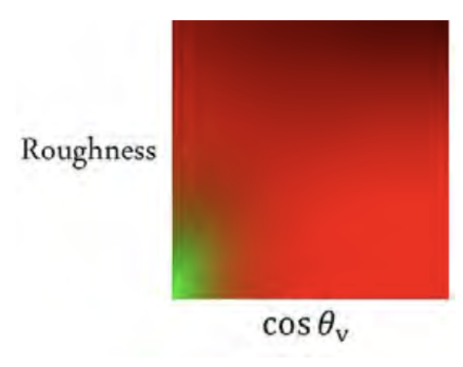
</div>

经过上述努力，我们成功完全避免了采样，并且能得到快速且高质量的结果。

<div style="text-align: center">
    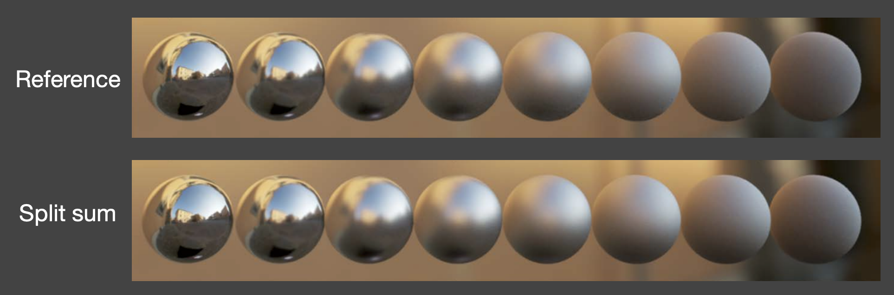
</div>

该方法被称为**分割和**(split sum)近似。之所以取这个名字，是因为工业界中往往采用的是离散形式，但实质上和这里介绍的积分近似是差不多的。

$$
\frac{1}{N} \sum_{k=1}^{N} \frac{L_{i}\left(\mathbf{l}_{k}\right) f\left(\mathbf{l}_{k}, \mathbf{v}\right) \cos \theta_{\mathbf{l}_{k}}}{p\left(\mathbf{l}_{k}, \mathbf{v}\right)} \approx\left(\frac{1}{N} \sum_{k=1}^{N} L_{i}\left(\mathbf{l}_{k}\right)\right)\left(\frac{1}{N} \sum_{k=1}^{N} \frac{f\left(\mathbf{l}_{k}, \mathbf{v}\right) \cos \theta_{\mathbf{l}_{k}}}{p\left(\mathbf{l}_{k}, \mathbf{v}\right)}\right)
$$


## Shadow from Environment Lighting

在实时渲染领域中，一般来说很难实现在环境光照下的阴影。这里面有不同的看法：

- **多光源**问题：阴影贴图的成本与光源数呈线性相关
- **采样**问题：求解可见性项 $V$ 可能很复杂，且无法将它轻易地从环境中分离开来
    - 很难用到之前介绍的近似公式化简（想想那两个条件能否在环境光照中得到满足）
    - 可以尝试用**环境光遮蔽**(ambient occlusion)近似表示，但要求环境光是恒定的（比如要么全白、要么全灰）

业界给出的一种解决方案是仅为最亮的光源生成一张或（少量）阴影贴图。而相关研究有：

- 不完美的阴影贴图(imperfect shadow maps)：实际上是在做间接光照
- 光切割(light cuts)：解决多光源问题
- 实时光线追踪(real-time ray tracing, RTRT)（可能是最终解决方案）：路径追踪 + 去噪
- **预计算辐射传输**(precomputed radiance transfer)（待会儿要介绍的）


## Background Knowledge

### Frequency and Filtering

要用数学表示频率，自然绕不开**傅里叶定理**(Fourier theorem)。傅里叶函数是一系列正弦和余弦函数的加权和（线性组合）。

<div style="text-align: center">
    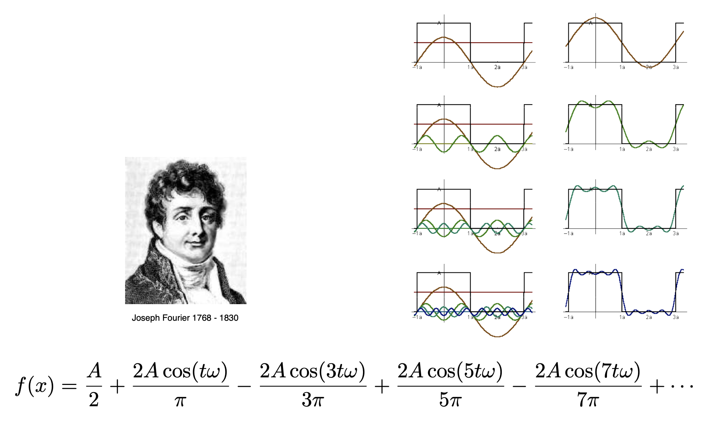
</div>

下面是图像信号频率可视化的结果：

<div style="text-align: center">
    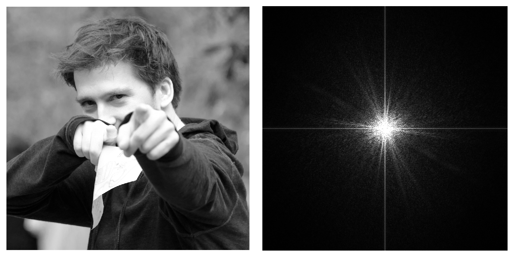
</div>

- 右图中间白色对应人物的头发，因为这块地方的频率发生剧烈变化
- 而背景是黑色的，说明频率变化平缓

而**滤波**(filtering)操作就是指剔除特定频率的一些内容，比如下面通过**低通滤波器**(low-pass filter)滤除了高频信号，因此整张图像变得模糊不清。

<div style="text-align: center">
    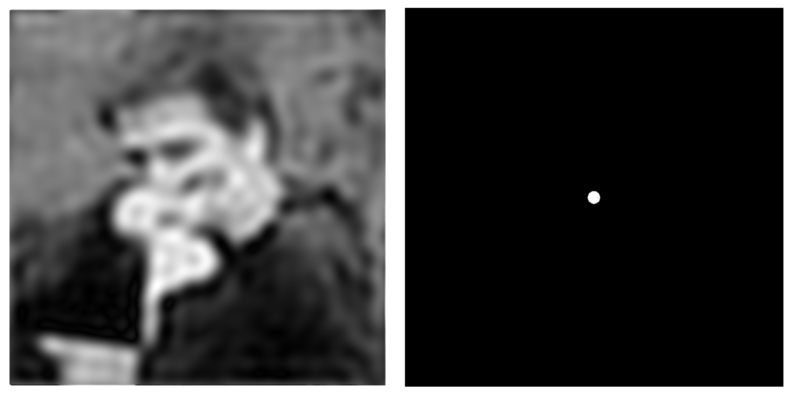
</div>

滤波操作在数学层面上可以用**卷积**(convolution)来表达。**卷积定理**(convolution theorem)表明，时域上（图像和卷积核）的卷积 == 频域上（图像频谱和与卷积核频谱）的乘法。

<div style="text-align: center">
    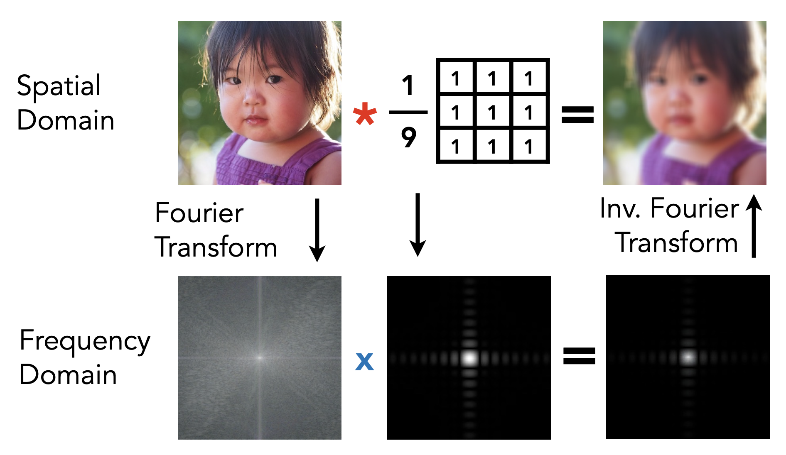
</div>

更一般的理解是：任何乘积的积分（$\int_\Omega f(x)g(x) dx$）都可被视为一种滤波操作。

- 低频意味着函数变化速度慢/平滑/...
- 积分的频率是乘积中**频率最小**的那一项的频率


### Basis Functions

**基函数**(basis functions)是指一组能用于表示其他函数的函数。

$$
f(x) = \sum_i c_i \cdot B_i(x)
$$

例子：傅里叶级数、多项式级数等。


## Real-time Environment Lighting (& Global Illumination)

### Spherical Harmonics (SH)

**球谐函数**(spherical harmonics, **SH**)是指定义在球体上的一组 2D 基函数 $B_i(\omega)$，可类比 1D 情况下的傅里叶级数。

<div style="text-align: center">
    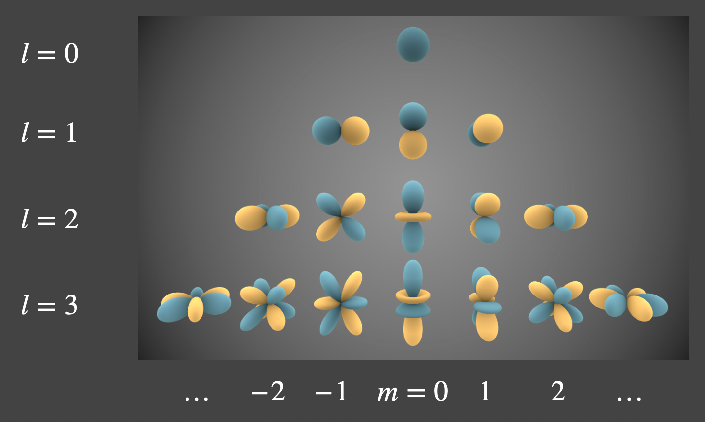
</div>

- 图中的颜色表示值，颜色越发白值越大，并且蓝黄颜色表示正负
- $l$ 表示 SH 的阶数，每一阶有 $2l + 1$ 个基函数（编号从 $-l$ 到 $l$），且前 $n$ 阶 SH 共有 $n^2$ 个基函数
- 每个 SH 基函数与一个多项式关联
- 基函数使用勒让德多项式写的（不过由于太麻烦了所以没给公式）
- **投影**(projection)：获取每个 SH 基函数的系数

    $$
    c_i = \int_\Omega f(\omega)B_i(\omega) d\omega
    $$

- **重建**(reconstruction)：使用（**截断后的**(truncated)）系数和基函数恢复原来的函数

??? info "注"

    也许有读者会想用 2D 的傅里叶变换替代 SH，但这样计算得到的球面就会出现裂缝，效果不是很好。

!!! note "SH 的良好性质"

    - 正交归一性(orthonormal)

        $$
        \int_{\Omega} B_{i}(\mathbf{i}) \cdot B_{j}(\mathbf{i}) \mathrm{d}\mathbf{i} = \begin{cases}
        1 & (i = j) \\
        0 & (i \neq j)
        \end{cases}
        $$
    
    - 简单投影/重建
    - 简单旋转
        - 基函数旋转之后其阶数不变，因此旋转后的基函数可通过同阶基函数的线性组合得到
        - 所以支持任意旋转光照
    
    - 简单卷积
    - 少量基函数：低频

???+ example "例子"

    <div style="text-align: center">
        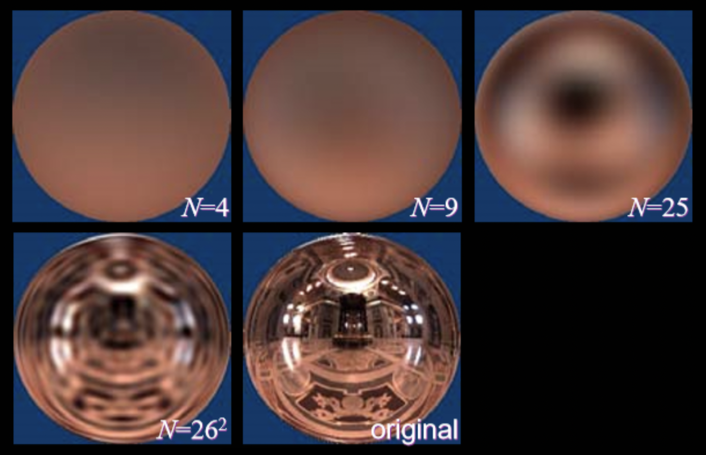
    </div>


### Prefiltered Environment Lighting

预滤波 + 单次查询 == 无滤波 + 多次查询

<div style="text-align: center">
    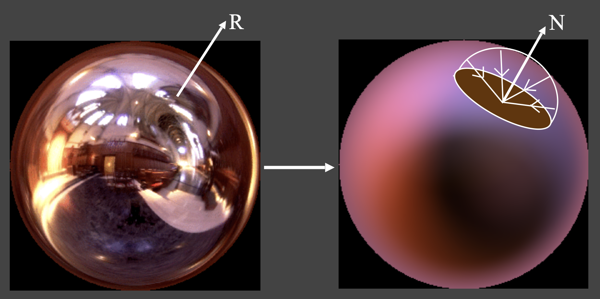
</div>

>右图就是左图滤波后的结果，看起来从高光变成**漫反射**。

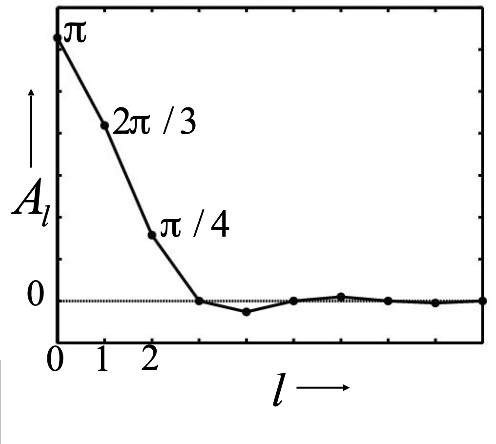{ align=right width=30% }

而**漫反射的 BRDF** 有一个很好的性质：它就像一个**低通滤波器**，此时只需要较少的 SH 就能描述它。

$$
\begin{aligned}
E_{lm} & = A_l L_{lm} \\
A_{l} & = 2\pi \frac{(-1)^{\frac{l}{2}-1}}{(l+2)(l-1)} \left[ \frac{l!}{2^{l} \left( \frac{l}{2}! \right)^{2}} \right] \quad l \text{ is even}
\end{aligned}
$$

如右图所示，可以看到从 $l = 3$ 后，$A_l$ 的值就很接近于 0，也就是说通常只需要前三阶 SH 就能表示漫反射的 BRDF。

下面展示使用 SH 的近似表示结果：

- 只用第 0 阶（1 项）

    <div style="text-align: center">
        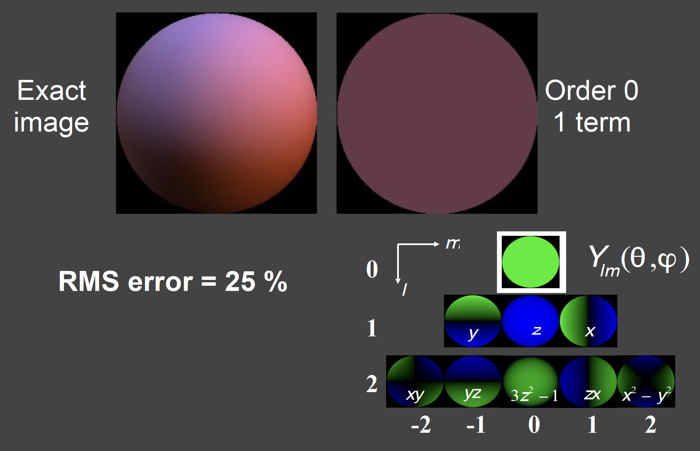
    </div>

- 用到第 1 阶（4 项）

    <div style="text-align: center">
        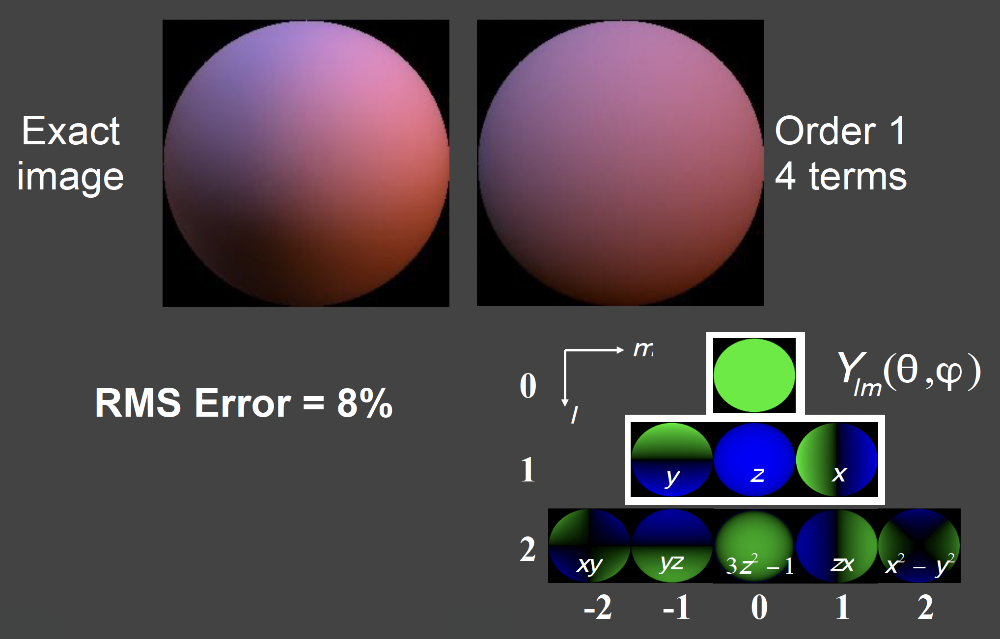
    </div>

- 用到第 2 阶（9 项）

    <div style="text-align: center">
        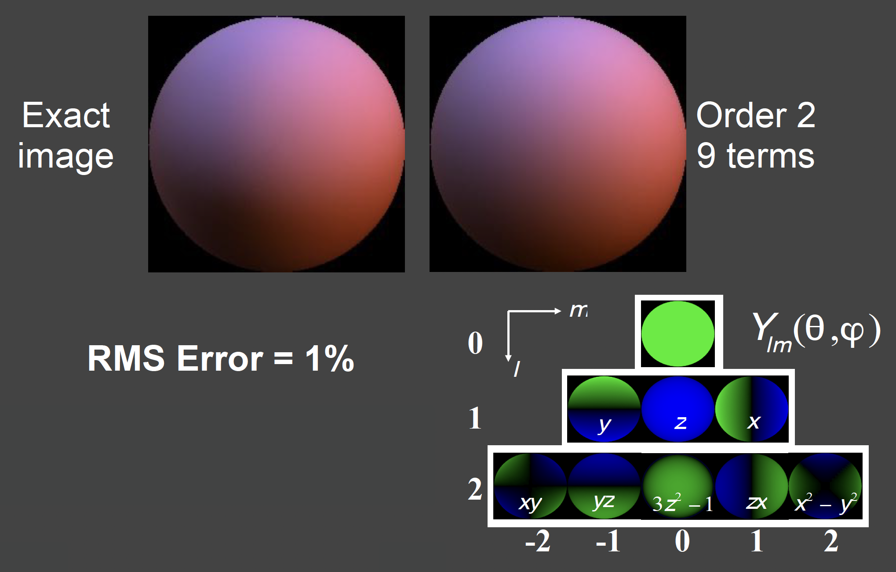
    </div>

结论：对于任意光照，采用前三阶 SH 近似表示漫反射 BRDF 的误差 < 3%。

提出这一方法的作者仅用短短几行代码（一种简单的过程渲染方法，仅包含矩阵-向量乘法和点乘，因此可直接在软件或利用 NVIDIA 的顶点编程硬件实现）就能计算环境光照下任何一点的着色结果。但现在在游戏（比如 Xbox 的 AMPED）、电影（Pixar，Framestore CFC 等）等行业已得到广泛应用。

```cpp
surface float1 irradmat(matrix4 M, float3 v) {
    float4 n = {v, 1} ;
    return dot(n, M*n) ;
}
```

>对应公式：$E(n) = n^t M n$


### Precomputed Radiance Transfer (PRT)

接下来我们便希望上面这趟方法还能用在高光的 BRDF 上，并且要考虑阴影。解决方法便是**预计算辐射传输**(precomputed radiance transfer, **PRT**)。它既可以用于处理环境光照，也能应用于全局光照的实现中（这部分将在下一讲介绍）。

在实时渲染中，人们更愿意把渲染方程写成以下形式：

$$
L(\mathbf{o}) = \int_{\Omega} \underbrace{L(\mathbf{i})}_{\text{lighting}} \underbrace{V(\mathbf{i})}_{\text{visibility}} \underbrace{\rho(\mathbf{i}, \mathbf{o}) \max(0, \mathbf{n} \cdot \mathbf{i})}_{\text{BRDF}} \mathrm{d}\mathbf{i}
$$

<div style="text-align: center">
    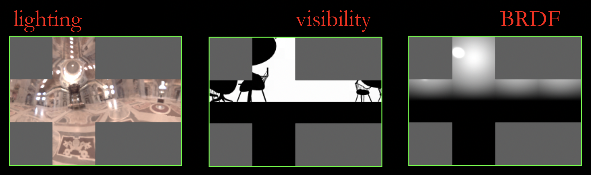
</div>

- $\mathbf{i, o}$ 分别对应入射/观察方向
- 上面标记出来的三个函数全是球面上的函数

假设贴图的分辨率为 6\*64\*64（立方体有 6 个面），如果直接按上述公式算场景中任意一点的着色结果，那么每一点要进行 6\*64\*64 次计算，显然是非常麻烦的事。

有人想到利用基函数的性质，把其中复杂的一些东西预计算出来————这便是 **PRT** 方法。回到前面的渲染方程，现在我们这样来看等号右边的函数：

$$
L(\mathbf{o}) = \int_{\Omega} \underbrace{L(\mathbf{i})}_{\text{lighting}} \underbrace{V(\mathbf{i}) \rho(\mathbf{i}, \mathbf{o}) \max(0, \mathbf{n} \cdot \mathbf{i})}_{\text{light transport}} \mathrm{d}\mathbf{i}
$$

>对于任何一点，光传输是固定不变的，而光照是可变的

- 使用基函数近似表示**光照**(lighting)：$L(\mathbf{i}) \approx \sum l_i B_i(\mathbf{i})$

    <div style="text-align: center">
        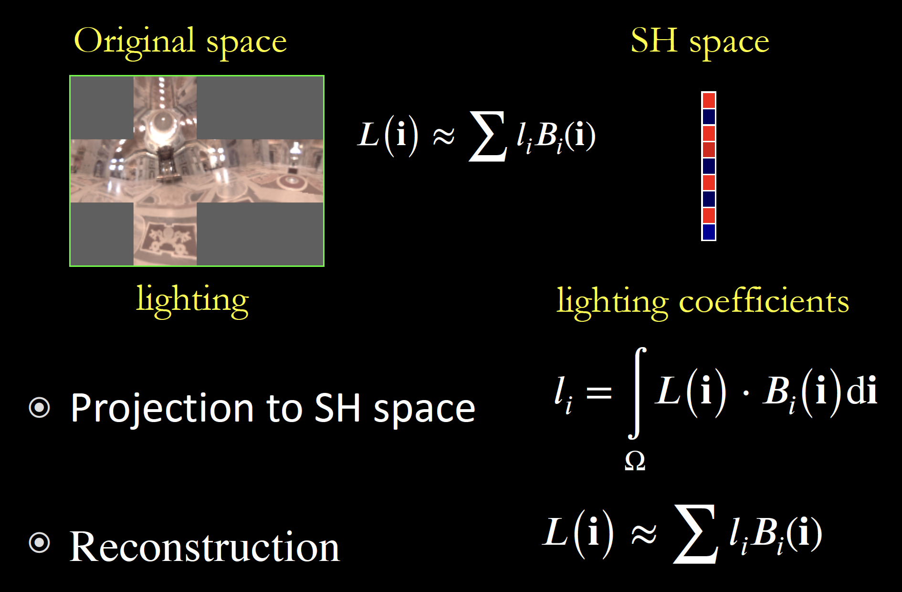
    </div>

- 预计算阶段：计算**光传输**(light transport)，并投影到基函数空间

    <div style="text-align: center">
        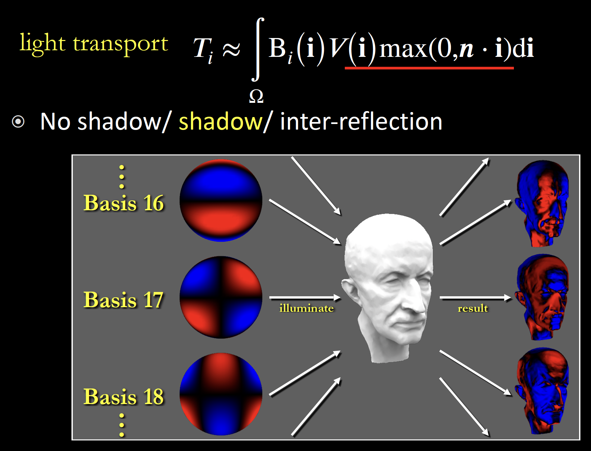
    </div>

- 运行时阶段：点乘（漫发射）或矩阵-向量乘法（镜面反射），下面只考虑前者

    $$
    \begin{aligned}
    L(\mathbf{o}) &= \rho \int_{\Omega} \underline{L(\mathbf{i})} V(\mathbf{i}) \max(0, \mathbf{n} \cdot \mathbf{i}) \mathrm{d}\mathbf{i} \\
    & \Downarrow \quad L(\mathbf{i}) \approx \sum l_i B_i(\mathbf{i}) \\
    L(\mathbf{o}) &\approx \rho \sum_{i} l_{i} \underline{\int_{\Omega} B_{i}(\mathbf{i}) V(\mathbf{i}) \max(0, \mathbf{n} \cdot \mathbf{i}) \mathrm{d}\mathbf{i}} \\
    & \Downarrow \quad \text{Precomputed}\\
    L(\mathbf{o}) &\approx \rho \sum_{i} l_{i} T_{i}
    \end{aligned}
    $$

    - 「实时」意味着可以在着色器中轻易实现

通过这样的转换，原本求解积分的问题被转换为求和问题，计算上简化了许多。

???+ example "例子"

    <div style="text-align: center">
        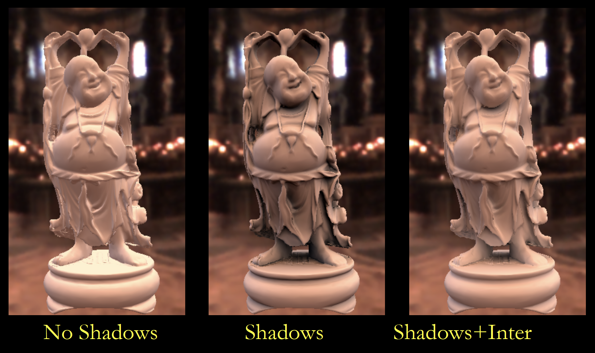
    </div>

    - 有阴影是因为考虑了可见性项
    - 最后阴影 + 相交（Inter）的情况中，后者是指光线可以弹射多次，这要到下一讲再展开介绍

!!! bug "代价"

    「预计算」场景意味着场景中的物体不能动。