# Real-Time Global Illumination

**全局光照**(global illumination, **GI**)很重要，因为它能增强场景的真实感；但同时它也很复杂，如下图所示（来自某篇关于全局光照的综述论文的 teaser image）：

    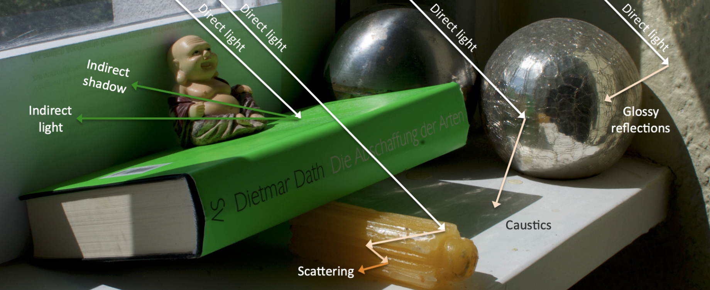

在实时渲染中，人们寻求简单快速的解决方案来处理**单次弹射的间接光照**。

    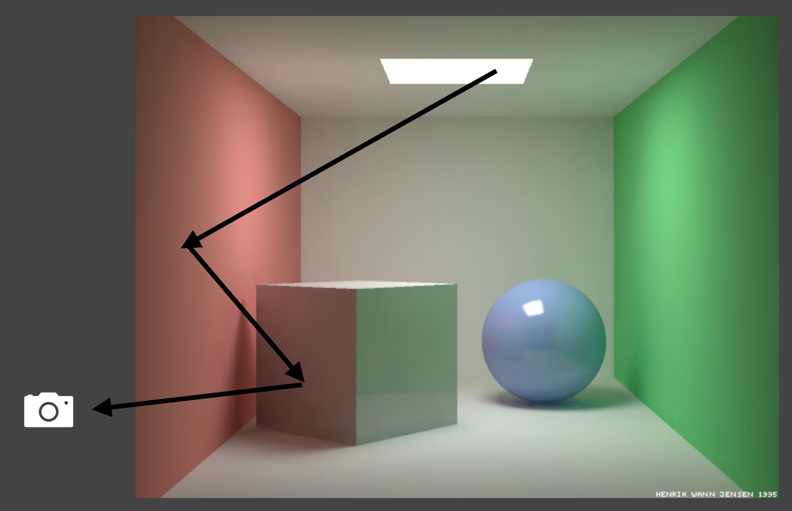

任何直接受光照射的表面都会再次充当光源。

    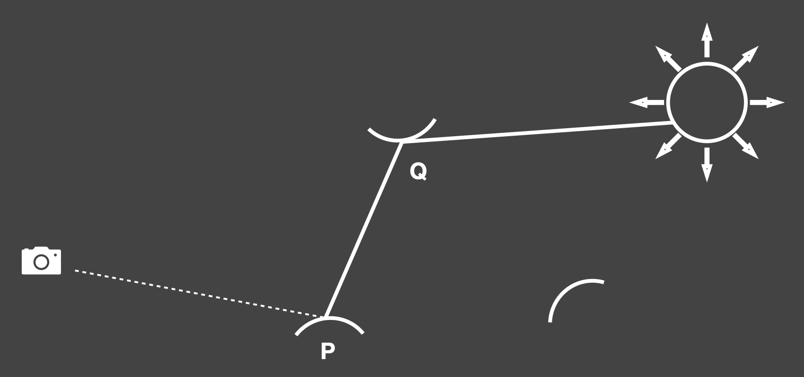

???+ example "经典老图"

    === "直接光照"

        

            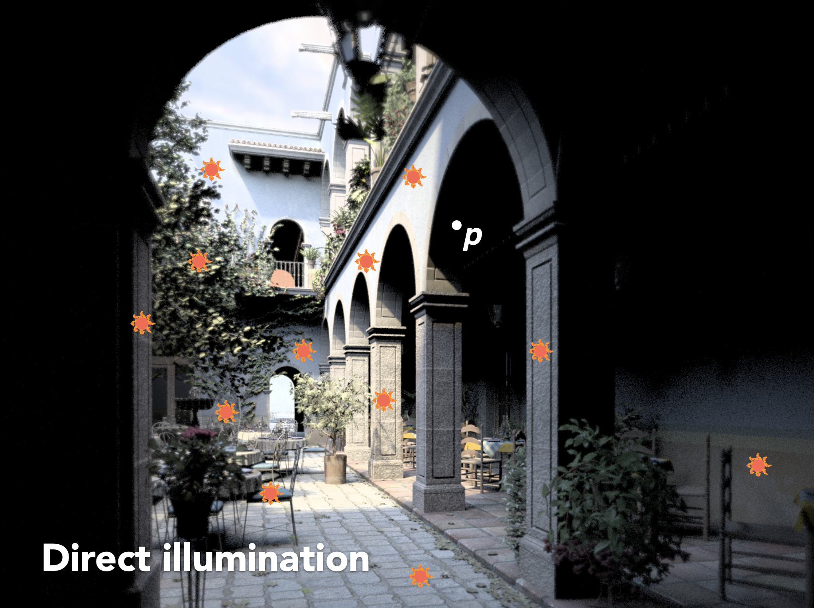
        

    === "单次弹射的全局光照（直接光照 + 间接光照）"

        

            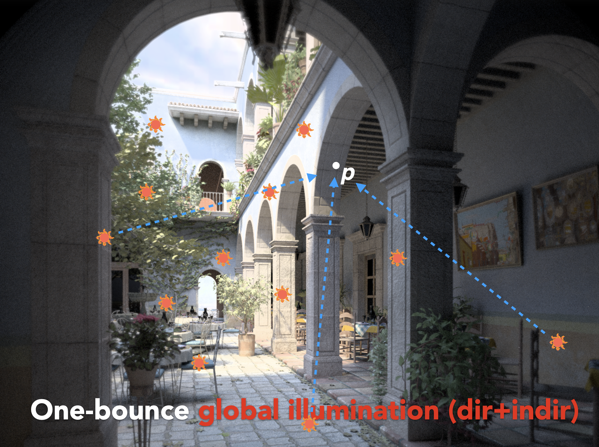
        

        可以看到，如果考虑间接光照，原本在暗处的 p 点就会被其他物体表面反射过来的间接光给照亮。

## GI in 3D

### Reflective Shadow Maps (RSM)

现在来考虑一个问题：要照亮任意点 p，所需的间接光照条件有哪些？（满足这些条件的技术便是**反射阴影贴图**(reflective shadow maps, **RSM**)）

- 哪些面片(surface patch)被直接照亮？
    - 可以借助经典的**阴影贴图**(shadow map)方法解决
    - 阴影贴图中的每个像素都是一个小的面片
    - 每个像素的确切出射辐射率是已知的，但是只知道沿着相机方向的辐射度
    - 我们假设所有反射物(reflectors)都是**漫反射**的，因此出射辐射率是沿各个方向均匀分布的

- 每个面片对点 p 的贡献是多少？然后汇总所有面片的贡献
    - 对覆盖面片的立体角进行积分 -> 对面片面积的积分

        

            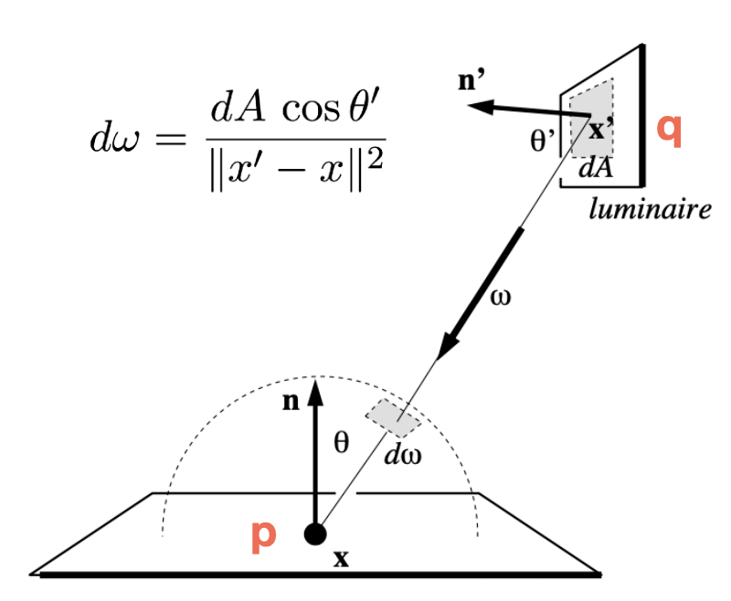
        

        $$
        \begin{aligned}
        L_{o}\left(\mathrm{p}, \omega_{o}\right) & =\int_{\Omega_{\text {patch }}} L_{i}\left(\mathrm{p}, \omega_{i}\right) V\left(\mathrm{p}, \omega_{i}\right) f_{r}\left(\mathrm{p}, \omega_{i}, \omega_{o}\right) \cos \theta_{i} \mathrm{~d} \omega_{i} \\
        & =\int_{A_{\text {patch }}} L_{i}(\mathrm{q} \rightarrow \mathrm{p}) V\left(\mathrm{p}, \omega_{i}\right) f_{r}\left(\mathrm{p}, \mathrm{q} \rightarrow \mathrm{p}, \omega_{o}\right) \frac{\cos \theta_{p} \cos \theta_{q}}{\|q-p\|^{2}} \mathrm{~d} A
        \end{aligned}
        $$

    - 对于漫反射面片
        - $f_r = \rho / \pi$
        - $L_i = f_r \cdot \dfrac{\Phi}{dA}$（$\Phi$ 表示入射通量或能量）
        - 因此公式可以简化为：

            $$
            E_p(x, n) = \Phi_p \frac{\max\{0, \langle n_p | x - x_p \rangle\} \max\{0, \langle n | x_p - x \rangle\}}{\|x - x_p\|^2}
            $$

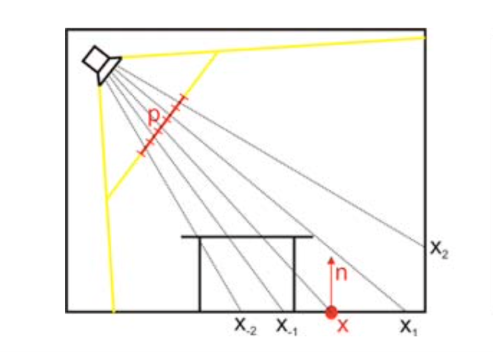{ align=right width=30% }

并非所有 RSM 内的像素点都能产生贡献，比如在以下情况中就失效了：

- 可见性（被遮挡）
- 方向（不对）
- 距离（过远）
    - 所以对于每一个着色点，只去找离离它较近的面片
    - 一个大胆的假设：用两点阴影贴图上的深度值大小来估计两点在世界坐标系中的距离

之所以做出这种假设，是为了加速计算，以减少计算贡献某一点 p 的像素数量。对于更大范围的查询，可以借助 [PCSS](3.md#percentage-closer-soft-shadows)的第 1 步和第 3 步来实现加速。不过原论文采用了不太一样的方法，这里不展开介绍。

    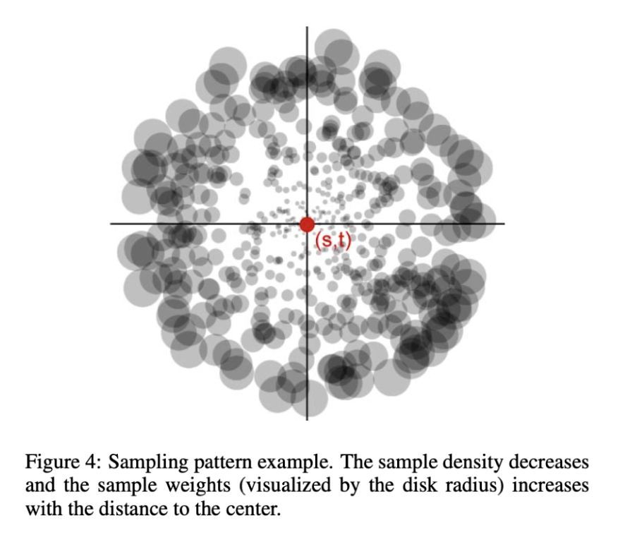

RSM 里往往会记录深度、世界坐标、发现、光照通亮等属性值。

    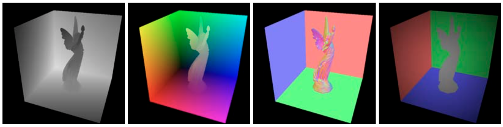

???+ example "例子"

    RSM 通常用于实现游戏中的手电筒(flashlight)灯光。

    

        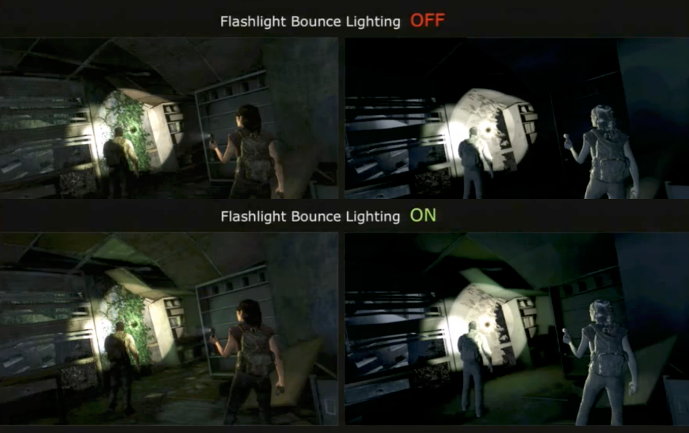
    

!!! success "优点：易于实现"

!!! bug "缺点"

    - 性能随光源数量线性衰减
    - 无法为间接光照进行可见性检查
    - 设置了多项假设，包括反射体是漫反射的、用深度表示距离等
    - 采样率与画质间的权衡

### Light Propagation Volumes (LPV)

**光传播体积**(light propagation volume, **LPV**)技术在 CryEngine 3 被首次引入（用于游戏《孤岛危机》中（~~显卡危机说是~~）），它在保持高性能的同时能实现高质量的渲染结果。

???+ example "例子"

    

        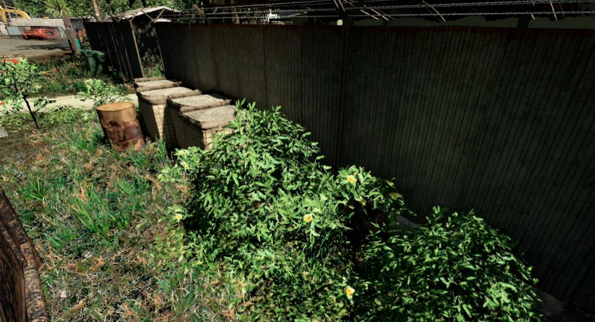
    

LPV 要解决的关键问题是查询任意着色点在任意方向上的辐射度。其思路是：光（辐射度）沿直线传播且不改变方向。对应的实现方案为采用 3D 网格（每个格子就是一个体素(voxel)），将辐射从直接被光照到的表面传播至其他任何位置上。

    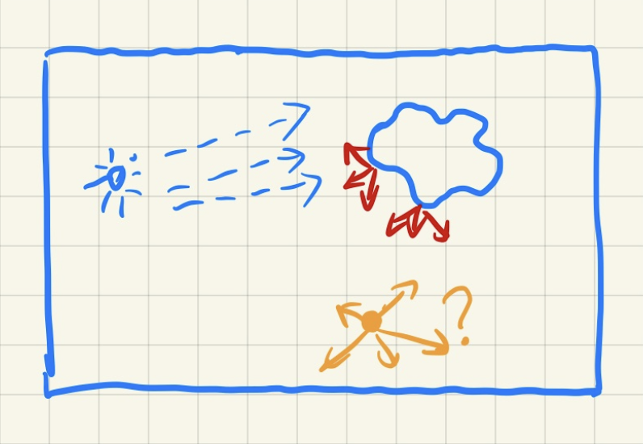

具体步骤如下：

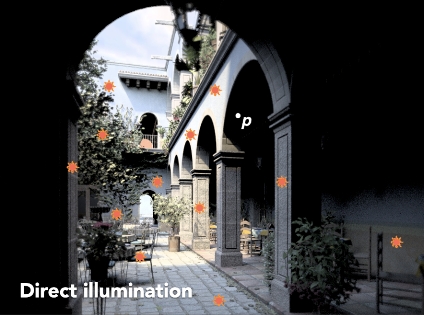{ align=right width=30% }

- 生成辐射点集的场景表示
    - 寻找被直接照亮的表面
    - 使用 RSM 就足够了
    - 可以采用更少的漫反射面片数（虚拟光源）

 

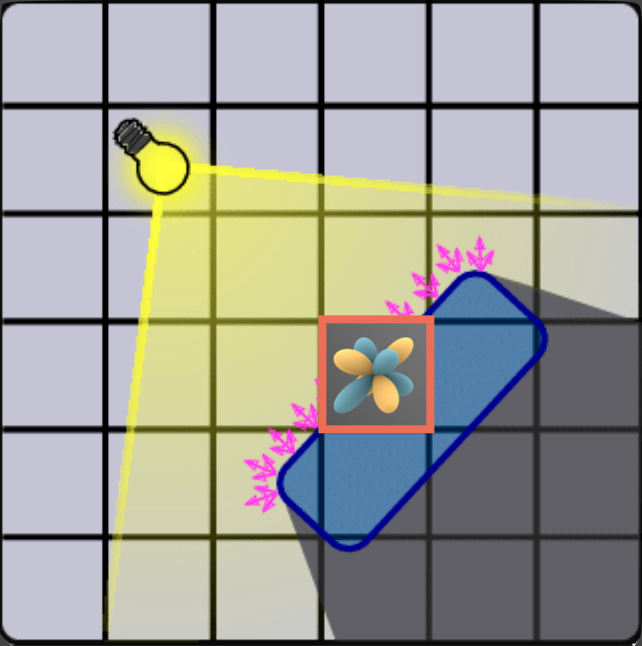{ align=right width=30% }

- 将虚拟光源点云（接收到直接光照的点）注入到辐射体积中
    - 将场景预分割为 3D 网格
    - 对每个网格单元，找出其内部包含的虚拟光源
    - 对不同朝向的辐射度分布求和
    - 投影至前两阶 SH 函数（共 4 个基函数）来压缩

  

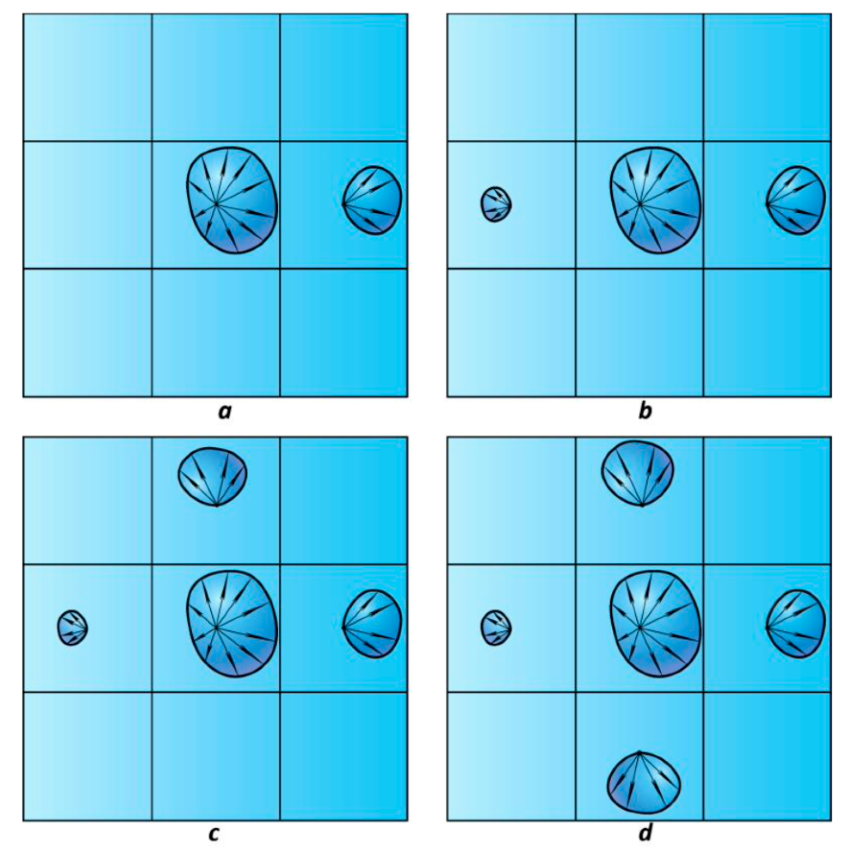{ align=right width=30% }

- 体素化辐射传播
    - 对于每个网格单元，收集从其六个面接收到的辐射度
    - 求和后，再次用 SH 表示
    - 重复此传播过程数次，直至体积内的状态趋于稳定（一般迭代四五次就稳定了）

- 使用最终光传播体积进行场景照明
    - 对于任意着色点，确定其所在的网格单元
    - 获取该网格单元中的入射辐射度（来自所有方向）
    - 着色

???+ bug "问题"

    如下图所示，假设 p 点是能被直接照明的，那么在 p 点反射的光线一定是向左运动的，不可能照亮墙壁右侧。但问题是墙的左右两侧都在同一个网格内，所以墙的右侧和 p 点的辐射度是一样的，那么右侧就会被照亮，这显然是不合理的。

    

        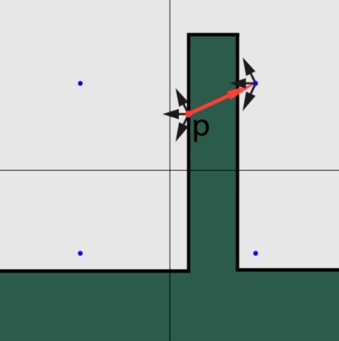
    

    也就是说，只要模型几何体比划分的网格还要细，就会出现**漏光**(light leaking)现象。解决方法是将网格划分得更细，但会带来额外的存储开销以及计算传播的开销。

    

        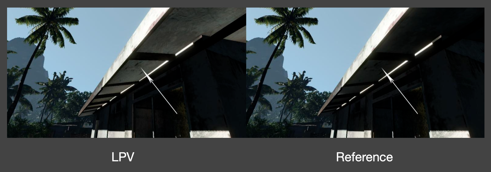
    

???+ example "例子"

    

        
    

### Voxel Global Illumination (VXGI)

第三种方法是**体素全局光照**(voxel global illumination, **VXGI**)。它和 RSM 一样是一种两趟算法，但和 RSM 有两点不同：

- 直接照亮的像素（面片）->（分层的）体素
    - 体素化整个场景（下图所示的一个个小格子）
    - 构建一个分层结构（类似 BVH）

    

        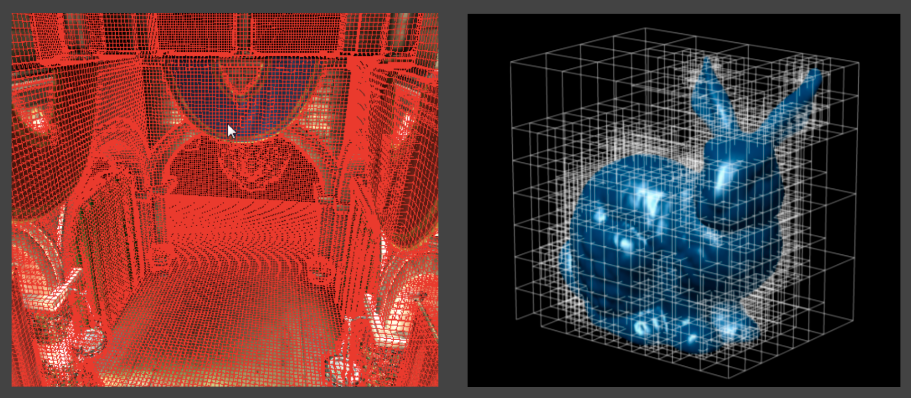
    

- 在 RSM 上采样（可能不准确）-> 从相机出发，在 3D 空间中追踪反射锥体

VXGI 的两趟过程具体为：

1. 来自光源
    - 在每个体素中存储入射光线与法线的分布情况
    - 在层级结构上进行更新

    

        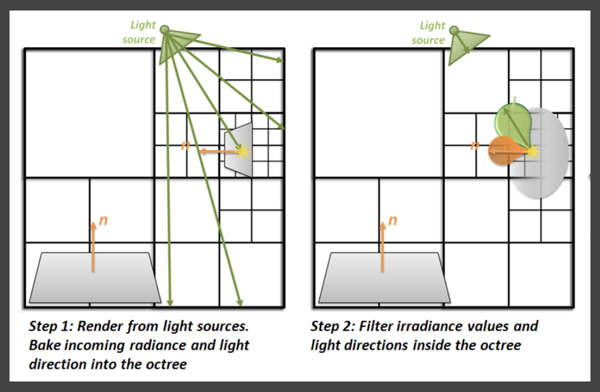
    

2. 来自相机
    - 对于金属光泽表面，沿反射方向追踪一个锥体
    - 根据（不断增大的）锥体大小查询层级结构

    

        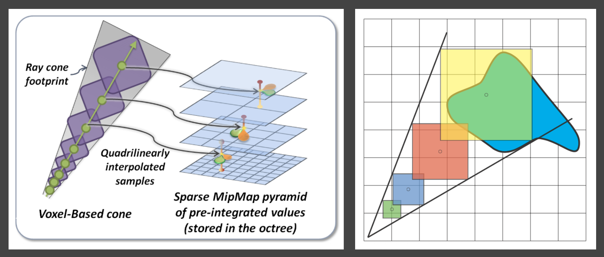
    

    - 对于漫反射，需追踪多个锥体（比如 8 个）

    

        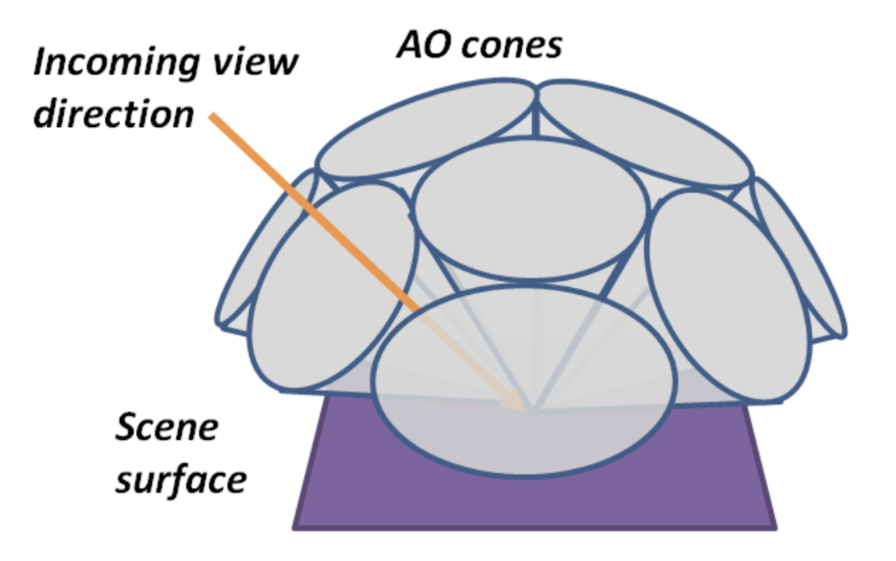
    

??? example "例子"

    可以看到渲染结果的质量很高，近乎媲美光线追踪。

    

        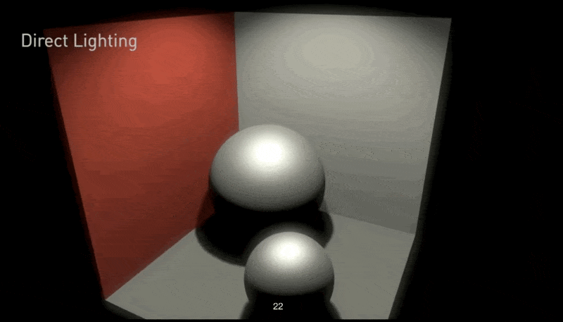
    

    

        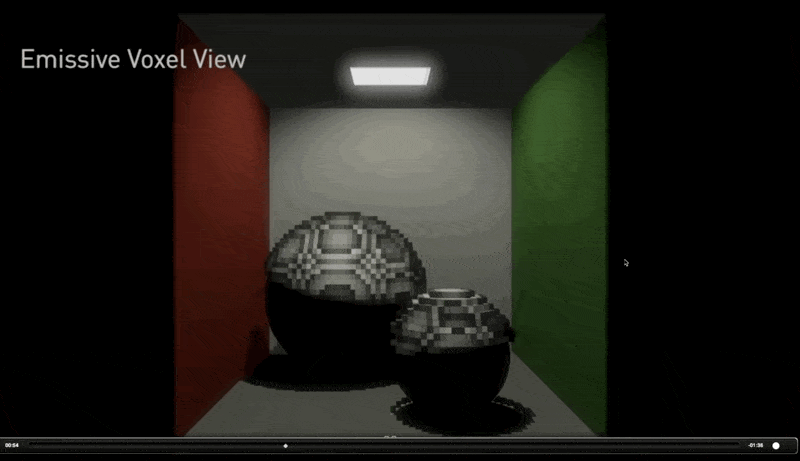
    

    

        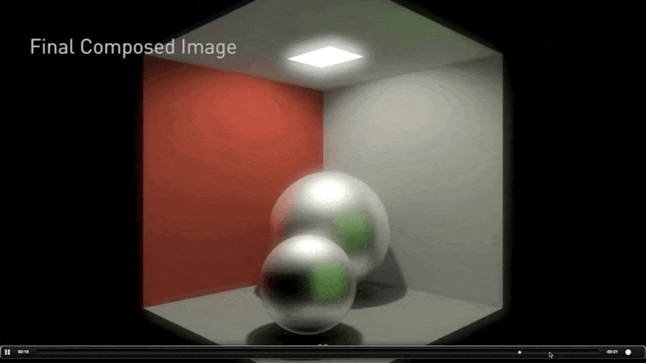
    

但由于开销较大（对整个场景体素化，若考虑到动态物体则问题还要复杂），因此 VXGI 的应用有限。

## GI in Screen Space

「**屏幕空间**」(screen space)的意思是指仅使用来自屏幕的信息，即对已存在的渲染结果（直接光照）进行**后处理**(post processing)。

???+ example "例子"

    

        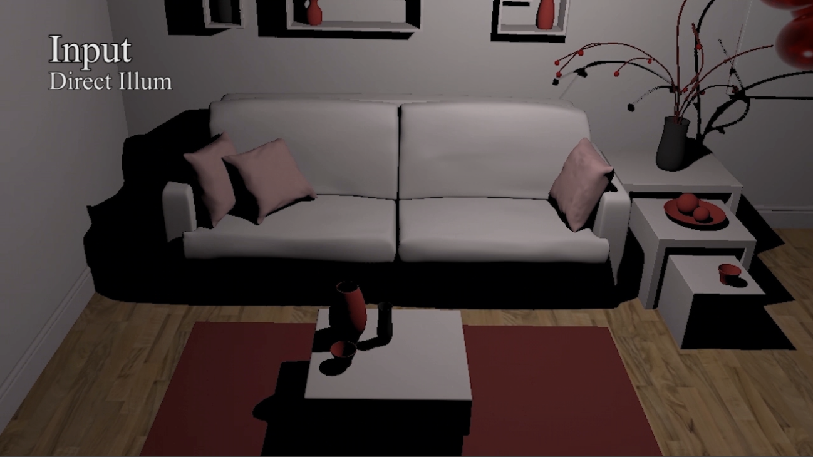
    

### Screen Space Ambient Occlusion (SSAO)

和 LPV 一样，**屏幕空间环境光遮蔽**(screen space ambient occlusion, **SSAO**)技术也是由 Crytek 公司首次引入。

???+ example "例子"

    

        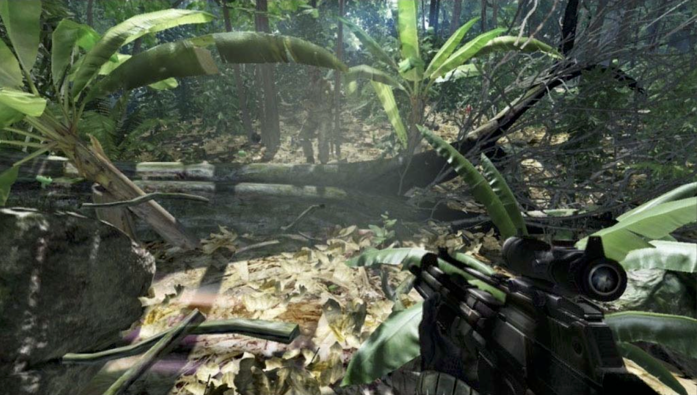
    

之所以要用到环境光遮蔽（AO），是因为这种技术实现成本低，但同时能增强玩家对物体相对位置的感知。

???+ example "例子"

    显然，左边这列图用到了 AO，右边这列没用到。

    

        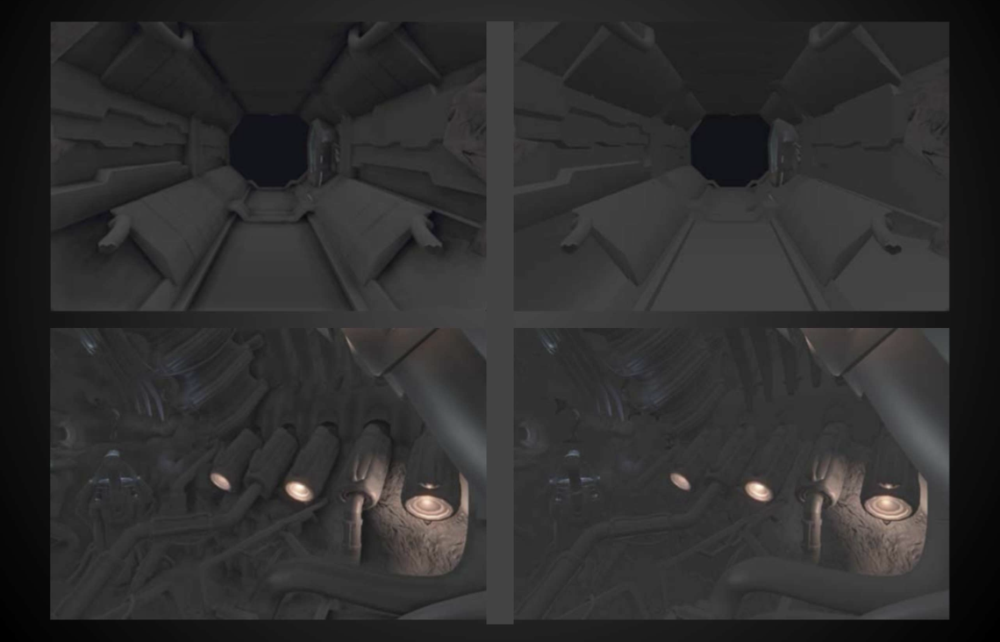
    

而 SSAO 是在屏幕空间上实现 GI 近似表示的一种方法。它的关键思路包括：

- 由于我们无法得知入射的间接光照，所以先假设对于每个着色点，对于所有方向的光照都是恒定的（这就和 Blinn-Phong 反射模型的假设一样）

    

        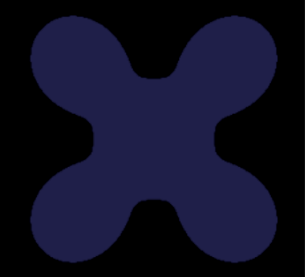
    

- 考虑到不同着色点在不同方向上的**可见性差异**

    

        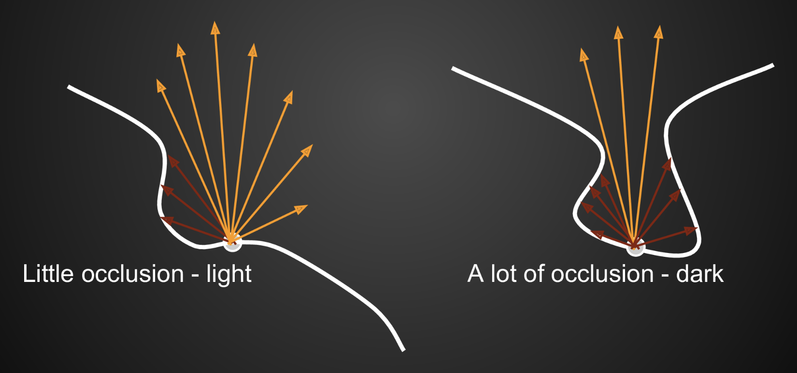
    

    ???+ example "例子"

        

            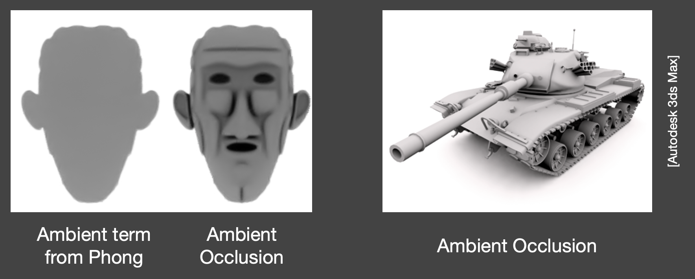
        

- 假设材质是漫反射的

接下来我们深入 SSAO 的理论部分——依旧渲染方程起手：

$$
L_{o}(\mathrm{p}, \omega_{o}) = \int_{\Omega^{+}} L_{i}(\mathrm{p}, \omega_{i}) f_{r}(\mathrm{p}, \omega_{i}, \omega_{o}) V(\mathrm{p}, \omega_{i}) \cos \theta_{i} \mathrm{d} \omega_{i}
$$

并且利用经典的「RTR 近似公式」（这是闫老师取的黑话，正式场合中不要这么叫）$\int_{\Omega} f(x)g(x) \,\mathrm{d}x \approx \dfrac{\int_{\Omega_G} f(x) \,\mathrm{d}x}{\int_{\Omega_G} \,\mathrm{d}x} \cdot \int_{\Omega} g(x) \,\mathrm{d}x$，将可见性项分离出来：

$$
\begin{aligned}
L_o(\mathrm{p}, \omega_o) \approx & \color{cornflowerblue}{\frac{\int_{\Omega^+} V(\mathrm{p}, \omega_i) \cos \theta_i \mathrm{d} \omega_i}{\int_{\Omega^+} \cos \theta_i \mathrm{d} \omega_i}} \cdot \\
& \color{orange}{\int_{\Omega^+} L_i(\mathrm{p}, \omega_i) f_r(\mathrm{p}, \omega_i, \omega_o) \cos \theta_i \mathrm{d} \omega_i}
\end{aligned}
$$

- 蓝色部分 $\stackrel{\triangle}{=} k_A = \dfrac{\int_{\Omega^+} V(p, \omega_i) \cos \theta_i \text{d} \omega_i}{\pi}$（即来自所有方向的加权平均可见性值 $\overline{V}$）
- 橙色部分 = $L_i^{\text{indir}}(p) \cdot \dfrac{\rho}{\pi} \cdot \pi = L_i^{\text{indir}}(p) \cdot \rho$（对 AO 而言是常量）

因此环境光就被近似表达为**可见性均值与某个常量的乘积**。接下来我们进行更深一步的理解：

- RTR 近似公式可以简写为：

    $$
    \int_\Omega f(x)g(x) \text{d}x \approx \overline{f(x)} \cdot \int_\Omega g(x) \text{d}x
    $$

    其中 $\overline{f(x)}$ 就是 $f(x)$ 在积分区间 $G$ 上的平均值。由于 $G = L \cdot f_r$ 就是一个常数（$L$ 为间接光照），因此在 AO 中，这种近似实际上是能得到准确值的。

- 另一个问题是可以看到近似后的渲染方程中三个 $\text{d}\omega_i$ 前都有一个 $\cos \theta_i$ 项，其中蓝色部分的两项是不能消去的，因为 $\cos \theta_i \text{d}\omega_i$ 合在一起表示一个**投影立体角**(projected solid angle) $\text{d}x_\perp$
    - 单位半球 -> 单位圆盘
    - 投影立体角的积分 == 单位圆盘的面积 == $\pi$，这就解释了橙色部分的计算

    

        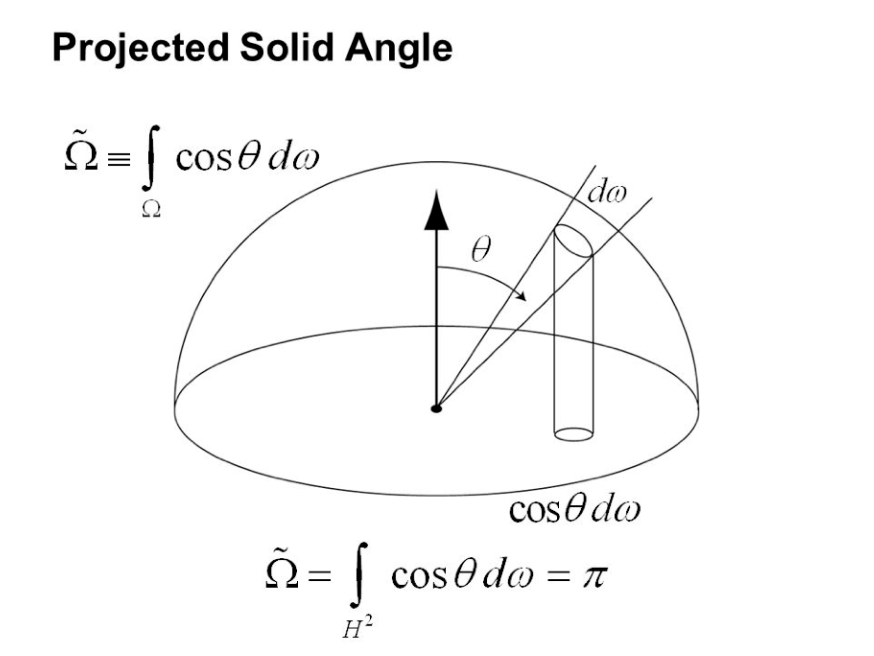
    

现在让我们以更简单的视角来理解整个过程：

- 均匀入射光照 $L_i$ 是常量
- 漫反射 BRDF $f_r = \dfrac{\rho}{\pi}$ 也是常量
- 因此将这两项从积分中提取出来，得到：

    $$
    \begin{aligned}
    L_{o}\left(\mathrm{p}, \omega_{o}\right) & =\int_{\Omega^{+}} L_{i}\left(\mathrm{p}, \omega_{i}\right) f_{r}\left(\mathrm{p}, \omega_{i}, \omega_{o}\right) V\left(\mathrm{p}, \omega_{i}\right) \cos \theta_{i} \mathrm{~d} \omega_{i} \\
    & =\frac{\rho}{\pi} \cdot L_{i}(p) \cdot \int_{\Omega^{+}} V\left(\mathrm{p}, \omega_{i}\right) \cos \theta_{i} \mathrm{~d} \omega_{i}
    \end{aligned}
    $$

接下来该考虑如何实时计算遮挡值 $k_A(p)$。先来比较对象空间和屏幕空间各自的特点：

- 在对象空间中（世界坐标系）
    - 对几何体进行射线投射(raycast)
    - 速度慢，需要简化，以及/或者空间数据结构
    - 取决于场景复杂度

- 在屏幕空间中
    - 在渲染后处理中完成
    - 无需预处理
    - 不依赖场景复杂度
    - 简单
    - 非物理精确

一个比较直观的方法是：对于着色点，在半径为 $R$ 的半球范围内计算局部遮挡。这种方法在室内场景等封闭区域中效率更高且效果更好。

    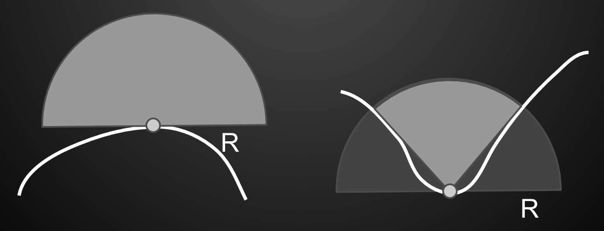

而 SSAO 的做法是利用现成的**深度缓冲区**（z-buffer）作为场景几何的近似：在每个像素周围的球体内采样，并与缓冲区进行对比测试。

    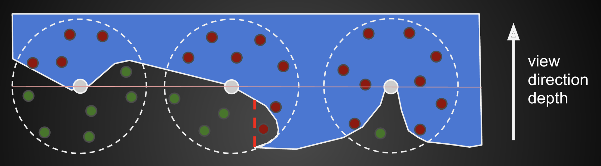

- 若超过半数采样点位于内部，则应用 AO，其强度取决于通过和未通过深度测试的采样点比例
- 由于无法获取法线信息，此处使用整个球体而非半球体进行采样
- **虚假遮挡**(false occlusions)：由于是对场景几何的近似，所以可能存在判定错误的情况，比如下图红线后的那个点明明是看得到的，却被认为是在内部的

    

        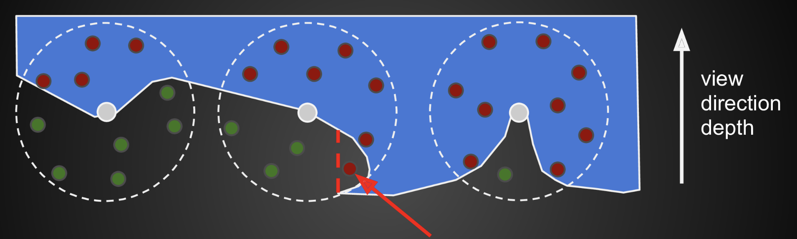
    

    ???+ example "例子"

        可以看到，由于只能获取屏幕信息，所以 SSAO 误以为石凳会对地板有一个 AO，所以石凳在地板上产生阴影，这看起来很不真实。

        

            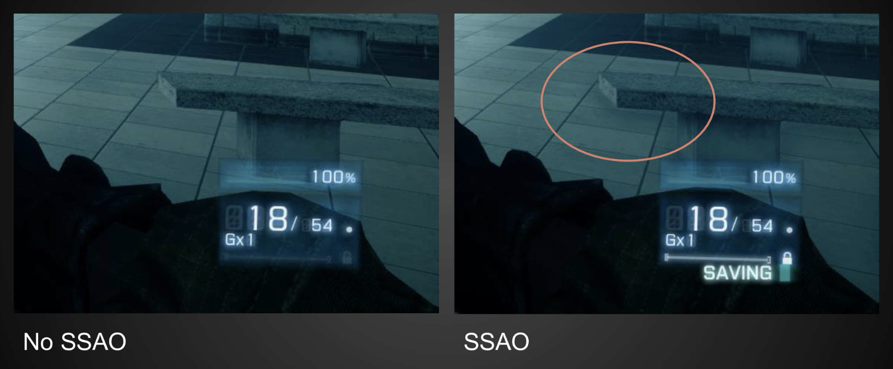
        

- 虽然采样点未按余弦加权（因此物理上不准确），但视觉效果上没啥问题

!!! note "采样点选择的注意事项"

    - 采样点越多，精度越高
    - 所以要想获得良好渲染效果就需要大量采样点，但出于性能考虑，通常仅使用 16 个左右
    - 采用随机纹理位置以避免带状伪影问题
    - 若结果带有噪点，可通过对边缘进行模糊处理

        ???+ example "例子"

            === "模糊前"

                

                    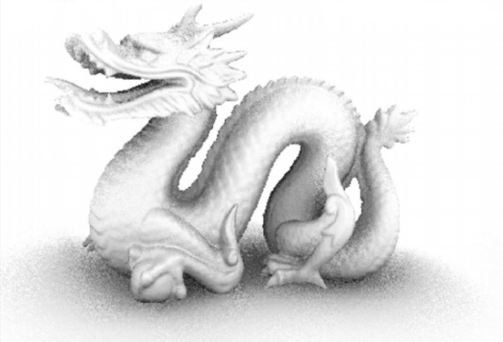
                

            === "模糊后"

                

                    
                

#### Horizon Based Ambient Occlusion (HBAO)

如果得知每个着色点的法线信息，那我们就可以实现更加精确的 AO，这种方法就是**基于水平线的环境光遮蔽**(horizon based ambient occlusion, **HBAO**)。相比 SSAO，它借助法线信息，只在与法线垂直的平面上方的半球区域内采样（可通过余弦加权实现）。

    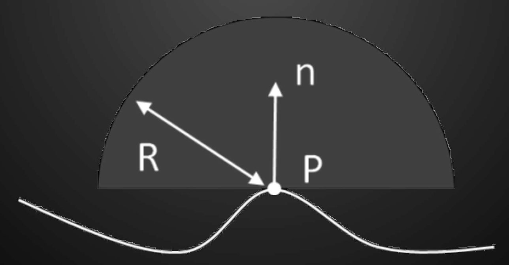

???+ example "效果比对"

    === "无 SSAO"

        

            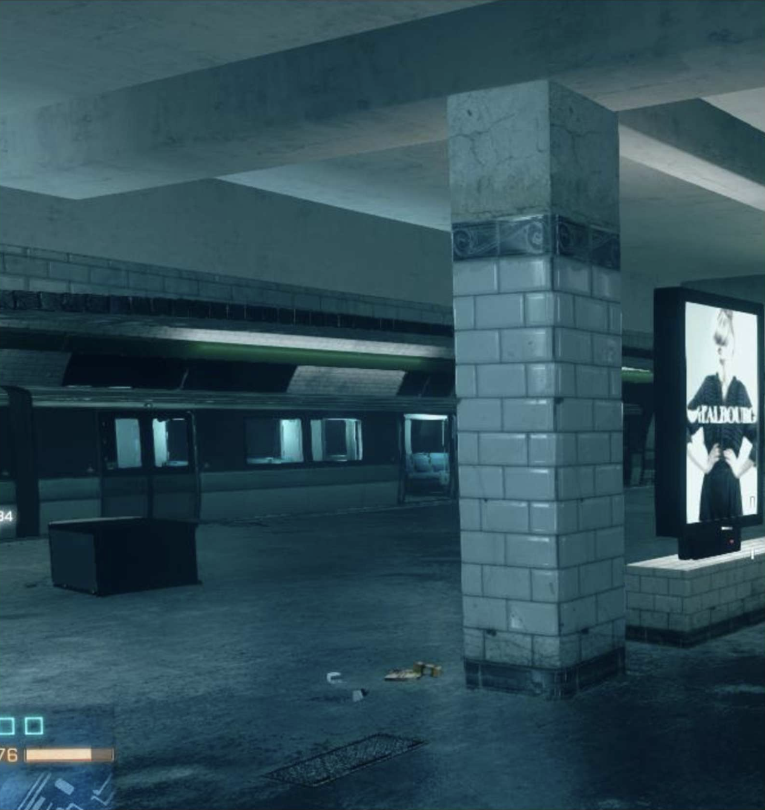
        

    === "SSAO"

        

            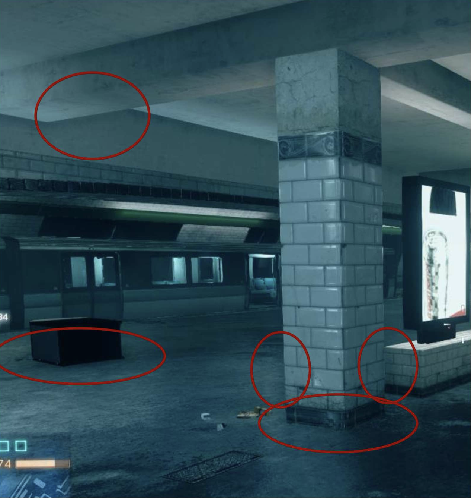
        

    === "HBAO"

        

            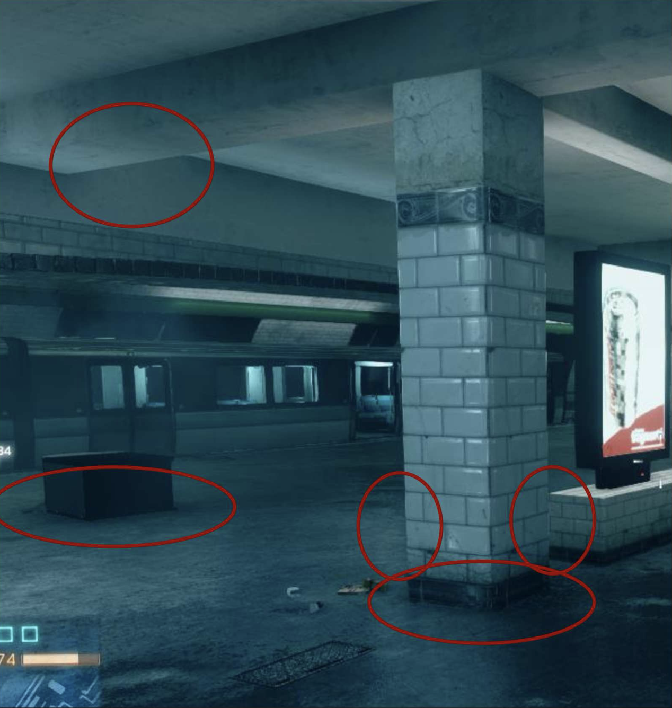
        

### Screen Space Directional Occlusion (SSDO)

### Screen Space Reflection (SSR)
