# Real-Time Ray Tracing

## Real-Time Ray Tracing

### Basic Idea

>RTR 领域某笑话——人们宣称：“光线追踪是未来，并且将一直会是未来。”

不过 2018 年，NVIDIA 宣布了 GeForce RTX 系列（图灵架构(Turing architecture)）显卡，老黄说会开启一个 2500 亿美元的市场（~~现在来看，他根本没想到 AI 会让 NVIDIA 的年收入接近这个数字~~）。

<div style="text-align: center">
    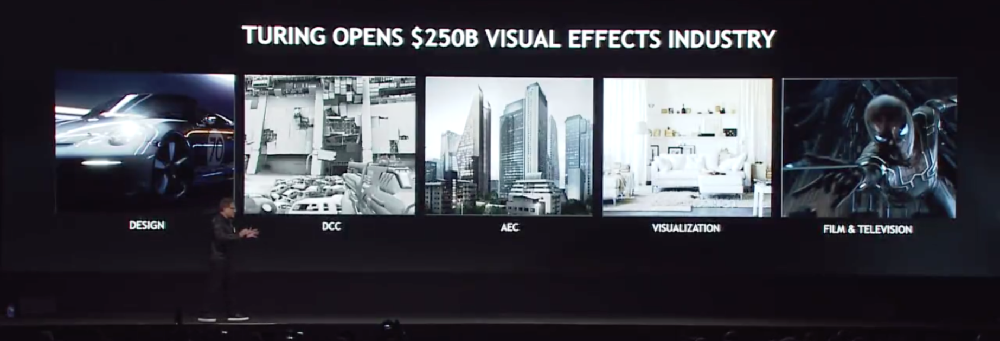
</div>

RTX 能做以下事情（一些关于 **RTRT**（实时光线追踪）的 demo）：

<div style="text-align: center">
    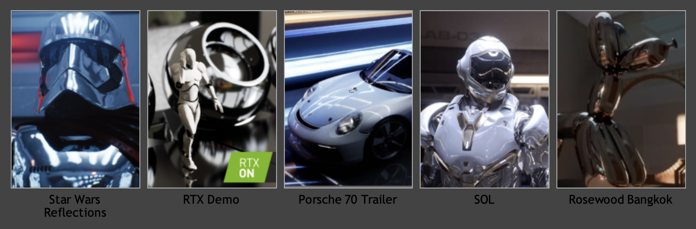
</div>

实际上，RTX 能实现高级的**光线追踪**效果：

<div style="text-align: center">
    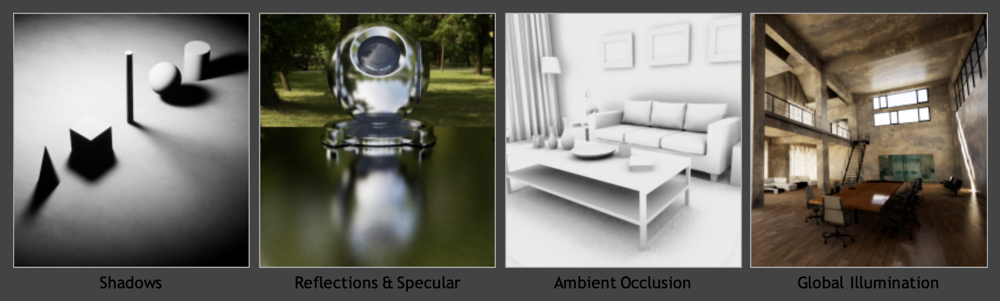
</div>

之所以 RTX 系列显卡在光线追踪上取得突破性进展，是因为它有一些有利于提升光线追踪的硬件，比如**张量核心**(tensor core)等。它能做到每秒追踪 10G（100 亿）根光线，相当恐怖！

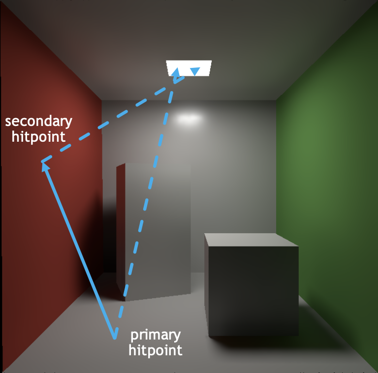{ align=right width=30% }

在实时应用中，这就对应了一个**每像素采样**(sample per pixel, **SPP**)。单个 SPP 的路径追踪包括：

- 1 次光栅化（主）
- 1 条光线（主可见性）
- 1 条光线（二次弹射）
- 1 条光线（次可见性）

RTRT 本身其实并没有多大创新，它的突破来自硬件能力的升级。由于路径追踪用的是蒙特卡洛积分法，自然无法避免噪点问题。所以 RTRT 的一项关键技术是**降噪**(denoising)。

<div style="text-align: center">
    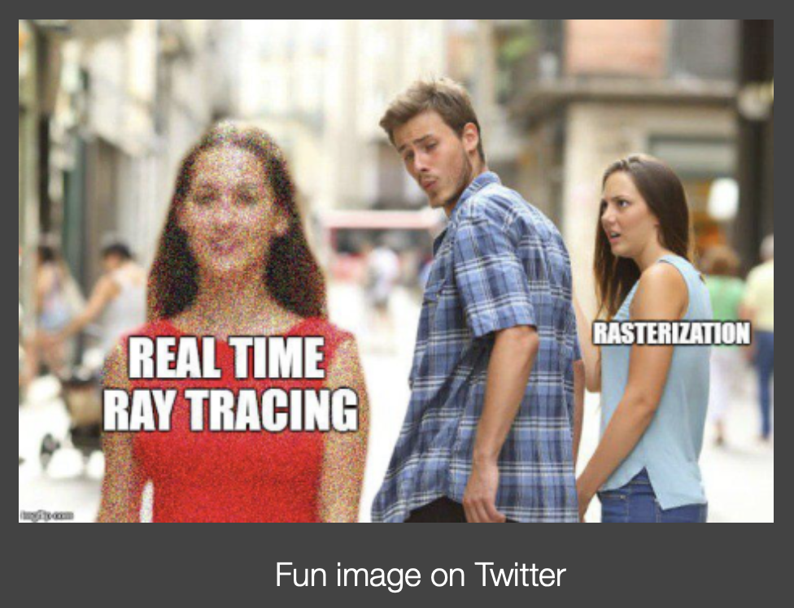
</div>

???+ example "SOTA（其实是 19 年）的降噪例子"

    <div style="text-align: center">
        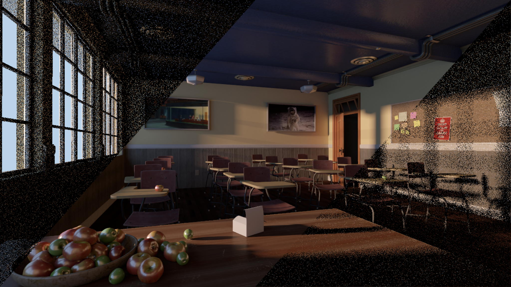
    </div>


### Motion Vector

在介绍具体方法前，我们先明确一下目标：

- 质量：不能有过度模糊和瑕疵，保留所有细节...
- 速度：对一个帧降噪（这只是渲染的一个小环节）的速度 <2ms

但实际上要同时达成上述两个目标是做不到的事。学术界的相关研究有：

- 剪切滤波(shear filtering)系列：SF、AAF、FSF、MAAF 等
- 其他离线滤波(offline filtering)方法：IPP、BM3D、APR 等
- 深度学习系列：CNN、自动编码器等

在业界的解决方案中，最重要的思想是**时间**(temporal)：

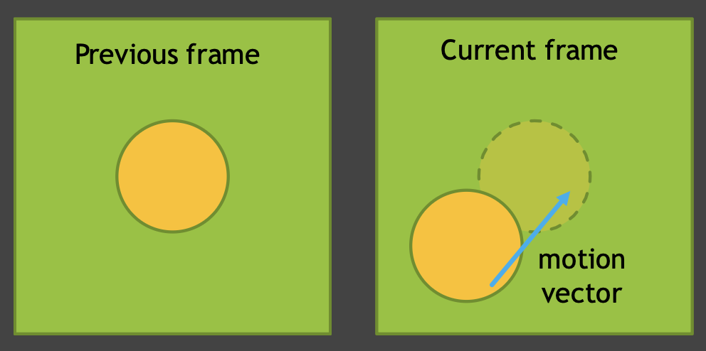{ align=right width=30% }

- 假设当前帧已经降过噪了，那我们就可以复用这一帧
- 使用**运动向量**(motion vector)来寻找前一个位置
- 本质上是增加了 SPP

!!! note "**几何缓冲区**(G-buffer)"

    - 渲染过程中**免费**获取的辅助信息（不是 100% 的免费，但生成 G-buffer 是一个轻量级的操作）
    - 通常包括世界坐标、每像素深度、法线、世界坐标等仅限于**屏幕空间**的信息

    <div style="text-align: center">
        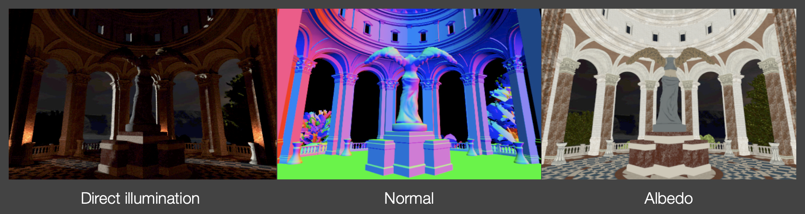
    </div>

记当前帧为 $i$，那么上一帧就是 $i - 1$。现在就要找第 $i - 1$ 帧中的哪个像素包含了和第 $i$ 帧中像素 $x$ 相同的位置或点。

<div style="text-align: center">
    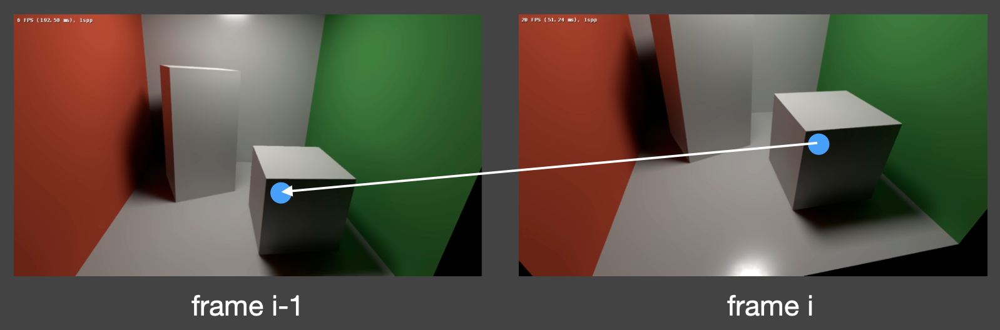
</div>

这便是**反向投影**(back projection)或者说求**运动向量**(motion vector)，具体操作如下：

- 如果世界坐标 $s$ 存在 G-buffer 中，那么可直接拿来用
- 否则 $s = M^{-1}V^{-1}P^{-1}E^{-1}x$（计算时仍需带有 $z$ 分量；$E$ 为视口变换）
- 由于运动已知：$s' \xrightarrow{T} s$，因此 $s' = T^{-1} s$
- 将第 $i - 1$ 帧中的世界坐标投影到屏幕上：$x' = P'V'M's'$

>注：加撇号的表示上一帧的东西。


### Temporal Accumulation / Filtering

???+ info "记号约定"

    - $\sim$：未滤波的
    - $\text{-}$：滤波好的

对于当前帧（第 $i$ 帧）：

<div style="text-align: center">
    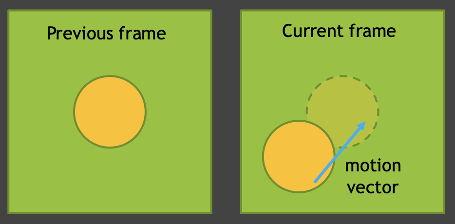
</div>

$$
\begin{aligned}
\bar{C}^{(i)} & = \text{Filter}[\tilde{C}^{(i)}] \\
\bar{C}^{(i)} & = \alpha \bar{C}^{(i)} + (1 - \alpha) C^{(i-1)}
\end{aligned}
$$

两行公式分别对应空间和时间上的滤波。其中 $\alpha$ 的取值在 0.1 到 0.2 之间，换句话说就是 80-90% 的贡献来自上一帧。

???+ example "效果"

    === "未去噪"

        <div style="text-align: center">
            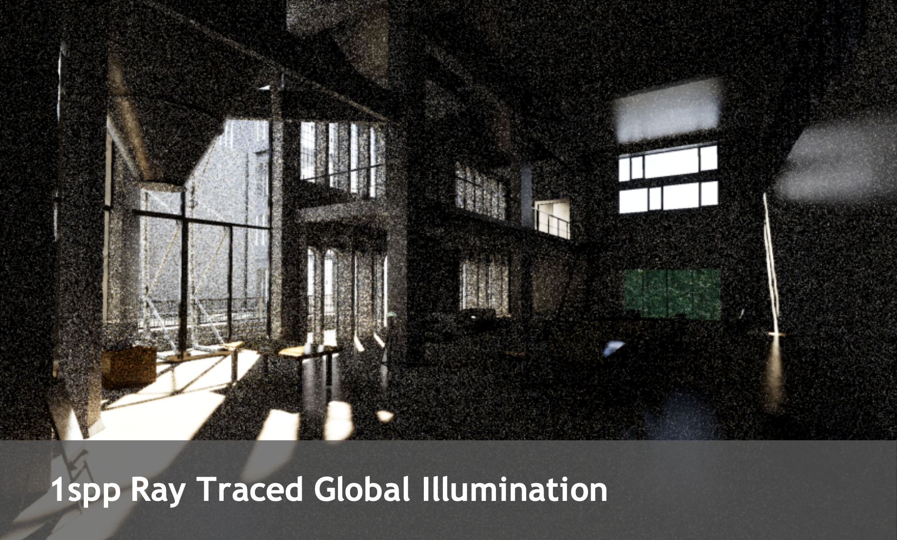
        </div>

    === "去噪后"

        <div style="text-align: center">
            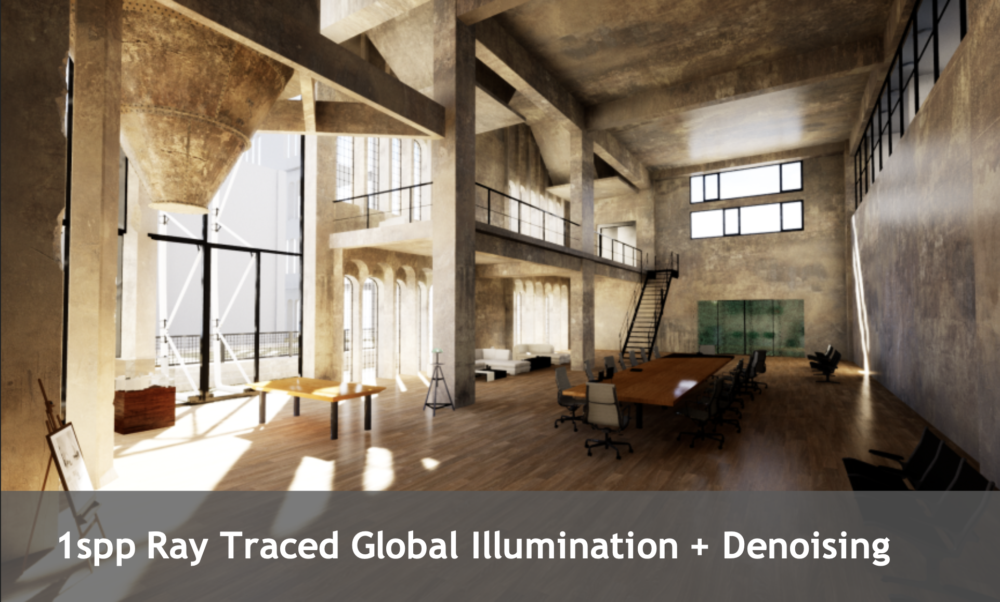
        </div>

        可以看到去噪前的渲染结果较暗，这是因为有噪点时，像素值上下浮动，可能存在像素值超过 255 的情况，此时会被裁剪到 255 这个值，因此那些特别亮的点就会变暗，整体也会变暗。

    === "基准事实"

        <div style="text-align: center">
            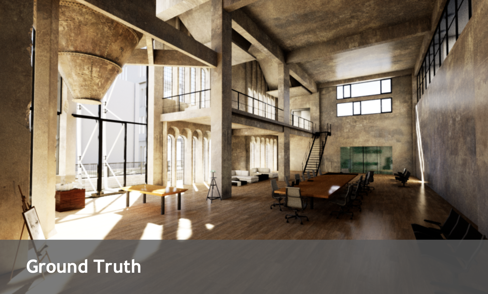
        </div>

    === "demo"

        <div style="text-align: center">
            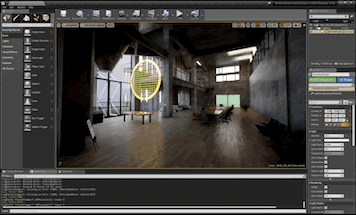
        </div>


### Failure Cases

但这一方法也有失效的时候，比如：

- 切换场景或镜头（需要有个**预热期**(burn-in period)累积几帧）

    <div style="text-align: center">
        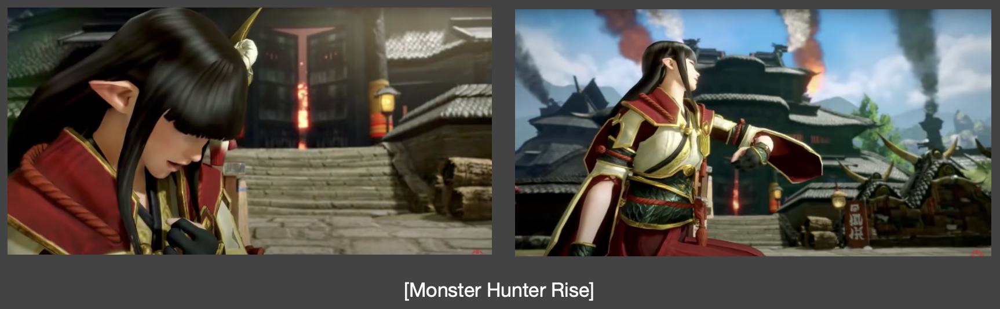
    </div>

- 在走廊里倒着走（**屏幕空间问题**）

    <div style="text-align: center">
        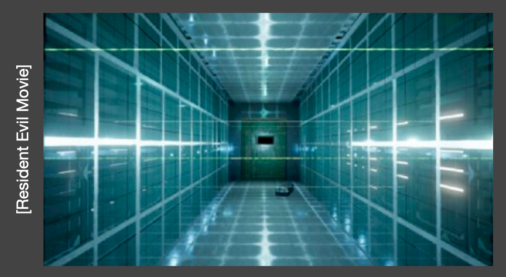
    </div>

- 突然出现的背景（**去遮挡**(disocclusion)）

    <div style="text-align: center">
        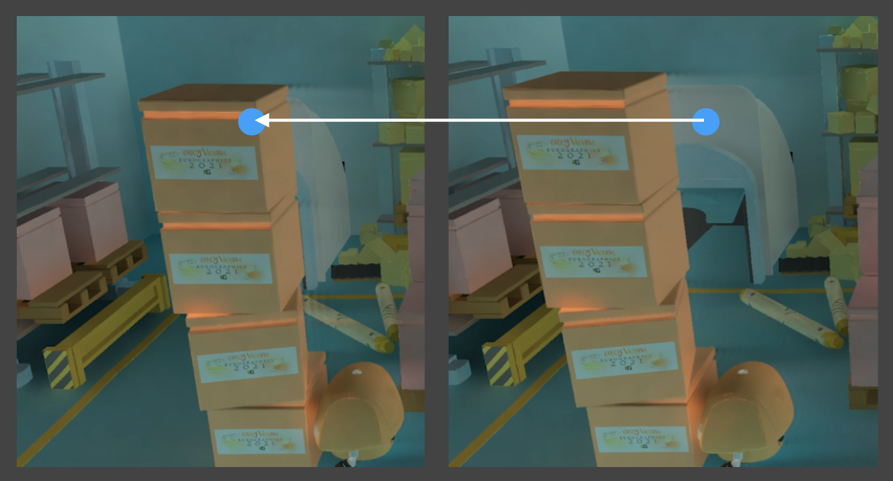
    </div>

    - 如果无视这一问题，就会带来**拖尾**(lagging)的效果

    ???+ example "例子"

        <div style="text-align: center">
            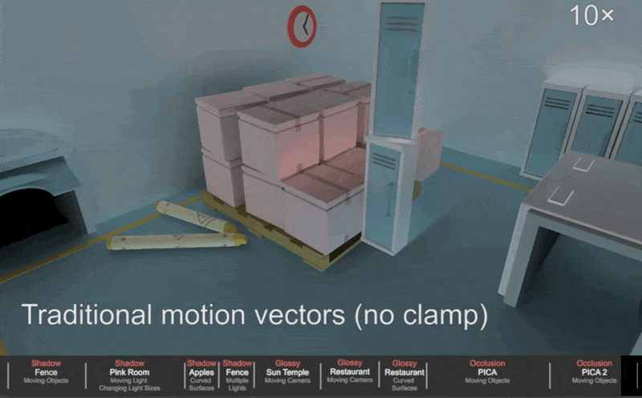
        </div>

解决方法有：

- **约束**(clamping)：将“上一帧的值”向当前帧的范围进行限制
- **检测**(detection)：
    - 使用如对象 ID 等来检测时间性失败
    - 以二值或连续形式调整 $\alpha$
    - 可能得加强/扩大空间滤波

!!! bug "问题：重新引入噪声（现在更依赖于当前帧，而上一帧才是没有噪点的）"

???+ example "例子"

    <div style="text-align: center">
        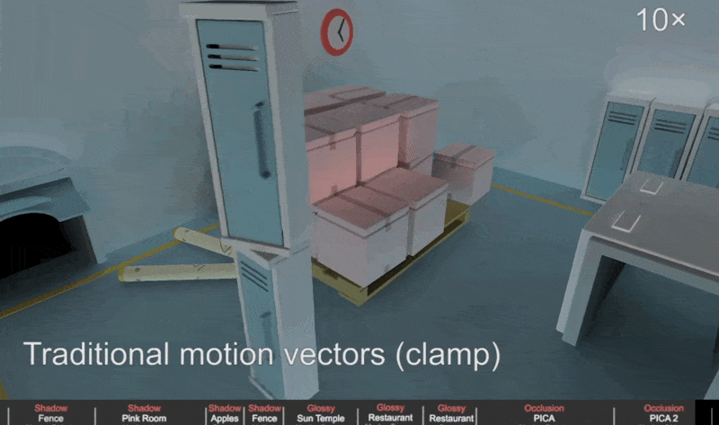
    </div>

---
该方法在**着色**上也有可能会失效：

- 考虑带有移动光源的“栅栏”场景，其中**阴影**的运动向量为 0，因为柱子几何位置关系没发生变化，这样的结果是阴影拖尾严重

    <div style="text-align: center">
        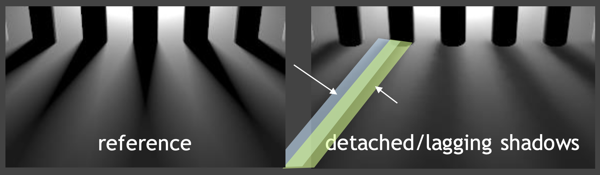
    </div>

    ???+ example "例子"

        <div style="text-align: center">
            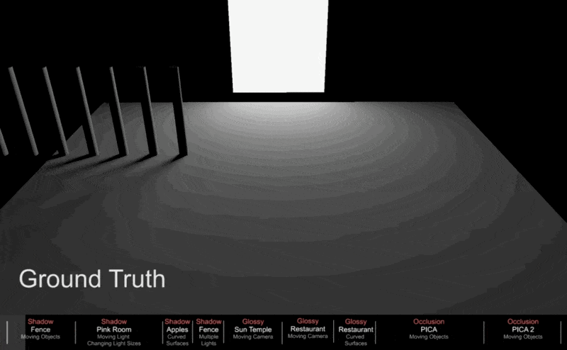
        </div>

- 考虑移动椅子，其中**光泽反射图像**(glossy reflected images)的运动向量也为 0，因为地板没有动，地板上的点的几何属性自然没发生变化

    <div style="text-align: center">
        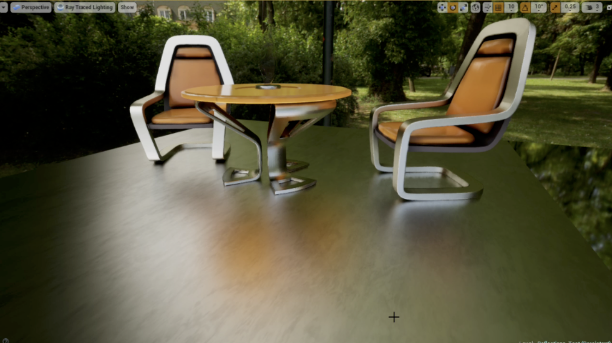
    </div>

    ???+ example "例子"

        <div style="text-align: center">
            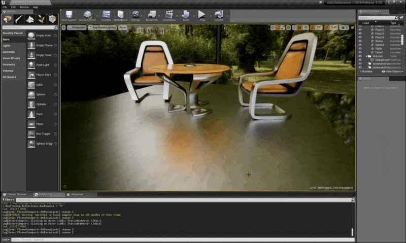
        </div>

???+ note "注"

    - 时间累积的思想受到 TAA（时间反走样）的启发（时间复用本质上提高了采样率）
    - 有研究（就是闫老师的团队）着手缓减该方法在部分场合失效的问题


## Implementing Spatial Filters

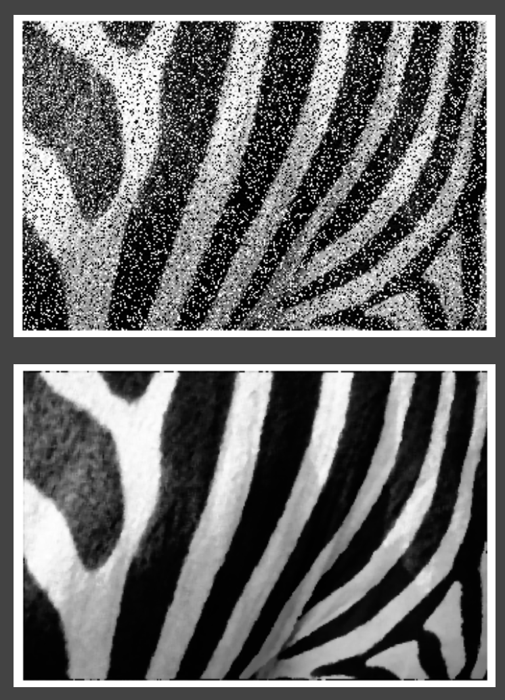{ align=right width=20% }

假如我们想对一张图像（做低通）滤波，也就是要移除图像中（通常是高频）的噪点。

>注：我们目前只专注于空间域。

- 输入：
    - 带噪点的图像 $\tilde{C}$
    - 滤波核 $K$（对每个像素而言值可以不同）
- 输出：滤波过的图像 $\bar{C}$

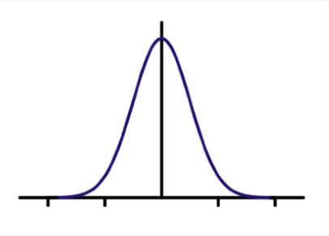{ width=20% align=right }

我们假设（2D）高斯滤波器的中心位于像素 $i$。$i$ 领域内的任何像素 $j$ 都会做出贡献，贡献量取决于 $i, j$ 间距。伪代码如下：

```
For each pixel i
    sum_of_weights = sum_of_weighted_values = 0.0
    For each pixel j around i
        Calculate the weight w_ij = G(|i - j|, sigma)
        sum_of_weighted_values += w_ij * C^{input}[j]
        sum_of_weights += w_ij
    C^{output}[I] = sum_of_weighted_values / sum_of_weights
```

- 维护 `sum_of_weights`，以便最后对结果进行归一化处理
- 测试 `sum_of_weights` 是否为零（针对其他核）
- 颜色可以是多通道的
- 一般认为超过 $3 \sigma$ 距离的像素不会产生任何贡献


### Bilateral Filtering

!!! bug "高斯滤波的问题：同时也模糊了边界，但这是我们想要保留的高频信号。"

    <div style="text-align: center">
        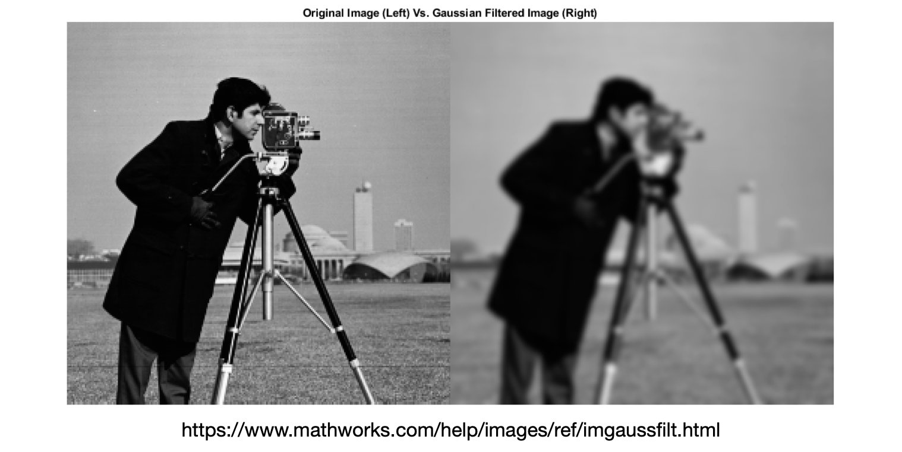
    </div>

观察发现，边界 <-> 剧烈变化的颜色。于是我们有了以下解决思路：

- 若像素 $j$ 与像素 $i$ 相差太大，则降低 $j$ 的贡献
- 仅向核加入更多控制

$$
w(i,j,k,l) = \exp\left(- \frac{(i - k)^2 + (j - l)^2}{2\sigma_d^2} - \frac{\| I(i,j) - I(k,l) \|^2}{2\sigma_r^2} \right)
$$

???+ example "效果"

    <div style="text-align: center">
        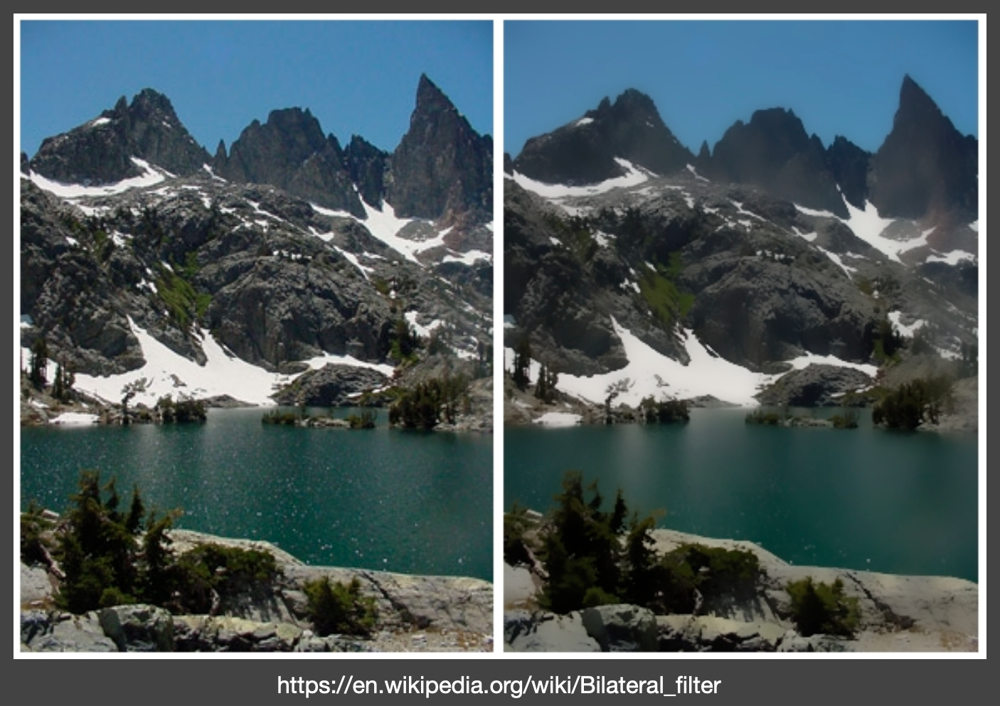
    </div>


### Joint Bilateral Filtering

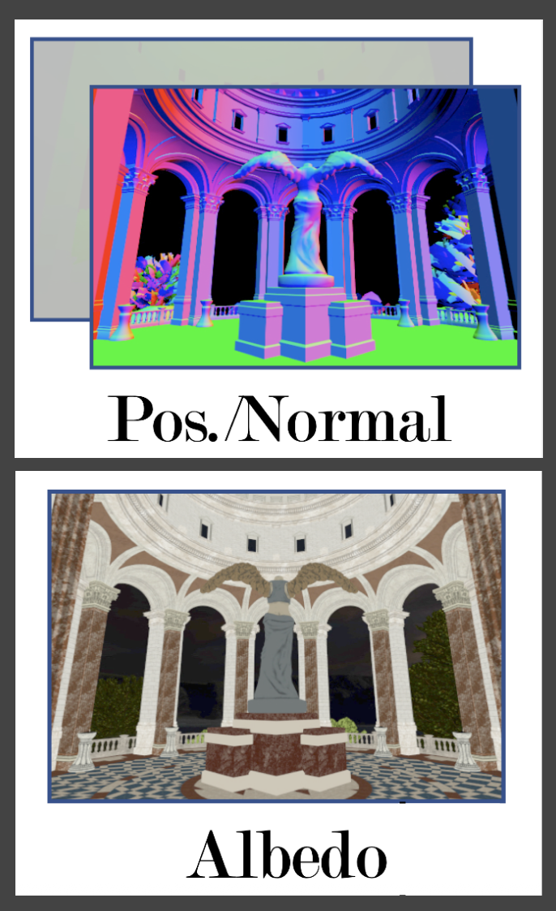{ align=right width=30% }

可以看到，高斯滤波仅有「距离」这一指标，而双边滤波有「位置距离」和「颜色距离」两个指标。那么为了得到更好的滤波效果，我们是不是可以引入更多的特征呢？这便是**联合双边滤波**(joint bilateral filtering)（或**跨双边滤波**(cross bilateral filtering)）所做的事。

该技术很适合用在**路径追踪**渲染结果的去噪上，因为 **G-buffers** 中保留了很多特征，包括法线、深度、位置、对象 ID 等大多数与几何相关的属性。且这些特征是**无噪声的**(noise-free)，因为它们和光线的多次弹射无关。

!!! note "注"

    - 指标本身无需归一化，因为滤波时就做好了归一化
    - 高斯不是唯一的选择：
        - 任何能随「距离」增长而衰减的函数都是可行的
        - 比如（绝对值）指数函数、（裁剪后的）余弦函数等

        <div style="text-align: center">
            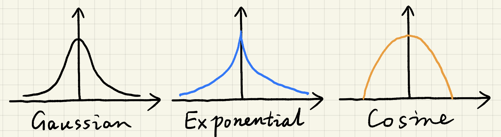
        </div>

???+ example "例子"

    假如我们仅考虑深度、法线和颜色。那我们为什么不去模糊下图这些点之间的边界呢？

    <div style="text-align: center">
        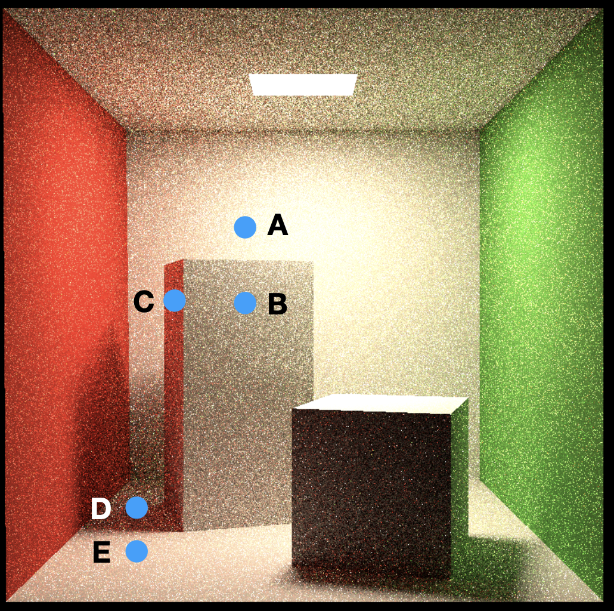
    </div>

    - A 和 B：深度不同
    - B 和 C：法线不同
    - D 和 E：颜色不同


### Implementing Large Filters

回忆一下：在滤波过程中，对于每个像素，我们需要遍历 NxN 大小的邻域。滤波器大小较小时，这样做是可以接受的；但滤波器很大的话，那计算成本就太大了。为此，下面提供一些解决方案。

- **单独的趟次**(separate passes)
    - 对于一个 2D 高斯滤波器，将其划分为一个水平趟次（1xN）和一个垂直趟次（Nx1）
    - 查询次数：N^2^ -> N + N

    <div style="text-align: center">
        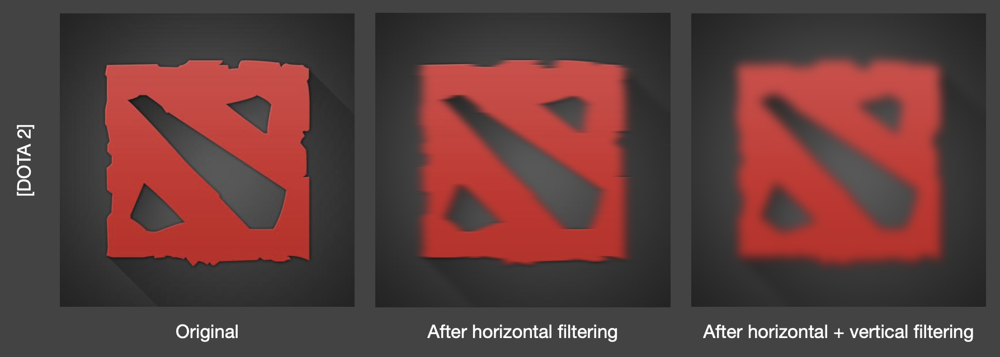
    </div>

    - 更深层的理解：将一个 2D 高斯滤波器分为两个 1D 高斯滤波器
    - 2D 高斯滤波核是可分离的：$G_{2D}(x, y) = G_{1D}(x) \cdot G_{1D}(y)$
    - 滤波 == 卷积，于是：

        $$
        \iint F(x_0, y_0)\, G_{2D}(x_0 - x, y_0 - y)\, dx\, dy = \int \left(\int F(x_0, y_0)\, G_{1D}(x_0 - x)\, dx \right) G_{1D}(y_0 - y)\, dy
        $$

    - 因此，分离的趟次需要可分离的滤波核（即**理论上**，双边滤波器无法单独实现）

- **渐进增长的大小**(progressively growing sizes)
    - 思路：使用渐进增长的大小进行多次滤波
    - **a-trous 小波**（就是一个滤波器）
        - 多次处理，每次使用 5x5 滤波器
        - 样本间的间隔逐渐增大（$2^i$）
            - 比如 $64^2$ 大小的滤波器变为了 $5^2 \times 5$

        <div style="text-align: center">
            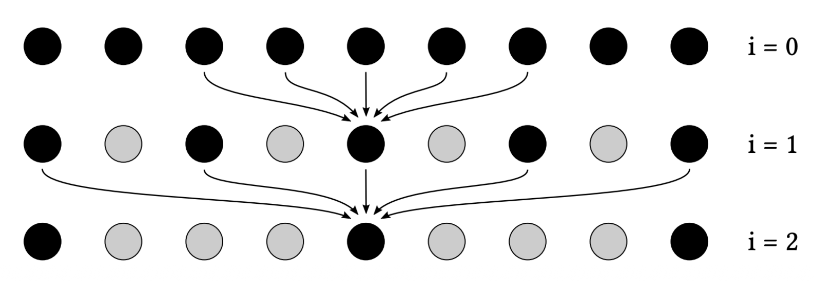
        </div>

    - 更深层的理解：
        - 采用增长的大小是因为：应用更大的滤波器 == 移除更低频的信号（左图）
        - 跳过某些采样点之所以是安全的，是因为：采样 == 重复频谱(spectrum)（右图）

        <div style="text-align: center">
            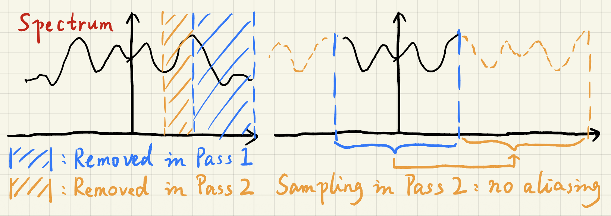
        </div>

    - 问题：可能会保留一些格子状的瑕疵

???+ info "注"

    上述滤波方法也可用在对 PCSS、SSR 等的去噪上。


### Outlier Removal

需要注意的是，滤波并非万能。有时滤波后的结果仍会带有噪声，甚至出现**块状**(blocky)瑕疵，这主要是由极端明亮的像素点（**异常点**(outliers)）引起的。

<div style="text-align: center">
    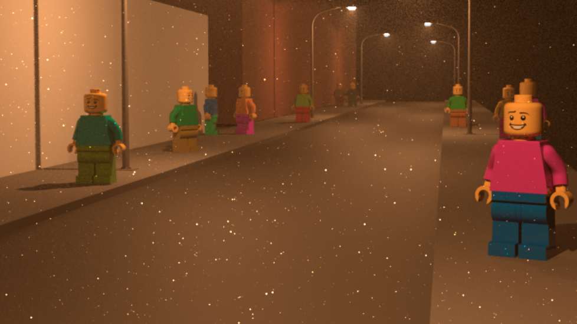
</div>

好消息是，我们可以**在**滤波**前**就移除这些异常点。

- 异常点检测
    - 对于每个像素，查看其邻域（比如 7x7 大小）
    - 计算均值和方差
    - 在 $[\mu - k\sigma, \mu + k\sigma]$ 范围外的值 -> 异常点

- 异常点移除
    - 将任何在上述范围之外的值**约束**(clamp)在这一有效范围内
    - 注意：这并**不等于**抛弃（设置成零值）这些异常点
    - 这和之前介绍的

???+ info "复习：时间约束(temporal clamping)"

    之前讲时间累积/滤波时也提到过类似的概念——直接使用上一帧的颜色可能会带来拖尾效果，原因是 $C^{(i-1)}$ 可能和 $\bar{C}^{(i)}$ 完全不一样。于是在时间复用中，我们将 $C^{(i-1)}$ 约束到和 $\bar{C}^{(i)}$ 足够接近：

    $$
    \begin{aligned}
    C^{(i)} = \alpha \bar{C}^{(i)} + & (1 - \alpha) C^{(i-1)} \\
    & \Rightarrow \mathbf{clamp}(C^{(i-1)}, \mu - k\sigma, \mu + k\sigma)
    \end{aligned}
    $$

    - 时间约束是噪点与拖尾问题之间的权衡
    - 注意约束方向是从 $C^{(i-1)}$ 到 $\bar{C}^{(i)}$，反过来是不行的！


## Specific Filtering Approaches for RTRT

### Spatiotemporal Variance-Guided Filtering (SVGF)

### Recurrent AutoEncoder (RAE)