# A Glimpse of Industrial Solutions

## Anti-Aliasing

???+ question "回顾：为何需要反走样？"

    由于光栅化时每像素采样数不够多，因此最终的解决方案是用更多的采样点。

### Temporal Anti-Aliasing

**时间反走样**(temporal anti-aliasing)的特点：

- 跨帧（时间）分发/重用样本
- 与 [RTRT](7.md) 几乎完全相同
- 比如使用上一帧像素左上角的采样点，再上一帧像素右上角的采样点，右下，左下...

    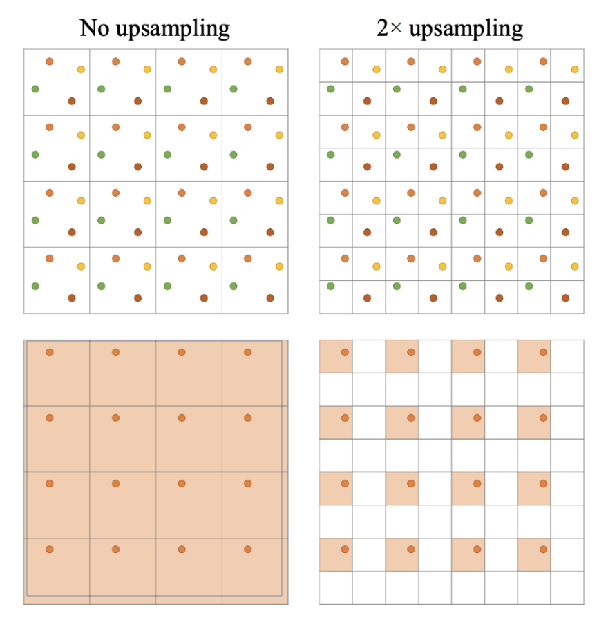

### Notes on Anti-Aliasing

- **MSAA**（多采样）vs **SSAA**（超采样）
    - SSAA 比较直接
        - 先以更大的分辨率渲染，再降采样
        - 最终的解决方案，但是成本高
    
    - MSAA 能改进性能
        - 相同图元只渲染一次
        
            

                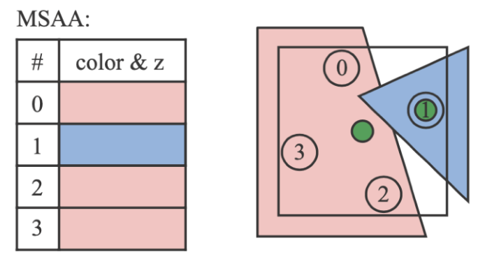
            

        
        - 像素间复用采样点，从而节省采样数（比如下图中间两个采样点既可算作对像素 1 的贡献，也可算作对像素 2 的贡献）

            

                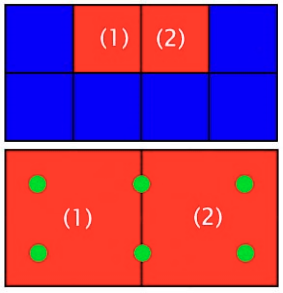
            

- 最先进的**基于图像**的反走样解决方案
    - **SMAA**（增强型子像素形态抗锯齿(enhanced subpixel morphological AA)）
    - 发展历程：FXAA -> MLAA（形态(morphological)抗锯齿）-> SMAA

    

        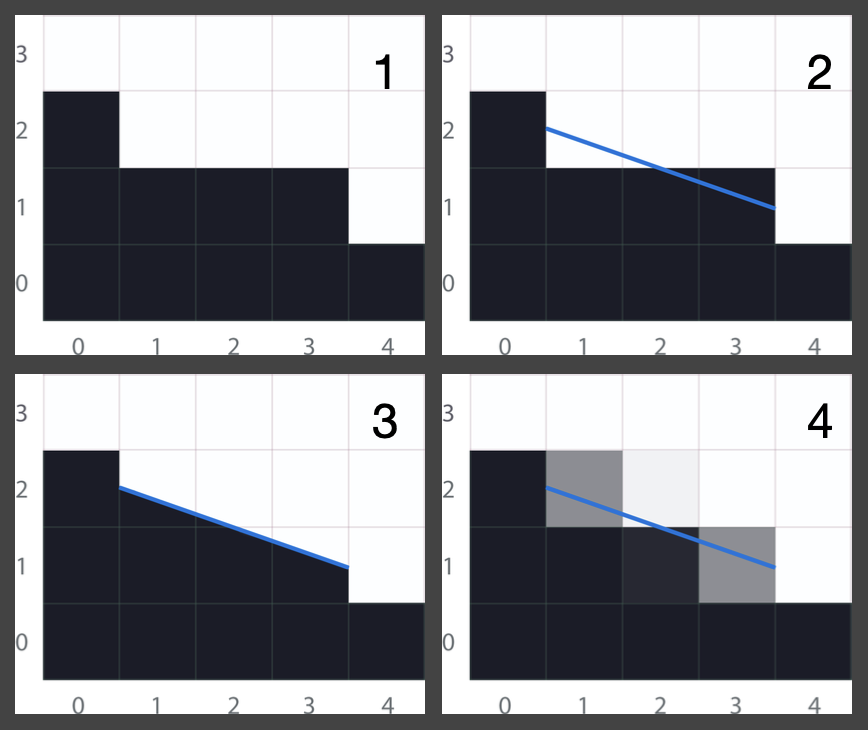
    

- 不要对 G-buffer 进行反走样操作

## Super Sampling and DLSS

**超分辨率**(super resolution)（或超采样）的字面理解就是增加分辨率。相关的经典技术便是 **DLSS**（深度学习超采样(deep learning super sampling)）。

- **DLSS 1.0**：毫无来由 / 纯属猜测
- **DLSS 2.0**：另一种类 TAA 的应用，通过复用时间采样来提升分辨率

DLSS 2.0 遇到的主要问题是：一旦时间层面出现问题，约束(clamping)不再是一个可行项，因为对于**每个更小的像素**都需要知道其确切值。因此关键在于找到一个更好的**利用时间信息**的方案。

    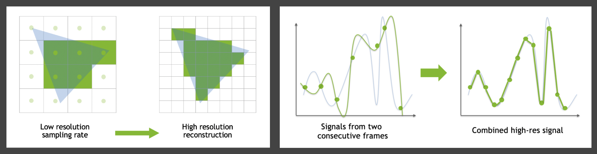

???+ example "结果"

    === "双三次升采样"

        

            
        

    === "DLSS 2.0"

        

            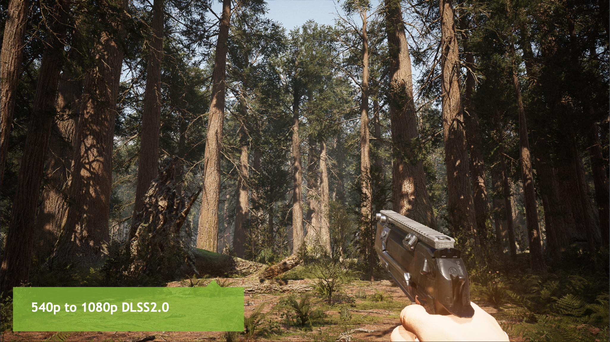
        

    === "TAA"

        

            
        

一个重要的实际问题是：如果 DLSS 本身每帧运行需 30ms，那它就已经失效了。解决方法是采用网络推理性能优化（机密内容）。

相对应 DLSS 的技术有：

- AMD：Fidelity FX 超分辨率技术
- Facebook：实时渲染的神经超采样技术

## Shading

### Deferred Shading

- 原本用于**节省着色时间**
- 考虑光栅化过程  
    - 三角形 -> 片元 -> 深度测试 -> 着色 -> 像素  
    - 每个片元都需要着色（在什么场景下？）  
    - 复杂度：O(片元树 * 光源数)  

- 关键观察：由于深度测试/遮挡，大多数片元在最终图像中不可见，所以可以只对**可见的片元**着色
- 修改光栅化流程：
    - 只需对场景进行**两次光栅化**
    - 第一遍：不进行着色，仅更新深度缓冲区
    - 第二遍相同，但由于现在可从深度缓冲区得知最近的片元，所以能保证仅对可见片元着色
    - 隐含假设：**对场景进行光栅化**远快于**对所有不可见片元进行着色**（通常成立）
    - 复杂度：O(片元数 * 光源数) -> **O(可见片元数 * 光源数)**

- 问题：难以实现抗锯齿
    - 但可通过 **TAA** 几乎完全解决这一问题

### Tiled Shading

另一种改进方法是**块着色**(tiled shading)，即将屏幕细分为块(tile)（比如 32x32 大小），然后对每个块进行着色。

    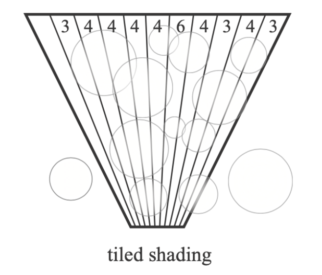

- 并非所有光源都能照亮特定块，主要是因为**距离平方衰减**
- 复杂度：O(可见片元数 * 光源数) -> O(可见片元数 * **每块平均光源数**)

### Clustered Shading

更进一步的改进技术是**簇着色**(cluster shading)。它将每个块进一步细分为不同的深度段，本质上将视锥体细分为 3D 网格。

    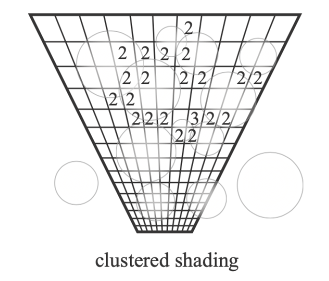

- 每个块的深度范围可能相当大
- 因此可能会识别出具有照亮该块能力的大量光源
- 但有些光源可能只照亮一个较小的深度范围
- 复杂度：O(可见片元数 * 每个块的平均光源数) -> O(可见片元数 * **每个簇的平均光源数**)

## Level of Detail Solutions

**细节层次**（**LoD**）非常重要，因为选择合适的细节层次可以节省计算资源，比如之前介绍过的纹理 [MIPMAP](../cg/5.md#mipmap) 技术便是一种 LoD。而多级 LoD 的应用在 RTR 领域中常被称为「**级联**」(cascaded)。

???+ example "例子"

    === "级联阴影贴图"

        

            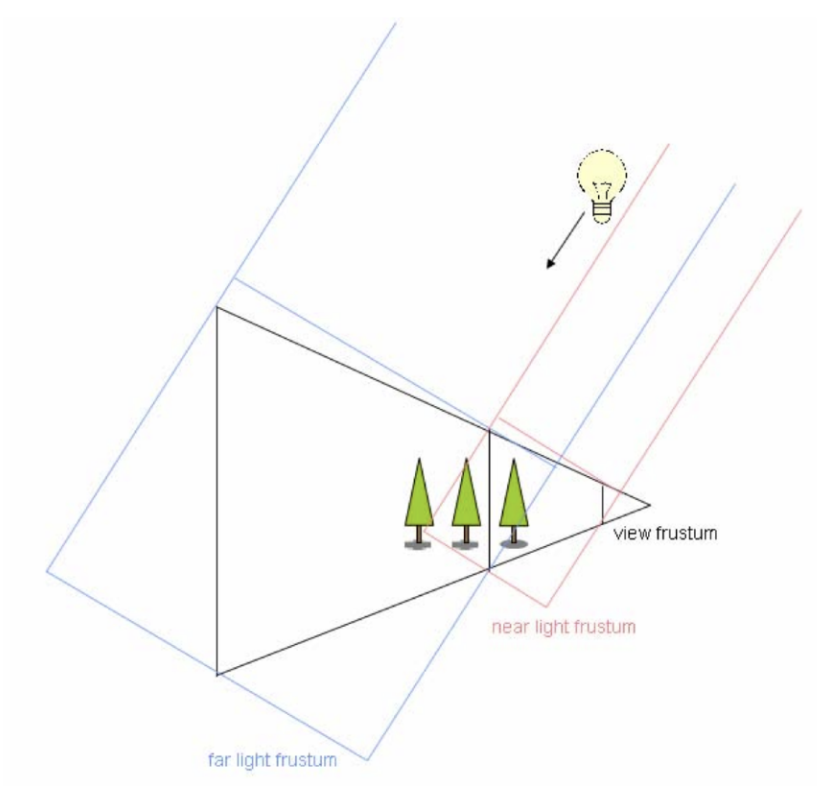
        

    === "级联 LPV（光传播体积）"

        

            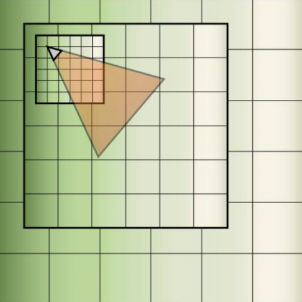
        

!!! warning "关键挑战"

    - 不同层级之间的**过渡**
    - 通常在边界附近需要一定的重叠(overlapping)与混合(blending)

???+ example "另一个例子：**几何 LoD**"

    - 预先生成一组简化的具有不同数量三角形的对象
    - 根据与摄像机的距离，选择合适的对象（或对象的一部分）进行显示，确保没有三角形大于一个像素
    - 由 TAA 解决跳变伪影的问题
    - 这就是 UE5 中的 **Nanite** 技术（当然 Nanite 的功能远不止于此）

!!! bug "一些（较为严重的）技术难题"

    - 不同地点存在不同层级，裂缝(cracks)问题如何处理？
    - 动态加载与调度不同层级时，如何最优利用缓存和带宽等资源？
    - 使用三角形还是其他几何纹理来表示几何体？
    - 如何通过裁剪(clipping)与剔除(culling)提升性能？
    - ...

    

        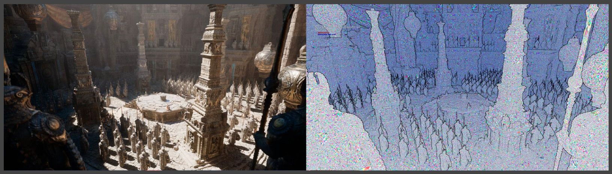
    

## Global Illumination Solutions

通过前面的学习，我们知道：

- 屏幕空间光线追踪（SSR）有时会失效，比如超出屏幕外，不在相机内等
- 没有一种 GI 解决方案能完美适用于所有情况，除了实时光线追踪（RTRT），但现在完全使用 RTRT 的成本仍然过高

因此业界倾向于采用混合的解决方案：

- 使用 SSR 进行粗略的全局光照近似
- 当 SSR 失效时，切换到更复杂的光线追踪
- 无论是硬件（RTRT）还是软件（？）方式
    - 软件光线追踪
        - **近距离单个物体 -> HQ SDF（高质量有符号距离场）**
        - **整个场景 -> LQ SDF（低质量有符号距离场）**
        - **存在强方向光或点光源时的 RSM（反射阴影贴图）**
        - 在 3D 网格中存储辐照度的探针（动态漫反射全局光照，即 DDGI）

    - 硬件光线追踪
        - **不必使用原始几何体**，可采用低多边形代理(low-poly proxies)
        - 探针（RTXGI）

    - 混合这些加粗标注的方法，就得到了 UE5 的 **Lumen** 技术